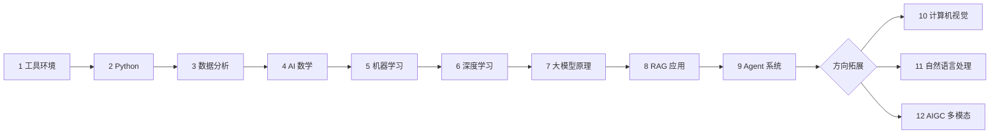

# AI 全栈学习教程

> 一条从开发基础、数据分析、AI 模型基础，到大模型应用、RAG、AI Agent 与多模态 AIGC 的系统化免费学习路线。

## 🌐 官方网站

| 访问方式 | 地址 |
|----------|------|
| **主站（推荐）** | [https://learning.airoads.org](https://learning.airoads.org) |
| 主域名 | [https://airoads.org](https://airoads.org)（自动跳转到学习站） |
| 带 www | [https://www.airoads.org](https://www.airoads.org)（自动跳转到学习站） |

---

## 📚 这套课程怎么读

这套课程按新人真实成长路线组织，不按历史文件夹名组织。学习者只需要理解一套清晰编号：

```text
1～12      学习站：整门课的主线顺序
1.1       章节：某个学习站内部的章节
1.1.1     小节：某章内部的具体页面或知识点
```

也就是说，`1 开发者工具基础` 是第 1 个学习站，`1.1 终端与命令行` 是它的第 1 章，`1.1.1 为什么要学命令行` 是这一章里的第 1 个具体页面。侧边栏主要显示到“学习站 + 章节”，具体小节放在章节内部阅读，避免导航过深、数字太乱。

最推荐的阅读方式是：先看学习地图，再按主线从 1 读到 9；如果你想做作品集，再从 10、11、12 里选择一个方向做毕业项目。



---

## 🧭 新人推荐学习路线

如果你会一点编程，但还没有系统学过 AI，建议按下面路线走。这里的“学习站”就是课程侧边栏里的顶层编号，“主要章节”是这一站下面最重要的学习单元。

| 学习站 | 主要章节 | 为什么学 | 阶段出口 |
|---|---|---|---|
| 1 开发者工具基础 | 1.1 终端与命令行；1.2 Git 与版本管理；1.3 开发环境配置 | 先能独立搭环境、跑代码、管理项目 | 能配置开发环境并使用 Git 管理代码 |
| 2 Python 编程基础 | 2.1 Python 语言入门；2.2 Python 进阶；2.3 阶段项目 | AI 应用开发的基础语言能力 | 完成命令行工具、爬虫或简单 API 项目 |
| 3 数据分析与可视化 | 3.1 从 Python 到数据分析；3.2 NumPy；3.3 Pandas；3.4 可视化；3.5 数据库；3.6 项目 | 先学会处理真实数据，再谈模型 | 完成一份数据清洗、分析与可视化报告 |
| 4 AI 数学最小必要基础 | 4.1 线性代数；4.2 概率与统计；4.3 微积分与优化 | 只补模型理解最需要的数学 | 能解释向量、矩阵、概率、梯度如何进入模型 |
| 5 机器学习入门到实战 | 5.1 基础概念；5.2 监督学习；5.3 无监督学习；5.4 模型评估；5.5 特征工程；5.6 项目 | 建立“数据 → 特征 → 模型 → 评估”的基本闭环 | 完成一个机器学习预测或分群项目 |
| 6 深度学习与 Transformer 基础 | 6.1 神经网络；6.2 PyTorch；6.3 CNN；6.4 RNN；6.5 Transformer；6.6 生成模型；6.7 训练技巧；6.8 项目 | 为理解大模型和多模态打基础 | 完成一个可复现的深度学习训练项目 |
| 7 大模型原理、Prompt 与微调 | 7.1 NLP 速成；7.2 LLM 概览；7.3 Transformer 深入；7.4 预训练；7.5 Prompt；7.6 微调；7.7 对齐；7.8 项目 | 知道大模型能力从哪里来，什么时候该 Prompt、RAG 或微调 | 能判断 Prompt、RAG、微调分别适合什么问题 |
| 8 LLM 应用开发与 RAG | 8.1 RAG；8.2 模型部署；8.3 应用开发；8.4 工程化；8.5 项目 | 从“会调模型”过渡到“能做应用” | 完成带引用、日志和评估样例的知识库助手 |
| 9 AI Agent 与智能体系统 | 9.1 Agent 基础；9.2 推理与规划；9.3 工具；9.4 记忆；9.5 MCP；9.6 框架；9.7 多 Agent；9.8 评估安全；9.9 部署；9.10 项目 | 学会把大模型变成能执行任务的系统 | 完成可追踪执行过程的 Agent 项目 |
| 10 计算机视觉（方向选修） | 10.1 CV 基础；10.2 图像分类；10.3 目标检测；10.4 图像分割；10.5 进阶方向；10.6 项目 | 选择视觉方向做作品集 | 完成带数据、标注、评估和失败分析的视觉项目 |
| 11 自然语言处理（方向选修） | 11.1 文本基础；11.2 词向量；11.3 文本分类；11.4 序列标注；11.5 Seq2Seq；11.6 预训练模型；11.7 项目 | 选择文本/NLP 方向做作品集 | 完成可评估的 NLP 分类、抽取、摘要或问答项目 |
| 12 AIGC 与多模态 | 12.1 多模态基础；12.2 图像生成；12.3 视频语音生成；12.4 前沿伦理；12.5 项目 | 把生成能力组织成产品原型 | 完成带生成、编辑、审核和导出的 AIGC 产品原型 |

---

## 🗂️ 侧边栏怎么看

侧边栏现在按“学习路径优先”组织。它只保留三层含义，避免出现“阶段、章、小节、文件夹路径”混在一起的情况。

```text
先看这里：学习地图

主线 1：打基础（1-3）
  1 开发者工具基础
    1.1 终端与命令行
    1.2 Git 与版本管理
    1.3 开发环境配置
  2 Python 编程基础
    2.1 Python 语言入门
    2.2 Python 进阶
    2.3 阶段项目
  3 数据分析与可视化
    3.1 从 Python 到数据分析
    3.2 NumPy 科学计算
    3.3 Pandas 数据处理
    3.4 数据可视化
    3.5 数据库基础
    3.6 阶段项目

主线 2：理解模型（4-6）
  4 AI 数学最小必要基础
  5 机器学习入门到实战
  6 深度学习与 Transformer 基础

主线 3：做大模型应用（7-9）
  7 大模型原理、Prompt 与微调
  8 LLM 应用开发与 RAG
  9 AI Agent 与智能体系统

主线 4：方向拓展与毕业项目（10-12）
  10 计算机视觉（方向选修）
  11 自然语言处理（方向选修）
  12 AIGC 与多模态
```

后续如果要继续彻底统一，可以再把所有文档标题里的 `1.1`、`7.1` 等显示编号统一成 `1.1.1` 这种三层格式。但这一步会涉及全站标题，建议在 README 和 sidebar 稳定后再做。

---

## 🧩 推荐先看哪些导览

第一次进入课程时，建议先读这 6 个导览，再进入 1～12 的正式课程。

| 导览 | 作用 |
|---|---|
| AI 全栈能力地图 | 先理解 AI 全栈需要哪些能力层 |
| 推荐学习路线 | 按应用型、模型理解型、项目作品集型选择路线 |
| AI 发展历史地图 | 用历史脉络理解 AI、深度学习、大模型、RAG 和 Agent 的演进 |
| 项目路线与作品集 | 提前知道每个阶段最终能做出什么作品 |
| 常见概念别混表 | 对照 API、SDK、模型、RAG、微调、Agent 等容易混淆的概念 |
| 环境准备 | 配置 Python、VS Code、Git、Jupyter、GPU/API 等基础环境 |

---

## 📁 维护者目录映射

学习者只需要看侧边栏里的 1～12 展示编号。下面这张表主要给维护者使用，用来说明展示编号和实际文档目录的对应关系。为了兼容已有链接，部分历史目录名没有强行重命名。

| 展示编号 | 展示名称 | 实际文档目录 |
|---|---|---|
| 1 | 开发者工具基础 | `docs/stage0/` |
| 2 | Python 编程基础 | `docs/stage1/` |
| 3 | 数据分析与可视化 | `docs/stage2/` |
| 4 | AI 数学最小必要基础 | `docs/stage3/` |
| 5 | 机器学习入门到实战 | `docs/stage4/` |
| 6 | 深度学习与 Transformer 基础 | `docs/stage5/` |
| 7 | 大模型原理、Prompt 与微调 | `docs/stage8a/` |
| 8 | LLM 应用开发与 RAG | `docs/stage8b/` |
| 9 | AI Agent 与智能体系统 | `docs/stage9/` |
| 10 | 计算机视觉（方向选修） | `docs/stage6/` |
| 11 | 自然语言处理（方向选修） | `docs/stage7/` |
| 12 | AIGC 与多模态 | `docs/stage10/` |

说明：`stage0/` 到 `stage10/` 是历史文件夹路径，不代表学习顺序。课程导航、README 和阶段首页以 1～12 的展示编号为准。

---

## 🧱 编号规则

课程统一采用“三层编号、一条主线”的方式。

| 层级 | 示例 | 含义 | 出现位置 |
|---|---|---|---|
| 学习站 | `8 LLM 应用开发与 RAG` | 整门课里的第 8 个学习站 | README、sidebar 顶层、阶段首页 |
| 章节 | `8.1 RAG 检索增强生成` | 第 8 站里的第 1 章 | sidebar 章节分组、章节导读 |
| 小节 | `8.1.1 RAG 基础` | 第 8 站第 1 章里的第 1 个具体页面 | 文档页面标题，后续可逐步统一 |
| 文件夹路径 | `docs/stage8b/ch01-rag/` | 维护用路径 | 只在维护者映射中出现 |

编号规则很简单：第一段表示学习站，第二段表示章节，第三段表示小节。学习者只需要按 1 → 2 → 3 往后学；维护者只在修改文档时关心实际文件夹路径。

页面开头也统一采用定位块，帮助新人先理解“这一页为什么要学”。具体规则是：阶段首页使用 `## 阶段定位`，章节导读或 roadmap 使用 `## 本章定位` 或 `## 章节导读`，普通知识点页面使用 `## 本节定位`，项目页面使用 `## 项目定位`。`本节定位` 建议放在一级标题后、学习目标前，用一小段话说明这一节解决什么问题、在课程路线中的位置、学完后能做什么。

阶段首页还统一增加趣味化学习引导，建议包含四类内容：`故事化导入` 用一个真实场景解释为什么学，`学习闯关地图` 用 Mermaid 展示从输入到作品的路线，`互动练习` 给学习者一个边学边自测的问题，`项目彩蛋` 提前展示本阶段能沉淀成什么作品集成果。

阶段首页还统一增加双路线与项目分层，帮助不同经验水平的学习者都能找到合适难度。`新手最小通关路线` 说明第一次学习时必须完成什么，`进阶深入路线` 给有经验的学习者提供更深的工程、理论或实验方向。`阶段项目` 建议统一拆成基础版、标准版、挑战版，避免新人被大项目吓退，也让有经验的人有继续深入的空间。

后续新增内容时，先判断它属于哪个学习站，再决定章节号。如果只是在某一章里新增页面，只增加第三层小节号，不改变学习站和章节号。

---

## 🚀 本地运行

```bash
npm install
npm run start
```

构建静态站点：

```bash
npm run build
```

---

## 📄 开源与许可

- 课程内容与本站结构：**MIT License**  
- 源码仓库：[GitHub - AI-fullstack-course](https://github.com/oudbiao/AI-fullstack-course)  
- 部署与开发说明见仓库内 `NGINX-PROXY-SETUP.md`、`GITHUB-ACTIONS-DEPLOY.md` 等文档。
