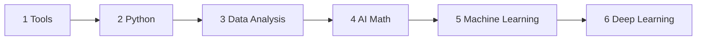
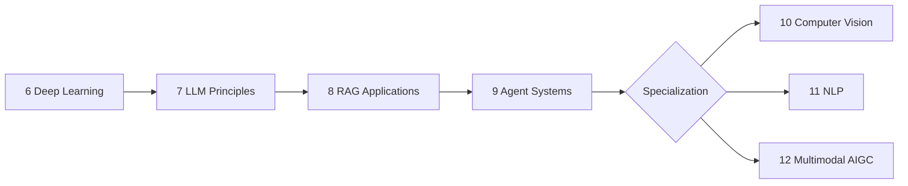

# AI Full-Stack Learning Course

> A free, beginner-friendly learning path from developer foundations and data analysis to machine learning, deep learning, LLM applications, RAG, AI Agents, and multimodal AIGC.

## Official Website

| Entry | URL |
|---|---|
| Main learning site | [https://learning.airoads.org](https://learning.airoads.org) |
| Root domain | [https://airoads.org](https://airoads.org) |
| WWW domain | [https://www.airoads.org](https://www.airoads.org) |

The root site now defaults to English. Learners can switch to Simplified Chinese or Japanese from the language dropdown in the navigation bar.

## What This Course Covers

This course is organized as a practical growth path for new AI learners, not as a collection of historical folder names. The public course numbering uses one clear sequence:

```text
1-12      Learning stations across the whole course
1.1       Chapters inside a learning station
1.1.1     Individual pages or knowledge points inside a chapter
```

For example, `1 Developer Tools Foundations` is the first learning station, `1.1 Terminal and Command Line` is its first chapter, and `1.1.1 Why Learn the Command Line` is an individual lesson page.

The recommended reading style is simple: start with the learning map, follow the main track from 1 to 9, then choose one of 10, 11, or 12 for a portfolio project. Treat the course as a project-upgrade path rather than a checklist of articles. Each stage should leave you with something runnable, explainable, and presentable.

The later parts of the course emphasize modern AI application engineering, including RAGOps, AgentOps, MCP, multimodal RAG, model routing, cost control, evaluation sets, traces, permission boundaries, and deployment checklists.





## Recommended Beginner Path

| Phase | Focus | Portfolio output |
|---|---|---|
| Build foundations | Stations 1-3: environment, Python, real data | CLI tool, scraper/API, small data report |
| Understand models | Stations 4-6: math intuition, ML, deep learning | ML prediction project and DL training experiment |
| Build applications | Stations 7-8: LLMs, prompting, RAG | Prompt templates and a cited knowledge-base assistant |
| Build systems | Station 9: planning, tools, memory, safety | Traceable AI Agent automation project |
| Specialize | Stations 10-12: CV, NLP, or multimodal AIGC | Graduation project with problem definition, method, and evaluation |

## Learning Stations

| Station | Main chapters | Why it matters | Exit outcome |
|---|---|---|---|
| 1 Developer Tools Foundations | Terminal, Git, development environment | You need to run code and manage projects independently | Stable local development workflow |
| 2 Python Programming Foundations | Python basics, intermediate Python, projects | Python is the core language for AI application work | CLI tool, scraper, or simple API project |
| 3 Data Analysis and Visualization | NumPy, Pandas, visualization, databases | Real AI work starts with understanding data | Data cleaning, analysis, and visualization report |
| 4 Minimal Math Foundations for AI | Linear algebra, probability, calculus, optimization | Math gives intuition for how models learn | Explain vectors, matrices, probability, gradients, and loss |
| 5 Machine Learning from Basics to Practice | ML concepts, supervised/unsupervised learning, evaluation, features | Builds the data -> feature -> model -> evaluation loop | Prediction, churn, or segmentation project |
| 6 Deep Learning and Transformer Foundations | Neural networks, PyTorch, CNN, RNN, Transformer, generative models | Prepares you for modern LLM and multimodal systems | Reproducible deep learning training project |
| 7 LLM Principles, Prompting, and Fine-Tuning | NLP, Transformer internals, pretraining, prompting, fine-tuning, alignment | Helps you choose between prompting, RAG, and fine-tuning | LLM decision framework and small practice project |
| 8 LLM Application Development and RAG | RAG, deployment, app development, engineering, evaluation | Turns model access into useful applications | Cited, logged, evaluated knowledge-base assistant |
| 9 AI Agents and Agentic Systems | Agent basics, planning, tools, memory, MCP, multi-agent, safety | Turns LLMs into task-executing systems | Traceable Agent project with safety boundaries |
| 10 Computer Vision | Classification, detection, segmentation, advanced CV | Optional visual AI specialization | Vision project with data, metrics, and failure analysis |
| 11 Natural Language Processing | Text basics, embeddings, classification, sequence labeling, Seq2Seq, pretrained models | Optional text/NLP specialization | Evaluated NLP project for classification, extraction, summary, or QA |
| 12 AIGC and Multimodal | Multimodal basics, image/video/audio generation, ethics, product project | Builds creative AI product prototypes | AIGC prototype with generation, editing, review, and export |

## Internationalization

The site supports three locales:

| Locale | URL pattern | Notes |
|---|---|---|
| English | `/` | Default language and canonical root experience |
| Simplified Chinese | `/zh-Hans/` | Full translated course content and localized visuals |
| Japanese | `/ja/` | Full translated course content and localized visuals |

Default course content lives in `docs/`. Chinese and Japanese translated content lives under `i18n/zh-Hans/` and `i18n/ja/`.

## Repository Structure

| Path | Purpose |
|---|---|
| `docs/` | Default English course content |
| `i18n/zh-Hans/` | Simplified Chinese localized content and theme strings |
| `i18n/ja/` | Japanese localized content and theme strings |
| `static/img/course/` | Course illustrations, diagrams, comics, and localized images |
| `src/css/custom.css` | Site-level style customizations |
| `scripts/` | Build, validation, image-generation, and maintenance scripts |
| `docker/` | Nginx runtime configuration for Docker deployment |
| `.github/workflows/` | GitHub Actions deployment workflow |

The historical folder names such as `ch01-tools/` and `ch12-multimodal/` are maintenance paths. Learners should follow the public 1-12 course order shown in the sidebar.

## Local Development

Install dependencies:

```bash
npm install
```

Run the default English development site:

```bash
npm run dev
```

Run localized development sites:

```bash
npm run dev:en
npm run dev:ja
npm run dev -- --locale zh-Hans
```

Build the full static site:

```bash
npm run build
```

Build one non-default locale for focused checks:

```bash
npm run build:ja
```

Validate course structure and internal links:

```bash
npm run validate:docs
```

Serve the generated build:

```bash
npm run serve
```

## Deployment Notes

The Docker deployment builds a new image while the old container keeps serving traffic, runs a preflight check against the new image, and only then recreates the production container. This keeps downtime much shorter than stopping the old container before compilation.

If GitHub Actions times out during image export or container startup, increase the workflow timeout or reduce Docker layer churn before retrying. The deployment workflow is in `.github/workflows/deploy.yml`.

## License

Course content and project code are released under the MIT License.
