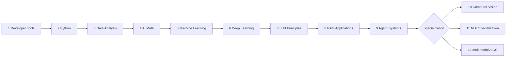

# AI Full-Stack Learning Course

> A free, beginner-friendly AI engineering curriculum that starts with developer foundations and grows into machine learning, deep learning, LLM applications, RAG, AI Agents, and multimodal AIGC.

## Official Site

[https://learning.airoads.org](https://learning.airoads.org)

The website defaults to English. Learners can switch to Simplified Chinese or Japanese from the language dropdown in the navigation bar.

## What This Project Is

This repository powers the AI Full-Stack Learning Course website. It is designed for beginners who want a practical, project-driven path into modern AI engineering rather than a scattered list of articles.

The course combines:

- Step-by-step lessons for new learners.
- Visual explanations, diagrams, and comics for difficult concepts.
- Project checkpoints that turn knowledge into portfolio work.
- Internationalized content for English, Simplified Chinese, and Japanese.
- Deployment, validation, sitemap, and maintenance scripts for a production learning site.

## Course Path

The public course uses a clear, hierarchical numbering system:

```text
0         Start-here guides before Chapter 1
1-12      Main course chapters
N.0       Chapter study guide and task sheet
N.M       Section inside a chapter
N.M.K     Individual lesson page inside a section
E.X       Elective module
E.X.K     Elective lesson page
A.K       Appendix page
```

For example, `4.1.2` means Chapter 4, section 1, lesson 2. It should not appear as a local-only `1.2`, because readers who open a page directly need to know where they are in the whole course.

The recommended path is:



## Learning Stations

| Station | Focus | Outcome |
|---|---|---|
| 1 Developer Tools Foundations | Terminal, Git, development environment | Run code, manage projects, and work independently |
| 2 Python Programming Foundations | Python syntax, data structures, files, OOP, projects | Build CLI tools, scrapers, APIs, and small AI API demos |
| 3 Data Analysis and Visualization | NumPy, Pandas, charts, databases | Clean, analyze, and explain real datasets |
| 4 Minimal Math Foundations for AI | Linear algebra, probability, calculus, optimization | Understand vectors, matrices, probability, gradients, and loss |
| 5 Machine Learning from Basics to Practice | Supervised learning, unsupervised learning, evaluation, features | Build prediction, churn, and segmentation projects |
| 6 Deep Learning and Transformer Foundations | Neural networks, PyTorch, CNN, RNN, Transformer, generative models | Train and diagnose deep learning models |
| 7 LLM Principles, Prompting, and Fine-Tuning | NLP, Transformer internals, pretraining, prompting, fine-tuning, alignment | Choose between prompting, RAG, fine-tuning, and alignment methods |
| 8 LLM Application Development and RAG | RAG, document processing, vector databases, deployment, evaluation | Build cited, logged, evaluated knowledge-base assistants |
| 9 AI Agents and Agentic Systems | Planning, tools, memory, MCP, multi-agent systems, safety | Build traceable AI Agent workflows with guardrails |
| 10 Computer Vision | Classification, detection, segmentation, OCR, video, 3D vision | Build visual AI projects with metrics and failure analysis |
| 11 NLP Specialization After LLMs | Text basics, embeddings, classification, extraction, Seq2Seq, pretrained models | Build text projects for QA, extraction, summarization, or semantic graphs after the main LLM/RAG/Agent path |
| 12 AIGC and Multimodal | Vision-language models, image/video/audio generation, ethics, product projects | Build multimodal creative AI prototypes |

## Beginner Learning Strategy

Treat the course as a project-upgrade path:

- First, read the learning map and station guide.
- Then follow stations 1-9 in order.
- Finally choose station 10, 11, or 12 for a specialization project.
- Do not only read pages. Each stage should leave you with something runnable, explainable, and presentable.

## Internationalization

| Locale | URL pattern | Role |
|---|---|---|
| English | `/` | Default language and canonical root experience |
| Simplified Chinese | `/zh-cn/` | Full localized course content and localized visuals |
| Japanese | `/ja/` | Full localized course content and localized visuals |

Default English content lives in `src/content/docs/`. Localized content lives under `src/content/docs/zh-cn/` and `src/content/docs/ja/`.

## Visual Learning Assets

The course includes many static diagrams, comics, and localized images under `public/img/course/`. These visuals are part of the learning experience, especially for math, machine learning, deep learning, LLMs, RAG, Agent systems, and AI history.

README intentionally stays mostly text-based so it remains fast to load, easy to maintain, and easy to read in package managers, GitHub previews, and terminals. Course visuals belong in the website pages where they can support the lesson context directly.

## Repository Structure

| Path | Purpose |
|---|---|
| `src/content/docs/` | Starlight course content, including English root docs and localized `zh-cn` / `ja` docs |
| `public/img/course/` | Course diagrams, comics, and localized images |
| `src/styles/starlight.css` | Site-level style customizations |
| `astro.config.mjs` | Astro Starlight configuration, locales, sidebar, sitemap, and metadata |
| `scripts/` | Validation, sitemap, image-generation, and maintenance scripts |
| `docker/` | Nginx runtime configuration for Docker deployment |
| `.github/workflows/` | GitHub Actions deployment workflow |

Folder names such as `ch01-tools/` and `ch12-multimodal/` are maintenance paths. Learners should follow the public numbering shown in the sidebar: `0` for start-here pages, `1-12` for the main course, `E` for electives, and `A` for appendix pages.

## Local Development

Install dependencies:

```bash
npm install
```

Run the development site:

```bash
npm run dev
```

Build the full static site:

```bash
npm run build
```

Validate course structure and internal links:

```bash
npm run validate:docs
```

Serve the generated build:

```bash
npm run serve
```

## Deployment

The deployment flow builds a new image while the old container keeps serving traffic. It then runs a preflight check against the new image and only replaces the production container after the new build is ready. This reduces downtime compared with stopping the old container before compilation.

The production build also removes legacy `/zh-Hans/` redirect URLs from the sitemap and strips unexpected NUL bytes from generated HTML. English, Simplified Chinese, and Japanese pages are generated together from Astro Starlight.

## License

Course content and project code are released under the MIT License.
