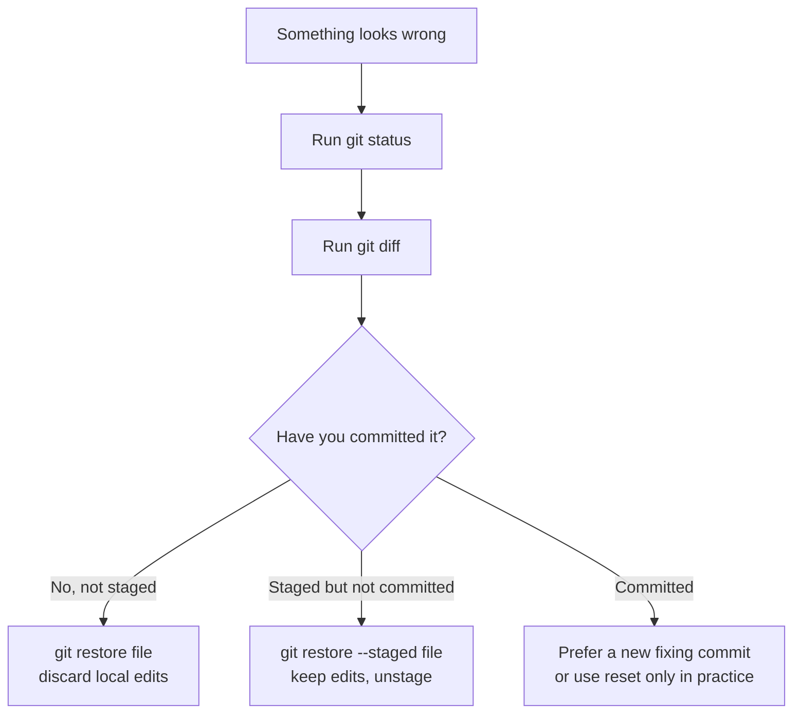

# 1.2.2 Git Core Operations


## Where This Section Fits

This section starts putting Git into practice. The focus is on mastering the add, commit, status, log, diff, and undo operations you will use every day, so you can build the basic development habit of “write a bit of code, check the status, and commit a record.”

## Learning Objectives

- Use `git add`, `git commit`, `git status`, and `git log` fluently
- Learn to use `git diff` to inspect changes
- Be able to write a `.gitignore` file
- Master several commonly used undo operations

---

## Preparation

We will use a simulated AI project to practice all operations. First, create the project:

```bash
mkdir ai-image-classifier
cd ai-image-classifier
git init

# Create the basic project structure
mkdir data models src
touch src/train.py src/model.py src/utils.py
touch README.md requirements.txt
```

---

## Check Status: git status

`git status` is one of the commands you will use most often. It tells you the current state of the repository: which files have been modified? Which files are in the staging area? Which files are not yet tracked by Git?

```bash
git status
```

Output:

```
On branch main

No commits yet

Untracked files:
  (use "git add <file>..." to include in what will be committed)
        README.md
        requirements.txt
        src/

nothing added to commit but untracked files present
```

**Untracked files**: Git can see these files, but it is not managing them yet. You need to use `git add` to tell Git, “please start tracking these files.”

---

## Add to the Staging Area: git add

```bash
# Add a single file
git add README.md

# Add multiple files
git add src/train.py src/model.py

# Add an entire folder
git add src/

# Add all files (most commonly used)
git add .

# Add all modified tracked files (excluding new files)
git add -u
```

### Hands-on Example

First, write some content into the files:

```bash
echo "# AI Image Classifier" > README.md
echo "torch>=2.0" > requirements.txt

cat > src/model.py << 'EOF'
import torch.nn as nn

class SimpleCNN(nn.Module):
    def __init__(self):
        super().__init__()
        self.conv1 = nn.Conv2d(3, 16, 3, padding=1)
        self.pool = nn.MaxPool2d(2, 2)
        self.fc1 = nn.Linear(16 * 16 * 16, 10)

    def forward(self, x):
        x = self.pool(torch.relu(self.conv1(x)))
        x = x.view(-1, 16 * 16 * 16)
        x = self.fc1(x)
        return x
EOF
```

Now add all files and check the status:

```bash
git add .
git status
```

Output:

```
On branch main

No commits yet

Changes to be committed:
  (use "git rm --cached <file>..." to unstage)
        new file:   README.md
        new file:   requirements.txt
        new file:   src/model.py
        new file:   src/train.py
        new file:   src/utils.py
```

The files have turned green as **"Changes to be committed"**, which means they are now in the staging area and ready to be committed.

---

## Commit: git commit

```bash
git commit -m "Initialize project: add model definition and project structure"
```

Output:

```
[main (root-commit) a1b2c3d] Initialize project: add model definition and project structure
 5 files changed, 18 insertions(+)
 create mode 100644 README.md
 create mode 100644 requirements.txt
 create mode 100644 src/model.py
 create mode 100644 src/train.py
 create mode 100644 src/utils.py
```

### How Should You Write Commit Messages?

Commit messages should be concise and clear, so people can immediately tell what changed.

**Good commit messages:**

```bash
git commit -m "Add CNN model definition"
git commit -m "Fix bug where learning rate was not updated in the training loop"
git commit -m "Add data augmentation: random flip and color jitter"
git commit -m "Update README: add installation instructions"
```

**Bad commit messages:**

```bash
git commit -m "update"           # What was updated?
git commit -m "fix"              # What was fixed?
git commit -m "aaa"              # ???
git commit -m "Changed some stuff" # Basically says nothing
```

:::tip A practical principle
A commit message should answer this question: **“What did this commit do?”** Start with a verb (add, fix, update, delete, refactor) and make the target clear.
:::

---

## Inspect Changes: git diff

`git diff` tells you “what changed since the last commit.”

### Example: Modifying the Model Code

```bash
# Add a new layer to model.py
cat > src/model.py << 'EOF'
import torch
import torch.nn as nn

class SimpleCNN(nn.Module):
    def __init__(self):
        super().__init__()
        self.conv1 = nn.Conv2d(3, 16, 3, padding=1)
        self.conv2 = nn.Conv2d(16, 32, 3, padding=1)  # Newly added convolution layer
        self.pool = nn.MaxPool2d(2, 2)
        self.fc1 = nn.Linear(32 * 8 * 8, 10)

    def forward(self, x):
        x = self.pool(torch.relu(self.conv1(x)))
        x = self.pool(torch.relu(self.conv2(x)))  # Newly added
        x = x.view(-1, 32 * 8 * 8)
        x = self.fc1(x)
        return x
EOF
```

Now check the changes:

```bash
git diff
```

The output will highlight differences in red and green:

```diff
--- a/src/model.py
+++ b/src/model.py
@@ -1,4 +1,5 @@
+import torch
 import torch.nn as nn

 class SimpleCNN(nn.Module):
     def __init__(self):
         super().__init__()
         self.conv1 = nn.Conv2d(3, 16, 3, padding=1)
+        self.conv2 = nn.Conv2d(16, 32, 3, padding=1)  # Newly added convolution layer
         self.pool = nn.MaxPool2d(2, 2)
-        self.fc1 = nn.Linear(16 * 16 * 16, 10)
+        self.fc1 = nn.Linear(32 * 8 * 8, 10)
```

- **Red** (`-` at the start): deleted lines
- **Green** (`+` at the start): newly added lines

Now commit this change:

```bash
git add src/model.py
git commit -m "Add a second convolution layer to improve model capacity"
```

### Common Ways to Use diff

```bash
git diff                    # View unstaged changes in the working directory
git diff --staged           # View staged changes (added but not yet committed)
git diff HEAD~1             # View what the most recent commit changed
git diff abc1234 def5678    # Compare differences between two commits
```

---

## View History: git log

```bash
git log
```

Output:

```
commit def5678... (HEAD -> main)
Author: Zhang San <zhangsan@example.com>
Date:   Mon Feb 9 10:30:00 2026

    Add a second convolution layer to improve model capacity

commit a1b2c3d...
Author: Zhang San <zhangsan@example.com>
Date:   Mon Feb 9 10:00:00 2026

    Initialize project: add model definition and project structure
```

### A More Concise Way to View History

```bash
# One record per line (most commonly used)
git log --oneline
# Output:
# def5678 Add a second convolution layer to improve model capacity
# a1b2c3d Initialize project: add model definition and project structure

# With file change statistics
git log --oneline --stat

# Show branches visually (very useful when branches exist)
git log --oneline --graph --all
```

---

## .gitignore: Tell Git What to Ignore

Some files should not be managed by Git:

- Data files (training data that is several GB)
- Model weight files (hundreds of MB)
- Virtual environment folders
- Temporary files generated by the system
- Sensitive information such as API keys and passwords

Create a `.gitignore` file to tell Git to ignore them:

```bash
cat > .gitignore << 'EOF'
# Python cache
__pycache__/
*.pyc
*.pyo

# Virtual environment
venv/
.venv/
env/

# Jupyter Notebook checkpoints
.ipynb_checkpoints/

# Data files (too large to put in Git)
data/*.csv
data/*.json
data/*.zip
*.h5
*.hdf5

# Model weight files
models/*.pt
models/*.pth
models/*.onnx
*.bin

# Environment variable files (contain API keys and other sensitive information)
.env
.env.local

# IDE settings
.vscode/
.idea/

# Operating system files
.DS_Store
Thumbs.db

# Logs
logs/
*.log

# Distribution / packaging
dist/
build/
*.egg-info/
EOF
```

```bash
git add .gitignore
git commit -m "Add .gitignore: ignore cache, data, model weights, and sensitive files"
```

### Verify That .gitignore Works

```bash
# Create some files that should be ignored
mkdir -p __pycache__
touch __pycache__/model.cpython-311.pyc
touch .env
echo "OPENAI_API_KEY=your_api_key_here" > .env

# Check the status — these files will not appear
git status
# Output: nothing to commit, working tree clean
```

`.env` and `__pycache__/` are both ignored and will not be committed to Git. Your API key is safe.

:::warning Already Tracked Files
`.gitignore` only works for files that have **not yet been tracked by Git**. If you committed a file first and only later added it to `.gitignore`, Git will not ignore it automatically. You need to stop tracking it manually first:

```bash
git rm --cached .env
git commit -m "Remove .env file from Git"
```
:::

---

## Undo Operations: Safety Nets

Git provides several different “safety nets,” and you choose one based on how far you want to go back.

:::warning Practice undo commands only in the practice repository first
Undo commands are useful, but some of them intentionally discard changes. Before using them in a real project, run `git status` and `git diff`, and make sure you know which changes will be kept and which will be lost.
:::

For beginners, use this order of thinking:



### Scenario 1: You changed a file but have not run add yet, and want to restore it

```bash
# You changed src/utils.py, but you are not happy with the changes and want to restore it to the last committed state
git restore src/utils.py

# Restore all files
git restore .
```

:::warning
`git restore` will **discard your changes** and they cannot be recovered. Make sure you really do not want those changes before running it.
:::

### Scenario 2: You already ran add and want to remove it from the staging area, but keep the changes

```bash
# You added model.py, but you do not want to commit it yet
git restore --staged src/model.py

# The file will move from the staging area back to the working directory, and your changes will remain
```

### Scenario 3: You already committed and want to change the commit message

```bash
# You just committed and realized the message was wrong
git commit --amend -m "Corrected commit message"
```

### Scenario 4: You already committed and want to undo the entire commit

```bash
# Undo the most recent commit, but keep the file changes (go back to before add)
git reset HEAD~1

# Undo the most recent commit and discard all changes (full rollback, use with caution)
git reset --hard HEAD~1
```

For the first few weeks, treat `git reset --hard` as an emergency command, not a daily command. In team projects, rewriting history may also affect other people, so the safer habit is often to make a new commit that fixes the mistake.

### Example: A Complete Undo Flow

```bash
# Suppose you accidentally committed an API key
echo "API_KEY=your_api_key_here" > config.py
git add .
git commit -m "Add configuration file"

# Oops! The key should not have been committed. Undo this commit
git reset HEAD~1

# The file is still there, but the commit has been undone. Now add it to .gitignore
echo "config.py" >> .gitignore
git add .gitignore
git commit -m "Update .gitignore: ignore config.py"
```

### Undo Quick Reference

| What I want to undo | Command | Are the file changes still there? |
|------------|------|:-----------:|
| Changes in the working directory (not yet added) | `git restore file-name` | ❌ Discarded |
| Files in the staging area (added but not committed) | `git restore --staged file-name` | ✅ Kept |
| The last commit message was wrong | `git commit --amend -m "new message"` | ✅ Kept |
| The most recent commit (keep changes) | `git reset HEAD~1` | ✅ Kept |
| The most recent commit (discard changes) | `git reset --hard HEAD~1` | ❌ Discarded |

---

## Hands-on Practice: Simulate a Full Development Workflow

```bash
# 1. Write the training script
cat > src/train.py << 'EOF'
import torch
from model import SimpleCNN

model = SimpleCNN()
optimizer = torch.optim.Adam(model.parameters(), lr=0.001)
print("Number of model parameters:", sum(p.numel() for p in model.parameters()))
EOF

git add src/train.py
git commit -m "Add basic training script"

# 2. Write a utility function
cat > src/utils.py << 'EOF'
def accuracy(predictions, labels):
    """Calculate accuracy"""
    correct = (predictions.argmax(dim=1) == labels).sum().item()
    return correct / len(labels)
EOF

git add src/utils.py
git commit -m "Add accuracy calculation utility function"

# 3. Update the README
cat > README.md << 'EOF'
# AI Image Classifier

A simple image classification project using CNN.

## Installation

```bash
pip install -r requirements.txt
```

## Usage

```bash
python src/train.py
```
EOF

git add README.md
git commit -m "Update README: add installation and usage instructions"

# 4. View the full history
git log --oneline
```

You should see something like these 5 commit records:

```
f6g7h8i Update README: add installation and usage instructions
d4e5f6g Add accuracy calculation utility function
b2c3d4e Add basic training script
9a0b1c2 Add .gitignore: ignore cache, data, model weights, and sensitive files
a1b2c3d Initialize project: add model definition and project structure
```

Each one is an archive point you can roll back to.

<details>
<summary>Reference answers and explanation</summary>

1. The final `git log --oneline` should show the three exercise commits plus the earlier setup commits.
2. Each commit should save one small idea: training script, utility function, or README update.
3. `git status` after the final commit should be clean, or it should show only intentional untracked files that you can explain.
4. If `src/train.py` fails because `torch` or `model` is missing, that is separate from the Git exercise. Record the run failure, but keep the commit workflow evidence.
5. Good commit messages use action words and explain the change, such as `Add basic training script`, not vague messages like `update stuff`.

</details>

---

## Evidence to Keep

Keep this page's proof of learning as a small evidence card:

```text
repo_state: git status before and after the operation
operation: init, add, commit, branch, merge, remote, pull, or push command used
history: git log or branch graph showing what changed
failure_check: untracked files, wrong branch, merge conflict, or remote/auth issue
Expected_output: a clean Git trace that another learner can replay safely
```

## Summary

| Command | Purpose | Frequency |
|------|------|:------:|
| `git status` | Check the current status | ⭐⭐⭐⭐⭐ |
| `git add .` | Stage all changes | ⭐⭐⭐⭐⭐ |
| `git commit -m "message"` | Commit | ⭐⭐⭐⭐⭐ |
| `git log --oneline` | View history | ⭐⭐⭐⭐ |
| `git diff` | Inspect changes | ⭐⭐⭐⭐ |
| `git restore` | Undo working-directory changes | ⭐⭐⭐ |
| `git reset` | Undo commits | ⭐⭐ |
