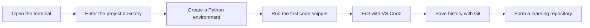
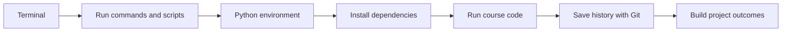

# 1 Developer Tools Fundamentals


This stage is about whether you can write code, run code, and save code reliably. Many beginners get stuck later in AI learning not because the models are too hard, but because they do not know how to use the command line, their environments are messy, dependencies are installed incorrectly, and their code has no version management.

## Story-based introduction: first build your AI workstation

Before you start writing models and applications, set up your workstation properly. The terminal is like a console, Git is like an archive system, the Python environment is like a lab, and VS Code and Jupyter are like two different operating panels. The goal of this tools stage is not to learn a lot of commands, but to make sure that when you encounter a project later, you can create, run, save, and restore it on your own.

## Learning roadmap



## Interactive exercise: leave one reproducible record every day

Every time you complete a tool operation, write a note in your learning repository: “What I did, what command I used, what error I ran into, and how I solved it.” These records will become your own development manual. When environment problems come up later, you will not be guessing from scratch — you can go back to your history and look for clues.

## Project bonus

The bonus project for this stage is a repository called `ai-learning-lab`. At first it may look like just a simple folder, but later it will gradually hold Python scripts, data analysis notebooks, model experiments, RAG projects, and Agent demos. In other words, this repository will grow from a small toolbox on day one into your AI full-stack portfolio.

## Stage position

| Information | Description |
|---|---|
| Suitable for | Learners who are just starting to study AI full-stack systematically, or whose development toolchain is unstable |
| Estimated time | 8–12 hours |
| Prerequisites | None |
| Stage output | A reproducible Python development environment and a learning repository managed with Git |

## Beginner minimum path to completion

Beginners should first get the basics of the terminal, Git, and Python environment setup working. You do not need to master complex branching models or every command parameter at the start. As long as you can create a project, run a Python file, install dependencies, and make one Git commit, you have completed the minimum path for this stage.

## Advanced deepening path

If you already have development experience, focus on environment isolation, Git branch collaboration, remote repository synchronization, and reproducible project documentation. Try to turn `ai-learning-lab` into a standard project repository, including environment instructions, run commands, directory structure, and common troubleshooting notes.

## What beginners should do first, and what advanced learners should do later

When beginners study this stage for the first time, keep the goal as small as possible: open the terminal, enter the project directory, run a Python file, install one dependency, and make one Git commit. Do not be intimidated by command parameters. First build the habit of checking paths, reading errors, and understanding the current environment when problems occur.

Learners with experience can focus on reproducibility: how to isolate environments for different projects, how to write run steps in the README, how to record dependency versions, and how Git history helps with rollbacks. Your goal is not just to “know how to use tools,” but to make sure every AI project later can be rerun by someone else.

## Why learn tools first

AI learning is not just about reading concepts on a web page. Later you will constantly install libraries, run scripts, open notebooks, download data, call APIs, train models, start services, and troubleshoot errors. The earlier your toolchain becomes stable, the less energy you will waste on unrelated problems.



## Learning path for this stage

In Chapter 1, learn the terminal and command line first. You need to be able to enter directories, view files, run commands, understand paths, and handle common errors.

In Chapter 2, learn Git and version management. You need to build the habit of committing as you go, know how to view history, roll back changes, manage branches, and sync with remote repositories.

In Chapter 3, learn development environment setup. You will build a Python environment, configure VS Code, use Jupyter, and understand why virtual environments are needed to isolate dependencies.

## What you should be able to do after finishing

- Complete basic file and project operations in the terminal
- Create, activate, and manage Python environments
- Use VS Code to write, run, and debug Python files
- Use Git to save your learning process and push projects to GitHub
- When environment issues occur, first determine whether the problem is path, interpreter, dependency, or permission related

## Common misconceptions

Many beginners think, “I can always learn the command line and Git later.” But in AI projects, environments, dependencies, data paths, model files, and deployment commands appear almost every day. If your tool foundation is unstable, every later stage will be interrupted again and again.

Another common misconception is installing every Python package into the same environment. That may feel convenient in the short term, but in the long term it leads to version conflicts. You should understand the meaning of virtual environments from the very beginning.

## Tool troubleshooting theater: where to look first

If the terminal says a command cannot be found, first check whether the command is installed, whether the current shell has refreshed, and whether the path is written correctly. If Python can run but imports fail, first confirm whether the current interpreter and the environment where you installed the dependency are the same. If a Git commit fails, first check whether the repository has been initialized, whether your username and email are configured, and whether the file has really been added to the staging area.

## Minimum runnable experiment: from an empty folder to a reproducible repository

The minimum experiment in this stage is not about writing complex code, but about completing the full development workflow: create an `ai-learning-lab` folder, write a `hello_ai.py`, run it in the terminal, write the commands and output into the README, and then make one Git commit.

```bash
mkdir ai-learning-lab
cd ai-learning-lab
python -m venv .venv
python hello_ai.py
git init
git add .
git commit -m "init learning lab"
```

If you can complete this chain independently, then when you later study Python, data analysis, RAG, and Agent, you will already have a stable workstation.

## Tool failure case library: check paths, environment, and version first

| Symptom | Common cause | How to locate it | How to fix it |
|---|---|---|---|
| The terminal says command not found | The command is not installed or PATH has not taken effect | Check the installation location and the current shell | Reinstall, refresh the terminal, and check PATH |
| Python runs but importing packages fails | `pip` and `python` are not in the same environment | Compare `which python` and `python -m pip --version` | Use a virtual environment and install with `python -m pip install` |
| Git commit fails | Repository not initialized, not staged, or identity not configured | Run `git status` and `git config --list` | Initialize the repository, configure username and email, then add before committing |
| Commands in the README do not work | Missing path, filename, or dependency | Re-run from a fresh terminal according to the README | Add the directory, dependencies, and full commands |

## Stage evaluation rubric

| Level | Evaluation criteria | Portfolio evidence |
|---|---|---|
| Minimum pass | Can open the terminal, run Python, and make one Git commit | Run screenshots, commit record |
| Recommended pass | Can create a virtual environment, install dependencies, and write a clear README | `.venv` notes, `requirements.txt`, README |
| Portfolio pass | Can turn the toolchain into a reusable repository for later courses | Directory structure, command notes, troubleshooting notes, remote repository link |

## Stage project

The basic version is to create an `ai-learning-lab` learning repository, including a runnable `hello_ai.py`, one Git commit, and a command log. The standard version should add Python environment instructions, dependency installation steps, VS Code or Jupyter usage notes, and push the repository to a remote platform. The challenge version can organize it as the portfolio root directory for the following 12 learning stations, and pre-design folders such as `scripts/`, `notebooks/`, `projects/`, and `notes/` so that the results of the whole course can be continuously accumulated.

If you want to see a more detailed learning rhythm, you can read [Stage Learning Task List: Developer Tools Fundamentals](task-list.md).

## Fun task card for this stage

| Play style | Task in this stage |
|---|---|
| Story task | Help the AI learning assistant build its first workstation: open the terminal, run Python, write a README, and complete one Git archive. |
| Boss battle | **Workstation Gatekeeper** |
| Unlockable badges | Terminal Survivor, Git Archivist |
| Beginner easy mode | Only complete one minimal input-to-output loop, and first leave a run screenshot or command output |
| Portfolio evidence | From an empty folder to one reproducible commit |

If you feel there is a lot of content in this stage, use this task card as your minimum goal first. Once you can complete the beginner easy mode, you can keep going; when you prepare your portfolio later, come back and upgrade to the standard and challenge versions.

## Stage deliverables

| Deliverable | Minimum version | Portfolio version |
|---|---|---|
| Learning repository | Create `ai-learning-lab` and run one Python file | Clear directory structure, README, screenshots, and commit history |
| Environment notes | Record the Python version and installation commands | Provide virtual environment notes, dependency files, and common troubleshooting steps |
| Command log | Save 5–10 commonly used terminal commands | Explain the purpose, output, and failure handling of each command |
| Git record | Make one local commit | Include branches, remote repository, commit messages, and rollback records |
| README | Clearly explain how to run `hello_ai.py` | Explain project goals, directory structure, environment setup, and next steps |

## Relationship with the AI learning assistant integrated project

This stage can correspond to AI Learning Assistant v0.1: create the repository, configure the Python environment, write the README, and save the first run screenshot. If you are learning through the integrated project path, it is recommended that by the end of this stage you submit at least one version record: what new capability was added in this stage, how to run it, what the sample input and output are, what problems you encountered, and how you plan to improve it next.


## Stage completion criteria

| Completion level | What you need to do |
|---|---|
| Minimum pass | Independently use the terminal, Git, editor, and Python/Jupyter environment. |
| Recommended pass | Complete at least one runnable mini-project in this stage, and record the run method, sample input/output, and problems encountered in the README. |
| Portfolio pass | Connect the output of this stage to the “AI Learning Assistant” integrated project, leaving screenshots, logs, evaluation samples, and a next-step plan. |

After finishing this stage, you do not need to memorize every detail. What matters more is being able to clearly explain: what problem this stage solves, how it relates to the previous stage, and how it will support later learning. The next stage will use these tools to write Python programs and save project code.
