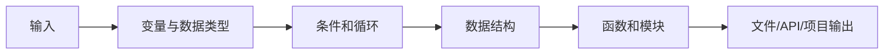

# 学习指南：Python 编程基础怎么学最不容易学乱

如果你已经来到 `01 Python 编程基础`，最重要的目标不是背完所有语法，而是能用 Python 写出一个能运行、能修改、能解释的小程序。

## 本阶段总原则

Python 第一遍要抓住一条主线：输入进入程序，经过数据结构、条件、循环、函数处理，最后输出结果或保存文件。只要这条线稳住，后面学数据分析、机器学习、RAG 和 Agent 都会更顺。

## 推荐学习顺序

第一轮先学最小编程闭环：Python 简介、数据类型、运算符、输入输出、流程控制、列表、字典、函数和模块。目标是能写一个小脚本，而不是记住所有细节。

第二轮再补代码组织能力：面向对象、异常处理、文件读写、函数式编程、迭代器生成器、类型注解和代码质量。目标是让代码更清晰、更稳定、更容易扩展。

第三轮进入项目：命令行任务管理器、网页爬虫、Web API、AI API 快速体验。项目会逼你把语法、文件、异常、第三方库和调试能力串起来。

## 建议学习节奏

| 内容类型 | 建议时间 | 学习目标 |
|---|---|---|
| 基础语法页 | 1～2 小时 | 能手敲示例，并改出新结果 |
| 数据结构和函数 | 2～4 小时 | 能把重复逻辑拆成函数 |
| 进阶组织页 | 2～4 小时 | 能读懂文件、类、异常和模块关系 |
| 项目页 | 4～8 小时 | 能独立跑通并做小改造 |

## 阶段项目路线

第一个项目建议做命令行任务管理器，练习输入输出、列表/字典、文件保存和异常处理。

第二个项目建议做网页数据采集，练习 HTTP 请求、HTML 解析、数据清洗和文件存储。

第三个项目建议做 Web API，理解请求、响应、路由、参数校验和服务启动。

第四个项目建议做 AI API 快速体验，把大模型能力接入自己的 Python 程序，为后面的 LLM 应用主线做铺垫。

## 常见卡点

最常见的卡点是“看懂示例，但自己写不出来”。解决方式不是继续看更多教程，而是把示例关掉，只保留需求，用最笨的方法先写出第一版。

第二个卡点是函数和模块。你可以先用一个文件写完，等代码超过几十行后，再把重复逻辑抽成函数，把相关函数整理到模块里。

第三个卡点是报错。不要害怕报错，先看最后一行错误信息，再看文件名和行号，最后用最小代码复现问题。

## 过关标准

学完本阶段后，你应该能独立完成一个小型 Python 项目，能解释每个文件的作用，能处理常见报错，能读写文件，能安装第三方库，能调用一个简单 API。

如果你能把“命令行任务管理器”从零写出来，并能加入一个新功能，比如搜索、排序、分类或导出，就可以进入下一阶段。