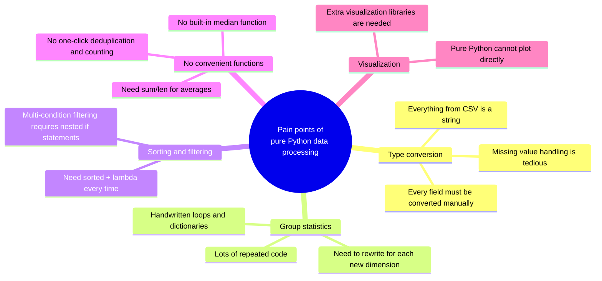
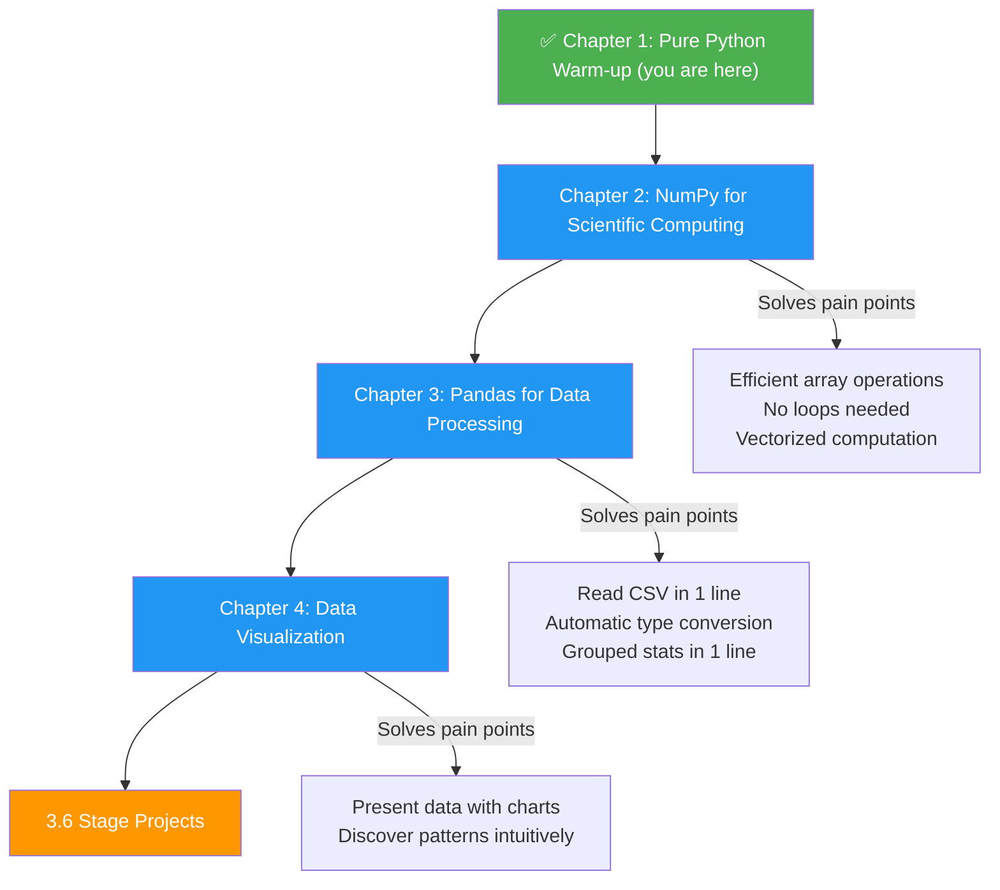

# 3.1.1 Warm-up: Processing Data with Pure Python

## Learning Objectives

- Process a real dataset using pure Python (`csv` module + dictionaries + lists)
- Experience the **pain points** of data processing with pure Python firsthand
- Understand why specialized data analysis tools (NumPy, Pandas) are needed
- Build intuition and motivation for the lessons ahead

---

## Why do this warm-up?

You might be thinking: "I already know Python. Why not just learn NumPy and Pandas directly?"

No rush. Let’s do a small experiment first.

It’s like riding a bicycle for 20 kilometers before learning to drive a car — only after you’ve personally experienced how "slow and tiring" a bicycle can be will you truly appreciate the value of a car.

**The goal of this section: process a real dataset using pure Python, and then you’ll say that sentence — "Isn’t there an easier way?!"**

---

## The big picture of data analysis

Before we start coding, let’s look at the typical data analysis workflow:


Today we’ll use **pure Python** to complete the first four steps. After we learn NumPy and Pandas, you’ll see that the same tasks can take **5–10x less code**.

---

## Meet our dataset: Titanic

We’ll use the classic **Titanic** dataset — one of the most common datasets for data science beginners.

Each row represents one passenger and contains the following information:

| Field | Meaning | Example Value |
|------|------|--------|
| `PassengerId` | Passenger ID | 1 |
| `Survived` | Whether they survived (0 = died, 1 = survived) | 0 |
| `Pclass` | Ticket class (1 = first, 2 = second, 3 = third) | 3 |
| `Name` | Name | Braund, Mr. Owen Harris |
| `Sex` | Sex | male |
| `Age` | Age | 22 |
| `SibSp` | Number of siblings/spouses aboard | 1 |
| `Parch` | Number of parents/children aboard | 0 |
| `Ticket` | Ticket number | A/5 21171 |
| `Fare` | Fare | 7.25 |
| `Cabin` | Cabin number | C85 |
| `Embarked` | Port of embarkation (C/Q/S) | S |

---

## Step 1: Prepare the data

First, let’s create a small Titanic dataset for practice. Save and run the following code, and it will generate a `titanic_sample.csv` file:

```python
# create_sample_data.py
# Create a small Titanic sample dataset

csv_content = """PassengerId,Survived,Pclass,Name,Sex,Age,SibSp,Parch,Ticket,Fare,Cabin,Embarked
1,0,3,"Braund, Mr. Owen Harris",male,22,1,0,A/5 21171,7.25,,S
2,1,1,"Cumings, Mrs. John Bradley",female,38,1,0,PC 17599,71.2833,C85,C
3,1,3,"Heikkinen, Miss. Laina",female,26,0,0,STON/O2. 3101282,7.925,,S
4,1,1,"Futrelle, Mrs. Jacques Heath",female,35,1,0,113803,53.1,C123,S
5,0,3,"Allen, Mr. William Henry",male,35,0,0,373450,8.05,,S
6,0,3,"Moran, Mr. James",male,,0,0,330877,8.4583,,Q
7,0,1,"McCarthy, Mr. Timothy J",male,54,0,0,17463,51.8625,E46,S
8,0,3,"Palsson, Master. Gosta Leonard",male,2,3,1,349909,21.075,,S
9,1,3,"Johnson, Mrs. Oscar W",female,27,0,2,347742,11.1333,,S
10,1,2,"Nasser, Mrs. Nicholas",female,14,1,0,237736,30.0708,,C
11,1,3,"Sandstrom, Miss. Marguerite Rut",female,4,1,1,PP 9549,16.7,G6,S
12,1,1,"Bonnell, Miss. Elizabeth",female,58,0,0,113783,26.55,C103,S
13,0,3,"Saundercock, Mr. William Henry",male,20,0,0,A/5. 2151,8.05,,S
14,0,3,"Andersson, Mr. Anders Johan",male,39,1,5,347082,31.275,,S
15,0,3,"Vestrom, Miss. Hulda Amanda",female,14,0,0,350406,7.8542,,S
16,1,2,"Hewlett, Mrs. Mary D",female,55,0,0,248706,16,,S
17,0,3,"Rice, Master. Eugene",male,2,4,1,382652,29.125,,Q
18,1,2,"Williams, Mr. Charles Eugene",male,,0,0,244373,13,,S
19,0,3,"Vander Planke, Mrs. Julius",female,31,1,0,345763,18,,S
20,1,3,"Masselmani, Mrs. Fatima",female,,0,0,2649,7.225,,C
21,0,2,"Fynney, Mr. Joseph J",male,35,0,0,239865,26,,S
22,1,2,"Beesley, Mr. Lawrence",male,34,0,0,248698,13,,S
23,1,3,"McGowan, Miss. Anna",female,15,0,0,330923,8.0292,,Q
24,1,1,"Sloper, Mr. William Thompson",male,28,0,0,113788,35.5,A6,S
25,0,3,"Palsson, Miss. Torborg Danira",female,8,3,1,349909,21.075,,S
26,1,3,"Asplund, Mrs. Carl Oscar",female,38,1,5,347077,31.3875,,S
27,0,3,"Emir, Mr. Farred Chehab",male,,0,0,2631,7.225,,C
28,0,1,"Fortune, Mr. Charles Alexander",male,19,3,2,19950,263,,S
29,1,3,"O'Dwyer, Miss. Ellen",female,,0,0,330959,7.8792,,Q
30,0,3,"Todoroff, Mr. Lalio",male,,0,0,349216,7.8958,,S"""

with open("titanic_sample.csv", "w", encoding="utf-8") as f:
    f.write(csv_content)

print("✅ titanic_sample.csv has been created! (30 records)")
```

After running this code, you’ll see a new `titanic_sample.csv` file in your directory.

:::tip You can also use the real dataset
If you want to challenge yourself with the full dataset (891 records), you can download `train.csv` from the [Kaggle Titanic page](https://www.kaggle.com/c/titanic/data). The code in this tutorial works for both.
:::

---

## Step 2: Read the CSV file

### Task: Read the CSV file into Python data structures

```python
import csv

def read_csv(filename):
    """Read a CSV file and return a list of dictionaries"""
    passengers = []

    with open(filename, "r", encoding="utf-8") as f:
        reader = csv.DictReader(f)
        for row in reader:
            passengers.append(dict(row))

    return passengers

# Read the data
passengers = read_csv("titanic_sample.csv")

# Take a look at the first record
print(f"Loaded {len(passengers)} records in total\n")
print("Information for the first passenger:")
for key, value in passengers[0].items():
    print(f"  {key}: {value}")
```

Output:

```
Loaded 30 records in total

Information for the first passenger:
  PassengerId: 1
  Survived: 0
  Pclass: 3
  Name: Braund, Mr. Owen Harris
  Sex: male
  Age: 22
  SibSp: 1
  Parch: 0
  Ticket: A/5 21171
  Fare: 7.25
  Cabin:
  Embarked: S
```

:::caution First pain point: all data is stored as strings!
Notice that `Age` is `"22"` instead of `22`, and `Survived` is `"0"` instead of `0`. Everything read from CSV is a **string**! To do any math, you have to convert every field manually.
:::

---

## Step 3: Data cleaning and type conversion

Before analysis, we need to convert strings to the correct types and handle missing values:

```python
def clean_data(passengers):
    """Clean the data: type conversion + missing value handling"""
    cleaned = []

    for p in passengers:
        # Try to convert Age (some passengers have no age data)
        age = None
        if p["Age"] and p["Age"].strip():
            try:
                age = float(p["Age"])
            except ValueError:
                age = None

        # Convert Fare
        fare = 0.0
        if p["Fare"] and p["Fare"].strip():
            try:
                fare = float(p["Fare"])
            except ValueError:
                fare = 0.0

        cleaned.append({
            "id": int(p["PassengerId"]),
            "survived": int(p["Survived"]),
            "pclass": int(p["Pclass"]),
            "name": p["Name"],
            "sex": p["Sex"],
            "age": age,             # May be None
            "sibsp": int(p["SibSp"]),
            "parch": int(p["Parch"]),
            "fare": fare,
            "cabin": p["Cabin"] if p["Cabin"] else None,
            "embarked": p["Embarked"] if p["Embarked"] else None,
        })

    return cleaned

passengers = clean_data(passengers)

# Verify the cleaning result
p = passengers[0]
print(f"Name: {p['name']}")
print(f"Age: {p['age']} (type: {type(p['age']).__name__})")
print(f"Fare: {p['fare']} (type: {type(p['fare']).__name__})")
print(f"Survived: {p['survived']} (type: {type(p['survived']).__name__})")

# Check how many passengers are missing age data
missing_age = sum(1 for p in passengers if p["age"] is None)
print(f"\nPassengers missing age data: {missing_age}")
```

By now you may already be feeling it — **just reading and cleaning the data took dozens of lines of code.** And this is only a small dataset!

---

## Step 4: Data analysis tasks

Now that the data is clean, let’s do a few analysis tasks.

### Task 1: Count survival rates by gender

```python
def survival_rate_by_gender(passengers):
    """Count survival rates by gender"""
    # Count total and survived passengers for males and females separately
    stats = {}

    for p in passengers:
        sex = p["sex"]
        if sex not in stats:
            stats[sex] = {"total": 0, "survived": 0}
        stats[sex]["total"] += 1
        stats[sex]["survived"] += p["survived"]

    # Calculate survival rates
    print("=== Survival Rate by Gender ===")
    print(f"{'Gender':<10}{'Total':<10}{'Survived':<10}{'Survival Rate'}")
    print("-" * 40)

    for sex, data in stats.items():
        rate = data["survived"] / data["total"] * 100
        print(f"{sex:<10}{data['total']:<10}{data['survived']:<10}{rate:.1f}%")

survival_rate_by_gender(passengers)
```

Output:

```
=== Survival Rate by Gender ===
Gender    Total     Survived  Survival Rate
----------------------------------------
male      14        3         21.4%
female    16        13        81.2%
```

**Historical fact:** The “women and children first” rule was indeed enforced when the Titanic sank — women had a much higher survival rate than men.

### Task 2: Find the top 5 passengers with the highest fares

```python
def top_fare_passengers(passengers, n=5):
    """Find the top n passengers with the highest fares"""
    # Sort by fare (you have to write the sorting logic manually)
    sorted_passengers = sorted(passengers, key=lambda p: p["fare"], reverse=True)

    print(f"\n=== Top {n} Passengers by Fare ===")
    print(f"{'Rank':<6}{'Name':<35}{'Class':<6}{'Fare'}")
    print("-" * 60)

    for i, p in enumerate(sorted_passengers[:n], 1):
        pclass_name = {1: "First", 2: "Second", 3: "Third"}[p["pclass"]]
        print(f"{i:<6}{p['name']:<35}{pclass_name:<6}${p['fare']:.2f}")

top_fare_passengers(passengers)
```

Output:

```
=== Top 5 Passengers by Fare ===
Rank  Name                               Class  Fare
------------------------------------------------------------
1     Fortune, Mr. Charles Alexander     First  $263.00
2     Cumings, Mrs. John Bradley         First  $71.28
3     Futrelle, Mrs. Jacques Heath       First  $53.10
4     McCarthy, Mr. Timothy J            First  $51.86
5     Sloper, Mr. William Thompson       First  $35.50
```

### Task 3: Group by class and calculate average age

This task shows most clearly how painful pure Python data processing can be:

```python
def avg_age_by_class(passengers):
    """Group by ticket class and calculate average age"""
    # Step 1: group by ticket class
    groups = {}  # {pclass: [age1, age2, ...]}

    for p in passengers:
        pclass = p["pclass"]
        if pclass not in groups:
            groups[pclass] = []

        # Only include passengers with age data
        if p["age"] is not None:
            groups[pclass].append(p["age"])

    # Step 2: calculate statistics for each group
    print("\n=== Age Statistics by Ticket Class ===")
    print(f"{'Class':<10}{'Count':<10}{'Average Age':<12}{'Max Age':<12}{'Min Age'}")
    print("-" * 55)

    for pclass in sorted(groups.keys()):
        ages = groups[pclass]
        if ages:
            avg = sum(ages) / len(ages)
            max_age = max(ages)
            min_age = min(ages)
            pclass_name = {1: "First Class", 2: "Second Class", 3: "Third Class"}[pclass]
            print(f"{pclass_name:<10}{len(ages):<10}{avg:<12.1f}{max_age:<12.0f}{min_age:.0f}")

avg_age_by_class(passengers)
```

Output:

```
=== Age Statistics by Ticket Class ===
Class       Count     Average Age Max Age     Min Age
-------------------------------------------------------
First Class  5         39.4        58          19
Second Class 4         34.5        55          14
Third Class  14        19.4        39          2
```

### Task 4: Calculate average fare by embarkation port

```python
def avg_fare_by_embarked(passengers):
    """Calculate the average fare for each embarkation port"""
    port_names = {"S": "Southampton", "C": "Cherbourg", "Q": "Queenstown"}
    groups = {}

    for p in passengers:
        port = p["embarked"]
        if port is None:
            continue
        if port not in groups:
            groups[port] = []
        groups[port].append(p["fare"])

    print("\n=== Fare Statistics by Embarkation Port ===")
    print(f"{'Port':<20}{'Count':<10}{'Average Fare':<15}{'Total Fare'}")
    print("-" * 55)

    for port, fares in sorted(groups.items()):
        avg = sum(fares) / len(fares)
        total = sum(fares)
        name = port_names.get(port, port)
        print(f"{name:<20}{len(fares):<10}${avg:<14.2f}${total:.2f}")

avg_fare_by_embarked(passengers)
```

---

## Step 5: Feel the pain points

Let’s review the problems we encountered when doing these analyses with pure Python:



### Pain point summary table

| Pain point | Pure Python approach | How much code |
|------|-----------------|-----------|
| Read CSV | `csv.DictReader` + manual type conversion | ~30 lines |
| Calculate survival rate by gender | Handwritten dictionary grouping + loop-based calculation | ~15 lines |
| Sort and take top N | `sorted()` + slicing + formatted output | ~10 lines |
| Group by class and compute mean | Handwritten dictionary grouping + manual missing-value filtering + manual calculation | ~20 lines |

**Total:** About 75–100 lines of code to complete 4 simple analysis tasks.

---

## Step 6: Preview — how much code would Pandas need for the same tasks?

Don’t rush into Pandas syntax yet. Just look at the comparison in results:

```python
# ⚠️ This is a preview! We will learn each line in detail later

import pandas as pd

# Read + automatic type conversion (1 line, replacing your 30 lines)
df = pd.read_csv("titanic_sample.csv")

# Survival rate by gender (1 line, replacing your 15 lines)
print(df.groupby("Sex")["Survived"].mean())

# Top 5 passengers by fare (1 line, replacing your 10 lines)
print(df.nlargest(5, "Fare")[["Name", "Pclass", "Fare"]])

# Average age by class (1 line, replacing your 20 lines)
print(df.groupby("Pclass")["Age"].mean())

# Average fare by port (1 line)
print(df.groupby("Embarked")["Fare"].mean())
```

**5 lines of Pandas code = 75 lines of pure Python code.**

And Pandas also **handles type conversion and missing values automatically**, so you don’t need to write any extra code.

### Code length comparison

```mermaid
xychart-beta
    title "Code Lines Comparison: Pure Python vs Pandas"
    x-axis ["Read data", "Gender survival rate", "Top 5 fares", "Grouped mean", "Total"]
    y-axis "Number of code lines" 0 --> 100
    bar [30, 15, 10, 20, 75]
    bar [1, 1, 1, 1, 5]
```



---

## Hands-on exercises

### Exercise 1: Calculate the average fare for survivors and non-survivors

Use pure Python to compute:
- The average fare for survivors
- The average fare for non-survivors
- The difference between them

```python
def avg_fare_by_survival(passengers):
    """Calculate the average fare for survivors and non-survivors"""
    # Hint: similar to grouping by gender
    # survived == 1 means survived, survived == 0 means did not survive
    groups = {0: [], 1: []}
    for p in passengers:
        groups[p["survived"]].append(p["fare"])

    for survived, fares in groups.items():
        label = "Survived" if survived else "Did not survive"
        average = sum(fares) / len(fares) if fares else 0
        print(f"{label}: {average:.2f}")

avg_fare_by_survival(passengers)
```

Think about it: what is the relationship between fare (ticket class) and survival rate?

### Exercise 2: Find all child passengers (age < 18)

```python
def find_children(passengers):
    """Find all passengers under 18 years old"""
    # Note: handle the case where age is None
    children = []
    for p in passengers:
        age = p.get("age")
        if age is not None and age < 18:
            children.append(p)

    print(f"There are {len(children)} child passengers:")
    for c in children:
        status = "survived" if c["survived"] else "did not survive"
        print(f"  {c['name']}, {c['age']:.0f} years old, {status}")

    # Calculate the survival rate for children
    if children:
        survival_rate = sum(1 for c in children if c["survived"]) / len(children) * 100
        print(f"Child survival rate: {survival_rate:.1f}%")
    else:
        print("Child survival rate: N/A")

find_children(passengers)
```

### Exercise 3: Summary statistics table

Generate a summary statistics table in the following format:

```
=== Titanic Summary Statistics ===
Total passengers: 30
Survived: 16 (53.3%)
Average age: 26.8 years old
Average fare: $31.23
Male passengers: 14 (46.7%)
Female passengers: 16 (53.3%)
Missing age: 7 (23.3%)
Missing cabin: 21 (70.0%)
```

### Challenge exercise: Cross-analysis

Calculate the **survival rate for males and females within each ticket class** (cross-tabulation of 2 dimensions):

```
=== Survival Rate by Gender Within Each Class ===
        Male Survival Rate  Female Survival Rate
First   33.3%              100.0%
Second  50.0%              100.0%
Third   0.0%               62.5%
```

Hint: you need to group by two fields at the same time (`pclass` + `sex`). Try it and see how many lines of code it takes.

---

## Complete code for this section

Combine all the code above into one file:

```python
"""
Pure Python Data Analysis Warm-up
Dataset: Titanic
Goal: Experience the pain points of data processing with pure Python and prepare for NumPy/Pandas
"""

import csv


def read_csv(filename: str) -> list[dict]:
    """Read a CSV file"""
    with open(filename, "r", encoding="utf-8") as f:
        return [dict(row) for row in csv.DictReader(f)]


def clean_data(passengers: list[dict]) -> list[dict]:
    """Data cleaning: type conversion + missing value handling"""
    cleaned = []
    for p in passengers:
        age = None
        if p["Age"] and p["Age"].strip():
            try:
                age = float(p["Age"])
            except ValueError:
                age = None

        fare = 0.0
        if p["Fare"] and p["Fare"].strip():
            try:
                fare = float(p["Fare"])
            except ValueError:
                fare = 0.0

        cleaned.append({
            "id": int(p["PassengerId"]),
            "survived": int(p["Survived"]),
            "pclass": int(p["Pclass"]),
            "name": p["Name"],
            "sex": p["Sex"],
            "age": age,
            "fare": fare,
            "cabin": p["Cabin"] if p["Cabin"] else None,
            "embarked": p["Embarked"] if p["Embarked"] else None,
        })
    return cleaned


def analyze(passengers: list[dict]) -> None:
    """Run all analysis tasks"""

    # Task 1: Gender survival rate
    print("=== Survival Rate by Gender ===")
    gender_stats = {}
    for p in passengers:
        sex = p["sex"]
        if sex not in gender_stats:
            gender_stats[sex] = {"total": 0, "survived": 0}
        gender_stats[sex]["total"] += 1
        gender_stats[sex]["survived"] += p["survived"]

    for sex, data in gender_stats.items():
        rate = data["survived"] / data["total"] * 100
        print(f"  {sex}: {data['survived']}/{data['total']} ({rate:.1f}%)")

    # Task 2: Top 5 fares
    print(f"\n=== Top 5 Passengers by Fare ===")
    sorted_by_fare = sorted(passengers, key=lambda p: p["fare"], reverse=True)
    for i, p in enumerate(sorted_by_fare[:5], 1):
        print(f"  {i}. {p['name'][:30]:<32} ${p['fare']:.2f}")

    # Task 3: Average age by class
    print(f"\n=== Average Age by Class ===")
    class_ages = {}
    for p in passengers:
        pc = p["pclass"]
        if pc not in class_ages:
            class_ages[pc] = []
        if p["age"] is not None:
            class_ages[pc].append(p["age"])

    for pc in sorted(class_ages.keys()):
        ages = class_ages[pc]
        avg = sum(ages) / len(ages) if ages else 0
        label = {1: "First Class", 2: "Second Class", 3: "Third Class"}[pc]
        print(f"  {label}: {avg:.1f} years old ({len(ages)} passengers)")


if __name__ == "__main__":
    raw = read_csv("titanic_sample.csv")
    passengers = clean_data(raw)
    print(f"Loaded {len(passengers)} records in total\n")
    analyze(passengers)
```

---

## Summary

| Key point | Explanation |
|------|------|
| CSV data comes in as strings | Every field requires manual `int()` / `float()` conversion |
| Missing value handling is tedious | You must check for empty values one by one and use `try/except` to avoid conversion errors |
| Group statistics require a lot of code | Every grouping task needs handwritten dictionaries and loops |
| Basic statistics functions are lacking | There are no built-in mean, median, standard deviation, etc. helpers |
| Poor code reusability | If the grouping dimension changes, you often need to rewrite the whole block |

:::tip Core takeaway
The purpose of this warm-up is not for you to memorize the code, but to **personally feel the pain points**. Remember this painful feeling — when you later learn NumPy and Pandas, every new feature will make you think: "Ah, that’s exactly what I wanted!"

This “suffer first, enjoy later” learning style will help you understand more deeply and remember more firmly.
:::

---

## What’s next?

The learning path looks like this:



Ready? Let’s enter the world of NumPy!
