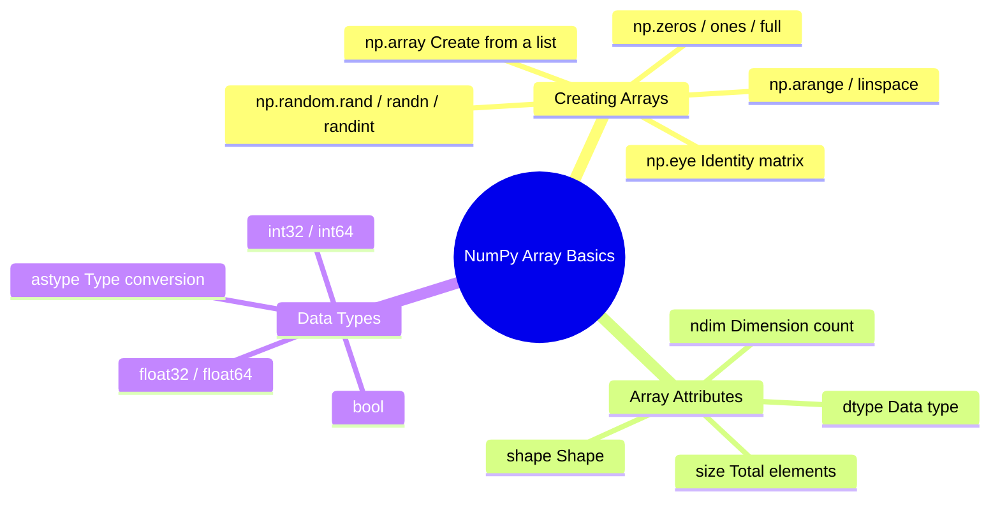

# Array Basics


## Learning Objectives

- Master multiple ways to create arrays
- Understand the core array attributes (`shape`, `dtype`, `ndim`, `size`)
- Learn NumPy's data type system
- Master array data type conversion

---

## Creating Arrays

### Creating from a Python List

The most basic way is to use `np.array()` to convert a Python list into a NumPy array:

```python
import numpy as np

# 1D array
a = np.array([1, 2, 3, 4, 5])
print(a)         # [1 2 3 4 5]
print(type(a))   # <class 'numpy.ndarray'>

# 2D array (matrix)
b = np.array([
    [1, 2, 3],
    [4, 5, 6]
])
print(b)
# [[1 2 3]
#  [4 5 6]]

# 3D array
c = np.array([
    [[1, 2], [3, 4]],
    [[5, 6], [7, 8]]
])
print(c.shape)  # (2, 2, 2)
```

:::caution Common Mistake
```python
# ❌ Wrong: nested lists have inconsistent lengths
bad = np.array([[1, 2, 3], [4, 5]])  # May raise a warning or create an object array

# ✅ Correct: each row must have the same length
good = np.array([[1, 2, 3], [4, 5, 6]])
```
:::

### Quick Creation Functions

NumPy provides many fast ways to create arrays, so you do not need to write every element by hand:

```python
import numpy as np

# ========== Arrays of all 0s / all 1s ==========
zeros_1d = np.zeros(5)
print(zeros_1d)  # [0. 0. 0. 0. 0.]

zeros_2d = np.zeros((3, 4))   # 3 rows and 4 columns
print(zeros_2d)
# [[0. 0. 0. 0.]
#  [0. 0. 0. 0.]
#  [0. 0. 0. 0.]]

ones_2d = np.ones((2, 3))     # 2 rows and 3 columns
print(ones_2d)
# [[1. 1. 1.]
#  [1. 1. 1.]]

# ========== Fill with a specified value ==========
fives = np.full((2, 3), 5)    # Fill everything with 5
print(fives)
# [[5 5 5]
#  [5 5 5]]

# ========== Identity matrix ==========
eye = np.eye(3)                # 3×3 identity matrix
print(eye)
# [[1. 0. 0.]
#  [0. 1. 0.]
#  [0. 0. 1.]]
```

### Arithmetic Sequences: `arange` and `linspace`

```python
# arange: similar to Python's range, but returns a NumPy array
a = np.arange(10)          # 0 to 9
print(a)                    # [0 1 2 3 4 5 6 7 8 9]

b = np.arange(2, 10, 2)    # Start at 2, stop before 10, step by 2
print(b)                    # [2 4 6 8]

c = np.arange(0, 1, 0.2)   # Supports decimal steps! (range does not)
print(c)                    # [0.  0.2 0.4 0.6 0.8]

# linspace: specify the number of points, and NumPy calculates the step automatically
d = np.linspace(0, 10, 5)   # From 0 to 10 (inclusive), evenly sample 5 points
print(d)                     # [ 0.   2.5  5.   7.5 10. ]

e = np.linspace(0, 1, 11)   # Sample 11 points between 0 and 1
print(e)                     # [0.  0.1 0.2 ... 0.9 1. ]
```

:::tip `arange` vs `linspace`
- `arange(start, stop, step)`: you specify the **step size**, and NumPy calculates how many elements there are
- `linspace(start, stop, num)`: you specify the **number of elements**, and NumPy calculates the step size

`linspace` is more commonly used in plotting because you usually want to control the number of sample points.
:::

### Creating Random Arrays

```python
# Uniformly distributed random numbers between 0 and 1
rand = np.random.rand(3, 4)       # 3×4
print(rand)

# Standard normal random numbers (mean 0, standard deviation 1)
randn = np.random.randn(3, 4)     # 3×4

# Random integers within a specified range
randint = np.random.randint(1, 100, size=(3, 4))  # 3×4 integers between 1 and 99
print(randint)
```

### Quick Reference Table for Creation Methods

| Function | Purpose | Example |
|------|------|------|
| `np.array()` | Create from a list | `np.array([1, 2, 3])` |
| `np.zeros()` | All-0 array | `np.zeros((3, 4))` |
| `np.ones()` | All-1 array | `np.ones((2, 3))` |
| `np.full()` | Fill with a specified value | `np.full((2, 3), 7)` |
| `np.eye()` | Identity matrix | `np.eye(4)` |
| `np.arange()` | Arithmetic sequence (specified step) | `np.arange(0, 10, 2)` |
| `np.linspace()` | Arithmetic sequence (specified number of points) | `np.linspace(0, 1, 100)` |
| `np.random.rand()` | Uniform random numbers in [0, 1) | `np.random.rand(3, 4)` |
| `np.random.randn()` | Standard normal distribution | `np.random.randn(3, 4)` |
| `np.random.randint()` | Random integers | `np.random.randint(0, 10, (3, 4))` |

---

## Array Attributes

Every NumPy array has some important attributes. Understanding them is the foundation for later operations:

```python
import numpy as np

arr = np.array([
    [1, 2, 3, 4],
    [5, 6, 7, 8],
    [9, 10, 11, 12]
])

print(f"Shape:  {arr.shape}")    # (3, 4) → 3 rows and 4 columns
print(f"ndim:   {arr.ndim}")     # 2 → 2D array
print(f"Total elements (size): {arr.size}")    # 12 → 3 × 4 = 12
print(f"Data type (dtype): {arr.dtype}")  # int64
print(f"Bytes per element: {arr.itemsize}") # 8 → int64 takes 8 bytes
print(f"Total bytes: {arr.nbytes}")         # 96 → 12 × 8 = 96
```

### What `shape` Means

`shape` is one of the most commonly used attributes. It tells you the array's "shape":

```python
# 1D array
a = np.array([1, 2, 3])
print(a.shape)      # (3,) → 3 elements

# 2D array
b = np.array([[1, 2, 3], [4, 5, 6]])
print(b.shape)      # (2, 3) → 2 rows and 3 columns

# 3D array
c = np.ones((2, 3, 4))
print(c.shape)      # (2, 3, 4) → 2 "matrices with 3 rows and 4 columns"
```

A good way to understand `shape` is: **count layer by layer from outside to inside**.

```
3D array shape = (2, 3, 4)
          ↓  ↓  ↓
          │  │  └── Innermost layer: 4 elements per row
          │  └───── Middle layer: 3 rows in each matrix
          └──────── Outermost layer: 2 matrices in total
```

---

## Data Types (`dtype`)

All elements in a NumPy array must be of the same type. This is one of the reasons NumPy can run operations so quickly.

### Common Data Types

| dtype | Meaning | Example Values | Common Use |
|-------|------|--------|---------|
| `int32` | 32-bit integer | -2147483648 ~ 2147483647 | Counting, indexing |
| `int64` | 64-bit integer (default) | Larger range | General integers |
| `float32` | 32-bit floating point | About 7 significant digits | Deep learning (saves memory) |
| `float64` | 64-bit floating point (default) | About 15 significant digits | Scientific computing (high precision) |
| `bool` | Boolean | True / False | Conditional filtering |
| `str_` | String | "hello" | Text labels (less common) |

### Specifying a Data Type

```python
# Let NumPy infer the type automatically
a = np.array([1, 2, 3])         # int64 (all integers)
b = np.array([1.0, 2.0, 3.0])   # float64 (contains decimal points)
c = np.array([1, 2.5, 3])       # float64 (mixed types are promoted automatically)

# Specify the type manually
d = np.array([1, 2, 3], dtype=np.float32)
print(d)        # [1. 2. 3.]
print(d.dtype)  # float32

e = np.zeros(5, dtype=np.int32)
print(e)        # [0 0 0 0 0]
print(e.dtype)  # int32
```

### Type Conversion: `astype`

```python
# Convert integers to floating-point numbers
int_arr = np.array([1, 2, 3, 4])
float_arr = int_arr.astype(np.float64)
print(float_arr)        # [1. 2. 3. 4.]
print(float_arr.dtype)  # float64

# Convert floating-point numbers to integers (truncates directly, not rounding!)
float_arr2 = np.array([1.7, 2.3, 3.9])
int_arr2 = float_arr2.astype(np.int32)
print(int_arr2)  # [1 2 3]  ← Note: 3.9 becomes 3, not 4!

# Boolean conversion
bool_arr = np.array([0, 1, 0, 2, -1]).astype(bool)
print(bool_arr)  # [False  True False  True  True]  ← 0 is False, non-zero is True
```

:::caution The Truncation Trap When Converting Float to Int
`astype(int)` **directly truncates the decimal part**, not round it. If you need rounding, use `np.round()` first:

```python
arr = np.array([1.5, 2.3, 3.7])
print(arr.astype(int))     # [1 2 3] ← truncation
print(np.round(arr).astype(int))  # [2 2 4] ← round first, then convert
```
:::

### `float32` vs `float64`: When Should You Use Each?

```python
# float64: default, high precision
a = np.array([1.0, 2.0, 3.0])  # Default float64, 8 bytes per element

# float32: memory-saving, commonly used in deep learning
b = np.array([1.0, 2.0, 3.0], dtype=np.float32)  # 4 bytes per element

# Memory comparison
big_f64 = np.random.rand(1000000)                        # float64
big_f32 = np.random.rand(1000000).astype(np.float32)     # float32
print(f"float64 memory usage: {big_f64.nbytes / 1024 / 1024:.1f} MB")  # 7.6 MB
print(f"float32 memory usage: {big_f32.nbytes / 1024 / 1024:.1f} MB")  # 3.8 MB
```

:::tip Practical Advice
- In the **data analysis** stage: use the default `float64`, which has high precision and needs no extra effort
- In the **deep learning** stage: model parameters and data are usually `float32` (or even `float16`), because GPU memory is precious
- For now, you only need to know that these two types exist; we will discuss them in more depth later in the deep learning section
:::

---

## Creating Arrays from Existing Arrays

Sometimes you need to create new arrays based on the shape of an existing array:

```python
original = np.array([[1, 2, 3], [4, 5, 6]])

# Create an all-0 array with the same shape as original
z = np.zeros_like(original)
print(z)
# [[0 0 0]
#  [0 0 0]]

# Create an all-1 array with the same shape as original
o = np.ones_like(original)
print(o)
# [[1 1 1]
#  [1 1 1]]

# Create an array filled with a specified value with the same shape as original
f = np.full_like(original, 99)
print(f)
# [[99 99 99]
#  [99 99 99]]

# Create an uninitialized array (fast, but values are random)
e = np.empty_like(original)
# ⚠️ The values are random; do not use an empty array before assigning values!
```

---

## Summary



---

## Hands-On Practice

### Exercise 1: Create Different Arrays

```python
import numpy as np

# 1. Create a 1D array containing 1 to 20
arr1 = np.arange(1, 21)

# 2. Create a 4×5 all-zero matrix
arr2 = np.zeros((4, 5))

# 3. Create a 3×3 matrix where all elements are 7
arr3 = np.full((3, 3), 7)

# 4. Create 100 evenly spaced points between 0 and 2π (np.pi * 2)
arr4 = np.linspace(0, np.pi * 2, 100)

# 5. Create a 5×5 random integer matrix (range 1~50)
arr5 = np.random.randint(1, 51, size=(5, 5))
```

### Exercise 2: Check Attributes

Create an all-1 array with shape `(3, 4, 5)` and answer the following questions:
1. What is its dimension count (`ndim`)?
2. How many elements does it have (`size`)?
3. What is the default `dtype`?
4. After converting it to `int32`, how many bytes does each element take?

### Exercise 3: Type Conversion

```python
# Given exam scores (floating-point numbers)
scores = np.array([85.6, 92.3, 78.8, 95.1, 60.5, 73.9])

# 1. Round the scores to integers
rounded = np.rint(scores).astype(int)

# 2. Determine whether each score is passing (>= 60) to get a boolean array
passed = scores >= 60

# 3. Calculate the number of passing scores (hint: True counts as 1, False counts as 0)
pass_count = passed.sum()
```
