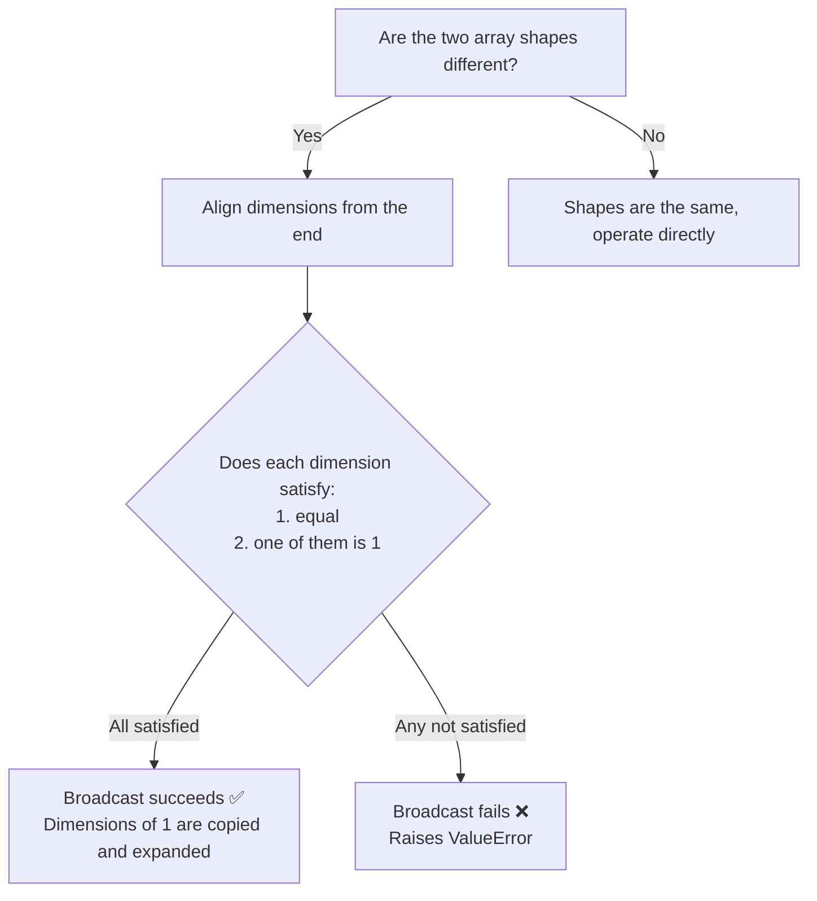

# Array Operations


## Learning Objectives

- Understand the concept and advantages of vectorized operations
- Master element-wise operations and universal functions (ufuncs)
- Understand the rules of Broadcasting
- Use aggregation functions confidently for statistical calculations

---

## Vectorized Operations: Say Goodbye to Loops

**Vectorized operations** are a core idea in NumPy — operate on the entire array without writing loops.

### Pure Python vs NumPy

```python
import numpy as np

# Pure Python: compute one by one
prices = [100, 200, 300, 400, 500]
discounted = []
for p in prices:
    discounted.append(p * 0.8)
print(discounted)  # [80.0, 160.0, 240.0, 320.0, 400.0]

# NumPy: one line does it all
prices = np.array([100, 200, 300, 400, 500])
discounted = prices * 0.8
print(discounted)  # [ 80. 160. 240. 320. 400.]
```

### Element-wise Operations

Arithmetic operations on NumPy arrays are performed **element by element**:

```python
a = np.array([1, 2, 3, 4])
b = np.array([10, 20, 30, 40])

print(a + b)     # [11 22 33 44]    add corresponding elements
print(a - b)     # [ -9 -18 -27 -36]
print(a * b)     # [ 10  40  90 160]  multiply corresponding elements (not matrix multiplication!)
print(a / b)     # [0.1 0.1 0.1 0.1]
print(a ** 2)    # [ 1  4  9 16]      square
print(b % 3)     # [1 2 0 1]          remainder
print(b // 3)    # [ 3  6 10 13]      integer division
```

### Operations with Scalars

When an array is operated on with a single number (a scalar), NumPy automatically applies the scalar to every element:

```python
arr = np.array([10, 20, 30, 40])

print(arr + 5)    # [15 25 35 45]
print(arr * 2)    # [20 40 60 80]
print(arr / 10)   # [1. 2. 3. 4.]
print(1 / arr)    # [0.1  0.05 0.033 0.025]
```

### Comparison Operations

```python
arr = np.array([15, 23, 8, 42, 31])

print(arr > 20)      # [False  True False  True  True]
print(arr == 23)     # [False  True False False False]
print(arr != 8)      # [ True  True False  True  True]
```

---

## Universal Functions (ufuncs)

NumPy provides many **universal functions** that apply mathematical operations to each element in an array:

### Common Mathematical Functions

```python
arr = np.array([1, 4, 9, 16, 25])

# Square root
print(np.sqrt(arr))     # [1. 2. 3. 4. 5.]

# Absolute value
neg = np.array([-3, -1, 0, 2, 5])
print(np.abs(neg))      # [3 1 0 2 5]

# Power
print(np.power(arr, 0.5))  # same as sqrt

# Exponential and logarithms
print(np.exp([0, 1, 2]))      # [1.    2.718 7.389]  e raised to a power
print(np.log([1, np.e, 10]))   # [0.    1.    2.303]  natural logarithm
print(np.log10([1, 10, 100]))  # [0. 1. 2.]           base 10
print(np.log2([1, 2, 8, 64]))  # [0. 1. 3. 6.]       base 2
```

### Trigonometric Functions

```python
# Create angles from 0 to 2π
angles = np.linspace(0, 2 * np.pi, 5)  # [0, π/2, π, 3π/2, 2π]

print(np.sin(angles))  # [ 0.  1.  0. -1.  0.]  ← sine
print(np.cos(angles))  # [ 1.  0. -1.  0.  1.]  ← cosine
```

### Rounding Functions

```python
arr = np.array([1.2, 2.5, 3.7, -1.3, -2.8])

print(np.floor(arr))    # [ 1.  2.  3. -2. -3.]  round down
print(np.ceil(arr))     # [ 2.  3.  4. -1. -2.]  round up
print(np.round(arr))    # [ 1.  2.  4. -1. -3.]  round to nearest
print(np.trunc(arr))    # [ 1.  2.  3. -1. -2.]  truncate decimals
```

### Operations Between Two Arrays

```python
a = np.array([3, 5, 7, 9])
b = np.array([1, 4, 2, 8])

print(np.maximum(a, b))  # [3 5 7 9]   take the larger value at each position
print(np.minimum(a, b))  # [1 4 2 8]   take the smaller value at each position
print(np.where(a > b, a, b))  # same as maximum, but more flexible
```

---

## Broadcasting

When arrays with different shapes are operated on, NumPy automatically "broadcasts" the smaller array so their shapes become compatible.

### The Simplest Example

```python
arr = np.array([1, 2, 3])

# scalar + array → scalar is broadcast to [10, 10, 10]
print(arr + 10)   # [11 12 13]
```

This is broadcasting in action — NumPy expands `10` to `[10, 10, 10]`, then adds element by element.

### 2D Array + 1D Array

```python
matrix = np.array([
    [1, 2, 3],
    [4, 5, 6],
    [7, 8, 9]
])

row = np.array([10, 20, 30])

# row is broadcast to every row
result = matrix + row
print(result)
# [[11 22 33]
#  [14 25 36]
#  [17 28 39]]
```

You can think about broadcasting like this:

```
matrix:         row (before broadcasting):      row (after broadcasting):
[[1, 2, 3],    [10, 20, 30]  →   [[10, 20, 30],
 [4, 5, 6],                        [10, 20, 30],
 [7, 8, 9]]                        [10, 20, 30]]
```

### Column Vector + Row Vector

```python
col = np.array([[1], [2], [3]])    # shape: (3, 1) column vector
row = np.array([10, 20, 30])       # shape: (3,)   row vector

# both are broadcast
result = col + row
print(result)
# [[11 21 31]
#  [12 22 32]
#  [13 23 33]]
```

### Broadcasting Rules



Simple rule to remember: **Compare dimensions from back to front — they must either be equal, or one of them must be 1.**

```python
# ✅ Can broadcast
# (3, 4) + (4,)     → (3, 4)     the last dimension is 4 in both
# (3, 4) + (1, 4)   → (3, 4)     first dimension 3 and 1 → broadcast to 3
# (3, 1) + (1, 4)   → (3, 4)     both dimensions are broadcast

# ❌ Cannot broadcast
# (3, 4) + (3,)     → error! last dimension 4 ≠ 3, and neither is 1
```

### Real-World Uses of Broadcasting

```python
# Standardize data: subtract the mean of each column from that column
data = np.array([
    [85, 170, 60],
    [92, 180, 75],
    [78, 165, 55],
    [90, 175, 70]
])  # 4 students: score, height, weight

# Compute the mean of each column
col_mean = data.mean(axis=0)        # [86.25 172.5  65.  ]  shape: (3,)

# Broadcasting: (4, 3) - (3,) → (4, 3)
centered = data - col_mean
print(centered)
# [[-1.25 -2.5  -5.  ]
#  [ 5.75  7.5  10.  ]
#  [-8.25 -7.5 -10.  ]
#  [ 3.75  2.5   5.  ]]
```

---

## Aggregation Functions

Aggregation functions "summarize" a group of data into one value or a small set of values:

### Common Aggregation Functions

```python
arr = np.array([4, 7, 2, 9, 1, 5, 8, 3, 6])

print(np.sum(arr))      # 45    total
print(np.mean(arr))     # 5.0   mean
print(np.median(arr))   # 5.0   median
print(np.std(arr))      # 2.58  standard deviation
print(np.var(arr))      # 6.67  variance
print(np.min(arr))      # 1     minimum
print(np.max(arr))      # 9     maximum
print(np.argmin(arr))   # 4     index of minimum
print(np.argmax(arr))   # 3     index of maximum
print(np.cumsum(arr))   # [ 4 11 13 22 23 28 36 39 45]  cumulative sum
print(np.cumprod(arr[:5]))  # [  4  28  56 504 504]  cumulative product
```

### Aggregation Along an Axis

For multi-dimensional arrays, the `axis` parameter controls which direction to aggregate along:

```python
matrix = np.array([
    [1, 2, 3],
    [4, 5, 6],
    [7, 8, 9]
])

# No axis specified: aggregate all elements
print(np.sum(matrix))          # 45

# axis=0: along the row direction (aggregate by column) — compress top to bottom
print(np.sum(matrix, axis=0))  # [12 15 18]

# axis=1: along the column direction (aggregate by row) — compress left to right
print(np.sum(matrix, axis=1))  # [ 6 15 24]
```

A helpful way to understand `axis` — **axis=0 removes rows, axis=1 removes columns**:

```
Original (3, 3):
[[1, 2, 3],
 [4, 5, 6],
 [7, 8, 9]]

axis=0 (remove rows → result shape=(3,)):
[1+4+7, 2+5+8, 3+6+9] = [12, 15, 18]

axis=1 (remove columns → result shape=(3,)):
[1+2+3, 4+5+6, 7+8+9] = [6, 15, 24]
```

### Practice: Grade Analysis

```python
# Scores for 5 students in 3 subjects
scores = np.array([
    [85, 92, 78],   # Student 1: Chinese, Math, English
    [90, 88, 95],   # Student 2
    [72, 65, 80],   # Student 3
    [95, 98, 92],   # Student 4
    [60, 55, 70]    # Student 5
])

subjects = ["Chinese", "Math", "English"]

# Total score for each student
total = np.sum(scores, axis=1)
print("Total score for each student:", total)   # [255 273 217 285 185]

# Average score for each student
avg_per_student = np.mean(scores, axis=1)
print("Average score for each student:", avg_per_student)

# Average score for each subject
avg_per_subject = np.mean(scores, axis=0)
for sub, avg in zip(subjects, avg_per_subject):
    print(f"  {sub} average score: {avg:.1f}")

# Who got the highest score, and in which subject
max_idx = np.unravel_index(np.argmax(scores), scores.shape)
print(f"Highest score: {scores[max_idx]} (Student {max_idx[0]+1}'s {subjects[max_idx[1]]})")

# Which student has the highest total score
best_student = np.argmax(total)
print(f"Highest total score: Student {best_student + 1}, total {total[best_student]}")
```

---

## np.where: Conditional Selection

`np.where` is NumPy's version of the ternary expression:

```python
arr = np.array([85, 42, 91, 67, 55, 78])

# Mark passing scores as "PASS" and failing scores as "FAIL"
result = np.where(arr >= 60, "PASS", "FAIL")
print(result)  # ['PASS' 'FAIL' 'PASS' 'PASS' 'FAIL' 'PASS']

# Raise failing scores to 60
adjusted = np.where(arr >= 60, arr, 60)
print(adjusted)  # [85 60 91 67 60 78]
```

---

## Summary

| Category | Content | Example |
|------|------|------|
| Vectorized operations | Operate on the whole array at once, no loops needed | `arr * 2`, `a + b` |
| Universal functions | Element-wise mathematical functions | `np.sqrt()`, `np.exp()`, `np.log()` |
| Broadcasting | Automatically expand arrays with different shapes | `(3,4) + (4,)` → `(3,4)` |
| Aggregation functions | Statistical summaries | `np.sum()`, `np.mean()`, `np.std()` |
| `axis` parameter | Controls aggregation direction | `axis=0` by column, `axis=1` by row |
| `np.where` | Conditional selection | `np.where(arr > 0, arr, 0)` |

---

## Hands-On Exercises

### Exercise 1: Vectorized Calculation

```python
# Convert Fahrenheit to Celsius
# Formula: C = (F - 32) × 5/9
import numpy as np

fahrenheit = np.array([32, 68, 100, 212, 72, 98.6])

# Complete the conversion in one line using vectorized operations
celsius = (fahrenheit - 32) * 5 / 9
```

### Exercise 2: Broadcasting Practice

```python
# Original prices of 3 products
import numpy as np

prices = np.array([100, 200, 300])

# 3 discount rates (column vector)
discounts = np.array([[0.9], [0.8], [0.7]])

# Use broadcasting to calculate the price of each product under each discount (3×3 matrix)
final_prices = discounts * prices
# Expected result:
# [[ 90. 180. 270.]
#  [ 80. 160. 240.]
#  [ 70. 140. 210.]]
```

### Exercise 3: Grade Statistics

```python
# Generate random scores for 50 students (between 40 and 100)
np.random.seed(42)
scores = np.random.randint(40, 101, size=50)

# 1. Compute the mean, median, and standard deviation
# 2. Find the highest score, lowest score, and their positions
# 3. Count how many students fall into each range: failing (<60), passing (60-69), average (70-79), good (80-89), excellent (90+)
# 4. Calculate the passing rate
```
