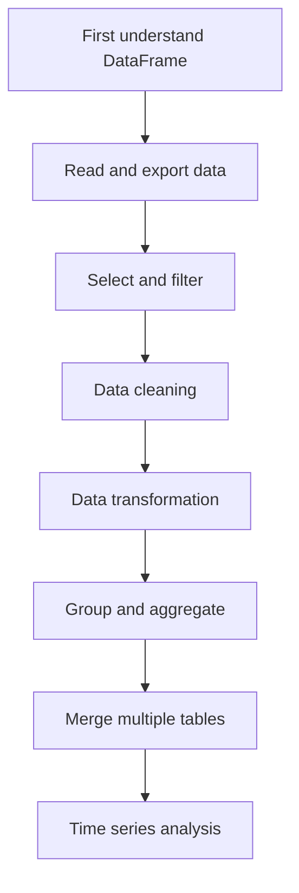
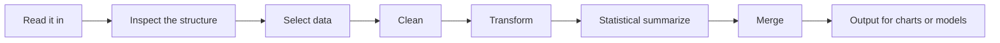

# 3.3.1 Pandas Introduction: What Is This Chapter Really About?

This chapter answers a practical question: once you get a real-world data table, how do you use code to read it in, understand it clearly, organize it, filter it, summarize it, and hand it off to visualization, machine learning, or business analysis?

Many beginners feel that they can understand each `Pandas` function on its own, but still do not know what to do first when facing a real analysis task. That is completely normal, because the hardest part of `Pandas` is never just the API. The real challenge is whether you can connect “read data → clean → filter → aggregate → merge → output results” into a smooth data workflow.

## Where This Chapter Fits in the Course

The second stage is data analysis and visualization, and `Pandas` is the backbone of this stage. The earlier NumPy is more like a low-level computing capability, while Pandas is more like a real-world data workstation: it handles tables with column names, missing values, categorical fields, time fields, and messy data.

If you get comfortable with Pandas, the later parts of visualization, EDA, machine learning feature preparation, and project analysis will all go much more smoothly. In real projects, there is usually a lot of table preparation work before models and charts.

## The Real Problems This Chapter Solves

This chapter answers five questions: what exactly `DataFrame` is; how data is read from CSV, Excel, JSON, and other files; how to select, filter, and clean data; how to use `groupby` for category-based, time-based, or department-based statistics; and how to merge multiple tables into one analyzable dataset.

The easiest mistake for beginners is to start by memorizing functions. A more reliable approach is to think in terms of data flow: what tables do I have now, what result do I want, and do I need cleaning, filtering, transformation, aggregation, or merging in between?

## Recommended Learning Order for Beginners

It is recommended to start with the core data structures and get `Series / DataFrame / Index` straight. Then learn data reading/writing and selection/filtering so you can “read it in” and “pick out what you need.” Next, learn data cleaning to handle missing values, duplicates, type issues, and string problems so the data is safe to analyze. After that, learn `groupby` to grasp the main statistical workflow. Finally, learn data transformation, merging, and time series to handle more complex business tables.

## The Main Thread to Focus on in This Chapter

The main idea of this chapter can be summarized like this: the most important thing about Pandas is not having lots of APIs, but making the data flow smooth.

If you can clearly explain at each step “what the input is, what the output is, and why you handle it this way,” then Pandas will not feel like a pile of disconnected functions.

## What the 8 Lessons in This Chapter Solve

| Section | The main problem it should help you solve |
|---|---|
| [3.3.2 Pandas Core Data Structures](./01-core-structures.md) | First understand what `Series / DataFrame / Index` actually are |
| [3.3.3 Data Reading and Writing](./02-read-write.md) | Read CSV / Excel / JSON files in and export them out |
| [3.3.4 Data Selection and Filtering](./03-selection-filter.md) | Start truly “picking out the part of the data I want” |
| [3.3.5 Data Cleaning](./04-data-cleaning.md) | Handle missing values, duplicates, outliers, and formatting issues |
| [3.3.6 Data Transformation](./05-data-transform.md) | Transform, map, and derive values across columns |
| [3.3.7 Grouping and Aggregation](./06-groupby.md) | Do statistical analysis by department / month / category |
| [3.3.8 Data Merging](./07-merge.md) | Stitch multiple tables together |
| [3.3.9 Time Series](./08-time-series.md) | Make tables work along the time dimension |

## How This Chapter Connects to Later Stages

Pandas is the input layer for many later capabilities. Visualization needs it to organize data, machine learning needs it to prepare features, and RAG and Agent projects often need it to read tables, analyze logs, or process evaluation data.

If you do not learn this chapter solidly, common problems later are: charts not rendering because visualization is hard, but because the data was not organized well; poor machine learning scores not because the model is bad, but because field types, missing values, or data leakage were not handled; or an Agent data analysis tool runs, but the table logic is wrong.

## How Beginners and Advanced Learners Should Read This

When beginners study this chapter for the first time, they should focus on the main thread and the smallest runnable example. You do not need to understand every detail at once. As long as you can explain what problem this chapter solves, what the inputs and outputs are, and how the smallest project runs, you can keep moving forward.

Learners with experience can use this chapter for gap-filling and engineering practice: pay attention to edge cases, failure cases, evaluation methods, code reproducibility, and how it connects to the sections before and after it. After reading, it is best to turn what you learned into your own project README or lab notes.

## Suggested Time and Difficulty

| Learning mode | Suggested time | Goal |
|---|---|---|
| Quick overview | 20–30 minutes | Understand what problem this chapter solves and where it will be used later |
| Minimum completion | 1–2 hours | Run a minimal example and finish the chapter’s small project deliverable |
| Deep practice | Half a day to 1 day | Add error analysis, comparison experiments, or project README notes |

## Self-Check Questions for This Chapter

| Self-check question | Passing standard |
|---|---|
| What problem does this chapter solve? | You can explain its place in the whole course in one sentence |
| What are the minimum input and output? | You can explain what input the example needs and what result it produces |
| Where are the common failure points? | You can list at least one reason for an error, poor result, or misunderstanding |
| What can you retain after learning it? | You can write this chapter’s output into a project README, lab notes, or portfolio |

## Small Project Deliverable for This Chapter

After finishing this chapter, it is recommended to do a “small sales data cleaning and analysis” project. Start with a table containing order, user, product, and time fields. Complete data reading, field checking, missing-value handling, type conversion, monthly and category-level aggregation, key metric output, and save a clean dataset that can be used for visualization.

The key point of the project is not using many functions, but being able to organize each step into a clear data flow.

## Passing Criteria

By the end of this chapter, you should be able to inspect the structure of a table first, complete reading/writing, filtering, cleaning, transformation, grouping and aggregation, and simple multi-table merging, and explain the role of `groupby`, `merge`, and `loc/iloc` in the data flow.

If you can turn a raw table into a clean analysis table and explain why each step was done, then you have reached the beginner level standard for Pandas in the data analysis stage.

## What to Read Next for the Smoothest Progress

It is recommended to read Pandas core data structures, data reading/writing, data selection and filtering, data cleaning, and grouping and aggregation first. Once those feel comfortable, continue with data transformation, data merging, and time series.
