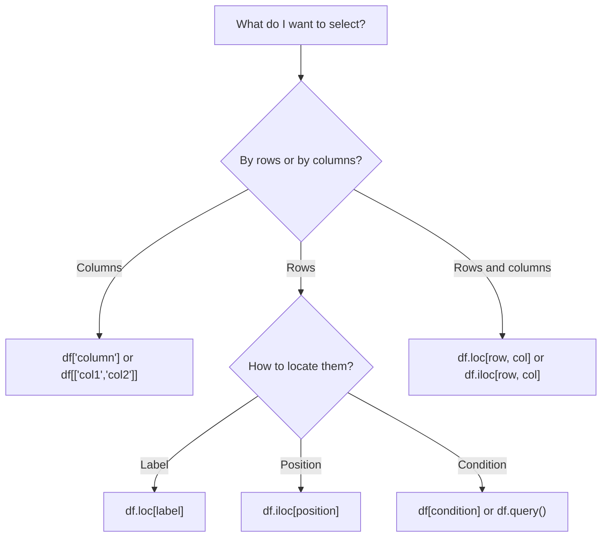

# 3.3.4 Data Selection and Filtering

:::tip Where this section fits
When many beginners first learn `Pandas`, what usually blocks them is not cleaning, but:

- How do I select the part of the data I actually want?

So the most important thing in this section is not memorizing every syntax pattern, but building this first question:

> **Am I selecting by label, by position, or by condition?**
:::

## Learning Objectives

- Master `loc` (label indexing) and `iloc` (position indexing)
- Learn to use boolean indexing for conditional filtering
- Master the `query()` method
- Learn multi-condition filtering

---

## First, build a mental map

Data selection and filtering are easier to understand as “who do I want to select?”


So what this section really aims to solve is:

- In different scenarios, should you think of `loc`, `iloc`, or boolean indexing first?
- Why is the first step in so many `Pandas` problems to “select the data you need first”?

## Prepare sample data

```python
import pandas as pd
import numpy as np

df = pd.DataFrame({
    "Name": ["Alice", "Bob", "Charlie", "Diana", "Ethan", "Fiona"],
    "Age": [22, 28, 25, 35, 21, 30],
    "Department": ["Engineering", "Marketing", "Engineering", "Management", "Engineering", "Marketing"],
    "Salary": [15000, 18000, 22000, 35000, 12000, 20000],
    "HireYear": [2023, 2020, 2021, 2018, 2024, 2019]
})
print(df)
```

### A better analogy for beginners

You can think of this section as:

- Finding the rows and columns you really want in a large table

In other words, the core of this section is not “many syntax patterns,” but:

- First figure out whether you are searching by name
- Or by position
- Or filtering by condition

---

## loc: label indexing

`loc` uses **labels (names)** to locate data, with the format: `df.loc[row_label, column_label]`

### What should you remember first when learning `loc`?

The most important thing to remember first is:

> **`loc` selects by “name and label.”**

That means it is more like:

- I know which column I want, and which label range I want

```python
# Select a single row
print(df.loc[0])         # The first row (the row with label 0)

# Select multiple rows
print(df.loc[0:2])       # Labels 0 to 2 (includes 2!)

# Select specific rows and columns
print(df.loc[0, "Name"])          # "Alice"
print(df.loc[0:2, "Name"])        # Names in the first 3 rows
print(df.loc[0:2, ["Name", "Salary"]])  # Names and salaries in the first 3 rows

# Select certain columns from all rows
print(df.loc[:, ["Name", "Age"]])

# Conditional filtering (the most common use!)
print(df.loc[df["Age"] > 25])    # All rows where age is greater than 25
```

---

## iloc: position indexing

`iloc` uses **position (integer)** to locate data, following the same slicing rules as Python lists:

### What should you remember first when learning `iloc`?

The most important thing to remember first is:

> **`iloc` selects by “which row, which column.”**

So it is more like:

- You use coordinates to pick values from the table

```python
# Select a single row
print(df.iloc[0])        # First row

# Select multiple rows (does not include the end, just like Python)
print(df.iloc[0:3])      # Rows 0, 1, 2

# Select specific positions
print(df.iloc[0, 0])     # Row 0, column 0 → "Alice"
print(df.iloc[0:3, 0:2]) # First 3 rows, first 2 columns
print(df.iloc[[0, 2, 4]])  # Rows 0, 2, 4

# Select the last row
print(df.iloc[-1])
```

### loc vs iloc comparison

| Feature | `loc` | `iloc` |
|------|-------|--------|
| Indexing method | Label (name) | Position (integer) |
| Slice end | **Included** | **Not included** |
| Example | `df.loc[0:2]` → 3 rows | `df.iloc[0:2]` → 2 rows |
| Conditional filtering | ✅ Supported | ❌ Not supported |

:::caution Most common pitfall
When the index is the default 0, 1, 2..., `loc[0:2]` returns **3 rows**, while `iloc[0:2]` returns **2 rows**.

```python
print(len(df.loc[0:2]))    # 3  (includes label 2)
print(len(df.iloc[0:2]))   # 2  (does not include position 2)
```
:::

### A selection table that beginners can remember first

| What you are thinking | Safer first choice |
|---|---|
| I know the column name or label | `loc` |
| I only know which row and column position | `iloc` |
| I want to filter people or orders by a condition | Boolean indexing |
| The condition is long and I want it to read more like a sentence | `query()` |

This table is especially good for beginners because it turns “which one should I use?” into a question you can actually answer.

---

## Boolean indexing: conditional filtering

This is the **most frequently used** operation in data analysis:

### Why is boolean indexing so important?

Because in real analysis tasks, what you most often do is:

- Find orders with amount greater than a certain value
- Find people in a specific department
- Find a subset that meets two or three conditions

In other words, in many analysis tasks, the first real step is:

- First filter out the data you want to analyze

### Single-condition filtering

```python
# Employees with salary greater than 20000
high_salary = df[df["Salary"] > 20000]
print(high_salary)

# Employees in the "Engineering" department
tech = df[df["Department"] == "Engineering"]
print(tech)

# Employees whose age is not 22
print(df[df["Age"] != 22])
```

### Combining multiple conditions

```python
# Engineering department and salary greater than 15000 (use & for AND)
result = df[(df["Department"] == "Engineering") & (df["Salary"] > 15000)]
print(result)

# Engineering department or management department (use | for OR)
result = df[(df["Department"] == "Engineering") | (df["Department"] == "Management")]
print(result)

# Negation (use ~ for NOT)
result = df[~(df["Department"] == "Engineering")]  # Non-engineering departments
print(result)
```

:::caution Multiple conditions must use parentheses
Just like with NumPy, every condition must be wrapped in parentheses. Use `&`, `|`, and `~` instead of `and`, `or`, and `not`.

```python
# ❌ Wrong
df[df["Age"] > 25 and df["Salary"] > 20000]

# ✅ Correct
df[(df["Age"] > 25) & (df["Salary"] > 20000)]
```
:::

### isin: match multiple values

```python
# Employees whose department is in ["Engineering", "Marketing"]
result = df[df["Department"].isin(["Engineering", "Marketing"])]
print(result)

# Reverse: not in these departments
result = df[~df["Department"].isin(["Engineering", "Marketing"])]
print(result)
```

### between: range filtering

```python
# Ages between 22 and 30 (inclusive)
result = df[df["Age"].between(22, 30)]
print(result)
```

### String conditions

```python
# Names containing "li"
result = df[df["Name"].str.contains("li")]

# Names starting with "A"
result = df[df["Name"].str.startswith("A")]
```

### The safest default order when you first do filtering problems

A safer order is usually:

1. Ask yourself whether you are selecting by label, by position, or by condition
2. Use boolean indexing first when the condition is simple
3. Consider `query()` when the condition is long
4. Finally, combine row selection and column selection

This is usually less confusing than mixing several styles at once from the start.

---

## The query() method

`query()` lets you filter data in a way that feels closer to natural language:

```python
# Equivalent to df[df["Salary"] > 20000]
result = df.query("Salary > 20000")
print(result)

# Multiple conditions
result = df.query("Department == 'Engineering' and Salary > 15000")
print(result)

# Using variables
min_salary = 20000
result = df.query("Salary > @min_salary")  # @ references an external variable
print(result)

# Range query
result = df.query("22 <= Age <= 30")
print(result)
```

:::tip When should you use query()?
- For simple conditions: boolean indexing like `df[df["col"] > 5]` is more direct
- For complex conditions: `query()` is more readable, especially with multiple conditions
- When you need to reference variables: `query("col > @var")` is very convenient
:::

---

## Evidence to Keep

Keep this page's proof of learning as a small evidence card:

```text
dataframe_state: columns, dtypes, row count, missing values, and sample rows
operation: read/write, select/filter, clean, transform, groupby, merge, or time-series step
output: resulting table, saved file, aggregation, join result, or time index view
failure_check: dtype mismatch, missing data, duplicated keys, chained assignment, or wrong time frequency
Expected_output: before/after table sample with the transformation reason
```

## Summary of methods for selecting specific data



## A data selection checklist beginners can copy directly

When you first do a `Pandas` filtering problem, the safest checklist is usually:

1. Am I selecting columns, rows, or both rows and columns?
2. Am I selecting by label, by position, or by condition?
3. Did I add parentheses to the conditions?
4. Is the result really the rows and columns I expected?

If you answer these 4 questions clearly, many filtering problems become much easier.

---

## Practice: data filtering

```python
import pandas as pd
import numpy as np

# Create a set of e-commerce order data
rng = np.random.default_rng(seed=42)
n = 100
orders = pd.DataFrame({
    "OrderID": range(1001, 1001 + n),
    "Customer": rng.choice(["Alice", "Bob", "Charlie", "Diana", "Eve"], n),
    "Category": rng.choice(["Electronics", "Clothing", "Food", "Books"], n),
    "Amount": rng.integers(10, 500, n),
    "Quantity": rng.integers(1, 10, n),
    "Returned": rng.choice([True, False], n, p=[0.1, 0.9])
})

# View the data
print(orders.head(10))
print(orders.info())

# Filtering practice
# 1. Orders with amount greater than 300
print(orders[orders["Amount"] > 300])

# 2. Electronic products purchased by Alice
print(orders.query("Customer == 'Alice' and Category == 'Electronics'"))

# 3. Orders that have not been returned and are in the top 10 by amount
not_returned = orders[~orders["Returned"]]
top10 = not_returned.nlargest(10, "Amount")
print(top10[["OrderID", "Customer", "Amount"]])
```

---

## Hands-on exercises

### Exercise 1: Basic filtering

```python
# Use the orders data above
# 1. Find all returned orders
# 2. Find the number of orders with amounts between 100 and 200
# 3. Find orders in the "Books" or "Food" category
# 4. Find the average amount of Bob's non-returned orders
```

### Exercise 2: Comprehensive filtering

```python
# 1. What is the maximum order amount for each customer? (Hint: filter first, then aggregate)
# 2. Which customers have return records?
# 3. Which orders are in the top 5% by amount? (Hint: use quantile)
```


<details>
<summary>Reference answers and explanation</summary>

- Use boolean masks for each condition, then combine them with `&`, `|`, and parentheses. For example, amount range, category membership, and non-returned orders should be separate named masks before combining.
- For grouped customer questions, filter first when the question says non-returned orders, then group by `Customer` and aggregate mean, max, or count.
- For top-percent questions, compute a threshold with `quantile`, filter rows above it, and report both the threshold and the resulting records. This makes the cutoff auditable.

</details>


## What you should take away from this section

- `loc` selects by label, `iloc` selects by position, and boolean indexing selects by condition
- In many real analysis tasks, the first step is not calculation, but filtering
- Before writing code, clearly think about “who do I want to select?” — that is more reliable than memorizing syntax
