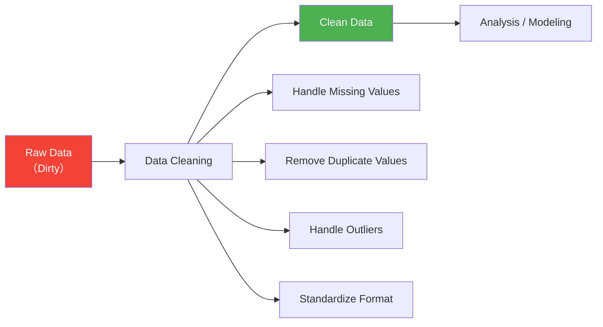

# 3.3.5 Data Cleaning

:::tip Section Positioning
When many beginners first learn data cleaning, the easiest misunderstanding is:

- Which function can get rid of dirty data

But a more solid understanding should be:

> **First identify the type of problem, then decide whether to delete, fill, modify, or keep it.**

So the most important thing in this section is not memorizing functions, but building a cleaning sequence and a habit of judgment.
:::

## Learning Objectives

- Master strategies for detecting, deleting, and filling missing values
- Learn how to handle duplicate values
- Understand methods for outlier detection
- Master data type conversion and string processing

---

## First, Build a Map

Data cleaning is better understood as “check first, then decide how to handle it”:


So what this section really wants to solve is:

- What are the most common problems in real data?
- When you first get dirty data, what is the safest order for checking it?

## Why Do We Need Data Cleaning?

Real-world data is **very dirty** — missing values, duplicate rows, inconsistent formats, outliers... If you analyze it directly without cleaning, the results will definitely be unreliable.

> "Data scientists spend 80% of their time cleaning data and 20% of their time complaining about cleaning data." — an industry saying



### A Better Analogy for Beginners

You can think of data cleaning as:

- Washing, sorting, and preparing ingredients before cooking

You are not doing these steps just to make things “look neater”;
you are doing them so that:

- when the real analysis starts later, you won’t be misled by broken, duplicated, or inconsistently formatted data

---

## Handling Missing Values

### Create Data with Missing Values

```python
import pandas as pd
import numpy as np

df = pd.DataFrame({
    "Name": ["Alice", "Bob", "Carol", "David", "Eve"],
    "Age": [22, np.nan, 25, 28, np.nan],
    "City": ["Beijing", "Shanghai", None, "Shenzhen", "Hangzhou"],
    "Salary": [15000, 22000, np.nan, 35000, 12000]
})
print(df)
```

### Detect Missing Values

```python
# Check whether each position is missing
print(df.isna())        # True = missing (isnull() works the same)
print(df.notna())       # True = not missing

# Number of missing values in each column
print(df.isna().sum())
# Name      0
# Age       2
# City      1
# Salary    1

# Missing value ratio
print(df.isna().mean())
# Age       0.4
# City      0.2
# Salary    0.2

# Rows with missing values
print(df[df.isna().any(axis=1)])
```

### Delete Missing Values

```python
# Delete any row that contains missing values
df_cleaned = df.dropna()
print(df_cleaned)  # Only 2 rows remain (Alice, David)

# Delete rows where all values are missing
df.dropna(how="all")

# Look at specific columns only
df.dropna(subset=["Age"])         # Delete rows where Age is missing
df.dropna(subset=["Age", "Salary"]) # Delete rows where Age or Salary is missing

# Keep rows with at least N non-missing values
df.dropna(thresh=3)  # Keep only rows with at least 3 filled columns
```

### Fill Missing Values

```python
# Fill with a fixed value
df["City"].fillna("Unknown")

# Fill with mean (commonly used for numeric columns)
df["Age"].fillna(df["Age"].mean())

# Fill with median
df["Salary"].fillna(df["Salary"].median())

# Fill with the previous value (commonly used for time series)
df["Age"].ffill()    # forward fill

# Fill with the next value
df["Age"].bfill()    # backward fill

# Use different strategies for different columns
df_filled = df.fillna({
    "Age": df["Age"].median(),
    "City": "Unknown",
    "Salary": 0
})
print(df_filled)
```

### Missing Value Handling Strategies

| Strategy | Use Case | Method |
|------|---------|------|
| Delete rows | Missing ratio is small (below 5%), data volume is large | `dropna()` |
| Fill with mean/median | Numeric data, symmetric distribution | `fillna(mean/median)` |
| Fill with mode | Categorical variables | `fillna(mode()[0])` |
| Forward/backward fill | Time series data | `ffill() / bfill()` |
| Fill with fixed value | Business rule is clear | `fillna(0)` or `fillna("Unknown")` |
| Interpolation | Continuous data | `interpolate()` |

### The Safest Default Order When Handling Missing Values for the First Time

A more reliable order is usually:

1. First check the missing-value ratio
2. Then decide whether the column is important
3. If only a little is missing, consider deleting rows
4. If a lot is missing, consider filling it

This is less likely to damage your data than calling `dropna()` immediately.

---

## Handling Duplicate Values

```python
df = pd.DataFrame({
    "Name": ["Alice", "Bob", "Alice", "Carol", "Bob"],
    "Department": ["Tech", "Marketing", "Tech", "Tech", "Marketing"],
    "Salary": [15000, 18000, 15000, 22000, 18000]
})

# Detect duplicate rows
print(df.duplicated())
# 0    False
# 1    False
# 2     True   ← Exactly the same as row 0
# 3    False
# 4     True   ← Exactly the same as row 1

# Number of duplicate rows
print(f"Number of duplicate rows: {df.duplicated().sum()}")  # 2

# Remove duplicate rows
df_unique = df.drop_duplicates()
print(df_unique)  # 3 rows

# Detect duplicates based on specific columns
df.drop_duplicates(subset=["Name"])        # Keep the first record for each name
df.drop_duplicates(subset=["Name"], keep="last")  # Keep the last record
```

### What Are Duplicate Values Most Easily Misunderstood As?

Many beginners think “duplicate values = always delete them.”
But a more careful way to think about it is:

- First confirm whether they are truly duplicates
- Or whether they are reasonable repeated records in the business context

For example:

- The same user placing multiple orders is not dirty data
- The same order being imported twice is the kind of duplicate that really needs cleaning

---

## Handling Outliers

### Z-score Method

```python
rng = np.random.default_rng(seed=42)
df = pd.DataFrame({
    "Salary": np.concatenate([
        rng.normal(20000, 5000, 97),  # normal data
        np.array([100000, 150000, 200000])    # outliers
    ])
})

# Calculate Z-score
z_scores = (df["Salary"] - df["Salary"].mean()) / df["Salary"].std()

# |Z| > 3 is treated as an outlier
outliers = df[z_scores.abs() > 3]
print(f"Detected {len(outliers)} outliers")
print(outliers)

# Remove outliers
df_clean = df[z_scores.abs() <= 3]
```

### IQR Method (More Robust)

```python
Q1 = df["Salary"].quantile(0.25)
Q3 = df["Salary"].quantile(0.75)
IQR = Q3 - Q1

lower = Q1 - 1.5 * IQR
upper = Q3 + 1.5 * IQR

print(f"Normal range: [{lower:.0f}, {upper:.0f}]")

# Remove data outside the range
df_clean = df[(df["Salary"] >= lower) & (df["Salary"] <= upper)]

# Or clip outliers to the boundary
df["Salary_clipped"] = df["Salary"].clip(lower, upper)
```

### A Simple Judgment Table for Beginners

| Phenomenon | Safer First Reaction |
|---|---|
| Many missing values | First check whether the column can still be kept |
| Extremely unreasonable numeric values | First check whether it is a data entry error |
| The same row appears multiple times | First confirm whether it was imported twice |
| A column should be numeric but is a string | First perform type conversion |

This table is especially useful for beginners because it breaks “dirty data” back down into several kinds of problems that can be handled separately.

---

## Data Type Conversion

```python
df = pd.DataFrame({
    "ID": ["001", "002", "003"],
    "Price": ["12.5", "23.8", "15.0"],
    "Quantity": ["3", "5", "2"],
    "Date": ["2024-01-15", "2024-02-20", "2024-03-10"]
})
print(df.dtypes)  # All object (strings)

# Convert data types
df["Price"] = df["Price"].astype(float)
df["Quantity"] = df["Quantity"].astype(int)
df["Date"] = pd.to_datetime(df["Date"])
print(df.dtypes)
# ID         object
# Price    float64
# Quantity    int64
# Date    datetime64[ns]

# Handle conversion errors
dirty = pd.Series(["10", "20", "abc", "40"])
# dirty.astype(int)  # ❌ Error

# Use to_numeric to handle it gracefully
clean = pd.to_numeric(dirty, errors="coerce")  # Values that cannot be converted become NaN
print(clean)
# 0    10.0
# 1    20.0
# 2     NaN
# 3    40.0
```

---

## String Processing (`str` Accessor)

Pandas `.str` accessor lets you perform batch operations on an entire string column:

```python
df = pd.DataFrame({
    "Name": ["  Alice ", "Bob", "  Carol  "],
    "Email": ["Alice@Email.COM", "bob@email.com", "CAROL@EMAIL.COM"],
    "Phone": ["138-0000-1111", "139-2222-3333", "137-4444-5555"]
})

# Remove spaces
df["Name"] = df["Name"].str.strip()

# Convert to lowercase
df["Email"] = df["Email"].str.lower()

# Replace
df["Phone_clean"] = df["Phone"].str.replace("-", "")

# Contains check
print(df["Email"].str.contains("email"))  # All True

# Extract
df["Phone_prefix"] = df["Phone"].str[:3]

# Split
df["Email_username"] = df["Email"].str.split("@").str[0]

print(df)
```

### Common `str` Methods

| Method | Purpose | Example |
|------|------|------|
| `.str.strip()` | Remove leading and trailing spaces | `" hello " → "hello"` |
| `.str.lower()` | Convert to lowercase | `"ABC" → "abc"` |
| `.str.upper()` | Convert to uppercase | `"abc" → "ABC"` |
| `.str.replace()` | Replace text | `"a-b".replace("-","")` |
| `.str.contains()` | Check whether it contains a pattern | Returns a boolean Series |
| `.str.startswith()` | Check whether it starts with something | Returns a boolean Series |
| `.str.len()` | String length | `"hello" → 5` |
| `.str.split()` | Split | `"a,b".split(",")` |
| `.str.extract()` | Regex extraction | Extract the matched part |

---

## Practice: Clean a Dirty Dataset

```python
import pandas as pd
import numpy as np

# Create a "dirty" dataset
dirty_data = pd.DataFrame({
    "Name": ["  Zhang San", "Li Si ", "Wang Wu", "Zhang San", " Zhao Liu", "Qian Qi", "Li Si"],
    "Age": [22, 28, np.nan, 22, "unknown", 150, 28],       # Missing, non-numeric, outlier
    "City": ["Beijing", "Shanghai ", None, "Beijing", " Guangzhou", "Shenzhen", "Shanghai"],
    "Salary": [15000, 22000, 18000, 15000, 20000, -5000, 22000]  # Negative value
})

print("=== Original Data ===")
print(dirty_data)
print(f"\nNumber of rows: {len(dirty_data)}")

# Step 1: Remove spaces from strings
dirty_data["Name"] = dirty_data["Name"].str.strip()
dirty_data["City"] = dirty_data["City"].str.strip()

# Step 2: Convert data types
dirty_data["Age"] = pd.to_numeric(dirty_data["Age"], errors="coerce")

# Step 3: Handle outliers
dirty_data.loc[dirty_data["Age"] > 120, "Age"] = np.nan    # Age > 120 is unreasonable
dirty_data.loc[dirty_data["Salary"] < 0, "Salary"] = np.nan      # Salary < 0 is unreasonable

# Step 4: Fill missing values
dirty_data["Age"] = dirty_data["Age"].fillna(dirty_data["Age"].median())
dirty_data["City"] = dirty_data["City"].fillna("Unknown")
dirty_data["Salary"] = dirty_data["Salary"].fillna(dirty_data["Salary"].median())

# Step 5: Remove duplicate rows
dirty_data = dirty_data.drop_duplicates()

print("\n=== After Cleaning ===")
print(dirty_data)
print(f"\nNumber of rows: {len(dirty_data)}")
```

### What Is the Most Important Thing to Learn from This Mini Practice?

The most important thing is not the name of any single function,
but the fact that cleaning usually follows a fairly reliable order:

1. Standardize the format first
2. Then convert types
3. Then handle outliers
4. Finally fill missing values and remove duplicates

Once the order is clear, many dirty-data problems become much easier to untangle.

## A Data Cleaning Checklist Beginners Can Copy Directly

When you clean data for the first time, the safest checklist is usually:

1. Are the data types in each column correct?
2. Is the missing-value ratio high?
3. Are there obvious outliers?
4. Are there duplicate records?
5. Can the cleaning rules be explained to others?

The last point is especially important, because cleaning is also a kind of decision-making.
If you can’t clearly explain why you deleted something or filled something in a certain way, it will be hard to make your analysis convincing.

---

## Evidence to Keep

Keep this page's proof of learning as a small evidence card:

```text
dataframe_state: columns, dtypes, row count, missing values, and sample rows
operation: read/write, select/filter, clean, transform, groupby, merge, or time-series step
output: resulting table, saved file, aggregation, join result, or time index view
failure_check: dtype mismatch, missing data, duplicated keys, chained assignment, or wrong time frequency
Expected_output: before/after table sample with the transformation reason
```

## Summary

| Type | Detection | Handling Method |
|------|------|---------|
| Missing values | `isna()`, `info()` | `dropna()`, `fillna()` |
| Duplicate values | `duplicated()` | `drop_duplicates()` |
| Outliers | Z-score, IQR | `clip()`, delete, replace with NaN |
| Type errors | `dtypes` | `astype()`, `pd.to_numeric()` |
| Dirty string data | Visual inspection, `str.contains()` | `str.strip()`, `str.replace()` |

---

## Hands-on Exercises

### Exercise 1: Missing Value Handling

```python
# Create a DataFrame with missing values (at least 20 rows and 5 columns)
# 1. Calculate the missing-value ratio for each column
# 2. Fill numeric columns with the median
# 3. Fill categorical columns with the mode
# 4. Delete columns with more than 50% missing values (if any)
```

### Exercise 2: Complete Cleaning Workflow

```python
# Create a dataset with various problems, then complete the full cleaning workflow:
# string spaces → type conversion → outlier handling → missing value filling → deduplication
```


<details>
<summary>Reference answers and explanation</summary>

- Start with a missing-value report using `isna().sum()` and `isna().mean()`. Decide column by column whether to drop, fill with median or mode, or keep missingness as a meaningful signal.
- Numeric columns usually use median when outliers are possible; categorical columns usually use mode or an explicit `Unknown` value. Columns with very high missingness need a written reason before being used.
- Keep a cleaning log: original row count, rows removed, values filled, duplicate rule, and any outlier rule. Without that log, the cleaned data is hard to trust.

</details>
