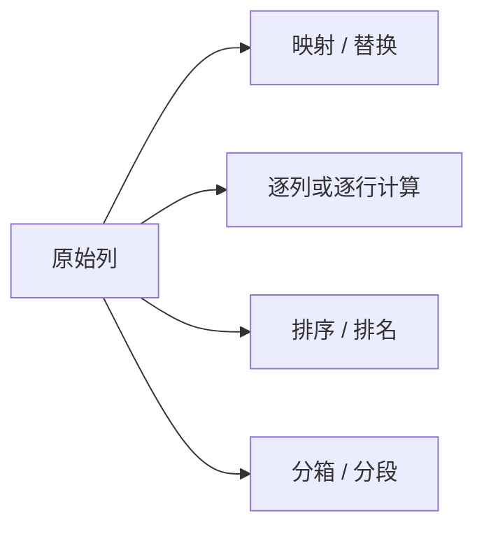

# 数据转换

:::tip 本节定位
很多新人学到这里时会开始有点乱：

- `apply`
- `map`
- `replace`
- `rank`
- `cut`

这些名字都认识，但一到题目里就容易分不清谁该先上。

所以这节最重要的不是再背函数，而是先建立一个判断：

> **我是想“改值”、"造新列"、"做排序排名"，还是“把连续值切成档位”。**
:::

## 学习目标

- 掌握 `apply`、`map`、`applymap` 的用法与区别
- 学会排序（sort_values）和排名（rank）
- 掌握数据替换与映射

---

## 先建立一张地图

数据转换更适合按“我要把这列变成什么”来理解：



所以这节真正想解决的是：

- 不同转换动作分别在补什么
- 什么时候该先想到 `map`，什么时候该先想到 `apply`

## apply：对行或列应用函数

`apply` 是 Pandas 最灵活的转换工具——可以把任意函数应用到每一行或每一列。

### 一个更适合新人的总类比

你可以把数据转换理解成：

- 给原始数据做“翻译、加工和重新标记”

有时候你只是想：

- 把代码翻成中文

有时候你想：

- 根据一行里几列数据算一个新结果

有时候你想：

- 把连续数字分成高、中、低三档

这些动作看起来都叫“转换”，  
但其实是不同类型的问题。

### 对列（Series）应用

```python
import pandas as pd
import numpy as np

df = pd.DataFrame({
    "姓名": ["张三", "李四", "王五", "赵六"],
    "数学": [85, 92, 78, 95],
    "英语": [90, 88, 72, 85]
})

# 对单列应用内置函数
print(df["数学"].apply(np.sqrt))  # 每个成绩开方

# 对单列应用自定义函数
def grade(score):
    if score >= 90: return "优秀"
    elif score >= 80: return "良好"
    elif score >= 70: return "中等"
    else: return "及格"

df["数学等级"] = df["数学"].apply(grade)
print(df)

# 用 lambda 更简洁
df["英语等级"] = df["英语"].apply(lambda x: "及格" if x >= 60 else "不及格")
```

### 对 DataFrame 按行应用

```python
# axis=1 表示对每一行操作
df["总分"] = df[["数学", "英语"]].apply(np.sum, axis=1)

# 自定义行操作
def student_info(row):
    return f"{row['姓名']}的数学{row['数学']}分"

df["描述"] = df.apply(student_info, axis=1)
print(df[["姓名", "描述"]])
```

### 第一次学 `apply`，最该先记什么？

最值得先记的是：

> **`apply` 最适合做“现成方法不够时的自定义计算”。**

也就是说，它不是第一反应就该上的工具，  
而更像：

- 规则稍微复杂，没法直接靠一两个内置方法搞定时，再拿出来用

---

## map：映射替换

`map` 用于 Series，把旧值映射到新值：

```python
df = pd.DataFrame({
    "姓名": ["张三", "李四", "王五"],
    "性别": ["M", "F", "M"],
    "部门代码": [1, 2, 1]
})

# 用字典映射
df["性别中文"] = df["性别"].map({"M": "男", "F": "女"})

# 部门代码映射
dept_map = {1: "技术部", 2: "市场部", 3: "管理部"}
df["部门名称"] = df["部门代码"].map(dept_map)

# 用函数映射
df["姓名长度"] = df["姓名"].map(len)

print(df)
```

### 什么时候最适合先想到 `map`？

当你的脑子里想的是：

- A 代码 -> A 名称
- M / F -> 男 / 女
- 月份缩写 -> 中文月份

这种“一个值对一个值”的翻译关系时，  
通常就该先想到：

- `map`

### map vs apply 的区别

| 特性 | `map` | `apply` |
|------|-------|---------|
| 作用对象 | 仅 Series | Series 或 DataFrame |
| 支持字典映射 | ✅ | ❌ |
| 支持函数 | ✅ | ✅ |
| 按行操作 | ❌ | ✅（axis=1） |

---

## replace：替换值

```python
df = pd.DataFrame({
    "城市": ["BJ", "SH", "GZ", "SZ", "BJ"],
    "等级": ["A", "B", "C", "A", "B"]
})

# 单值替换
df["城市"] = df["城市"].replace("BJ", "北京")

# 多值替换（字典）
city_map = {"SH": "上海", "GZ": "广州", "SZ": "深圳"}
df["城市"] = df["城市"].replace(city_map)

print(df)
```

### `map` 和 `replace` 最容易混在哪里？

可以先这样记：

- `map` 更像“做映射翻译”
- `replace` 更像“把某些旧值直接换掉”

如果你的目标是：

- 一整套编码转名称

通常更像 `map`；  
如果你只是想：

- 把某个脏值替换掉

通常更像 `replace`。

---

## 排序

### sort_values：按值排序

```python
df = pd.DataFrame({
    "姓名": ["张三", "李四", "王五", "赵六", "钱七"],
    "年龄": [22, 28, 25, 35, 21],
    "薪资": [15000, 22000, 18000, 35000, 12000]
})

# 按薪资升序
print(df.sort_values("薪资"))

# 按薪资降序
print(df.sort_values("薪资", ascending=False))

# 多列排序：先按年龄升序，年龄相同按薪资降序
print(df.sort_values(["年龄", "薪资"], ascending=[True, False]))

# 取前 3 名（推荐用 nlargest）
print(df.nlargest(3, "薪资"))

# 取后 3 名
print(df.nsmallest(3, "薪资"))
```

### sort_index：按索引排序

```python
df_indexed = df.set_index("姓名")
print(df_indexed.sort_index())           # 按姓名排序
print(df_indexed.sort_index(ascending=False))
```

---

## rank：排名

```python
df = pd.DataFrame({
    "姓名": ["张三", "李四", "王五", "赵六", "钱七"],
    "成绩": [85, 92, 78, 92, 88]
})

# 默认排名（相同值取平均排名）
df["排名"] = df["成绩"].rank(ascending=False)
print(df)
#    姓名  成绩   排名
# 0  张三   85   4.0
# 1  李四   92   1.5  ← 并列第 1 名，取 (1+2)/2
# 2  王五   78   5.0
# 3  赵六   92   1.5
# 4  钱七   88   3.0

# 不同的排名策略
df["最小排名"] = df["成绩"].rank(ascending=False, method="min")     # 并列取最小
df["最大排名"] = df["成绩"].rank(ascending=False, method="max")     # 并列取最大
df["密集排名"] = df["成绩"].rank(ascending=False, method="dense")   # 不跳号
print(df[["姓名", "成绩", "排名", "最小排名", "密集排名"]])
```

| method | 并列处理 | 示例(92,92) |
|--------|---------|------------|
| `average` | 取平均 | 1.5, 1.5 |
| `min` | 取最小 | 1, 1 |
| `max` | 取最大 | 2, 2 |
| `dense` | 密集（不跳号） | 1, 1（下一个是 2） |
| `first` | 按出现顺序 | 1, 2 |

### 一个很适合初学者先记的选择表

| 你现在想做什么 | 更稳的第一反应 |
|---|---|
| 把代码翻成中文标签 | `map` |
| 按一行里几列算新结果 | `apply(axis=1)` |
| 找 Top N / 排序 | `sort_values` / `nlargest` |
| 做排名 | `rank` |
| 把连续值切成区间 | `cut` / `qcut` |

这个表很适合新人，因为它会把“转换方法很多”重新压回成几个很常见的问题。

---

## 其他常用转换

### 值计数

```python
df = pd.DataFrame({
    "部门": ["技术", "市场", "技术", "管理", "技术", "市场"]
})

# 每个值出现次数
print(df["部门"].value_counts())
# 技术    3
# 市场    2
# 管理    1

# 占比
print(df["部门"].value_counts(normalize=True))
```

### 唯一值

```python
print(df["部门"].unique())     # ['技术' '市场' '管理']
print(df["部门"].nunique())    # 3（唯一值个数）
```

### 分箱（cut / qcut）

```python
ages = pd.Series([18, 22, 25, 30, 35, 42, 55, 68])

# 按固定区间分箱
bins = [0, 18, 30, 50, 100]
labels = ["少年", "青年", "中年", "老年"]
age_group = pd.cut(ages, bins=bins, labels=labels)
print(age_group)

# 按分位数分箱（每组人数相近）
quartile_group = pd.qcut(ages, q=4, labels=["Q1", "Q2", "Q3", "Q4"])
print(quartile_group)
```

---

## 小结

| 操作 | 方法 | 常见用途 |
|------|------|---------|
| 自定义转换 | `apply()` | 复杂的逐行/逐列计算 |
| 值映射 | `map()` | 字典映射、编码转换 |
| 值替换 | `replace()` | 修正错误值 |
| 排序 | `sort_values()` | Top N、排行榜 |
| 排名 | `rank()` | 成绩排名 |
| 值计数 | `value_counts()` | 分类统计 |
| 分箱 | `cut()` / `qcut()` | 年龄段、收入段 |

## 这节最该带走什么

- 数据转换最重要的不是函数名，而是先想清楚你要把数据变成什么
- `map` 更像映射翻译，`apply` 更像自定义加工
- 排序、排名和分箱，本质上都是在给数据重新组织表达方式

---

## 动手练习

### 练习 1：数据映射

```python
# 创建一份包含英文月份缩写的数据
# 1. 把月份缩写映射为中文
# 2. 把月份映射为季度（Q1, Q2, Q3, Q4）
```

### 练习 2：排名应用

```python
# 创建 20 个学生的 3 科成绩 DataFrame
# 1. 计算总分
# 2. 按总分排名（密集排名）
# 3. 按总分排序，取前 5 名
# 4. 给每科成绩标注等级（优秀/良好/中等/及格/不及格）
```

### 练习 3：分箱练习

```python
# 有 100 个用户的消费金额数据
# 1. 用 cut 把消费金额分为 "低消费/中消费/高消费" 三档
# 2. 用 qcut 平均分成 5 组
# 3. 统计每组的人数和平均消费
```
