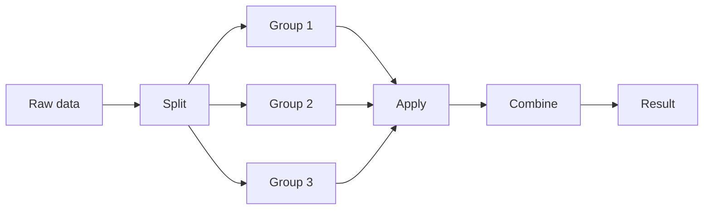

# 3.3.7 Grouping and Aggregation


:::tip Section focus
When many beginners first learn `groupby`, they often feel:

- The syntax does not seem too hard
- But when they face a real problem, they do not know how to think about it

The safest way to understand it is:

> **First think: “What do I want to group by, and what do I want to calculate for each group?” Then write the code.**

So the most important thing in this section is not memorizing a few more aggregation functions, but building a workflow mindset around “split -> summarize -> combine”.
:::

## Learning objectives

- Understand the "split-apply-combine" mechanism of groupby
- Master common aggregation functions and the `agg` method
- Learn group-wise transformation (`transform`) and group-wise filtering (`filter`)
- Master pivot tables (`pivot_table`)

---

## First build a mental map

`groupby` is easier to understand as “split -> apply -> combine”:


So what this section is really trying to solve is:

- Why `groupby` can handle so many problems like “by department / by category / by month”
- What `agg / transform / filter / pivot_table` each actually adds

## Why is groupby so important?

Think back to Chapter 1 — when using pure Python to calculate the survival rate by sex, you had to write dictionaries and loops by hand. With Pandas groupby, you can do it in **one line**:

```python
# Pure Python: 15 lines of code
# Pandas: 1 line
df.groupby("Sex")["Survived"].mean()
```

`groupby` is like SQL `GROUP BY` — group by a field, then calculate separately for each group.

### A more beginner-friendly overall analogy

You can think of `groupby` as:

- First split similar things into piles, then count, calculate, and compare each pile separately

For example:

- Group by department
- Group by city
- Group by month

This is much easier than keeping “Pandas syntax” in your head all the time, and it helps you grasp the essence.

---

## groupby basics

### Grouping mechanism



```python
import pandas as pd
import numpy as np

df = pd.DataFrame({
    "Department": ["Engineering", "Marketing", "Engineering", "Management", "Marketing", "Engineering", "Management"],
    "Name": ["Zhang San", "Li Si", "Wang Wu", "Zhao Liu", "Qian Qi", "Sun Ba", "Zhou Jiu"],
    "Salary": [15000, 18000, 22000, 35000, 20000, 19000, 30000],
    "Age": [22, 28, 25, 35, 30, 24, 40]
})

# Group by department and calculate average salary
result = df.groupby("Department")["Salary"].mean()
print(result)
# Department
# Marketing    19000.0
# Engineering  18666.7
# Management   32500.0
```

### Basic aggregation

```python
grouped = df.groupby("Department")

# Common aggregation functions
print(grouped["Salary"].sum())       # Total salary
print(grouped["Salary"].mean())      # Average salary
print(grouped["Salary"].median())    # Median
print(grouped["Salary"].min())       # Lowest salary
print(grouped["Salary"].max())       # Highest salary
print(grouped["Salary"].std())       # Standard deviation
print(grouped["Salary"].count())     # Headcount
```

### Aggregating multiple columns

```python
# Aggregate multiple columns
print(df.groupby("Department")[["Salary", "Age"]].mean())
#                Salary       Age
# Department
# Marketing    19000.0  29.000000
# Engineering  18666.7  23.666667
# Management   32500.0  37.500000
```

### Multi-level grouping

```python
df2 = pd.DataFrame({
    "Department": ["Engineering", "Engineering", "Marketing", "Marketing", "Engineering", "Marketing"],
    "Level": ["Junior", "Senior", "Junior", "Senior", "Junior", "Junior"],
    "Salary": [15000, 25000, 12000, 22000, 18000, 14000]
})

# Group by department and level
result = df2.groupby(["Department", "Level"])["Salary"].mean()
print(result)
# Department  Level
# Marketing   Junior    13000.0
#             Senior    22000.0
# Engineering Junior    16500.0
#             Senior    25000.0
```

### The safest default order when you solve grouping problems for the first time

A safer order is usually:

1. First ask yourself what to group by
2. Then ask what to calculate for each group
3. Finally decide whether you want a summary table or whether you need to write the result back to the original table

This step is very important because it directly determines whether you should use:

- `agg`
- `transform`
- `filter`

---

## `agg`: do multiple aggregations at once

`agg` lets you apply different aggregation functions to the same column or different columns:

```python
# Calculate multiple statistics for the salary column at once
result = df.groupby("Department")["Salary"].agg(["mean", "min", "max", "count"])
print(result)
#            mean    min    max  count
# Department
# Marketing  19000.0  18000  20000      2
# Engineering 18666.7  15000  22000      3
# Management  32500.0  30000  35000      2
```

```python
# Use different aggregation functions for different columns
result = df.groupby("Department").agg({
    "Salary": ["mean", "max"],
    "Age": ["mean", "min"],
    "Name": "count"           # Headcount
})
print(result)

# Custom aggregation function
result = df.groupby("Department")["Salary"].agg(
    AverageSalary="mean",
    HighestSalary="max",
    SalaryGap=lambda x: x.max() - x.min()
)
print(result)
```

### When should you think of `agg` first?

When your question sounds like:

- “What are the average, maximum, and count for each department?”

At that point, you should usually think first of:

- `groupby(...).agg(...)`

In other words, `agg` is best for:

- Doing multiple summary statistics in one go

---

## `transform`: group-wise transformation

`transform` applies a function to each group, but it **returns a result with the same length as the original data** — perfect for creating new columns.

```python
# Scenario: label each person with "difference from department average salary"
df["DepartmentMeanSalary"] = df.groupby("Department")["Salary"].transform("mean")
df["SalaryGap"] = df["Salary"] - df["DepartmentMeanSalary"]
print(df[["Name", "Department", "Salary", "DepartmentMeanSalary", "SalaryGap"]])

# Scenario: within-group standardization (subtract mean and divide by std for each group)
df["Salary_Standardized"] = df.groupby("Department")["Salary"].transform(
    lambda x: (x - x.mean()) / x.std() if x.std() > 0 else 0
)
```

:::tip The difference between `transform` and `agg`
- `agg`: returns **one value per group** (summary), so the number of rows equals the number of groups
- `transform`: returns **the same number of values as the original data**, so the number of rows equals the original number of rows

```python
# agg: 3 departments → 3 rows
df.groupby("Department")["Salary"].agg("mean")

# transform: 7 people → 7 rows (each person gets their department mean)
df.groupby("Department")["Salary"].transform("mean")
```
:::

### A comparison table that is very useful for beginners to remember first

| Method | The most important result to remember |
|---|---|
| `agg` | One summary result per group |
| `transform` | Same number of rows, just add a “group statistic” column |
| `filter` | Keep or remove entire groups |
| `pivot_table` | Organize results into a cross table |

This table is especially useful for beginners because it helps separate several easily confused methods again.

---

## `filter`: group-wise filtering

`filter` keeps or removes whole groups based on a condition:

```python
# Keep only departments with average salary > 20000
result = df.groupby("Department").filter(lambda x: x["Salary"].mean() > 20000)
print(result)
# Only the "Management" department has an average salary > 20000, so only people in Management are kept

# Keep only departments with at least 3 people
result = df.groupby("Department").filter(lambda x: len(x) >= 3)
print(result)
```

---

## Pivot tables (`pivot_table`)

Pivot tables are a very familiar feature for Excel users — and Pandas supports them perfectly.

```python
# Prepare sales data
sales = pd.DataFrame({
    "Month": ["Jan", "Jan", "Feb", "Feb", "Jan", "Feb"],
    "Product": ["Apple", "Milk", "Apple", "Milk", "Bread", "Bread"],
    "SalesVolume": [50, 30, 60, 25, 40, 45],
    "Amount": [250, 240, 300, 200, 120, 135]
})

# Pivot table: total sales volume of each product by month
pivot = pd.pivot_table(
    sales,
    values="SalesVolume",        # Value to aggregate
    index="Product",             # Rows
    columns="Month",             # Columns
    aggfunc="sum"                # Aggregation method
)
print(pivot)
# Month   Jan   Feb
# Product
# Milk     30   25
# Apple    50   60
# Bread    40   45

# Multiple aggregations
pivot2 = pd.pivot_table(
    sales,
    values="Amount",
    index="Product",
    columns="Month",
    aggfunc=["sum", "mean"],
    margins=True              # Add total rows and columns
)
print(pivot2)
```

### Crosstab

```python
# Count the distribution of people across departments and levels
ct = pd.crosstab(df2["Department"], df2["Level"])
print(ct)
# Level  Junior  Senior
# Department
# Marketing    2    1
# Engineering  2    1

# Add totals and proportions
ct2 = pd.crosstab(df2["Department"], df2["Level"], margins=True, normalize="index")
print(ct2)  # Row-wise proportions (the share of Junior/Senior within each department)
```

---

## Practice: sales data grouping analysis

```python
import pandas as pd
import numpy as np

rng = np.random.default_rng(seed=42)
n = 200

orders = pd.DataFrame({
    "Month": rng.choice(["Jan", "Feb", "Mar", "Apr"], n),
    "Region": rng.choice(["East China", "South China", "North China", "Southwest"], n),
    "Product": rng.choice(["Phone", "Computer", "Headphones", "Tablet"], n),
    "SalesVolume": rng.integers(1, 50, n),
    "UnitPrice": rng.choice([99, 299, 999, 2999, 5999], n)
})
orders["Amount"] = orders["SalesVolume"] * orders["UnitPrice"]

# 1. Total sales amount for each region
print(orders.groupby("Region")["Amount"].sum().sort_values(ascending=False))

# 2. Average sales volume and total amount for each product
print(orders.groupby("Product").agg(
    AverageSalesVolume=("SalesVolume", "mean"),
    TotalAmount=("Amount", "sum"),
    OrderCount=("Amount", "count")
))

# 3. Pivot table: total amount by region × product
print(pd.pivot_table(orders, values="Amount", index="Region", columns="Product", aggfunc="sum"))

# 4. The region with the highest sales amount in each month
monthly_top = orders.groupby(["Month", "Region"])["Amount"].sum().reset_index()
idx = monthly_top.groupby("Month")["Amount"].idxmax()
print(monthly_top.loc[idx])
```

---

## Evidence to Keep

Keep this page's proof of learning as a small evidence card:

```text
dataframe_state: columns, dtypes, row count, missing values, and sample rows
operation: read/write, select/filter, clean, transform, groupby, merge, or time-series step
output: resulting table, saved file, aggregation, join result, or time index view
failure_check: dtype mismatch, missing data, duplicated keys, chained assignment, or wrong time frequency
Expected_output: before/after table sample with the transformation reason
```

## Summary

| Operation | Method | Number of rows returned | Use case |
|------|------|---------|------|
| Basic aggregation | `groupby().mean()` etc. | Number of groups | Summary statistics |
| Multiple aggregations | `groupby().agg()` | Number of groups | Multiple statistics |
| Group-wise transformation | `groupby().transform()` | Original number of rows | Create new columns |
| Group-wise filtering | `groupby().filter()` | ≤ original number of rows | Keep groups by condition |
| Pivot table | `pivot_table()` | Number of unique row values | Cross-tabulation |
| Crosstab | `crosstab()` | Number of unique row values | Frequency statistics |

---

## Hands-on exercises

### Exercise 1: basic grouping

```python
# Use the orders data above
# 1. Calculate the average order value by month (amount / volume)
# 2. Which month and product had the highest sales volume?
# 3. Which product sold best in each region?
```

### Exercise 2: `transform` practice

```python
# 1. Add a "region average amount" column to each order
# 2. Mark whether each order amount is above the average of its region
# 3. Calculate what percentage each order amount contributes to the total amount of its region
```

### Exercise 3: pivot tables

```python
# 1. Create a pivot table: rows = region, columns = month, values = total amount, with totals
# 2. In which month did each region have the highest sales amount?
```


<details>
<summary>Reference implementation and walkthrough</summary>

- Average order value is total amount divided by order count, so compute both numerator and denominator instead of averaging already-averaged rows.
- For best product by month or region, aggregate to the correct level first, then sort or use `idxmax`. Picking the maximum raw row can give the wrong answer when a product appears many times.
- Use `transform` when each original row needs a group-level value, such as region average or share of monthly sales. Use `agg` when the output should be one row per group.

</details>
