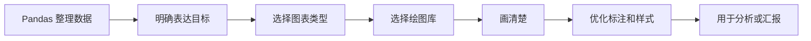
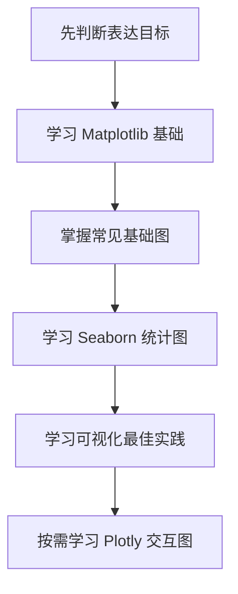
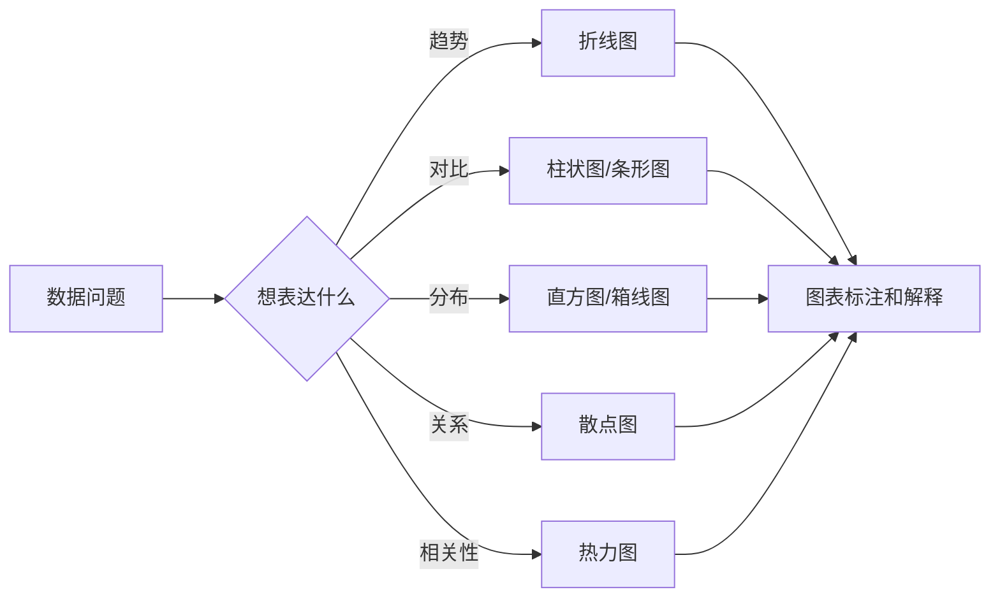

# 可视化导读：先学会选图，再学会美化

这一章解决的是：怎样把数据里的趋势、对比、分布和关系，用别人一眼能看懂的图表表达出来。

很多新人第一次学可视化时会被 API 淹没：`plot()` 怎么写，参数怎么调，颜色怎么改。但可视化最重要的第一步不是背函数，而是先问清楚：我现在到底想让读者一眼看到什么。

## 这一章在整个课程里的位置

你已经学过 Pandas，知道如何把数据读进来、清洗、筛选和聚合。可视化就是把这些整理后的数据变成图形表达，让自己更快探索数据，也让别人更快理解结论。

在后面的机器学习和项目阶段，可视化还会用于 EDA、特征分布分析、模型结果展示、错误分析和项目汇报。因此这一章不是“美化图表”的附属内容，而是数据分析表达能力的核心部分。

## 这一章真正要解决的问题

这一章要回答五个问题：什么时候应该画折线图、柱状图、散点图、直方图、箱线图或热力图；Matplotlib、Seaborn 和 Plotly 各自适合什么场景；探索性图表和汇报型图表有什么差异；怎样通过标题、坐标轴、图例和颜色让图更清楚；怎样避免图表误导读者。

新人最容易犯的错误，是图还没想好就开始写代码。工具很重要，但工具应该服务表达。你要先判断自己想表达趋势、对比、分布、关系还是占比，再决定用什么图。

## 新人推荐学习顺序

建议先学 Matplotlib，因为它能帮助你理解 Figure、Axes、坐标轴和基础绘图对象。然后学 Seaborn，用更少代码完成常见统计图和探索性分析。接着学可视化最佳实践，理解选图、标题、颜色、标注和避免误导。最后按需学 Plotly，当你需要交互图、网页展示或动态探索时再使用。

## 学这一章时要抓住的主线

这一章的主线可以概括为：先决定要讲什么，再决定用什么图，最后才谈美化。

看懂这条线后，你会知道“图画得好看”不是目标，“让别人更快看懂数据”才是目标。

## 这一章 4 节课分别在做什么

| 章节 | 它最该帮你解决什么问题 |
|---|---|
| [4.1 Matplotlib 基础](./01-matplotlib.md) | 先学会最基本的画图动作和 Figure/Axes 模型 |
| [4.2 Seaborn 统计可视化](./02-seaborn.md) | 用更少代码更快做探索性分析和统计图 |
| [4.3 交互式可视化（选修）](./03-plotly.md) | 当你需要交互、演示、网页图表时该怎么做 |
| [4.4 可视化最佳实践](./04-best-practices.md) | 选图、配色、避免误导，让图真正“能看” |

## 这一章和后面阶段的关系

可视化会贯穿后面的机器学习、深度学习和大模型应用项目。机器学习需要用图查看数据分布、特征关系、模型误差和评估结果；深度学习需要展示训练曲线和预测样例；Agent 和 RAG 项目也可以用图展示评估数据、调用成本和失败类型。

如果这一章没学稳，后面常见的问题是：数据分析报告只有表格没有结论；机器学习项目只给一个分数，没有解释；训练过程没有曲线；项目展示缺少让人快速理解的图。

## 新人和进阶学习者怎么读

新人第一次学这一章时，先抓住主线和最小可运行例子。你不需要一次理解所有细节，只要能说清楚这一章解决什么问题、输入输出是什么、最小项目怎么跑起来，就可以继续往后走。

有经验的学习者可以把这一章当成查漏补缺和工程化练习：关注边界条件、失败案例、评估方式、代码可复现性，以及它和前后阶段的连接。读完后最好能把本章内容沉淀到自己的作品 README 或实验记录里。

## 学习时间与难度建议

| 学习方式 | 建议投入 | 目标 |
|---|---|---|
| 快速浏览 | 20～30 分钟 | 看懂本章解决什么问题，知道后面会用到哪里 |
| 最小通关 | 1～2 小时 | 跑通一个最小例子，完成本章小项目出口 |
| 深入练习 | 半天～1 天 | 补充错误分析、对比实验或项目 README 记录 |

## 本章自测问题

| 自测问题 | 通过标准 |
|---|---|
| 这一章解决什么问题？ | 能用一句话说明它在整门课里的位置 |
| 最小输入输出是什么？ | 能说清楚例子需要什么输入，会产生什么结果 |
| 常见失败点在哪里？ | 能列出至少一个报错、效果差或理解偏差的原因 |
| 学完后能沉淀什么？ | 能把本章产出写进项目 README、实验记录或作品集 |

## 本章小项目出口

学完这一章后，建议做一个“销售数据可视化报告”。用 Pandas 整理好的销售数据，分别画出月度趋势、品类对比、订单金额分布、价格与销量关系、地区热力图或透视表，并为每张图写一句结论。

项目重点不是图表数量，而是每张图都能回答一个明确问题。

## 过关标准

这一章结束时，你应该能根据趋势、对比、分布、关系和相关性选择合适图表，能用 Matplotlib 和 Seaborn 画出基础图，能解释 Plotly 适合什么场景，能通过标题、坐标轴、图例和颜色让图更清楚。

如果你能把一份数据整理成 4 到 6 张有结论的图表，并说明每张图为什么这样选，就达到了数据可视化入门标准。

## 学到这里，下一步怎么读最顺

建议先读 Matplotlib 基础，再读 Seaborn 统计可视化，然后读可视化最佳实践，最后按需阅读 Plotly 交互式可视化。
