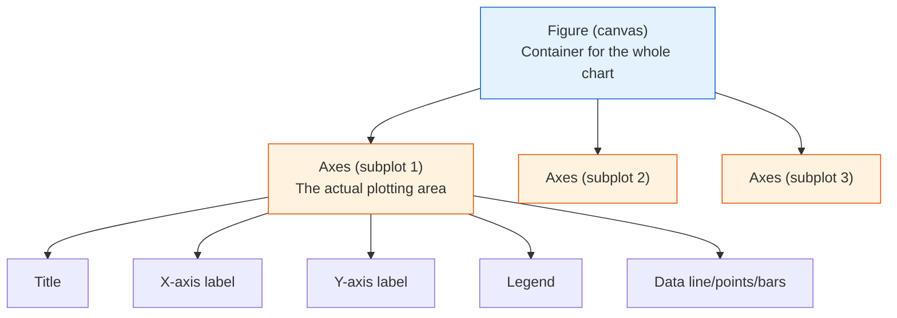
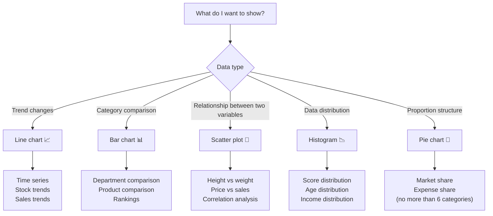

# 3.4.2 Matplotlib Basics


:::tip Section focus
For many beginners learning `Matplotlib` for the first time, the hardest parts are:

- too many parameters
- code that feels too long
- the chart is drawn, but you do not really know why you made that chart

So the most important thing in this section is not memorizing the API first, but building the most stable workflow:

> **First clarify what you want to express, then decide what chart to draw, and finally write the code.**
:::

## Learning objectives

- Understand the object model of Figure and Axes
- Master 5 basic chart types
- Learn how to customize chart elements (title, legend, grid, etc.)
- Master subplot layouts

---

## First, build a map

When learning `Matplotlib` for the first time, the safest order is not “memorize all the functions first,” but to first see how a chart usually comes together:


So what this section really wants to solve is:

- What is the most basic plotting action?
- Why does the `Figure / Axes` model become the foundation for all later charts?

---

## Why learn visualization?

> "A picture is worth a thousand words."

For the same data—

- In a table: `Average salary: Technical Dept 18667, Marketing Dept 19000, Management Dept 32500`
- In a chart: you can immediately see that the Management Dept salary is much higher than the others

The purpose of data visualization is to **let data speak**, so people can understand the patterns and story behind it within seconds.

### A better beginner-friendly analogy

You can think of `Matplotlib` as:

- a basic toolbox for drawing charts

It is not like `Seaborn`, which already gives you many default styles,
but its advantage is:

- you can truly see how a chart is built step by step

So the value of learning `Matplotlib` is not only to be able to draw charts,
but also to build an intuition for:

- how a chart is made up of data, canvas, and axes

---

## Installation and import

```python
# Install (usually already included)
# python -m pip install --upgrade matplotlib

import matplotlib.pyplot as plt
import numpy as np

# Show charts in Jupyter Notebook
# %matplotlib inline
```

:::tip Import convention
`import matplotlib.pyplot as plt` is the standard way to write it, and the entire data science community uses it.
:::

---

## Your first chart: 5 lines of code

```python
import matplotlib.pyplot as plt

x = [1, 2, 3, 4, 5]
y = [2, 4, 6, 8, 10]

plt.plot(x, y)        # Draw a line chart
plt.title("My First Chart")  # Title
plt.show()             # Display the chart
```

That’s it! You will see a straight line rising from the lower left to the upper right.

### The most important order to remember when plotting for the first time

When drawing any chart for the first time, a safer order is usually:

1. Prepare `x` and `y` first
2. Draw the most basic version first
3. Add the title and labels next
4. Finally add the legend, colors, and styling

This is usually much easier than trying to study color schemes and styles from the very beginning.

---

## Core concepts: Figure and Axes

Matplotlib charts are built from two core objects:



- **Figure**: the whole canvas, which can contain multiple subplots
- **Axes**: one specific chart area (note: not “axis,” but “subplot”)

### Two plotting styles

```python
# Style 1: quick plotting with plt (good for simple cases)
plt.plot([1, 2, 3], [4, 5, 6])
plt.title("Quick Plotting")
plt.show()

# Style 2: object-oriented style (recommended, more flexible)
fig, ax = plt.subplots()         # Create the canvas and subplot
ax.plot([1, 2, 3], [4, 5, 6])   # Plot on the subplot
ax.set_title("Object-Oriented Plotting")      # Set the title
plt.show()
```

:::tip Recommended: use the object-oriented style
Although `plt.plot()` is simpler, the object-oriented style (`fig, ax = plt.subplots()`) is more convenient when you need multiple subplots or fine-grained control. It is a good habit to develop from the start.
:::

---

## 5 basic chart types

### First, do not memorize functions blindly—first remember what each one is best for

| Chart | What it is best for |
|------|----------------|
| Line chart | Showing trends |
| Bar chart | Comparing categories |
| Scatter plot | Showing relationships |
| Histogram | Showing distribution |
| Pie chart | Showing proportions (with only a few categories) |

This table is especially important for beginners because it turns “function names” back into “communication tasks.”

### Line Plot

**Best for:** showing how data changes over time or another continuous variable

```python
import matplotlib.pyplot as plt
import numpy as np

# Simulate sales data for 12 months
months = np.arange(1, 13)
sales_2023 = [120, 135, 150, 180, 200, 210, 195, 188, 220, 250, 280, 310]
sales_2024 = [140, 155, 170, 195, 230, 245, 225, 210, 260, 290, 320, 350]

fig, ax = plt.subplots(figsize=(10, 6))  # Set canvas size

ax.plot(months, sales_2023, marker="o", label="2023", color="#2196F3", linewidth=2)
ax.plot(months, sales_2024, marker="s", label="2024", color="#FF5722", linewidth=2)

ax.set_title("Monthly Sales Trend", fontsize=16, fontweight="bold")
ax.set_xlabel("Month", fontsize=12)
ax.set_ylabel("Sales (10k yuan)", fontsize=12)
ax.set_xticks(months)
ax.set_xticklabels([f"{m}" for m in months])
ax.legend(fontsize=12)     # Show legend
ax.grid(True, alpha=0.3)   # Show grid lines

plt.tight_layout()  # Automatically adjust margins
plt.show()
```

**Key parameters:**

| Parameter | Purpose | Example |
|------|------|------|
| `marker` | Data point marker | `"o"` circle, `"s"` square, `"^"` triangle |
| `linestyle` | Line style | `"-"` solid, `"--"` dashed, `":"` dotted |
| `linewidth` | Line width | `2` |
| `color` | Color | `"red"`, `"#FF5722"`, `"C0"` |
| `label` | Legend label | `"2023"` |
| `alpha` | Transparency | `0.7` (0 fully transparent, 1 fully opaque) |

### Bar Chart

**Best for:** comparing values across different categories

```python
# Salary comparison across departments
departments = ["Technical Dept", "Marketing Dept", "Management Dept", "Finance Dept", "HR Dept"]
avg_salary = [18500, 16200, 28000, 15800, 14500]

fig, ax = plt.subplots(figsize=(8, 5))

bars = ax.bar(departments, avg_salary, color=["#4CAF50", "#2196F3", "#FF9800", "#9C27B0", "#607D8B"])

# Show values above each bar
for bar, val in zip(bars, avg_salary):
    ax.text(bar.get_x() + bar.get_width()/2, bar.get_height() + 300,
            f"¥{val:,}", ha="center", fontsize=10)

ax.set_title("Average Salary by Department", fontsize=14)
ax.set_ylabel("Salary (yuan)")
ax.set_ylim(0, max(avg_salary) * 1.15)  # Leave space for value labels on the Y-axis

plt.tight_layout()
plt.show()
```

**Horizontal bar chart** (better when labels are long):

```python
fig, ax = plt.subplots(figsize=(8, 5))
ax.barh(departments, avg_salary, color="#4CAF50")
ax.set_xlabel("Salary (yuan)")
ax.set_title("Average Salary by Department")
plt.tight_layout()
plt.show()
```

**Grouped bar chart:**

```python
# Two-year comparison
x = np.arange(len(departments))
width = 0.35

fig, ax = plt.subplots(figsize=(10, 5))
ax.bar(x - width/2, [17000, 15000, 26000, 14500, 13000], width, label="2023", color="#64B5F6")
ax.bar(x + width/2, avg_salary, width, label="2024", color="#1565C0")

ax.set_xticks(x)
ax.set_xticklabels(departments)
ax.legend()
ax.set_title("Department Salary Comparison (2023 vs 2024)")
plt.tight_layout()
plt.show()
```

### Scatter Plot

**Best for:** observing the relationship between two variables

```python
rng = np.random.default_rng(seed=42)

# Simulate height and weight data
height = rng.normal(170, 8, 100)
weight = height * 0.65 - 40 + rng.normal(0, 5, 100)

fig, ax = plt.subplots(figsize=(8, 6))

scatter = ax.scatter(height, weight, c=weight, cmap="RdYlGn_r",
                     s=50, alpha=0.7, edgecolors="white", linewidth=0.5)

ax.set_title("Relationship Between Height and Weight", fontsize=14)
ax.set_xlabel("Height (cm)")
ax.set_ylabel("Weight (kg)")

plt.colorbar(scatter, label="Weight")  # Color bar
plt.tight_layout()
plt.show()
```

**Key parameters:**

| Parameter | Purpose | Example |
|------|------|------|
| `s` | Point size | `50`, or pass an array for varying sizes |
| `c` | Point color | `"red"`, or pass an array for color mapping |
| `cmap` | Colormap | `"viridis"`, `"RdYlGn"`, `"Blues"` |
| `alpha` | Transparency | `0.7` |

### Histogram

**Best for:** viewing the distribution of data

```python
rng = np.random.default_rng(seed=42)
scores = rng.normal(75, 12, 500)  # Scores of 500 students

fig, ax = plt.subplots(figsize=(8, 5))

# Draw histogram
n, bins, patches = ax.hist(scores, bins=20, color="#42A5F5", edgecolor="white",
                            alpha=0.8)

# Add mean line
mean_val = scores.mean()
ax.axvline(mean_val, color="red", linestyle="--", linewidth=2, label=f"Mean: {mean_val:.1f}")

ax.set_title("Student Score Distribution", fontsize=14)
ax.set_xlabel("Score")
ax.set_ylabel("Number of students")
ax.legend()

plt.tight_layout()
plt.show()
```

### Pie Chart

**Best for:** showing parts of a whole (categories should not exceed 5–6)

```python
labels = ["Python", "JavaScript", "Java", "C++", "Others"]
sizes = [35, 25, 20, 10, 10]
colors = ["#4CAF50", "#FFC107", "#2196F3", "#FF5722", "#9E9E9E"]
explode = (0.05, 0, 0, 0, 0)  # Highlight Python

fig, ax = plt.subplots(figsize=(7, 7))

ax.pie(sizes, explode=explode, labels=labels, colors=colors,
       autopct="%1.1f%%", startangle=90, shadow=False,
       textprops={"fontsize": 12})

ax.set_title("Programming Language Usage in AI", fontsize=14)

plt.tight_layout()
plt.show()
```

:::caution Use pie charts carefully
When there are many categories (more than 6) or the proportions are close together, pie charts are **hard to read clearly**. In most cases, a bar chart is better. Use a pie chart only when you want to emphasize the relationship of “part to whole.”
:::

---

## Chart selection guide



---

## Chart customization

### A minimal checklist that beginners should remember first

Before you start styling, ask yourself:

1. Does the title clearly explain what this chart is trying to show?
2. Do the X-axis and Y-axis have labels and units?
3. Is a legend really necessary?
4. Is the color helping understanding, or just adding noise?

If you get these 4 things right first, your chart is usually already clearer than most versions that “run but look bad.”

### Displaying Chinese text

Matplotlib does not support Chinese by default, so you need to configure it:

```python
import matplotlib.pyplot as plt

# Method 1: global settings (recommended)
plt.rcParams["font.sans-serif"] = ["SimHei", "Arial Unicode MS", "DejaVu Sans"]
plt.rcParams["axes.unicode_minus"] = False  # Fix minus sign display issues

# macOS users can use
# plt.rcParams["font.sans-serif"] = ["Arial Unicode MS"]

# Linux users can use
# plt.rcParams["font.sans-serif"] = ["WenQuanYi Micro Hei"]
```

:::tip A once-and-for-all method
Put these two lines at the start of all your plotting code, and you won’t need to set them every time. In Jupyter, put them in the first cell.
:::

### Title and labels

```python
fig, ax = plt.subplots()
ax.plot([1, 2, 3], [4, 5, 6])

ax.set_title("Main Title", fontsize=16, fontweight="bold", color="#333")
ax.set_xlabel("X-axis Label", fontsize=12)
ax.set_ylabel("Y-axis Label", fontsize=12)
```

### Legend

```python
ax.plot(x, y1, label="Data A")
ax.plot(x, y2, label="Data B")
ax.legend(loc="upper left", fontsize=10, frameon=True, shadow=True)

# Common loc values:
# "best" (automatic), "upper left", "upper right", "lower left", "lower right", "center"
```

### Grid and styles

```python
ax.grid(True, alpha=0.3, linestyle="--")  # Semi-transparent dashed grid

# Use a preset style (global setting)
plt.style.use("seaborn-v0_8-whitegrid")  # Clean white grid
# Other nice styles:
# "ggplot", "seaborn-v0_8", "fivethirtyeight", "bmh"
```

View all available styles:

```python
print(plt.style.available)
```

### Annotations and callouts

```python
fig, ax = plt.subplots(figsize=(8, 5))
x = np.arange(1, 13)
y = [120, 135, 150, 180, 200, 210, 195, 188, 220, 250, 280, 310]
ax.plot(x, y, marker="o")

# Mark the maximum value
max_idx = np.argmax(y)
ax.annotate(f"Highest point: {y[max_idx]}",
            xy=(x[max_idx], y[max_idx]),       # Arrow target
            xytext=(x[max_idx]-2, y[max_idx]+20),  # Text position
            arrowprops=dict(arrowstyle="->", color="red"),
            fontsize=12, color="red")

plt.show()
```

---

## Subplot layout

### subplots: create multiple subplots

```python
# 2 rows × 2 columns = 4 subplots
fig, axes = plt.subplots(2, 2, figsize=(12, 8))

# axes is a 2×2 array
axes[0, 0].plot([1, 2, 3], [1, 4, 9])
axes[0, 0].set_title("Line Chart")

axes[0, 1].bar(["A", "B", "C"], [3, 7, 5])
axes[0, 1].set_title("Bar Chart")

rng = np.random.default_rng(seed=42)
axes[1, 0].scatter(rng.random(50), rng.random(50))
axes[1, 0].set_title("Scatter Plot")

axes[1, 1].hist(rng.standard_normal(200), bins=15)
axes[1, 1].set_title("Histogram")

fig.suptitle("Four Basic Chart Types", fontsize=16, fontweight="bold")
plt.tight_layout()
plt.show()
```

### Uneven subplots

```python
fig = plt.figure(figsize=(12, 5))

# Left takes up 2/3 of the width
ax1 = fig.add_axes([0.05, 0.1, 0.6, 0.8])   # [left, bottom, width, height]
ax1.plot([1, 2, 3, 4], [10, 20, 25, 30])
ax1.set_title("Main Chart")

# Right takes up 1/3 of the width
ax2 = fig.add_axes([0.72, 0.1, 0.25, 0.8])
ax2.bar(["A", "B"], [15, 25])
ax2.set_title("Secondary Chart")

plt.show()
```

---

## Saving charts

```python
fig, ax = plt.subplots()
ax.plot([1, 2, 3], [4, 5, 6])
ax.set_title("Save Example")

# Save as PNG (most common)
fig.savefig("my_chart.png", dpi=150, bbox_inches="tight")

# Save as SVG (vector graphic, does not blur when enlarged)
fig.savefig("my_chart.svg", bbox_inches="tight")

# Save as PDF
fig.savefig("my_chart.pdf", bbox_inches="tight")
```

| Parameter | Purpose | Recommended value |
|------|------|--------|
| `dpi` | Resolution | 150 (normal), 300 (print) |
| `bbox_inches` | Crop margins | `"tight"` for automatic cropping |
| `transparent` | Transparent background | `True` (for PowerPoint) |

---

## Evidence to Keep

Keep this page's proof of learning as a small evidence card:

```text
question: what comparison, distribution, trend, or relationship the chart answers
chart_choice: line, bar, scatter, histogram, box, heatmap, or interactive dashboard
artifact: saved chart image/html plus the data slice used
failure_check: misleading scale, overloaded chart, wrong aggregation, or missing labels
Expected_output: chart artifact with one sentence explaining the insight
```

## Summary

| Chart | Function | Use case |
|------|------|---------|
| Line chart | `ax.plot()` | Trends, time series |
| Bar chart | `ax.bar()` / `ax.barh()` | Category comparison |
| Scatter plot | `ax.scatter()` | Relationship between two variables |
| Histogram | `ax.hist()` | Data distribution |
| Pie chart | `ax.pie()` | Proportions (use carefully) |

Core workflow:

```python
fig, ax = plt.subplots(figsize=(8, 5))   # 1. Create the canvas
ax.plot(x, y)                             # 2. Plot the data
ax.set_title("Title")                     # 3. Set title/labels
ax.legend()                               # 4. Add legend
plt.tight_layout()                        # 5. Adjust layout
plt.show()                                # 6. Display
```

## What you should take away from this section

- The most important thing about `Matplotlib` is not the number of functions, but that it helps you truly understand how a chart is built
- First clarify what you want to express, then choose the chart, then write the code — this is more stable than memorizing the API first
- `Figure / Axes` is the underlying intuition behind almost all Python visualization libraries later on

---

## Hands-on exercises

### Exercise 1: Line chart

```python
# Plot curves for sin(x) and cos(x)
# Let x range from 0 to 2π with 100 points
# Requirements: different colors and line styles, legend, grid, and title
```

### Exercise 2: Bar chart

```python
# You have housing price data and per-capita income data for 6 cities
# Draw a grouped bar chart for comparison
# Requirements: label the values above each bar
```

### Exercise 3: Combined subplots

```python
# Generate 1000 random numbers from a normal distribution
# Show the following in a 2×2 subplot layout:
# 1. Line chart (trend of the first 100 data points)
# 2. Histogram (distribution)
# 3. Scatter plot (relationship between adjacent data points)
# 4. Bar chart (frequency by interval)
```


<details>
<summary>Reference implementation and walkthrough</summary>

- The sine/cosine plot should have two labeled lines, a title, axis labels, legend, and light grid. If the lines are hard to compare, adjust color and line style before adding decoration.
- For grouped bars, compute x positions explicitly and label bars or axes clearly enough that the reader does not need the code to understand the chart.
- Use `fig, ax = plt.subplots()` for multi-chart work and save the figure with `fig.savefig(...)`. A saved image is part of the evidence, not an afterthought.

</details>
