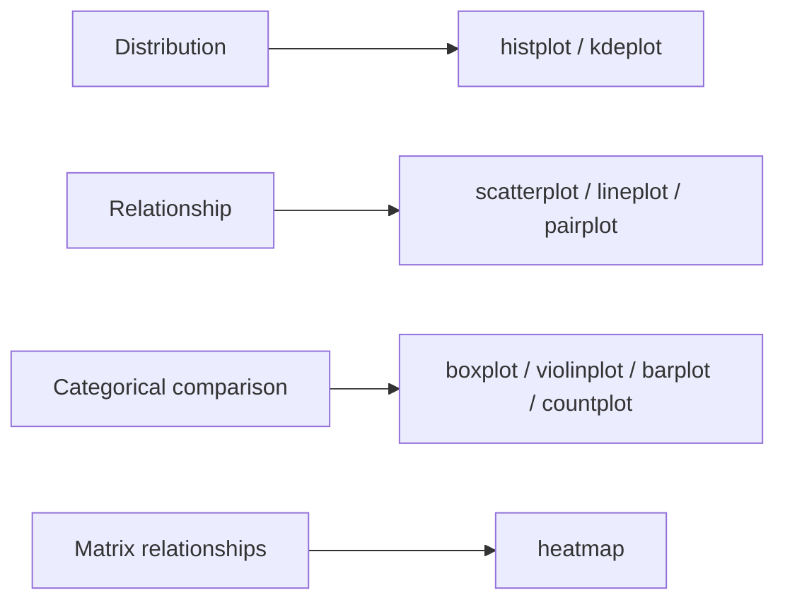
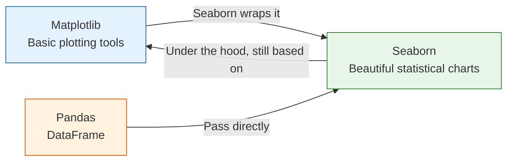
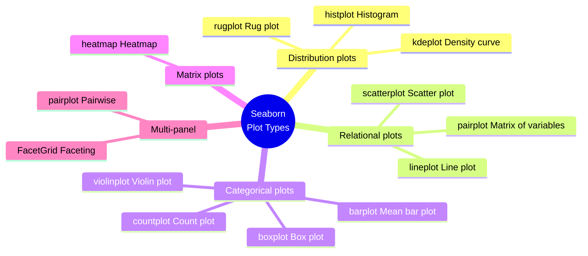

# 3.4.3 Seaborn Statistical Visualization


:::tip Where this section fits
One of the easiest things for beginners to mix up between `Matplotlib` and `Seaborn` is:

- Which library is responsible for what

The safest way to understand it is:

- `Matplotlib` is more like a basic plotting toolbox
- `Seaborn` is more like an advanced tool with preset styles and statistical plot templates

So the most important goal of this section is not to learn yet another library, but to learn:

> **How to make exploratory analysis plots clear more quickly.**
:::

## Learning Objectives

- Understand the relationship between Seaborn and Matplotlib
- Master distribution plots, relational plots, and categorical plots
- Learn to draw heatmaps and correlation matrices
- Use FacetGrid for faceting plots

---

## First, Build a Map

For beginners, the best way to understand `Seaborn` is not by memorizing its function list, but by first seeing the 4 problem types it handles best:



So what this section really aims to solve is:

- When you are doing EDA, which plot should you use first?
- Why is `Seaborn` more suitable than plain `Matplotlib` for quick exploration?

---

## What Is Seaborn?

If you think of Matplotlib as **brushes and paint**, then Seaborn is **a brush set + palette + templates**.



| Comparison | Matplotlib | Seaborn |
|------|-----------|---------|
| Positioning | Low-level plotting library | High-level statistical plotting library |
| Amount of code | More, requires manual setup | Less, ready to use out of the box |
| Default aesthetics | Average | Very polished |
| Data format | Arrays, lists | Directly uses DataFrame |
| Statistical features | Must compute manually | Automatically computes means, confidence intervals, etc. |
| Customization | Extremely strong | Moderate (can be extended with Matplotlib) |

**One-line summary:** Seaborn lets you create a beautiful statistical plot in 1 line of code that might take 10 lines with Matplotlib.

### A Beginner-Friendly Analogy

You can think of `Seaborn` as:

- A data visualization tool where the table is already set for you

`Matplotlib` is like setting everything up from scratch, pots and pans included,
while `Seaborn` is like having the tableware and default style already prepared.
This makes it easier to focus on:

- What statistical phenomenon this chart is meant to show

---

## Installation and Import

```python
# Install
# python -m pip install --upgrade seaborn

import seaborn as sns
import matplotlib.pyplot as plt
import pandas as pd
import numpy as np

# Seaborn's built-in example datasets
tips = sns.load_dataset("tips")      # restaurant tip data
iris = sns.load_dataset("iris")      # iris flower data
titanic = sns.load_dataset("titanic")  # Titanic data

# Set global style
sns.set_theme(style="whitegrid")     # white background + grid, clean and nice
```

### Common Styles at a Glance

| Style | Description | Best use case |
|------|------|----------|
| `"whitegrid"` | White background + grid | Numerical comparison (recommended default) |
| `"darkgrid"` | Gray background + grid | Highlight data points |
| `"white"` | Plain white background | Papers, reports |
| `"dark"` | Gray background | Artistic style |
| `"ticks"` | White background + tick marks | Clean and professional |

---

## Distribution Plots: What Does the Data Look Like?

Distribution plots help answer: **Where are the values concentrated? How spread out are they? Is the distribution skewed?**

### The Most Reliable Default Order for Your First EDA

A safer workflow is usually:

1. Start with distribution plots
   First see where the data is concentrated and whether it is skewed.
2. Then look at relational plots
   Check whether there is a clear relationship between variables.
3. Then look at categorical plots
   Compare differences across groups.
4. Finally, check heatmaps
   Quickly scan the overall correlation structure.

This order is especially good for beginners because it gives the exploration process a clear main thread.

### histplot: Histogram

```python
fig, axes = plt.subplots(1, 3, figsize=(15, 4))

# Basic histogram
sns.histplot(data=tips, x="total_bill", ax=axes[0])
axes[0].set_title("Basic Histogram")

# Add density curve
sns.histplot(data=tips, x="total_bill", kde=True, ax=axes[1])
axes[1].set_title("Histogram + Density Curve")

# Color by category
sns.histplot(data=tips, x="total_bill", hue="time", kde=True, ax=axes[2])
axes[2].set_title("Grouped by Meal Time")

plt.tight_layout()
plt.show()
```

### kdeplot: Kernel Density Estimation

```python
fig, axes = plt.subplots(1, 2, figsize=(12, 4))

# One-dimensional density
sns.kdeplot(data=tips, x="total_bill", hue="sex", fill=True, ax=axes[0])
axes[0].set_title("Distribution of Total Bill Density")

# Two-dimensional density (contours)
sns.kdeplot(data=tips, x="total_bill", y="tip", fill=True, cmap="Blues", ax=axes[1])
axes[1].set_title("Joint Density of Total Bill vs Tip")

plt.tight_layout()
plt.show()
```

:::tip What is KDE?
KDE (Kernel Density Estimation) can be understood as a "smoothed histogram." It uses a continuous curve to estimate the probability density of the data, making it smoother and easier to compare than a histogram.
:::

### rugplot: Rug Plot

```python
fig, ax = plt.subplots(figsize=(8, 4))
sns.kdeplot(data=tips, x="total_bill", fill=True, ax=ax)
sns.rugplot(data=tips, x="total_bill", ax=ax, alpha=0.5)
ax.set_title("Density Curve + Rug Plot (Each line represents one data point)")
plt.show()
```

---

## Relational Plots: What Is the Relationship Between Variables?

### scatterplot: Scatter Plot

```python
fig, axes = plt.subplots(1, 2, figsize=(14, 5))

# Basic scatter plot, use color to distinguish categories
sns.scatterplot(data=tips, x="total_bill", y="tip", hue="time", ax=axes[0])
axes[0].set_title("Total Bill vs Tip")

# Use size and color to show information at the same time
sns.scatterplot(data=tips, x="total_bill", y="tip",
                hue="day", size="size", sizes=(20, 200), ax=axes[1])
axes[1].set_title("Multidimensional Scatter Plot")

plt.tight_layout()
plt.show()
```

### lineplot: Line Plot (with Confidence Interval)

```python
# Simulated experimental data: each x has multiple y values
rng = np.random.default_rng(seed=42)
data = pd.DataFrame({
    "step": np.tile(np.arange(1, 51), 10),
    "accuracy": np.tile(np.linspace(0.5, 0.95, 50), 10) + rng.normal(0, 0.03, 500),
    "model": np.repeat(["Model A", "Model B"], 250)
})

fig, ax = plt.subplots(figsize=(10, 5))
sns.lineplot(data=data, x="step", y="accuracy", hue="model", ax=ax)
ax.set_title("Training Accuracy Over Time (Shaded area = 95% confidence interval)")
plt.show()
```

:::info Seaborn's automatic statistics
When multiple `y` values correspond to the same `x` value, `lineplot` automatically computes the mean and the 95% confidence interval. This is very useful when presenting experimental results!
:::

### pairplot: A Quick Look at Pairwise Relationships

```python
# Relationships among all variables in the iris dataset
sns.pairplot(iris, hue="species", diag_kind="kde", corner=True)
plt.suptitle("Feature Relationships in the Iris Dataset", y=1.02)
plt.show()
```

`pairplot` can show relationships among all variables with just one line of code, making it a **powerful tool in the data exploration stage**.

---

## Categorical Plots: How Do Different Groups Compare?

Categorical plots are one of Seaborn's strengths. They help you compare distributions and statistics across categories.

### A Handy Plot Selection Guide for Beginners

| What you want to know most | Safer first choice |
|---|---|
| What does the distribution of this column look like? | `histplot` |
| Is there a relationship between two variables? | `scatterplot` |
| Do the distributions of two or more groups differ a lot? | `boxplot` / `violinplot` |
| Which category has more samples? | `countplot` |
| Are multiple numerical variables correlated? | `heatmap` |

This table can save beginners a lot of detours because you do not have to be overwhelmed by function names at the start.

### boxplot: Box Plot

```python
fig, axes = plt.subplots(1, 2, figsize=(14, 5))

# Basic box plot
sns.boxplot(data=tips, x="day", y="total_bill", ax=axes[0])
axes[0].set_title("Total Bill Distribution by Day")

# Use color to distinguish subgroups
sns.boxplot(data=tips, x="day", y="total_bill", hue="sex", ax=axes[1])
axes[1].set_title("Total Bill Distribution by Day (by Sex)")

plt.tight_layout()
plt.show()
```

:::tip How to read a box plot

```
          Maximum (upper whisker)
            │
    ┌───────┤
    │  Upper quartile (Q3) ─── 75% of data is below this
    │       │
    │  Median (Q2) ──── 50th percentile
    │       │
    │  Lower quartile (Q1) ─── 25% of data is below this
    └───────┤
            │
          Minimum (lower whisker)

    ●       Outliers (points beyond the whiskers)
```

The taller the box, the more spread out the data is; the higher the median line, the larger the overall values are.
:::

### violinplot: Violin Plot

```python
fig, ax = plt.subplots(figsize=(10, 5))

sns.violinplot(data=tips, x="day", y="total_bill", hue="sex",
               split=True, inner="quart", ax=ax)
ax.set_title("Total Bill Distribution by Day (Violin Plot, female left, male right)")

plt.show()
```

A violin plot = box plot + density distribution, so it shows more of the distribution shape than a box plot.

### barplot: Mean Bar Plot (with Error Bars)

```python
fig, ax = plt.subplots(figsize=(8, 5))

sns.barplot(data=tips, x="day", y="total_bill", hue="sex",
            ci=95, ax=ax)  # ci=95 means a 95% confidence interval
ax.set_title("Average Total Bill by Day (error bars = 95% confidence interval)")

plt.show()
```

:::caution Error bars in barplot
By default, Seaborn's `barplot` adds error bars to each bar using bootstrap confidence intervals. These are not standard deviations! If you want standard deviation instead, set `ci="sd"`.
:::

### countplot: Count Plot

```python
fig, axes = plt.subplots(1, 2, figsize=(12, 4))

# Simple counts
sns.countplot(data=tips, x="day", order=["Thur", "Fri", "Sat", "Sun"], ax=axes[0])
axes[0].set_title("Number of Diners by Day")

# Grouped counts
sns.countplot(data=titanic, x="class", hue="survived", ax=axes[1])
axes[1].set_title("Survival by Class")

plt.tight_layout()
plt.show()
```

---

## Heatmap

A heatmap uses color intensity to represent values and is most commonly used for **correlation matrices**.

### Draw a Correlation Matrix

```python
# Compute correlations for numeric columns
# Select the numeric columns in tips
numeric_cols = tips.select_dtypes(include="number")
corr = numeric_cols.corr()

fig, ax = plt.subplots(figsize=(8, 6))
sns.heatmap(corr, annot=True, fmt=".2f", cmap="RdBu_r",
            center=0, vmin=-1, vmax=1,
            square=True, linewidths=0.5, ax=ax)
ax.set_title("Correlation Matrix of the Tips Dataset")
plt.tight_layout()
plt.show()
```

**Key parameters:**

| Parameter | Purpose | Common value |
|------|------|--------|
| `annot` | Show values | `True` |
| `fmt` | Number format | `".2f"` for two decimals |
| `cmap` | Color map | `"RdBu_r"` inverted red-blue |
| `center` | Center value for colors | `0` (correlation coefficient) |
| `square` | Square cells | `True` |

### Custom Heatmap

```python
# Pivot-table heatmap (for example, average total bill by day and time)
pivot = tips.pivot_table(values="total_bill", index="day", columns="time", aggfunc="mean")

fig, ax = plt.subplots(figsize=(6, 4))
sns.heatmap(pivot, annot=True, fmt=".1f", cmap="YlOrRd",
            linewidths=1, ax=ax)
ax.set_title("Average Total Bill by Day and Time")
plt.show()
```

---

## FacetGrid: Faceting Plots

Use FacetGrid when you want to **split a chart into multiple subplots based on a variable**.

```python
# Facet by meal time to show the relationship between total bill and tip
g = sns.FacetGrid(tips, col="time", row="sex", hue="smoker",
                  height=4, aspect=1.2)
g.map_dataframe(sns.scatterplot, x="total_bill", y="tip")
g.add_legend()
g.fig.suptitle("Total Bill vs Tip Faceted by Time and Sex", y=1.02)
plt.show()
```

### More Faceting Examples

```python
# Histogram faceted by day
g = sns.FacetGrid(tips, col="day", col_wrap=2, height=3)
g.map_dataframe(sns.histplot, x="total_bill", kde=True)
g.set_titles("Day: {col_name}")
g.fig.suptitle("Total Bill Distribution by Day", y=1.02)
plt.show()
```

| Parameter | Purpose |
|------|------|
| `col` | Split into columns by this variable |
| `row` | Split into rows by this variable |
| `hue` | Use this variable for color |
| `col_wrap` | Maximum number of columns per row (wrap automatically) |
| `height` | Height of each subplot |
| `aspect` | Width-to-height ratio |

### Why is faceting especially good for exploration?

Because it helps you turn:

- “The overall picture looks fine”

into:

- What is actually different across categories and groups?

This is very important for beginners, because many data issues do not show up in the overall distribution. Instead, they become obvious once you split the data into groups.

---

## Seaborn Plot Type Cheat Sheet



---

## Evidence to Keep

Keep this page's proof of learning as a small evidence card:

```text
question: what comparison, distribution, trend, or relationship the chart answers
chart_choice: line, bar, scatter, histogram, box, heatmap, or interactive dashboard
artifact: saved chart image/html plus the data slice used
failure_check: misleading scale, overloaded chart, wrong aggregation, or missing labels
Expected_output: chart artifact with one sentence explaining the insight
```

## Summary

| Need | Function | Description |
|------|------|------|
| Check distribution | `histplot` / `kdeplot` | Histogram / density curve |
| Relationship between two variables | `scatterplot` / `lineplot` | Scatter plot / line plot |
| Relationships among all variables | `pairplot` | One-line matrix plot |
| Compare categories | `boxplot` / `violinplot` / `barplot` | Distribution / mean |
| Count categories | `countplot` | Bar chart |
| Numerical matrix | `heatmap` | Heatmap |
| Faceted display | `FacetGrid` | Multiple subplots |

**Core advantage:** You can draw beautiful charts with statistical information in one line of code, and pass a DataFrame directly.

## What You Should Take Away from This Section

- The most important value of `Seaborn` is not that it is more flashy, but that it is better for quick statistical exploration
- For your first EDA, start with distribution, then relationships, then categorical comparisons — this is usually the safest path
- When choosing a plot, it is more important to ask “What statistical phenomenon do I want to see?” than to memorize function names first

---

## Hands-On Exercises

### Exercise 1: Explore Data Distribution

```python
# Load the tips dataset
# 1. Use histplot to draw the distribution of tip, colored by time
# 2. Use kdeplot to draw the density curve of total_bill, grouped by sex
```

### Exercise 2: Categorical Comparison

```python
# Load the titanic dataset
# 1. Use boxplot to compare the age distribution across classes
# 2. Use countplot to show the number of survivors in each class
```

### Exercise 3: Correlation Analysis

```python
# Load the iris dataset
# 1. Compute the correlation matrix for numeric columns
# 2. Visualize it with heatmap and add value annotations
# 3. Use pairplot to inspect relationships among all variables
```

### Exercise 4: Faceting Plots

```python
# Use the tips dataset
# Use FacetGrid to facet by day and draw a scatter plot of total_bill and tip
# Use color to distinguish sex
```


<details>
<summary>Reference implementation and walkthrough</summary>

- For distribution charts, use `histplot` or `kdeplot` and describe skew, outliers, and the approximate center. A beautiful curve without interpretation is incomplete.
- For categorical comparisons, box plots and count plots answer different questions: spread versus frequency. Pick the one that matches the question before styling it.
- For heatmaps and pair plots, explain one or two relationships that matter and one limitation. Correlation or visual clustering is a lead for investigation, not proof by itself.

</details>
