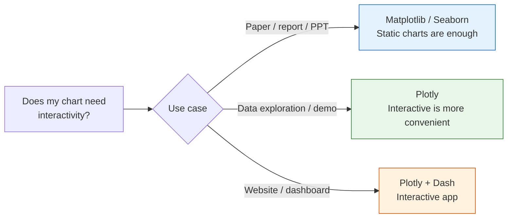

# 3.4.4 Interactive Visualization

:::info Section overview
Many beginners, when they first see `Plotly`, tend to think:

- The charts look cooler
- You can move the mouse around

But the really important question is:

> **When do you actually need interactivity, and when is a static chart enough?**

So the most important thing in this section is not “making flashy charts,” but learning to decide:

- Which scenarios are worth using interactive charts for
- Which scenarios are clearer with static charts
:::

:::info Optional content
This section is optional. If you are short on time, you can skip it for now and come back later when you need it. But we recommend at least skimming it once to understand what interactive charts can do.
:::

## Learning Objectives

- Understand the difference between static charts and interactive charts
- Learn to use Plotly Express for quick charting
- Understand the concept of interactive dashboards

---

## First, build a mental map

`Plotly` is best understood through the question: “When do I want users to explore the chart themselves?”


So what this section really tries to answer is:

- What extra capability do interactive charts provide beyond static charts?
- When are they a plus, and when do they feel unnecessary?

---

## Why do we need interactive charts?

| Comparison | Static charts (Matplotlib/Seaborn) | Interactive charts (Plotly) |
|------|--------------------------|-----------------|
| Mouse hover | Not supported | Shows detailed data |
| Zoom and drag | Not supported | Freely zoom and pan |
| Data filtering | Not supported | Click legends to hide/show |
| Export | Save as image | Image + HTML page |
| Use cases | Papers, reports | Data exploration, web display |



### A better analogy for beginners

You can think of `Plotly` as:

- A chart you can hold in your hands and inspect, zoom into, and filter yourself

A static chart is more like:

- A printed poster

An interactive chart is more like:

- A digital map with zoom and filter buttons

So it is best for:

- Readers who want to keep exploring

Not for forcing interactivity into every single scenario.

---

## Installation and imports

```python
# Install
# python -m pip install --upgrade plotly

# Plotly Express: quick charting (recommended)
import plotly.express as px

# Plotly Graph Objects: lower-level control
import plotly.graph_objects as go

import pandas as pd
import numpy as np
```

---

## Quick start with Plotly Express

Plotly Express is Plotly’s high-level interface. You can create beautiful interactive charts with just **one line of code**.

### The safest learning order for Plotly beginners

A good order is usually:

1. Start with `px.scatter()`, `px.line()`, and `px.bar()` to get familiar with basic interactions
2. Then look at heatmaps, 3D charts, and animated charts
3. Finally, study dashboards and web display

This is much less confusing than jumping straight into Dash at the beginning.

### Scatter plot

```python
# Use a built-in dataset
df = px.data.iris()

fig = px.scatter(df, x="sepal_width", y="sepal_length",
                 color="species",        # Color by species
                 size="petal_length",     # Control point size by petal length
                 hover_data=["petal_width"],  # Show petal width on hover
                 title="Iris Dataset - Interactive Scatter Plot")
fig.show()
```

After running this, you will see a chart that supports hovering, zooming, and dragging!

### Line chart

```python
df = px.data.gapminder()
# Filter data for China, the United States, and Japan
countries = df[df["country"].isin(["China", "United States", "Japan"])]

fig = px.line(countries, x="year", y="gdpPercap",
              color="country",
              title="Changes in GDP per Capita for China, the US, and Japan",
              labels={"gdpPercap": "GDP per Capita (USD)", "year": "Year", "country": "Country"})
fig.show()
```

### Bar chart

```python
df = px.data.tips()

fig = px.bar(df, x="day", y="total_bill", color="sex",
             barmode="group",          # "group" for grouped, "stack" for stacked
             title="Daily Spending (Grouped by Sex)",
             labels={"total_bill": "Bill Amount", "day": "Day", "sex": "Sex"})
fig.show()
```

### Histogram

```python
df = px.data.tips()

fig = px.histogram(df, x="total_bill", color="time",
                   nbins=20,
                   marginal="box",    # Marginal plot: "box", "violin", "rug"
                   title="Distribution of Bill Amounts (with Marginal Box Plot)")
fig.show()
```

### Box plot

```python
df = px.data.tips()

fig = px.box(df, x="day", y="total_bill", color="smoker",
             notched=True,             # Notched box plot
             title="Distribution of Daily Spending (by Smoking Status)")
fig.show()
```

### Pie / donut chart

```python
# Pie chart
fig = px.pie(df, names="day", values="total_bill",
             title="Proportion of Spending by Day",
             hole=0.3)  # hole > 0 turns it into a donut chart
fig.show()
```

---

## Advanced charts

### Heatmap

```python
# Compute correlation coefficients
df = px.data.iris()
numeric_cols = df.select_dtypes(include="number")
corr = numeric_cols.corr()

fig = px.imshow(corr, text_auto=".2f",
                color_continuous_scale="RdBu_r",
                title="Correlation Heatmap of Iris Features")
fig.show()
```

### 3D scatter plot

```python
df = px.data.iris()

fig = px.scatter_3d(df, x="sepal_length", y="sepal_width", z="petal_length",
                    color="species",
                    title="Iris 3D Scatter Plot (rotatable!)")
fig.show()
```

You can drag the mouse to rotate this 3D chart and view the data from different angles.

### Animated chart

```python
df = px.data.gapminder()

fig = px.scatter(df, x="gdpPercap", y="lifeExp",
                 size="pop", color="continent",
                 hover_name="country",
                 animation_frame="year",      # Play animation by year
                 animation_group="country",
                 log_x=True,
                 range_x=[100, 100000],
                 range_y=[25, 90],
                 title="Development Trajectories by Country (1952-2007)")
fig.show()
```

Click the play button to see how each country changes over time. This is the famous **Hans Rosling bubble chart**.

---

## Chart customization

### Update layout

```python
fig = px.scatter(px.data.iris(), x="sepal_width", y="sepal_length",
                 color="species")

fig.update_layout(
    title=dict(text="Custom Title", font=dict(size=20)),
    xaxis_title="Sepal Width (cm)",
    yaxis_title="Sepal Length (cm)",
    template="plotly_white",      # Theme template
    width=800,
    height=500,
    legend_title="Species"
)

fig.show()
```

### Common templates

| Template name | Style |
|--------|------|
| `"plotly"` | Default blue background |
| `"plotly_white"` | White background (recommended) |
| `"plotly_dark"` | Dark background |
| `"ggplot2"` | R ggplot style |
| `"simple_white"` | Minimal white background |

### A simple decision table worth remembering first

| Your goal | Safer first choice |
|---|---|
| Make charts for a paper or report | Prefer static charts |
| Explore data details yourself | Plotly is a good fit |
| Build a web demo for others | Plotly is a good fit |
| Just want it to “look cooler” | Pause and think whether it is really necessary |

This table is especially useful for beginners because it brings “interactive charts are cool” back to a question of use case.

### Saving charts

```python
# Save as interactive HTML
fig.write_html("my_chart.html")

# Save as a static image (requires kaleido)
# python -m pip install --upgrade kaleido
fig.write_image("my_chart.png", scale=2)
fig.write_image("my_chart.svg")
```

---

## Plotly vs Matplotlib vs Seaborn

| Feature | Matplotlib | Seaborn | Plotly |
|------|-----------|---------|--------|
| Interactivity | No | No | Strong |
| Visual appeal | Moderate | Good | Good |
| Learning curve | Medium | Low | Low |
| Customization | Very strong | Medium | Strong |
| Output formats | Image/PDF | Image/PDF | HTML/Image |
| Best for | Papers / fine control | Fast statistical charts | Data exploration / presentation |

---

## Introduction to interactive dashboards

In real-world work, you may need to combine multiple interactive charts into a single **dashboard**.

Common tools:

| Tool | Features |
|------|------|
| **Plotly Dash** | Built with Python code, very powerful |
| **Streamlit** | Easiest to use; you can build an app with just a few lines of code |
| **Gradio** | Designed for AI model demos |
| **Panel** | Good integration with the Jupyter ecosystem |

A simple Dash example (just for awareness):

```python
# python -m pip install --upgrade dash
from dash import Dash, html, dcc
import plotly.express as px

app = Dash(__name__)

df = px.data.gapminder().query("year == 2007")
fig = px.scatter(df, x="gdpPercap", y="lifeExp", size="pop",
                 color="continent", hover_name="country", log_x=True)

app.layout = html.Div([
    html.H1("World Development Indicators Dashboard"),
    dcc.Graph(figure=fig)
])

# Run: python app.py, then open http://127.0.0.1:8050
# app.run(debug=True)
```

:::tip Follow-up courses
Detailed dashboard development is outside the scope of this stage. There will be hands-on exercises in the project stage later.
:::

---

## Summary

| Plotly Express function | Chart type |
|---------------------|---------|
| `px.scatter()` | Scatter plot |
| `px.line()` | Line chart |
| `px.bar()` | Bar chart |
| `px.histogram()` | Histogram |
| `px.box()` | Box plot |
| `px.pie()` | Pie chart |
| `px.imshow()` | Heatmap |
| `px.scatter_3d()` | 3D scatter plot |

The core advantage of Plotly is **interactivity**—hover to inspect data, zoom to look at details, and use animation to show changes over time. It is very useful for data exploration and presenting results.

## What should you take away from this section?

- The core value of `Plotly` is not being flashy, but letting readers continue exploring the data
- Interactive charts are best for data exploration, web display, and presentations
- When learning for the first time, mastering `px.scatter / px.line / px.bar` is enough

---

## Hands-on exercises

### Exercise 1: Interactive exploration

```python
# Load the gapminder dataset
# 1. Use px.scatter to plot the relationship between gdpPercap and lifeExp for each country in 2007
#    - Use pop for point size, continent for color
#    - Show country on hover
# 2. Use px.line to plot China's lifeExp changes from 1952 to 2007
```

### Exercise 2: Data distribution

```python
# Load the tips dataset
# 1. Use px.histogram to plot the distribution of bill amounts, and add a marginal plot with marginal="violin"
# 2. Use px.box to compare bill amounts by day
```

### Exercise 3: Animated chart

```python
# Use the gapminder dataset to create an animated scatter plot
# Show changes in gdpPercap vs lifeExp across countries from 1952 to 2007
# Use animation_frame="year"
```
