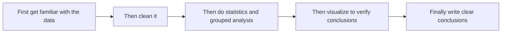
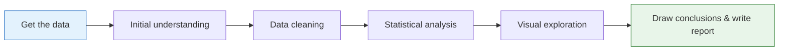
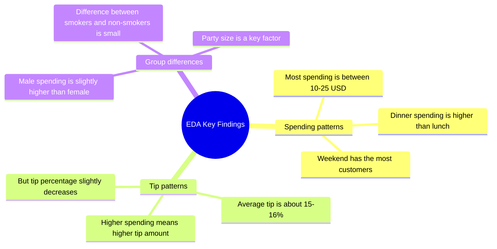

# 3.6.1 Hands-on Project: Exploratory Data Analysis (EDA)


:::tip Project focus
This is a **comprehensive hands-on project** for Data Analysis and Visualization. You will use the NumPy, Pandas, and Matplotlib/Seaborn knowledge you learned earlier to perform a complete exploratory data analysis on a real dataset.
:::

## First, build a map

When doing an EDA project for the first time, the safest sequence is not “draw all the charts first,” but to first understand:



So what this project really trains is:

- not whether you can make a few charts
- but whether you can turn “look at the data -> reach conclusions” into a complete chain

## Project overview

**Exploratory Data Analysis (EDA)** is the first step in a data science project — before modeling, use statistics and visualization to “get to know” the data.



### A beginner-friendly overall analogy

You can think of EDA as:

- a site survey before actually building a model

You wouldn’t start working before you’ve clearly seen the terrain.
Likewise, in a data project, you shouldn’t rush into modeling before you’ve understood:

- the distribution
- missing values
- outliers
- relationships between variables

### Skills you will practice

| Skill | Corresponding chapter |
|------|---------|
| Pandas data loading and cleaning | Chapter 3 |
| Statistical summaries and grouped aggregation | Chapter 3 |
| Matplotlib / Seaborn visualization | Chapter 4 |
| NumPy numerical computation | Chapter 2 |

### Project deliverable

After finishing, you will have a **complete EDA report** (a Jupyter Notebook) that includes a data overview, cleaning process, statistical findings, and visual charts.

---

## Project setup

### Dataset selection

We will use Seaborn’s built-in **`tips` dataset** — a record of tips from a U.S. restaurant.

| Field | Meaning | Type |
|------|------|------|
| `total_bill` | Total bill amount (USD) | Continuous |
| `tip` | Tip amount (USD) | Continuous |
| `sex` | Customer gender | Categorical |
| `smoker` | Smoker or not | Categorical |
| `day` | Day of the week | Categorical |
| `time` | Lunch/Dinner | Categorical |
| `size` | Party size | Discrete |

:::info Why choose this dataset?
- Built in, **no download required**, can be loaded with one line of code
- Rich variable types (continuous + categorical)
- Moderate size (244 rows), great for learning
- Easy-to-understand business context — everyone has been to a restaurant
:::

### Environment setup

```python
# Import all required libraries
import numpy as np
import pandas as pd
import matplotlib.pyplot as plt
import seaborn as sns

# Configure Chinese font display (macOS)
plt.rcParams['font.sans-serif'] = ['Arial Unicode MS']
# Windows users can use: plt.rcParams['font.sans-serif'] = ['SimHei']
plt.rcParams['axes.unicode_minus'] = False

# Set Seaborn theme
sns.set_theme(style="whitegrid", font_scale=1.1)

# Show plots inline in Jupyter
# %matplotlib inline
```

### Load the data

```python
# Load the built-in dataset
tips = sns.load_dataset("tips")

# First look: see what the data looks like
print(f"Dataset size: {tips.shape[0]} rows × {tips.shape[1]} columns")
tips.head(10)
```

Example output:

| | total_bill | tip | sex | smoker | day | time | size |
|---|-----------|-----|-----|--------|-----|------|------|
| 0 | 16.99 | 1.01 | Female | No | Sun | Dinner | 2 |
| 1 | 10.34 | 1.66 | Male | No | Sun | Dinner | 3 |
| 2 | 21.01 | 3.50 | Male | No | Sun | Dinner | 3 |
| 3 | 23.68 | 3.31 | Male | No | Sun | Dinner | 2 |
| 4 | 24.59 | 3.61 | Female | No | Sun | Dinner | 4 |

---

## Data overview — start with “getting familiar”

The first step in EDA is not to rush into charts, but to first understand: How big is the dataset? What type is each column? Are there missing values?

### What should you ask first when looking at data?

The 4 most important questions are:

1. How large is the table?
2. What type is each column?
3. Are there any missing values?
4. What does the target analysis field look like?

If you can answer these 4 questions clearly first, many later analysis steps will go much more smoothly.

### Basic information

```python
# Data types and non-null counts
tips.info()
```

The output tells you:
- 7 columns, 244 rows
- No missing values (all Non-Null Count values are 244)
- `total_bill` and `tip` are float64
- `sex`, `smoker`, `day`, and `time` are category

```python
# Statistical summary
tips.describe()
```

| | total_bill | tip | size |
|---|-----------|-----|------|
| count | 244.0 | 244.0 | 244.0 |
| mean | 19.79 | 3.00 | 2.57 |
| std | 8.90 | 1.38 | 0.95 |
| min | 3.07 | 1.00 | 1.00 |
| 25% | 13.35 | 2.00 | 2.00 |
| 50% | 17.80 | 2.90 | 2.00 |
| 75% | 24.13 | 3.56 | 3.00 |
| max | 50.81 | 10.00 | 6.00 |

**Findings**:
- Average bill is about 19.79 USD, and average tip is about 3.00 USD
- Tips range from 1 USD to 10 USD
- Most parties have 2 people

### Distribution of categorical variables

```python
# Count each value for categorical variables
for col in ['sex', 'smoker', 'day', 'time']:
    print(f"\n--- {col} ---")
    print(tips[col].value_counts())
```

**Findings**:
- There are more male customers than female customers (157 vs 87)
- There are more non-smokers than smokers (151 vs 93)
- Saturday and Sunday have the most records
- Dinner data is far more common than lunch data (176 vs 68)

### Create derived features

Good analysts **create new features** to help discover patterns:

```python
# Tip percentage = tip / total bill
tips['tip_pct'] = (tips['tip'] / tips['total_bill'] * 100).round(2)

# Per-person spending
tips['per_person'] = (tips['total_bill'] / tips['size']).round(2)

tips[['total_bill', 'tip', 'tip_pct', 'per_person']].head()
```

| | total_bill | tip | tip_pct | per_person |
|---|-----------|-----|---------|-----------|
| 0 | 16.99 | 1.01 | 5.94 | 8.50 |
| 1 | 10.34 | 1.66 | 16.05 | 3.45 |
| 2 | 21.01 | 3.50 | 16.66 | 7.00 |
| 3 | 23.68 | 3.31 | 13.97 | 11.84 |
| 4 | 24.59 | 3.61 | 14.68 | 6.15 |

---

## Data cleaning — check data quality

This dataset is quite clean, but in real projects this step usually takes the most time. We will still go through the full process:

### Missing value check

```python
# Missing value statistics
missing = tips.isnull().sum()
print("Missing value statistics:")
print(missing[missing > 0] if missing.sum() > 0 else "No missing values ✓")
```

### Duplicate value check

```python
# Completely duplicated rows
dup_count = tips.duplicated().sum()
print(f"Duplicate rows: {dup_count}")

if dup_count > 0:
    tips = tips.drop_duplicates()
    print(f"Duplicates removed, {len(tips)} rows remaining")
```

### Outlier detection

Use the IQR (interquartile range) method to detect outliers:

```python
def detect_outliers_iqr(df, column):
    """Detect outliers using the IQR method"""
    Q1 = df[column].quantile(0.25)
    Q3 = df[column].quantile(0.75)
    IQR = Q3 - Q1
    lower = Q1 - 1.5 * IQR
    upper = Q3 + 1.5 * IQR

    outliers = df[(df[column] < lower) | (df[column] > upper)]
    return outliers, lower, upper

# Check outliers in each numeric column
for col in ['total_bill', 'tip', 'tip_pct']:
    outliers, lower, upper = detect_outliers_iqr(tips, col)
    print(f"\n{col}: normal range [{lower:.2f}, {upper:.2f}], {len(outliers)} outliers")
    if len(outliers) > 0:
        print(f"  Outlier examples: {outliers[col].values[:5]}")
```

:::tip Outlier handling strategy
In the EDA stage, we usually **do not rush to delete outliers**. Instead, we first mark them and understand them:
- Outliers may be data entry errors → should be corrected
- Outliers may be real extreme cases → keep them, but pay attention during analysis
- Too many outliers → may indicate data quality problems
:::

---

## Statistical analysis — let the numbers speak

### Core statistical metrics

```python
# Tip statistics grouped by gender
tips.groupby('sex')[['total_bill', 'tip', 'tip_pct']].agg(['mean', 'median', 'std'])
```

```python
# Group by day
day_stats = tips.groupby('day')[['total_bill', 'tip']].agg(['mean', 'count'])
print(day_stats)
```

### Cross analysis

```python
# Pivot table: average tip percentage by gender and smoker status
pivot = tips.pivot_table(
    values='tip_pct',
    index='sex',
    columns='smoker',
    aggfunc='mean'
).round(2)

print("Tip percentage (%):")
print(pivot)
```

Example output:

| smoker | No | Yes |
|--------|-----|------|
| Female | 15.69 | 18.22 |
| Male | 16.07 | 15.28 |

**Finding**: Female smokers have the highest tip percentage, while male smokers have the lowest.

### Correlation analysis

```python
# Correlation coefficients for numeric columns
numeric_cols = ['total_bill', 'tip', 'size', 'tip_pct', 'per_person']
corr_matrix = tips[numeric_cols].corr().round(3)
print(corr_matrix)
```

**Key findings**:
- `total_bill` and `tip` are positively correlated (about 0.68) → the more you spend, the more tip you leave
- `total_bill` and `tip_pct` are negatively correlated (about -0.09) → as spending increases, the tip **percentage** slightly decreases
- `size` and `total_bill` are positively correlated (about 0.60) → the larger the party, the higher the spending

### A beginner-friendly analysis order to remember

When doing EDA, a safer order is usually:

1. First look at single-variable distributions
2. Then look at counts of categorical variables
3. Then look at relationships between two variables
4. Finally do combined analysis and multi-dimensional comparisons

This is often easier to follow than jumping directly into complex facet plots at the beginning.

---

## Visual exploration — let the data speak

### Numeric distributions

```python
fig, axes = plt.subplots(1, 3, figsize=(15, 4))

# Total bill distribution
axes[0].hist(tips['total_bill'], bins=20, color='steelblue', edgecolor='white')
axes[0].set_title('Total Bill Distribution')
axes[0].set_xlabel('Amount (USD)')
axes[0].set_ylabel('Frequency')

# Tip distribution
axes[1].hist(tips['tip'], bins=20, color='coral', edgecolor='white')
axes[1].set_title('Tip Distribution')
axes[1].set_xlabel('Amount (USD)')

# Tip percentage distribution
axes[2].hist(tips['tip_pct'], bins=20, color='mediumseagreen', edgecolor='white')
axes[2].set_title('Tip Percentage (%) Distribution')
axes[2].set_xlabel('Percentage')

plt.tight_layout()
plt.savefig('01_distribution.png', dpi=150, bbox_inches='tight')
plt.show()
```

**Interpretation**: Total bill and tip both have right-skewed distributions — most people spend between 10 and 25 USD, and most tips are between 2 and 4 USD.

### Visualization of categorical variables

```python
fig, axes = plt.subplots(2, 2, figsize=(12, 10))

# Count by day
sns.countplot(data=tips, x='day', order=['Thur', 'Fri', 'Sat', 'Sun'],
              palette='Blues_d', ax=axes[0, 0])
axes[0, 0].set_title('Customer Count by Day')

# By time of day
sns.countplot(data=tips, x='time', palette='Set2', ax=axes[0, 1])
axes[0, 1].set_title('Lunch vs Dinner')

# By gender
sns.countplot(data=tips, x='sex', palette='Pastel1', ax=axes[1, 0])
axes[1, 0].set_title('Customer Gender Distribution')

# By smoking status
sns.countplot(data=tips, x='smoker', palette='Pastel2', ax=axes[1, 1])
axes[1, 1].set_title('Smoker vs Non-smoker')

plt.tight_layout()
plt.savefig('02_categorical.png', dpi=150, bbox_inches='tight')
plt.show()
```

### Exploring key relationships

### Relationship between bill and tip

```python
fig, axes = plt.subplots(1, 2, figsize=(14, 5))

# Scatter plot: bill vs tip
sns.scatterplot(data=tips, x='total_bill', y='tip', hue='time',
                style='smoker', s=80, alpha=0.7, ax=axes[0])
axes[0].set_title('Total Bill vs Tip')
axes[0].set_xlabel('Total Bill (USD)')
axes[0].set_ylabel('Tip (USD)')

# Regression line
sns.regplot(data=tips, x='total_bill', y='tip',
            scatter_kws={'alpha': 0.5}, line_kws={'color': 'red'},
            ax=axes[1])
axes[1].set_title('Total Bill vs Tip (with trend line)')
axes[1].set_xlabel('Total Bill (USD)')
axes[1].set_ylabel('Tip (USD)')

plt.tight_layout()
plt.savefig('03_bill_vs_tip.png', dpi=150, bbox_inches='tight')
plt.show()
```

**Interpretation**: As the bill amount increases, the tip also increases, showing a clear linear trend. You can also see some “outliers” — for example, someone spent more than 40 USD but only left a 1.5 USD tip.

### Comparing tips across different scenarios

```python
fig, axes = plt.subplots(1, 3, figsize=(16, 5))

# Compare tip by day
sns.boxplot(data=tips, x='day', y='tip',
            order=['Thur', 'Fri', 'Sat', 'Sun'],
            palette='coolwarm', ax=axes[0])
axes[0].set_title('Tip Distribution by Day')

# Compare by time of day
sns.violinplot(data=tips, x='time', y='tip',
               palette='Set2', ax=axes[1])
axes[1].set_title('Tip Distribution: Lunch vs Dinner')

# Compare by party size
sns.boxplot(data=tips, x='size', y='tip',
            palette='YlOrRd', ax=axes[2])
axes[2].set_title('Tip by Party Size')

plt.tight_layout()
plt.savefig('04_tip_comparison.png', dpi=150, bbox_inches='tight')
plt.show()
```

**Interpretation**:
- Sunday has the highest median tip
- Dinner tips are overall higher than lunch tips (because dinner spending is higher)
- Larger parties give higher tips

### Correlation heatmap

```python
plt.figure(figsize=(8, 6))

# Draw heatmap
sns.heatmap(
    corr_matrix,
    annot=True,           # show values
    fmt='.2f',            # keep two decimal places
    cmap='RdBu_r',        # red-blue palette
    center=0,             # center at 0
    square=True,          # square cells
    linewidths=0.5        # grid line width
)
plt.title('Correlation Matrix of Numeric Variables')
plt.tight_layout()
plt.savefig('05_correlation.png', dpi=150, bbox_inches='tight')
plt.show()
```

### Combined multi-dimensional analysis

```python
# FacetGrid: look at the bill-tip relationship by gender and smoking status
g = sns.FacetGrid(tips, col='sex', row='smoker',
                  height=4, aspect=1.2, margin_titles=True)
g.map_dataframe(sns.scatterplot, x='total_bill', y='tip',
                hue='time', alpha=0.7)
g.add_legend()
g.set_axis_labels('Total Bill (USD)', 'Tip (USD)')
g.fig.suptitle('Faceted by Gender × Smoking Status', y=1.02, fontsize=14)
plt.savefig('06_facet.png', dpi=150, bbox_inches='tight')
plt.show()
```

---

## Analysis conclusions

After a complete EDA, we can draw the following conclusions:

### Key findings



### Specific conclusions

1. **Bill and tip are positively correlated**: the higher the total bill, the higher the tip amount (correlation coefficient 0.68), but the tip percentage decreases slightly
2. **Dinner spending is higher than lunch**: both average spending and average tip are significantly higher at dinner
3. **Weekends are peak periods**: Saturday and Sunday have the most customers and the highest spending
4. **Party size matters a lot**: the larger the party, the higher the total bill (correlation coefficient 0.60)
5. **Gender differences are small**: men and women do not differ much in tip percentage (about 1 percentage point)
6. **Smoking status has limited impact**: whether someone smokes does not significantly affect tip percentage

### Recommendations for the restaurant

- **Weekend dinner** is the key revenue period, so service quality should be ensured
- Encourage larger parties to dine in (more people usually means more spending and more tips)
- Consider lunch set meals to increase midday traffic

### A beginner-friendly way to write conclusions

Good EDA conclusions are usually not:

- I drew a lot of charts

Instead, they should answer:

1. What did I find?
2. Which charts and statistics support this?
3. What does this mean for the business?

This order is especially important because it turns your Notebook from “many charts” into “a report with real insights.”

---

## Code integration — complete analysis script

Combine the above analysis into a clear, structured script:

```python
"""
Tips dataset - Exploratory Data Analysis (EDA)
==============================================
Analysis goal: Understand the factors that influence restaurant spending and tipping
"""

# ========== 1. Imports and configuration ==========
import numpy as np
import pandas as pd
import matplotlib.pyplot as plt
import seaborn as sns

plt.rcParams['font.sans-serif'] = ['Arial Unicode MS']
plt.rcParams['axes.unicode_minus'] = False
sns.set_theme(style="whitegrid", font_scale=1.1)


# ========== 2. Load data ==========
tips = sns.load_dataset("tips")
print(f"Dataset: {tips.shape[0]} rows × {tips.shape[1]} columns\n")


# ========== 3. Data overview ==========
print("=== Basic information ===")
tips.info()
print("\n=== Statistical summary ===")
print(tips.describe().round(2))


# ========== 4. Feature engineering ==========
tips['tip_pct'] = (tips['tip'] / tips['total_bill'] * 100).round(2)
tips['per_person'] = (tips['total_bill'] / tips['size']).round(2)


# ========== 5. Data quality check ==========
print(f"\nMissing values: {tips.isnull().sum().sum()}")
print(f"Duplicate rows: {tips.duplicated().sum()}")


# ========== 6. Statistical analysis ==========
print("\n=== Grouped by gender ===")
print(tips.groupby('sex')[['total_bill', 'tip', 'tip_pct']].mean().round(2))

print("\n=== Grouped by day ===")
print(tips.groupby('day')[['total_bill', 'tip']].agg(['mean', 'count']).round(2))

print("\n=== Correlation matrix ===")
print(tips[['total_bill', 'tip', 'size', 'tip_pct']].corr().round(3))


# ========== 7. Visualization ==========
# See the visualization code in Section 5 above
# Running each part step by step in Jupyter Notebook works best

print("\nAnalysis complete!")
```

---

## Advanced challenges

After completing the basic EDA, try these challenges:

### Challenge 1: Use a different dataset

Do EDA with Seaborn’s built-in **`diamonds`** dataset:

```python
diamonds = sns.load_dataset("diamonds")
print(diamonds.shape)       # 53940 rows × 10 columns
print(diamonds.head())
```

Analysis directions:
- Which factors affect diamond price?
- How do cut, color, and clarity affect price?
- Is carat and price a linear relationship?

### Challenge 2: Automate the EDA report

Try using code to automatically generate a simple report:

```python
def quick_eda(df, title="EDA Report"):
    """Quickly generate an EDA report"""
    print(f"{'='*50}")
    print(f"  {title}")
    print(f"{'='*50}")

    # Basic information
    print(f"\n📊 Dataset size: {df.shape[0]} rows × {df.shape[1]} columns")

    # Data type statistics
    print(f"\n📋 Data types:")
    print(df.dtypes.value_counts().to_string())

    # Missing values
    missing = df.isnull().sum()
    if missing.sum() > 0:
        print(f"\n⚠️ Missing values:")
        print(missing[missing > 0].to_string())
    else:
        print(f"\n✅ No missing values")

    # Numeric column statistics
    num_cols = df.select_dtypes(include=[np.number]).columns
    if len(num_cols) > 0:
        print(f"\n📈 Numeric column statistics:")
        print(df[num_cols].describe().round(2).to_string())

    # Categorical column statistics
    cat_cols = df.select_dtypes(include=['object', 'category']).columns
    for col in cat_cols:
        print(f"\n🏷️ Distribution of {col}:")
        print(df[col].value_counts().head(5).to_string())

    return None

# Use it
quick_eda(tips, "Tips Dataset EDA")
```

### Challenge 3: Make an interactive version with Plotly

If you learned Plotly in Chapter 4, try replacing static charts with interactive ones:

```python
import plotly.express as px

# Interactive scatter plot
fig = px.scatter(
    tips, x='total_bill', y='tip',
    color='time', size='size',
    hover_data=['sex', 'smoker', 'day'],
    title='Total Bill vs Tip (Interactive)'
)
fig.show()
```

---

## EDA checklist

After finishing the project, check the following:

| Check item | Completed |
|--------|---------|
| Load the data and view the first few rows | ☐ |
| Check `info()` and `describe()` | ☐ |
| Check missing values and duplicate values | ☐ |
| Detect outliers | ☐ |
| Create meaningful derived features | ☐ |
| Plot distributions of numeric variables | ☐ |
| Plot count charts for categorical variables | ☐ |
| Explore relationships between variables (scatter plots, box plots) | ☐ |
| Plot a correlation heatmap | ☐ |
| Multi-dimensional cross analysis (facet plots, pivot tables) | ☐ |
| Write 3–5 valuable findings | ☐ |
| Provide data-driven recommendations | ☐ |

## A ready-to-use EDA checklist for beginners

When doing an EDA project for the first time, the safest checklist is usually:

1. Is the data overview clear?
2. Have missing values and outliers been explained?
3. Have single-variable, two-variable, and grouped analyses each been done at least once?
4. Does each key chart have a clear conclusion?
5. Have the findings been translated into business recommendations?

If you can do these 5 things well, this project is no longer just a “plotting exercise,” but a real analysis report.

:::tip Next step after finishing
After you get the EDA conclusions, the next step is usually **modeling and prediction** — for example, using tip percentage as the target variable and predicting it from other features. That is the machine learning content you will learn in the third and fourth stages.
:::

---

:::note Project recap
This project guided you through a complete EDA workflow: load data → overview → clean → analyze → visualize → conclude. This workflow is the first step in almost all data science projects. Once you master it, you will find that you no longer “don’t know where to start” when facing any dataset.
:::


<details>
<summary>Reference answers and explanation</summary>

- There is no single numeric answer for an EDA project. A strong submission includes raw data location, data dictionary, cleaning log, summary statistics, at least three question-driven visuals, conclusions, and limitations.
- Every visual should answer a named question and point back to the cleaned dataset. If a chart cannot be tied to a question, remove it or rewrite the question.
- The final README should let another person reproduce the analysis and understand which decisions were judgment calls.

</details>


## Version roadmap suggestions

| Version | Goal | Delivery focus |
|---|---|---|
| Basic version | Get the minimal loop working | Can input, process, and output, while keeping one set of examples |
| Standard version | Build a presentable project | Add configuration, logs, error handling, README, and screenshots |
| Challenge version | Get close to portfolio quality | Add evaluation, comparison experiments, failure sample analysis, and next-step roadmap |

It is recommended to complete the basic version first; don’t aim for everything at once at the beginning. Each time you improve a version, write into the README “what new capability was added, how it was validated, and what problems remain.”

## Evidence to Keep

Keep this page's proof of learning as a small evidence card:

```text
analysis_goal: business/data question and success criterion
data_evidence: source, cleaning notes, features, and chart/table outputs
result: insight, metric, dashboard, or report section
failure_check: dirty data, biased sample, wrong aggregation, or unreproducible notebook
Expected_output: reproducible analysis folder with data, charts, and a short report
```
