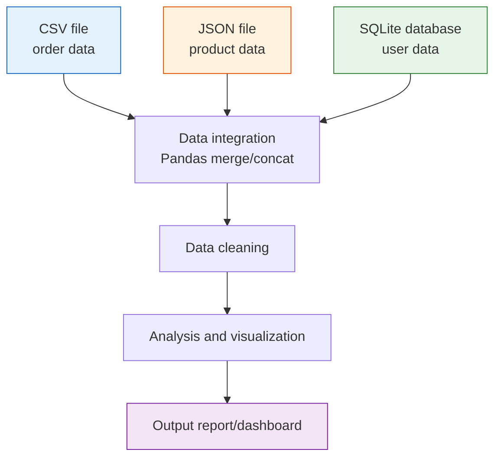
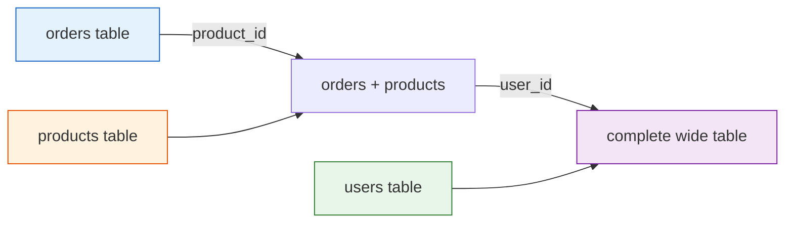
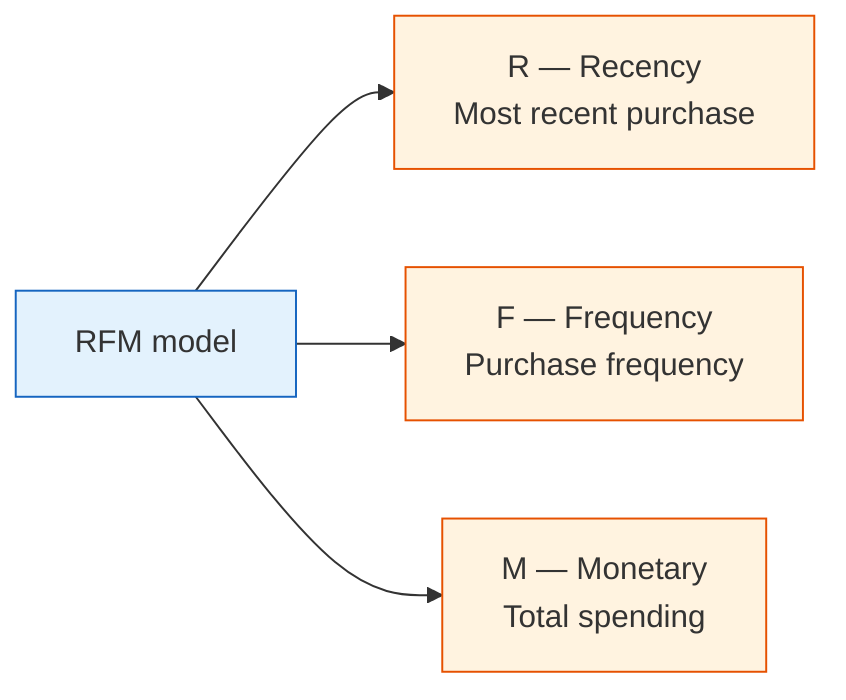
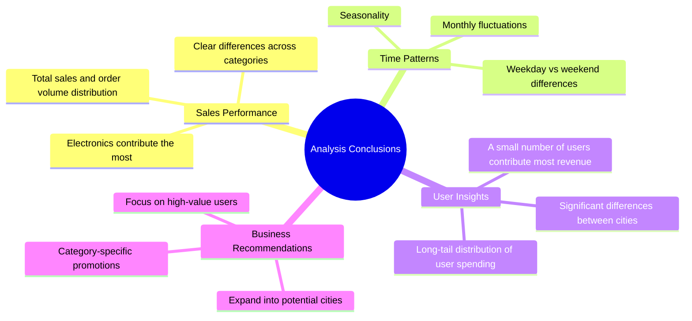

# 3.6.2 Hands-on Project: Multi-Source Data Integration Analysis


:::tip Project Positioning
This is the **capstone project** for 3 Data Analysis and Visualization. Compared with Project 1 (single-dataset EDA), this project adds **multi-source data integration** and **time-dimension analysis**, which is closer to real-world data analysis work.
:::

## First, Build a Map

For beginners, the most suitable way to understand this project is not “start merging first,” but to first clearly see:


So what this section really wants you to practice is:

- How multi-source data enters the same analysis table
- When to check keys first, and when to start analyzing


## Project Overview

In real work, data is almost never neatly placed in one CSV file. You need to fetch data from multiple sources such as CSV, JSON, and databases, then clean and integrate it before analysis.



### A Better Beginner-Friendly Big Picture Analogy

You can think of this project as:

- Combining tables from different departments into one master table that can actually be used for reporting

In other words, the real challenge in this project is not:

- Whether you can make charts

But rather:

- Whether the data can be aligned smoothly first
- Whether the tables can be connected correctly

### Project Scenario

You are a data analyst for an **online retail company**. The company’s data is spread across different systems:

| Data source | Format | Content |
|---------|------|------|
| Sales system export | CSV | Order records (order ID, user ID, product ID, quantity, date) |
| Product management system API | JSON | Product information (product ID, name, category, price) |
| User system database | SQLite | User information (user ID, name, city, registration date) |

Your task: integrate these data, analyze sales performance, and produce a valuable analysis report.

### Acronyms and Terms to Understand First

| Term | Full name | Beginner-friendly meaning |
|---|---|---|
| `CSV` | Comma-Separated Values | A plain-text table format, often exported from business systems |
| `JSON` | JavaScript Object Notation | A structured text format commonly returned by APIs |
| `API` | Application Programming Interface | A doorway for one system to provide data or capabilities to another system |
| `ID` | Identifier | A stable value used to recognize one user, product, order, or record |
| `PK` | Primary Key | The unique ID of a row in its own table |
| `FK` | Foreign Key | An ID that points to a row in another table |
| `RFM` | Recency, Frequency, Monetary | A classic user segmentation method based on recent purchase, purchase frequency, and total spending |

In this project, the most important engineering habit is to check `ID / PK / FK` before merging. Many analysis errors are not caused by charts or statistics, but by joining the wrong rows together.

### Knowledge Areas Involved

| Skill | Corresponding chapter |
|------|---------|
| CSV/JSON read and write | Chapter 3, Section 3.2 |
| Pandas merge | Chapter 3, Section 3.7 |
| Grouping, aggregation, and pivot tables | Chapter 3, Section 3.6 |
| Time series processing | Chapter 3, Section 3.8 |
| Matplotlib/Seaborn visualization | Chapter 4 |
| SQLite database operations | Chapter 5 |

---

## Prepare Mock Data

In real projects, data is already available. But for learning, we’ll first generate mock data with Python.

### Generate Order Data (CSV)

```python
import numpy as np
import pandas as pd
import json
import sqlite3
from datetime import datetime, timedelta

rng = np.random.default_rng(seed=42)

# ---------- Order data ----------
n_orders = 2000
order_dates = pd.date_range('2024-01-01', '2024-12-31', freq='h')
order_dates = rng.choice(order_dates, n_orders)

orders = pd.DataFrame({
    'order_id': range(1, n_orders + 1),
    'user_id': rng.integers(1, 201, n_orders),       # 200 users
    'product_id': rng.integers(1, 51, n_orders),      # 50 products
    'quantity': rng.choice([1, 1, 1, 2, 2, 3], n_orders),
    'order_date': order_dates
})

# Save as CSV
orders.to_csv('orders.csv', index=False)
print(f"Order data: {orders.shape}")
orders.head()
```

### Generate Product Data (JSON)

```python
# ---------- Product data ----------
categories = ['Electronics', 'Clothing', 'Food', 'Home', 'Books']
products = []

for i in range(1, 51):
    cat = rng.choice(categories)
    # Different categories have different price ranges
    price_ranges = {
        'Electronics': (200, 5000),
        'Clothing': (50, 800),
        'Food': (10, 100),
        'Home': (30, 500),
        'Books': (20, 150),
    }
    low, high = price_ranges[cat]
    price = round(rng.uniform(low, high), 2)

    products.append({
        'product_id': i,
        'name': f'{cat}_{i:03d}',
        'category': cat,
        'price': price
    })

# Save as JSON
with open('products.json', 'w', encoding='utf-8') as f:
    json.dump(products, f, ensure_ascii=False, indent=2)

print(f"Product data: {len(products)} products")
pd.DataFrame(products).head()
```

### Generate User Data (SQLite)

```python
# ---------- User data ----------
cities = ["Beijing", "Shanghai", "Guangzhou", "Shenzhen", "Hangzhou", "Chengdu", "Wuhan", "Nanjing", "Chongqing", "Xi'an"]

users = pd.DataFrame({
    'user_id': range(1, 201),
    'name': [f'User_{i:03d}' for i in range(1, 201)],
    'city': rng.choice(cities, 200),
    'register_date': pd.date_range('2022-01-01', periods=200, freq='2D')
})

# Save to SQLite
conn = sqlite3.connect('users.db')
users.to_sql('users', conn, if_exists='replace', index=False)
conn.close()

print(f"User data: {users.shape}")
users.head()
```

:::info Data File List
After running the code above, you will get three files:
- `orders.csv` — 2000 order records
- `products.json` — 50 product records
- `users.db` — SQLite database containing 200 users
:::

---

## Read Multi-Source Data

### Read CSV

```python
import pandas as pd
import numpy as np
import matplotlib.pyplot as plt
import seaborn as sns
import json
import sqlite3

plt.rcParams['font.sans-serif'] = ['Arial Unicode MS']
plt.rcParams['axes.unicode_minus'] = False
sns.set_theme(style="whitegrid", font_scale=1.1)

# 1. Read CSV
orders = pd.read_csv('orders.csv', parse_dates=['order_date'])
print(f"Order data: {orders.shape}")
print(orders.dtypes)
orders.head()
```

### Read JSON

```python
# 2. Read JSON
with open('products.json', 'r', encoding='utf-8') as f:
    products_list = json.load(f)

products = pd.DataFrame(products_list)
print(f"\nProduct data: {products.shape}")
products.head()
```

You can also read it directly with Pandas:

```python
# One line with Pandas
products = pd.read_json('products.json')
```

### Read SQLite

```python
# 3. Read SQLite
conn = sqlite3.connect('users.db')
users = pd.read_sql_query("SELECT * FROM users", conn, parse_dates=['register_date'])
conn.close()

print(f"\nUser data: {users.shape}")
users.head()
```

### Data Overview

```python
print("=" * 50)
print("Data Source Summary")
print("=" * 50)
print(f"Order table: {orders.shape[0]} rows × {orders.shape[1]} columns")
print(f"Product table: {products.shape[0]} rows × {products.shape[1]} columns")
print(f"User table: {users.shape[0]} rows × {users.shape[1]} columns")

# Check relationship keys
print(f"\nUser ID range in orders: {orders['user_id'].min()} ~ {orders['user_id'].max()}")
print(f"Product ID range in orders: {orders['product_id'].min()} ~ {orders['product_id'].max()}")
print(f"User ID range in user table: {users['user_id'].min()} ~ {users['user_id'].max()}")
print(f"Product ID range in product table: {products['product_id'].min()} ~ {products['product_id'].max()}")
```

### What Should You Ask First in Multi-Source Analysis?

The most important questions to ask first are:

1. Which key connects these tables?
2. Are the key ranges and data types consistent?
3. Will there be a large number of unmatched records after merging?

This step is especially important because many problems that look like “analysis issues” later on
are actually caused by incorrect merging at the beginning.

## Data Integration

This is the **core step** of the project — merging three tables into one wide table.

### Integration Strategy



### Merge Operations

```python
# Step 1: orders + product information
df = orders.merge(products, on='product_id', how='left')
print(f"After merging products: {df.shape}")

# Step 2: + user information
df = df.merge(users, on='user_id', how='left')
print(f"After merging users: {df.shape}")

df.head()
```

### Compute Key Metrics

```python
# Order amount = unit price × quantity
df['amount'] = df['price'] * df['quantity']

# Extract time dimensions
df['month'] = df['order_date'].dt.month
df['weekday'] = df['order_date'].dt.day_name()
df['quarter'] = df['order_date'].dt.quarter

# View results
print(f"\nComplete dataset: {df.shape[0]} rows × {df.shape[1]} columns")
print(f"Total sales: ¥{df['amount'].sum():,.0f}")
print(f"Average order amount: ¥{df['amount'].mean():,.0f}")
df[['order_id', 'name_x', 'category', 'quantity', 'price', 'amount', 'city', 'month']].head(10)
```

:::warning Watch Out for Column Name Conflicts When Merging
`orders` and `users` may both have a `name` column. Pandas will automatically add suffixes `_x` and `_y`. It is recommended to rename columns before merging, or handle them after merging:
```python
# Rename to avoid confusion
df = df.rename(columns={'name_x': 'user_name', 'name_y': 'product_name'})
# Or select only the needed columns before merging
users_slim = users[['user_id', 'city', 'register_date']]
```
:::

### Data Quality Check

```python
# Check data completeness after merging
print("=== Data Quality Check After Merging ===")
print(f"Total rows: {len(df)}")
print(f"Missing values:")
print(df.isnull().sum()[df.isnull().sum() > 0])

# If there are missing values, some IDs do not exist in the related tables
# Check orphan records
orphan_products = set(orders['product_id']) - set(products['product_id'])
orphan_users = set(orders['user_id']) - set(users['user_id'])
print(f"\nUnmatched product IDs: {orphan_products if orphan_products else 'None'}")
print(f"Unmatched user IDs: {orphan_users if orphan_users else 'None'}")
```

### A Data Integration Checklist Beginners Can Copy Directly

When doing multi-source integration for the first time, the safest checklist is usually:

1. Is the primary key unique, and is the data type consistent?
2. Did the row count change abnormally after merging?
3. Are there a lot of orphan records that could not be matched?
4. Are there any column name conflicts or ambiguities after merging?

Check these 4 items first, and then move on to analysis. Things will usually be much more stable.

## Analysis 1: Sales Overview

### Overall Metrics

```python
print("=" * 50)
print("  2024 Sales Overview")
print("=" * 50)
print(f"  Total orders: {df['order_id'].nunique():,}")
print(f"  Total sales: ¥{df['amount'].sum():,.0f}")
print(f"  Average order value: ¥{df.groupby('order_id')['amount'].sum().mean():,.0f}")
print(f"  Active users: {df['user_id'].nunique()}")
print(f"  Number of products: {df['product_id'].nunique()}")
```

### Category Analysis

```python
# Sales and order volume by category
cat_stats = df.groupby('category').agg(
    Sales=('amount', 'sum'),
    Order_Count=('order_id', 'count'),
    Average_Price=('price', 'mean'),
    Product_Count=('product_id', 'nunique')
).round(0).sort_values('Sales', ascending=False)

print(cat_stats)
```

```python
fig, axes = plt.subplots(1, 2, figsize=(14, 5))

# Category sales share
colors = ['#2196f3', '#ff9800', '#4caf50', '#f44336', '#9c27b0']
axes[0].pie(cat_stats['Sales'], labels=cat_stats.index, autopct='%1.1f%%',
            colors=colors, startangle=90, pctdistance=0.85)
axes[0].set_title('Sales Share by Category')

# Compare order volume by category
cat_stats['Order_Count'].plot(kind='barh', ax=axes[1], color=colors)
axes[1].set_title('Order Volume by Category')
axes[1].set_xlabel('Number of Orders')

plt.tight_layout()
plt.savefig('07_category.png', dpi=150, bbox_inches='tight')
plt.show()
```

### City Analysis

```python
# Top cities by sales
city_stats = df.groupby('city').agg(
    Sales=('amount', 'sum'),
    Order_Count=('order_id', 'count'),
    User_Count=('user_id', 'nunique')
).sort_values('Sales', ascending=False)

fig, ax = plt.subplots(figsize=(10, 5))
city_stats['Sales'].plot(kind='bar', color='steelblue', ax=ax)
ax.set_title('Sales by City')
ax.set_ylabel('Sales (CNY)')
ax.set_xticklabels(ax.get_xticklabels(), rotation=45, ha='right')

# Add labels on bars
for i, v in enumerate(city_stats['Sales']):
    ax.text(i, v + v*0.01, f'¥{v:,.0f}', ha='center', va='bottom', fontsize=9)

plt.tight_layout()
plt.savefig('08_city.png', dpi=150, bbox_inches='tight')
plt.show()
```

### What Is the Most Important Thing to Learn Here?

The most important thing to learn is:

- Once multi-source integration is successful, the later analysis becomes more and more like single-table analysis

In other words, the real bottleneck in this project is often not the chart, but:

- Understanding the data before merging
- Aligning keys during merging

---

## Analysis 2: Time Trends

### Monthly Trend

```python
# Aggregate by month
monthly = df.groupby('month').agg(
    Sales=('amount', 'sum'),
    Order_Count=('order_id', 'count')
).reset_index()

fig, ax1 = plt.subplots(figsize=(12, 5))

# Dual Y-axis: sales as bars, order volume as a line
color1 = 'steelblue'
color2 = 'coral'

bars = ax1.bar(monthly['month'], monthly['Sales'], color=color1, alpha=0.7, label='Sales')
ax1.set_xlabel('Month')
ax1.set_ylabel('Sales (CNY)', color=color1)
ax1.tick_params(axis='y', labelcolor=color1)
ax1.set_xticks(range(1, 13))

ax2 = ax1.twinx()
ax2.plot(monthly['month'], monthly['Order_Count'], color=color2, marker='o', linewidth=2, label='Order Volume')
ax2.set_ylabel('Order Volume', color=color2)
ax2.tick_params(axis='y', labelcolor=color2)

ax1.set_title('Monthly Sales Trend (2024)')

# Merge legend
lines1, labels1 = ax1.get_legend_handles_labels()
lines2, labels2 = ax2.get_legend_handles_labels()
ax1.legend(lines1 + lines2, labels1 + labels2, loc='upper left')

plt.tight_layout()
plt.savefig('09_monthly.png', dpi=150, bbox_inches='tight')
plt.show()
```

### Weekly Distribution

```python
# Statistics by day of week
weekday_order = ['Monday', 'Tuesday', 'Wednesday', 'Thursday', 'Friday', 'Saturday', 'Sunday']
weekday_cn = ['Mon', 'Tue', 'Wed', 'Thu', 'Fri', 'Sat', 'Sun']

weekday_stats = df.groupby('weekday')['amount'].agg(['sum', 'count']).reindex(weekday_order)
weekday_stats.index = weekday_cn

fig, axes = plt.subplots(1, 2, figsize=(14, 5))

weekday_stats['sum'].plot(kind='bar', color='mediumseagreen', ax=axes[0])
axes[0].set_title('Sales by Day of Week')
axes[0].set_ylabel('Sales (CNY)')
axes[0].set_xticklabels(weekday_cn, rotation=0)

weekday_stats['count'].plot(kind='bar', color='salmon', ax=axes[1])
axes[1].set_title('Order Volume by Day of Week')
axes[1].set_ylabel('Number of Orders')
axes[1].set_xticklabels(weekday_cn, rotation=0)

plt.tight_layout()
plt.savefig('10_weekday.png', dpi=150, bbox_inches='tight')
plt.show()
```

### Monthly Trend by Category

```python
# Monthly sales by category
cat_monthly = df.groupby(['month', 'category'])['amount'].sum().reset_index()

plt.figure(figsize=(12, 6))
sns.lineplot(data=cat_monthly, x='month', y='amount', hue='category',
             marker='o', linewidth=2)
plt.title('Monthly Sales Trend by Category')
plt.xlabel('Month')
plt.ylabel('Sales (CNY)')
plt.xticks(range(1, 13))
plt.legend(title='Category', bbox_to_anchor=(1.02, 1), loc='upper left')
plt.tight_layout()
plt.savefig('11_cat_monthly.png', dpi=150, bbox_inches='tight')
plt.show()
```

---

## Analysis 3: User Analysis

### User Consumption Segmentation

Use a simplified version of the **RFM model** to segment users:



```python
# Compute RFM
today = pd.Timestamp('2025-01-01')  # reference date

rfm = df.groupby('user_id').agg(
    Recency=('order_date', lambda x: (today - x.max()).days),     # days since last order
    Frequency=('order_id', 'nunique'),                             # number of orders
    Monetary=('amount', 'sum')                                     # total spending
).round(0)

print(rfm.describe().round(1))
rfm.head(10)
```

### Visualize User Segments

```python
fig, axes = plt.subplots(1, 3, figsize=(16, 4))

axes[0].hist(rfm['Recency'], bins=30, color='steelblue', edgecolor='white')
axes[0].set_title('R: Days Since Most Recent Purchase')
axes[0].set_xlabel('Days')

axes[1].hist(rfm['Frequency'], bins=20, color='coral', edgecolor='white')
axes[1].set_title('F: Purchase Frequency')
axes[1].set_xlabel('Number of Orders')

axes[2].hist(rfm['Monetary'], bins=30, color='mediumseagreen', edgecolor='white')
axes[2].set_title('M: Total Spending')
axes[2].set_xlabel('Amount (CNY)')

plt.tight_layout()
plt.savefig('12_rfm.png', dpi=150, bbox_inches='tight')
plt.show()
```

### Simple User Segmentation

```python
# Divide users into 4 groups based on spending and frequency
rfm['value_group'] = pd.qcut(rfm['Monetary'], q=4, labels=['Low Value', 'Lower-Mid', 'Upper-Mid', 'High Value'])
rfm['freq_group'] = pd.qcut(rfm['Frequency'], q=3, labels=['Low Freq', 'Mid Freq', 'High Freq'], duplicates='drop')

# Crosstab: value × frequency
cross = pd.crosstab(rfm['value_group'], rfm['freq_group'], margins=True)
print("User segmentation crosstab:")
print(cross)
```

```python
# Characteristics of high-value users
high_value = rfm[rfm['value_group'] == 'High Value']
print(f"\nHigh-value users: {len(high_value)}")
print(f"  Average spending: ¥{high_value['Monetary'].mean():,.0f}")
print(f"  Average frequency: {high_value['Frequency'].mean():.1f} orders")
print(f"  Average recency: {high_value['Recency'].mean():.0f} days")
```

### City × User Segmentation

```python
# Merge RFM segmentation back to the main table
user_city = df.groupby('user_id')['city'].first().reset_index()
rfm_city = rfm.reset_index().merge(user_city, on='user_id')

# Share of high-value users in each city
city_value = pd.crosstab(rfm_city['city'], rfm_city['value_group'], normalize='index') * 100

plt.figure(figsize=(12, 6))
city_value[['High Value', 'Upper-Mid']].plot(kind='barh', stacked=True,
                                    color=['#2196f3', '#90caf9'],
                                    figsize=(10, 6))
plt.title('Share of Upper-Mid and High-Value Users by City')
plt.xlabel('Share (%)')
plt.legend(title='User Segment')
plt.tight_layout()
plt.savefig('13_city_value.png', dpi=150, bbox_inches='tight')
plt.show()
```

---

## Analysis 4: Comprehensive Dashboard

Integrate key metrics and charts into one large figure:

```python
fig = plt.figure(figsize=(18, 14))
fig.suptitle('2024 Online Retail Analysis Dashboard', fontsize=18, fontweight='bold', y=0.98)

# ---------- 1. Core metrics (text) ----------
ax_text = fig.add_subplot(4, 3, (1, 3))
ax_text.axis('off')

metrics = [
    (f"¥{df['amount'].sum():,.0f}", "Total Sales"),
    (f"{df['order_id'].nunique():,}", "Total Orders"),
    (f"{df['user_id'].nunique()}", "Active Users"),
    (f"¥{df.groupby('order_id')['amount'].sum().mean():,.0f}", "Average Order Value"),
]

for i, (value, label) in enumerate(metrics):
    x_pos = 0.12 + i * 0.22
    ax_text.text(x_pos, 0.6, value, fontsize=22, fontweight='bold',
                 color='#1565c0', ha='center', transform=ax_text.transAxes)
    ax_text.text(x_pos, 0.2, label, fontsize=12, color='#666',
                 ha='center', transform=ax_text.transAxes)

# ---------- 2. Monthly trend ----------
ax2 = fig.add_subplot(4, 3, (4, 6))
monthly_amount = df.groupby('month')['amount'].sum()
ax2.fill_between(monthly_amount.index, monthly_amount.values, alpha=0.3, color='steelblue')
ax2.plot(monthly_amount.index, monthly_amount.values, color='steelblue', linewidth=2, marker='o')
ax2.set_title('Monthly Sales Trend', fontsize=13)
ax2.set_xlabel('Month')
ax2.set_ylabel('Sales')
ax2.set_xticks(range(1, 13))

# ---------- 3. Category pie chart ----------
ax3 = fig.add_subplot(4, 3, 7)
cat_amount = df.groupby('category')['amount'].sum().sort_values(ascending=False)
colors = ['#2196f3', '#ff9800', '#4caf50', '#f44336', '#9c27b0']
ax3.pie(cat_amount, labels=cat_amount.index, autopct='%1.0f%%',
        colors=colors, startangle=90, textprops={'fontsize': 9})
ax3.set_title('Category Sales Share', fontsize=13)

# ---------- 4. Top products ----------
ax4 = fig.add_subplot(4, 3, 8)
# Use the name column associated with product_id (may be called name or product_name)
product_col = 'name' if 'name' in df.columns else df.columns[df.columns.str.contains('name')][0]
top_products = df.groupby('product_id')['amount'].sum().nlargest(8)
product_names = products.set_index('product_id').loc[top_products.index, 'name']
ax4.barh(product_names.values[::-1], top_products.values[::-1], color='coral')
ax4.set_title('Top 8 Best-Selling Products', fontsize=13)
ax4.set_xlabel('Sales')

# ---------- 5. City comparison ----------
ax5 = fig.add_subplot(4, 3, 9)
city_amount = df.groupby('city')['amount'].sum().sort_values(ascending=True)
ax5.barh(city_amount.index, city_amount.values, color='mediumseagreen')
ax5.set_title('City Sales Ranking', fontsize=13)
ax5.set_xlabel('Sales')

# ---------- 6. User spending distribution ----------
ax6 = fig.add_subplot(4, 3, (10, 12))
user_amount = df.groupby('user_id')['amount'].sum()
ax6.hist(user_amount, bins=40, color='#7986cb', edgecolor='white', alpha=0.8)
ax6.axvline(user_amount.mean(), color='red', linestyle='--', linewidth=2, label=f'Mean: ¥{user_amount.mean():,.0f}')
ax6.axvline(user_amount.median(), color='orange', linestyle='--', linewidth=2, label=f'Median: ¥{user_amount.median():,.0f}')
ax6.set_title('User Spending Distribution', fontsize=13)
ax6.set_xlabel('Total Spending (CNY)')
ax6.set_ylabel('Number of Users')
ax6.legend()

plt.tight_layout(rect=[0, 0, 1, 0.96])
plt.savefig('14_dashboard.png', dpi=150, bbox_inches='tight')
plt.show()
```

---

## Findings and Recommendations

### Key Findings



### Recommendations for the Company

1. **Retain high-value users**: The top 20% of users contribute most of the sales. A VIP mechanism should be created with exclusive services.
2. **Category strategy**: Although electronics have high unit prices, food and books can be used to attract traffic and improve user stickiness.
3. **City expansion**: Analyze the penetration rate of each city. For cities with fewer users but higher per-capita spending, it is worth increasing promotion efforts.
4. **Time-based operations**: Arrange promotions and inventory reasonably according to monthly and weekly trends.
5. **User growth**: Focus on conversion between new and existing users, and issue coupons to low-frequency users to reactivate them.

---

## Project Summary and Extension

### Knowledge Review

| Step | Skills Used | Corresponding Code |
|------|-----------|---------|
| Data reading | `read_csv`, `read_json`, `read_sql_query` | Section 2 |
| Data merging | `merge` (multi-table relationship) | Section 3 |
| Group aggregation | `groupby`, `agg`, `pivot_table` | Sections 4–6 |
| Time processing | `dt.month`, `dt.day_name()`, `date_range` | Section 5 |
| Visualization | Matplotlib subplots, dual Y-axis, Seaborn | Throughout |

### Advanced Challenges

**Challenge 1: Add More Data Sources**

Fetch data from a web API (such as weather data) and analyze the impact of weather on sales:

```python
# Example: simulate weather data
rng = np.random.default_rng(seed=42)
weather = pd.DataFrame({
    'date': pd.date_range('2024-01-01', '2024-12-31'),
    'temp': rng.normal(20, 10, 366).clip(-5, 40),
    'rain': rng.choice([0, 0, 0, 1], 366)  # 0=sunny, 1=rainy
})
```

**Challenge 2: Use Plotly to Build an Interactive Dashboard**

```python
import plotly.express as px
from plotly.subplots import make_subplots

# Interactive monthly trend
fig = px.line(monthly, x='month', y='sales',
              title='Monthly Sales Trend', markers=True)
fig.show()
```

**Challenge 3: Automatically Generate a PDF Report**

Explore the `matplotlib` `PdfPages` or `reportlab` library to automatically generate a PDF analysis report.

**Challenge 4: Use a Real Dataset**

Find a real e-commerce dataset on [Kaggle](https://www.kaggle.com/datasets) (for example, [Brazilian E-Commerce](https://www.kaggle.com/datasets/olistbr/brazilian-ecommerce)) and recreate this project.

---

## Project Checklist

| Checklist Item | Completed |
|--------|---------|
| Read order data from CSV | ☐ |
| Read product data from JSON | ☐ |
| Read user data from SQLite | ☐ |
| Merge the three tables with merge | ☐ |
| Check the merged data quality | ☐ |
| Complete sales overview analysis (category, city) | ☐ |
| Complete time trend analysis (monthly, weekly) | ☐ |
| Complete user analysis (RFM, segmentation) | ☐ |
| Create a comprehensive dashboard (large figure) | ☐ |
| Write at least 3 analysis conclusions | ☐ |
| Provide business recommendations | ☐ |

:::note Congratulations on Completing 3 Data Analysis and Visualization!
Completing these two projects means you have mastered the full data analysis workflow—from data acquisition and cleaning/integration to analysis, visualization, and report writing. These skills are a solid foundation for entering the **machine learning** stage.

Next, you will move on to 4 Minimum Essential Math for AI and 5 Introduction to Machine Learning to Practice, upgrading your data analysis skills into prediction and modeling skills.
:::


<details>
<summary>Reference answers and explanation</summary>

- A complete project proves that every source was loaded, merge keys were checked, row counts were compared before and after each join, and unmatched records were inspected.
- The final analysis should contain at least three insights with business or product meaning, not just three charts. Each insight needs the table or chart that supports it.
- Good recommendations name the evidence, the action, and the risk or assumption. For example, do not just say “improve sales”; say which segment, why, and what to monitor.

</details>


## Suggested Version Roadmap

| Version | Goal | Delivery Focus |
|---|---|---|
| Basic version | Get the minimal loop working | Can input, process, and output, while keeping one set of examples |
| Standard version | Build a presentable project | Add configuration, logging, error handling, README, and screenshots |
| Challenge version | Approach portfolio quality | Add evaluation, comparison experiments, failed-sample analysis, and next-step roadmap |

It is recommended to finish the basic version first. Don’t try to make everything big and complete at the beginning. With every version upgrade, write “what new capability was added, how it was verified, and what problems remain” into the README.

## Evidence to Keep

Keep this page's proof of learning as a small evidence card:

```text
analysis_goal: business/data question and success criterion
data_evidence: source, cleaning notes, features, and chart/table outputs
result: insight, metric, dashboard, or report section
failure_check: dirty data, biased sample, wrong aggregation, or unreproducible notebook
Expected_output: reproducible analysis folder with data, charts, and a short report
```
