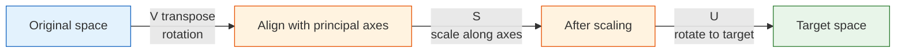

# Vector Spaces and Linear Transformations [Elective]


:::info Elective Chapter
This section is here to help you **build deeper understanding**. If you just want to get started quickly with AI projects, you can skip it for now and come back later when you encounter these concepts again.
:::

## Learning Objectives

- Understand the meaning of linear independence, basis, and dimension
- Understand the matrix representation of linear transformations
- Build intuition for singular value decomposition (SVD)

## First, let’s set an important learning expectation

This section is elective, and the title is more abstract, so beginners often slow down right away.
Your most important goal here is not to fully master every advanced theory in linear algebra, but to first build a higher-level perspective:

- What the vectors, matrices, and eigenvalues from earlier sections really are in the bigger picture
- Why terms like “dimension,” “basis,” and “linear independence” keep showing up later in AI
- Why SVD becomes a foundational tool in many methods

In other words, this section is more like:

> **A higher-level framework that organizes the intuition from the previous three sections.**

---

## How does this section relate to the previous three?

If the previous three sections were about “how vectors are represented, how matrices transform, and how eigenvalues find special directions,” then this section raises the viewpoint and looks at all of that again from a broader angle.


So this lesson is more like a “deeper understanding and organization” lesson. You do not need to fully master it right away, but once you do understand it, you will better see why the earlier concepts make sense.

### Acronyms and Notation to Decode Before Going Deeper

| Term | Full name | Beginner-friendly meaning |
|---|---|---|
| `SVD` | Singular Value Decomposition | Split a matrix into directions, strengths, and reconstruction steps |
| `PCA` | Principal Component Analysis | Find the most important directions in data and keep fewer dimensions |
| `NLP` | Natural Language Processing | AI methods for text and language |
| `LSA` | Latent Semantic Analysis | A classic text method that uses SVD to find hidden topic structure |
| `V^T` / `Vt` | V transpose | Flip rows and columns of `V`; NumPy often names it `Vt` |
| Low-rank approximation | Approximation with fewer effective dimensions | Keep only the most important singular values and drop weaker details |

## 1. Linear Independence — Vectors with "No Redundancy"

### 1.1 What is linear independence?

**Intuition**: A set of vectors is “linearly independent” if **each vector contributes unique information, and none of them is unnecessary**.

### 1.1.1 A beginner-friendly analogy

You can think of “linear independence” like team roles:

- If everyone on the team brings a different ability, then there is no redundancy
- If two people are doing the same thing, then one of them is somewhat repeated

So the most important thing to remember about linear independence is not the formal definition, but this sentence:

> **In this set of vectors, is anyone just repeating information that someone else has already expressed?**

```python
import numpy as np
import matplotlib.pyplot as plt

plt.rcParams['font.sans-serif'] = ['Arial Unicode MS']
plt.rcParams['axes.unicode_minus'] = False

# Example of linear independence: right and up, completely different directions
v1 = np.array([1, 0])
v2 = np.array([0, 1])

# Example of linear dependence: v2 is just 2 times v1, same direction
u1 = np.array([1, 2])
u2 = np.array([2, 4])  # u2 = 2 * u1, redundant!
```

```python
fig, axes = plt.subplots(1, 2, figsize=(12, 5))

# Linear independence
ax = axes[0]
ax.quiver(0, 0, v1[0], v1[1], angles='xy', scale_units='xy', scale=1,
          color='steelblue', width=0.01, label='v1 = [1, 0]')
ax.quiver(0, 0, v2[0], v2[1], angles='xy', scale_units='xy', scale=1,
          color='coral', width=0.01, label='v2 = [0, 1]')
ax.set_xlim(-0.5, 2)
ax.set_ylim(-0.5, 2)
ax.set_aspect('equal')
ax.grid(True, alpha=0.3)
ax.legend()
ax.set_title('Linear independence\nTwo different directions, no redundancy')

# Linear dependence
ax = axes[1]
ax.quiver(0, 0, u1[0], u1[1], angles='xy', scale_units='xy', scale=1,
          color='steelblue', width=0.01, label='u1 = [1, 2]')
ax.quiver(0, 0, u2[0], u2[1], angles='xy', scale_units='xy', scale=1,
          color='coral', width=0.01, label='u2 = [2, 4]')
ax.set_xlim(-0.5, 3)
ax.set_ylim(-0.5, 5)
ax.set_aspect('equal')
ax.grid(True, alpha=0.3)
ax.legend()
ax.set_title('Linear dependence\nu2 = 2×u1, completely redundant')

plt.tight_layout()
plt.show()
```

### 1.2 Why this matters in AI

| Scenario | Why linear independence matters |
|------|--------------|
| Feature engineering | If two features are linearly dependent (for example, “temperature (°C)” and “temperature (°F)”), one of them is redundant |
| PCA dimensionality reduction | Principal components are orthogonal to each other (linearly independent), and each one provides unique information |
| Neural networks | If the columns of a weight matrix are linearly dependent, it means some neurons are redundant |

### 1.3 Using matrix rank to judge it

**Matrix rank** = the maximum number of linearly independent rows (or columns) in a matrix.

```python
# 3 columns are linearly independent
A = np.array([[1, 0, 0],
              [0, 1, 0],
              [0, 0, 1]])
print(f"Rank of A: {np.linalg.matrix_rank(A)}")  # 3 (full rank)

# The 3rd column = the 1st column + the 2nd column, redundant!
B = np.array([[1, 0, 1],
              [0, 1, 1],
              [0, 0, 0]])
print(f"Rank of B: {np.linalg.matrix_rank(B)}")  # 2 (not full rank)
```

---

## 2. Basis and Dimension — the "Coordinate System" of a Space

### 2.1 Basis

A **basis** = a set of linearly independent vectors that can “span” the entire space (that is, any vector can be expressed as a combination of them).

### 2.1.1 The most important thing to remember about a basis is not the term, but its role

You can think of a basis as:

- A minimal, sufficient, and non-redundant coordinate system

In other words:

- It can represent everything you need
- It does not contain extra directions

This is exactly why many AI methods are always looking for a “better basis for representation.”

The most common basis is the **standard basis**:

```python
# Standard basis in 2D space
e1 = np.array([1, 0])  # x direction
e2 = np.array([0, 1])  # y direction

# Any 2D vector can be represented using the standard basis
v = np.array([3, 5])
# v = 3 * e1 + 5 * e2

print(f"v = {v[0]} × e1 + {v[1]} × e2 = {v[0]*e1 + v[1]*e2}")
```

**A non-standard basis also works**:

```python
# Change to another basis
b1 = np.array([1, 1])
b2 = np.array([1, -1])

# What are the coordinates of v = [3, 5] in the new basis?
# v = c1 * b1 + c2 * b2
# Solve the system of equations
B = np.column_stack([b1, b2])
coords = np.linalg.solve(B, v)
print(f"Coordinates in the new basis: {coords}")  # [4, -1]
# Check: 4*[1,1] + (-1)*[1,-1] = [4,4]+[-1,1] = [3,5] ✓
```

### 2.2 Dimension

**Dimension** = the number of basis vectors = the minimum number of coordinates needed to describe a space.

### 2.2.1 Why does “dimension” become such a frequent term in AI?

Because in AI, you often care about two things:

- How many degrees of freedom the current representation actually has
- Whether you can reduce the dimension while losing as little information as possible

So in AI, dimension is not just a geometric term.
It often means:

- Computational cost
- Information capacity
- Model complexity

| Space | Dimension | Example |
|------|------|------|
| A line | 1 | Temperature scale |
| A plane | 2 | Position on a map |
| 3D space | 3 | Position in the real world |
| Word vector space | 100~300 | A word’s “semantic coordinates” |
| Image pixel space | tens of thousands to millions | Each pixel is a dimension |

:::tip Dimensions in AI
In AI, people often say “high-dimensional space” — a 28×28 handwritten digit image is a point in a 784-dimensional space. The essence of PCA is to find a new set of “basis vectors” (principal components) so that we can use fewer dimensions (for example, 2D) to approximately represent the data.
:::

---

## 3. Matrix Representation of Linear Transformations

### 3.1 A linear transformation = a matrix

A very deep result: **any linear transformation can be represented by a matrix**.

### 3.1.1 Why is this especially important for AI?

Because it unifies many things that seem different into the same form of expression:

- Rotation
- Scaling
- Projection
- A neural network layer

In other words, many “layers” in AI can be understood first as:

- Some linear transformation + subsequent nonlinear processing

What is a linear transformation? A transformation T that satisfies two conditions:
1. T(a + b) = T(a) + T(b) (addition can be “moved in and out”)
2. T(ka) = k·T(a) (scalar multiplication can be “moved in and out”)

```python
# Rotation, scaling, projection, shearing... all are linear transformations

# Look at where the standard basis vectors go, and you know the matrix
# A 90° rotation:
# e1 = [1, 0] → [0, 1]
# e2 = [0, 1] → [-1, 0]

# Put the transformed basis vectors as columns, and you get the transformation matrix!
R90 = np.array([[0, -1],
                [1,  0]])

# Verify
print(R90 @ np.array([1, 0]))  # [0, 1] ✓
print(R90 @ np.array([0, 1]))  # [-1, 0] ✓
```

### 3.2 Composition of transformations = matrix multiplication

Rotate by 45° first, then scale by 2? Just multiply the two matrices.

```python
# Rotate 45°
theta = np.radians(45)
R45 = np.array([
    [np.cos(theta), -np.sin(theta)],
    [np.sin(theta),  np.cos(theta)]
])

# Scale by 2
S2 = np.array([
    [2, 0],
    [0, 2]
])

# Rotate first, then scale = S2 @ R45 (note: read from right to left!)
combined = S2 @ R45
print(f"Combined transformation matrix:\n{combined.round(3)}")

# Apply to a vector
v = np.array([1, 0])
result = combined @ v
print(f"[1, 0] → {result.round(3)}")  # ≈ [1.414, 1.414]
```

---

## 4. SVD — the "Swiss Army Knife" of Matrix Decomposition

### 4.1 What is SVD?

**Singular Value Decomposition (SVD)** is a generalization of eigenvalue decomposition — it applies to **matrices of any shape** (not limited to square matrices).

### 4.1.1 A beginner-friendly analogy

You can think of SVD as:

- Breaking a complicated transformation into several smaller actions that are easier to understand

It is a lot like taking apart a machine to see how it works:

1. First, how it is oriented
2. Then, how it stretches
3. Finally, how it is rotated back toward the target direction

That is also why it becomes a foundational tool in many AI methods:

- Because it is not only something you can compute
- It is also very good for explaining structure


SVD decomposes a matrix M into the product of three matrices:

**M = U × S × V^T**

Where:
- U: left singular vectors (orthogonal matrix)
- S: singular values (diagonal matrix, sorted from large to small)
- V^T: V transpose, the transpose of the right singular vector matrix

In NumPy, `np.linalg.svd()` returns `U, S, Vt`. Notice that `S` is returned as a one-dimensional list of singular values, so when reconstructing the matrix you usually write `np.diag(S)` to turn it into a diagonal matrix.

```python
# SVD of an arbitrary matrix
M = np.array([
    [1, 2, 3],
    [4, 5, 6],
])  # 2×3 matrix

U, S, Vt = np.linalg.svd(M, full_matrices=False)

print(f"Shape of U: {U.shape}")     # (2, 2)
print(f"Singular values S: {S.round(3)}")  # [9.508, 0.773]
print(f"Shape of Vt: {Vt.shape}")   # (2, 3)

# Verify: M ≈ U @ diag(S) @ Vt
reconstructed = U @ np.diag(S) @ Vt
print(f"\nReconstruction error: {np.linalg.norm(M - reconstructed):.10f}")  # ≈ 0
```

### 4.2 The intuition behind SVD

**SVD decomposes any transformation into three steps**:



### 4.3 An SVD application: image compression

The most intuitive application of SVD is using less data to approximate an image:

```python
# Use a grayscale image as an example
# Here we use random numbers to simulate a grayscale image
rng = np.random.default_rng(seed=42)
image = rng.integers(0, 256, (100, 150)).astype(float)
# Add some structure (not pure randomness)
for i in range(100):
    for j in range(150):
        image[i, j] = 128 + 50 * np.sin(i/10) * np.cos(j/15) + rng.normal() * 20

print(f"Original image: {image.shape} = {image.size} values")

# SVD decomposition
U, S, Vt = np.linalg.svd(image, full_matrices=False)
print(f"Number of singular values: {len(S)}")

# Reconstruct using different numbers of singular values
fig, axes = plt.subplots(1, 4, figsize=(16, 4))

for ax, k in zip(axes, [1, 5, 20, 100]):
    # Keep only the first k singular values
    reconstructed = U[:, :k] @ np.diag(S[:k]) @ Vt[:k, :]

    # Compression ratio = number of stored values / original number of values
    original_size = image.size
    compressed_size = k * (U.shape[0] + 1 + Vt.shape[1])
    ratio = compressed_size / original_size * 100

    ax.imshow(reconstructed, cmap='gray')
    ax.set_title(f'k = {k}\nStorage: {ratio:.0f}%')
    ax.axis('off')

plt.suptitle('SVD Image Compression: Approximate with Fewer Singular Values', fontsize=13)
plt.tight_layout()
plt.show()
```

**Interpretation**: Using only the first 20 singular values (instead of the original 100) can already restore the image quite well, while greatly reducing storage.

### 4.4 Applications of SVD in AI

| Application | Explanation |
|------|------|
| Image compression | Approximate the original image with a small number of singular values |
| Recommendation systems | Matrix factorization (for example, Netflix recommendations) |
| NLP | Latent Semantic Analysis (LSA) uses SVD to reduce the dimensionality of word-document matrices |
| Data dimensionality reduction | SVD is the underlying implementation of PCA |
| Pseudo-inverse matrix | Solve overdetermined/underdetermined systems of equations |

### 4.5 A beginner-friendly reference table

| When you see this term | Think of it first as |
|------|------|
| Linear independence | Whether there is redundant information |
| Basis | A minimal, sufficient coordinate system |
| Dimension | How many coordinates are needed to describe it |
| Rank | The number of truly effective information dimensions in the data |
| SVD | Breaking a complex matrix into a few easier-to-understand actions |

This table is especially useful for beginners because it compresses a series of intimidating terms into a few usable intuitions.

### 4.6 Another minimal example of "low-rank approximation"

```python
M = np.array([
    [5.0, 4.8, 0.1],
    [4.9, 5.1, 0.2],
    [0.2, 0.1, 4.9],
])

U, S, Vt = np.linalg.svd(M, full_matrices=False)

# Keep only the largest singular value
k = 1
Mk = U[:, :k] @ np.diag(S[:k]) @ Vt[:k, :]

print("Original matrix:\n", np.round(M, 3))
print("\nLow-rank approximation:\n", np.round(Mk, 3))
print("\nReconstruction error:", round(np.linalg.norm(M - Mk), 4))
```

This example is especially good for beginners because it helps you first see:

- SVD is not only about decomposing a matrix
- It can also tell you: if I keep only the most important part of the structure, how much information will I lose?

This is exactly the shared idea behind many AI scenarios:

- Compression
- Dimensionality reduction
- Approximate representation

---

## After learning this, where is the best place to go next?

If you have read this fourth stop to the end, the most valuable thing to carry into the next sections is not more derivations, but these questions:

1. How do these mathematical objects actually get used in machine learning?
2. When does a vector become a feature, and a matrix become weights?
3. Why do probability, gradients, and these linear algebra objects appear together in the same model?

The best follow-up readings are usually:

- [Chapter 5 Home](../../ch05-machine-learning/index.md)
- [How Math Really Flows into Machine Learning](../../ch05-machine-learning/ch01-ml-basics/03-math-to-ml-bridge.md)

## If this section still feels abstract, what is the most useful thing to hold onto?

The most important things to remember are not every single definition detail, but these four sentences:

1. Linear independence = no redundancy
2. Basis = a minimal sufficient coordinate system
3. Dimension = how many degrees of freedom are needed to describe it
4. SVD = splitting apart a complex matrix transformation

:::info Chapter Review
Across the four linear algebra lessons, you learned:
1. **Vectors**: the basic data unit in AI; cosine similarity measures directional similarity
2. **Matrices**: transform data in batches; the core operation in each neural network layer
3. **Eigenvalues**: find the most important directions in data; used in PCA dimensionality reduction
4. **Vector spaces** (this section): understand dimension, basis, and SVD

These concepts will appear again and again when you continue learning machine learning, deep learning, and NLP. You do not need to memorize every detail right away; your understanding will deepen as you practice more later.
:::

---

## Summary

| Concept | Intuition | NumPy |
|------|------|-------|
| Linear independence | A set of vectors with no redundancy | `np.linalg.matrix_rank(A)` |
| Basis | A coordinate system for describing a space | — |
| Dimension | How many coordinates are needed | `A.shape` |
| Linear transformation | Matrix multiplication | `A @ v` |
| SVD | Any matrix = rotation × scaling × rotation | `np.linalg.svd(A)` |
| Matrix rank | Number of effective dimensions | `np.linalg.matrix_rank(A)` |

## What should you take away from this section?

- The most important intuition for linear independence is “whether there is redundant information”
- The most important intuition for a basis is “a minimal sufficient coordinate system”
- The most important intuition for dimension is “how many degrees of freedom this representation needs”
- The most important intuition for SVD is “breaking a complex transformation into a few easier-to-understand actions”

## Hands-on Exercises

### Exercise 1: Determine linear independence

Which of the following three sets of vectors are linearly independent? Verify with `np.linalg.matrix_rank()`.

```python
# Set 1
g1 = np.array([[1, 2], [3, 6]])

# Set 2
g2 = np.array([[1, 0], [0, 1]])

# Set 3
g3 = np.array([[1, 2, 3], [4, 5, 6], [5, 7, 9]])
```

### Exercise 2: SVD compression

Use SVD to perform a low-rank approximation of a `50×80` random matrix, and plot the reconstruction error curve for different values of k.

```python
rng = np.random.default_rng(seed=42)
M = rng.normal(size=(50, 80))
U, S, Vt = np.linalg.svd(M, full_matrices=False)

errors = []
for k in range(1, 51):
    reconstructed = U[:, :k] @ np.diag(S[:k]) @ Vt[:k, :]
    error = np.linalg.norm(M - reconstructed)
    errors.append(error)

# Plot
```

### Exercise 3: Combining transformations

Construct two 2×2 transformation matrices — first scale (double x, keep y unchanged), then rotate by 30°. Multiply them to get the combined matrix, apply it to a set of triangle vertices, and plot the result.
