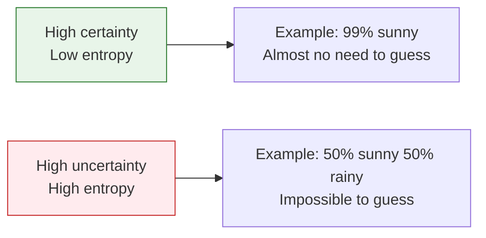
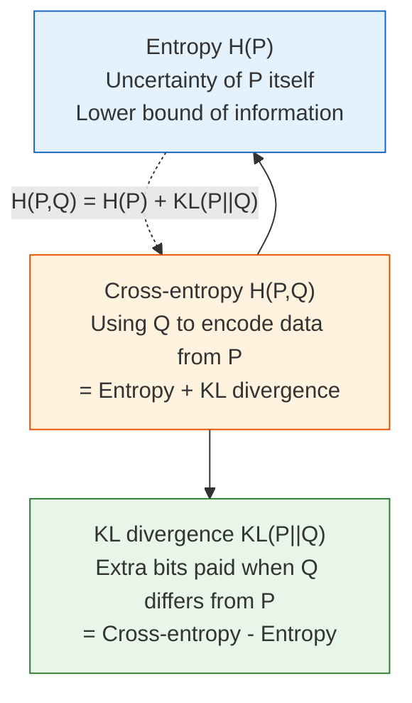

# 4.2.5 Fundamentals of Information Theory


:::tip Why learn information theory?
When you train a classification model with `CrossEntropyLoss`, the word "entropy" is right there in the name. Information theory tells you **what this loss function is actually measuring** and why it is so effective for classification tasks.
:::

## Learning Objectives

- Understand information content and entropy — measures of uncertainty
- Understand cross-entropy — the difference between two distributions
- Understand KL divergence — the "distance" from one distribution to another
- Compute and visualize everything with Python

## Terms to Decode Before the Formulas

Information theory terms can sound abstract, but most of them answer very concrete questions:

| Term | Meaning | Beginner-friendly question |
|---|---|---|
| `bit` | Unit of information when using `log2` | How many yes/no questions would this information be worth? |
| `nat` | Unit of information when using natural log `ln` | The unit most deep learning loss functions use internally |
| `log2` | Logarithm base 2 | Used when we want answers in bits |
| `entropy` | Average uncertainty of a distribution | Before seeing the answer, how uncertain are we on average? |
| `cross-entropy` | Cost of predicting distribution Q when truth is P | How expensive is it to use the model's prediction to explain the truth? |
| `KL divergence` | Extra cost from using Q instead of P | How much extra cost do we pay because the model distribution is wrong? |
| `logits` | Raw model scores before probability conversion | The unnormalized scores a neural network outputs before softmax |
| `softmax` | Converts logits into probabilities | Turn raw class scores into a probability distribution that sums to 1 |
| `perplexity` | `2 ** cross_entropy` when cross-entropy uses bits | A language-model metric; lower usually means the model is less confused |
| `RLHF` / `PPO` | Reinforcement Learning from Human Feedback / Proximal Policy Optimization | Training methods that use KL to keep a fine-tuned model from drifting too far |

This lesson uses `log2` for information-theory intuition in **bits**. Many deep learning libraries use the natural logarithm, so their loss values are in **nats**. The shape and optimization meaning are the same; only the unit changes.

## Historical Background: What Is the Most Important Starting Point for This Section?

The most important historical milestone in this section is:

| Year | Paper | Key Author | What it Solved Most Importantly |
|---|---|---|---|
| 1948 | *A Mathematical Theory of Communication* | Claude Shannon | Systematically introduced information content, entropy, and the main framework of modern information theory |

For beginners, the most important thing to remember first is:

> **Shannon made it possible to rigorously measure "how much information" there is for the first time.**

So the topics in this section:

- information content
- entropy
- cross-entropy

are not separate ideas, but all part of the same information theory framework.

## First, Set the Right Learning Expectations

The most common sticking points for beginners in this section are:

- the names sound very abstract
- the formulas look like "math about math"

But what matters most here is not memorizing every definition first. Instead, start by understanding:

- why "the more surprising something is, the more information it contains"
- why "the more uncertain something is, the higher its entropy"
- why classification loss is connected to these quantities

You can think of this section as:

> **A more precise language for describing how certain a model is and how far its prediction is from the truth.**

---

## First, Build a Map

This section may not look much like a "probability lesson," but it is very closely related to model training.


So what this lesson really wants to explain is:

- why "more surprising events carry more information"
- why a distribution with more uncertainty has higher entropy
- why cross-entropy becomes the core loss function for classification tasks

## Information Content — "How Surprised Are You?"

### Intuition

The **information content** of a message = how **unexpected** it is.

- "The sun rises in the east" → information content ≈ 0 (not surprising at all)
- "It snowed in Beijing today" (in summer) → very high information content (very surprising)
- "It snowed in Beijing today" (in winter) → moderate information content

**The lower the probability of an event, the more information it brings when it happens.**

### A More Beginner-Friendly Analogy

You can think of information content as:

- "How much should I be surprised by this?"

For example:

- The sun rises tomorrow: not worth being surprised about
- It snows in summer: definitely surprising

So the most important thing to remember about information content is not the formula, but this:

> **The less common something is, the more information it gives when it happens.**

### Mathematical Definition

**Information content = -log2(probability)**

```python
import numpy as np
import matplotlib.pyplot as plt

plt.rcParams['font.sans-serif'] = ['Arial Unicode MS']
plt.rcParams['axes.unicode_minus'] = False

# Information content for different probabilities
probs = np.linspace(0.01, 1, 100)
info = -np.log2(probs)

plt.figure(figsize=(8, 5))
plt.plot(probs, info, color='steelblue', linewidth=2)
plt.xlabel('Event Probability')
plt.ylabel('Information Content (bits)')
plt.title('Information Content = -log₂(Probability)')
plt.grid(True, alpha=0.3)

# Mark a few key points
for p, label in [(1.0, 'Certain event'), (0.5, 'Coin flip'), (0.01, 'Rare event')]:
    i = -np.log2(p)
    plt.annotate(f'{label}\np={p}, info={i:.1f}bit',
                 xy=(p, i), fontsize=10,
                 xytext=(p+0.15, i+0.5),
                 arrowprops=dict(arrowstyle='->', color='gray'))

plt.show()
```

| Event Probability | Information Content | Intuition |
|---------|--------|------|
| 1.0 | 0 bit | It must happen, so it carries no information |
| 0.5 | 1 bit | One coin flip gives 1 bit |
| 0.25 | 2 bits | Guessing a two-digit binary number |
| 0.01 | 6.64 bits | Very surprising, so it carries a lot of information |

If you run the formula directly:

```python
for p in [1.0, 0.5, 0.25, 0.01]:
    print(f"p={p:>4}: information={-np.log2(p):.4f} bits")
```

Expected output:

```text
p= 1.0: information=-0.0000 bits
p= 0.5: information=1.0000 bits
p=0.25: information=2.0000 bits
p=0.01: information=6.6439 bits
```

---

## Entropy — Average Uncertainty

### Intuition

**Entropy = the "average information content" of a distribution = the system's "average uncertainty."**

### The Most Important Thing to Remember About Entropy Is Not the Definition, but the "Degree of Chaos"

You can first think of entropy as:

- how unsure you are before making a judgment

If a system is usually almost certain:

- entropy is low

If a system is hard to predict every time:

- entropy is high

So the most basic meaning of entropy is:

> **How large is the average uncertainty?**



### Formula and Calculation

**H(X) = -Σ p(x) × log2(p(x))**

```python
def entropy(probs):
    """Compute entropy (in bits)"""
    probs = np.array(probs)
    # Avoid log(0)
    probs = probs[probs > 0]
    return -np.sum(probs * np.log2(probs))

# Example 1: fair coin (maximum uncertainty)
h1 = entropy([0.5, 0.5])
print(f"Entropy of a fair coin: {h1:.3f} bit")  # 1.0

# Example 2: unfair coin
h2 = entropy([0.9, 0.1])
print(f"Entropy of an unfair coin (0.9, 0.1): {h2:.3f} bit")  # 0.469

# Example 3: certain event (no uncertainty)
h3 = entropy([1.0, 0.0])
print(f"Entropy of a certain event: {h3:.3f} bit")  # 0.0

# Example 4: fair die
h4 = entropy([1/6]*6)
print(f"Entropy of a fair die: {h4:.3f} bit")  # 2.585
```

Expected output:

```text
Entropy of a fair coin: 1.000 bit
Entropy of an unfair coin (0.9, 0.1): 0.469 bit
Entropy of a certain event: -0.000 bit
Entropy of a fair die: 2.585 bit
```

`-0.000` appears because of floating-point rounding. Conceptually, the entropy is exactly 0.

### Visualization: How Coin Entropy Changes with p

```python
p_values = np.linspace(0.001, 0.999, 1000)
entropies = [-p * np.log2(p) - (1-p) * np.log2(1-p) for p in p_values]

plt.figure(figsize=(8, 5))
plt.plot(p_values, entropies, color='steelblue', linewidth=2)
plt.xlabel('Probability of Heads p')
plt.ylabel('Entropy H (bit)')
plt.title('Entropy of a Binary Distribution: Maximum at p=0.5 (Most Uncertain)')
plt.axvline(x=0.5, color='red', linestyle='--', alpha=0.5, label='p=0.5 (maximum entropy)')
plt.legend()
plt.grid(True, alpha=0.3)
plt.show()
```

**Key insight**: entropy is maximum when p = 0.5 (most uncertain), and entropy is 0 when p = 0 or 1 (completely certain).

### Applications of Entropy in AI

| Application | Description |
|------|------|
| Decision trees | Use **information gain** (the reduction in entropy) to choose the best split feature |
| Model outputs | The lower the entropy of a classification model's probability distribution, the more "confident" the model is |
| Data compression | Entropy is the theoretical lower bound of data compression |
| Language models | Perplexity = 2^(cross-entropy), used to measure model quality |

---

## Cross-Entropy — Measuring "How Accurate the Prediction Is"

### Intuition

**Cross-entropy = the average number of bits needed to encode data from distribution P using distribution Q.**

### A More Beginner-Friendly Way to Say It

You can also temporarily think of cross-entropy as:

- how far apart the predicted distribution and the true distribution are

That is already enough for beginners.
Because later, in classification models, what you really care about is also:

- whether the model assigns higher probability to the correct class

If Q and P are exactly the same → cross-entropy = entropy of P (the minimum value)
If Q and P are very different → cross-entropy is much larger than the entropy of P

### Formula and Calculation

**H(P, Q) = -Σ p(x) × log2(q(x))**

```python
def cross_entropy(p, q):
    """Compute cross-entropy"""
    p, q = np.array(p), np.array(q)
    # Avoid log(0)
    q = np.clip(q, 1e-10, 1)
    return -np.sum(p * np.log2(q))

# True distribution P
P = [0.7, 0.2, 0.1]  # three-class problem

# Predicted distributions Q (different prediction quality)
Q_good = [0.65, 0.25, 0.10]   # good prediction
Q_bad  = [0.33, 0.33, 0.34]   # poor prediction (uniform guess)
Q_wrong = [0.1, 0.1, 0.8]     # wrong prediction

print(f"Entropy of P:        {entropy(P):.4f}")
print(f"Cross-entropy, good prediction:   {cross_entropy(P, Q_good):.4f}")
print(f"Cross-entropy, poor prediction:   {cross_entropy(P, Q_bad):.4f}")
print(f"Cross-entropy, wrong prediction: {cross_entropy(P, Q_wrong):.4f}")
```

Expected output:

```text
Entropy of P:        1.1568
Cross-entropy, good prediction:   1.1672
Cross-entropy, poor prediction:   1.5952
Cross-entropy, wrong prediction: 3.0219
```

### Cross-Entropy as a Loss Function

In classification tasks, **minimizing cross-entropy = making the model's predictions as close as possible to the true distribution**.

```python
# Binary cross-entropy loss
def binary_cross_entropy(y_true, y_pred):
    """Binary cross-entropy (equivalent to PyTorch's BCELoss)"""
    y_pred = np.clip(y_pred, 1e-10, 1 - 1e-10)
    return -np.mean(
        y_true * np.log(y_pred) + (1 - y_true) * np.log(1 - y_pred)
    )

# True labels
y_true = np.array([1, 0, 1, 1, 0])

# Predictions of different quality
predictions = {
    "Perfect prediction":   np.array([1.0, 0.0, 1.0, 1.0, 0.0]),
    "Good prediction":     np.array([0.9, 0.1, 0.8, 0.9, 0.2]),
    "Poor prediction":     np.array([0.6, 0.4, 0.6, 0.6, 0.4]),
    "Completely wrong":   np.array([0.1, 0.9, 0.1, 0.1, 0.9]),
}

for name, y_pred in predictions.items():
    loss = binary_cross_entropy(y_true, y_pred)
    print(f"{name:18s} → cross-entropy loss = {loss:.4f}")
```

Output:
```text
Perfect prediction   → cross-entropy loss ≈ 0.0000
Good prediction      → cross-entropy loss ≈ 0.1525
Poor prediction      → cross-entropy loss ≈ 0.5108
Completely wrong     → cross-entropy loss ≈ 2.3026
```

This block uses `np.log`, the natural logarithm, so the unit is nats. That matches what most deep learning frameworks use for cross-entropy loss.

### Visualization: Prediction Accuracy vs. Loss

```python
# Relationship between predicted probability p and loss when the true label y=1
p_pred = np.linspace(0.01, 0.99, 100)

# When y=1, loss = -log(p)
loss_y1 = -np.log(p_pred)

# When y=0, loss = -log(1-p)
loss_y0 = -np.log(1 - p_pred)

fig, axes = plt.subplots(1, 2, figsize=(14, 5))

axes[0].plot(p_pred, loss_y1, color='steelblue', linewidth=2)
axes[0].set_xlabel('Model prediction P(y=1)')
axes[0].set_ylabel('Loss')
axes[0].set_title('Loss when the true label is y=1\nThe closer the prediction is to 1, the smaller the loss')
axes[0].grid(True, alpha=0.3)

axes[1].plot(p_pred, loss_y0, color='coral', linewidth=2)
axes[1].set_xlabel('Model prediction P(y=1)')
axes[1].set_ylabel('Loss')
axes[1].set_title('Loss when the true label is y=0\nThe closer the prediction is to 0, the smaller the loss')
axes[1].grid(True, alpha=0.3)

plt.tight_layout()
plt.show()
```

**Interpretation**: cross-entropy loss has a very nice property — when the prediction is wrong (for example, y=1 but the model outputs 0.01), the loss increases **sharply**, strongly penalizing wrong predictions.

### A More Beginner-Friendly Classification Intuition

You can first think of cross-entropy as:

- how much confidence you placed on the correct answer

If the correct class is clearly `cat`, but you assign most of the probability to `dog`,
then cross-entropy will be large.
If you assign most of the probability to the correct class,
cross-entropy will be smaller.

So the most important thing to remember about cross-entropy is not what the formula looks like, but this:

> **The more probability the model assigns to the correct answer, the smaller the loss usually is.**

### Another Small "Single-Sample Cross-Entropy" Example

```python
labels = ["cat", "dog", "bird"]
true_label = "dog"
pred_probs = [0.1, 0.7, 0.2]

true_index = labels.index(true_label)
loss = -np.log(pred_probs[true_index])

print("Correct class:", true_label)
print("Model prediction:", dict(zip(labels, pred_probs)))
print("Cross-entropy loss:", round(loss, 4))
```

Expected output:

```text
Correct class: dog
Model prediction: {'cat': 0.1, 'dog': 0.7, 'bird': 0.2}
Cross-entropy loss: 0.3567
```

This example is especially good for beginners because it brings abstract distribution language back to the most familiar classification setting:

- Who is the correct answer?
- How much probability did you assign to it?
- How large does that make the loss?

---

## KL Divergence — The "Distance" Between Two Distributions

### Intuition

**KL divergence = how many extra bits you "pay" if you use distribution Q instead of the true distribution P.**

### Why Does KL Divergence Feel So Intimidating?

Because it looks like a "distance" between distributions,
but it is not symmetric.

A safer first step for beginners is to understand it as:

- KL is not a normal geometric distance
- It is more like: "If I use the wrong distribution to approximate the true one, how much extra cost will I pay?"

This intuition is already enough to help you understand its role in:

- VAE
- distillation
- RLHF

**KL(P || Q) = cross-entropy(P, Q) - entropy(P)**

```python
def kl_divergence(p, q):
    """Compute KL divergence"""
    p, q = np.array(p), np.array(q)
    q = np.clip(q, 1e-10, 1)
    p = np.clip(p, 1e-10, 1)
    return np.sum(p * np.log2(p / q))

P = [0.7, 0.2, 0.1]
Q1 = [0.65, 0.25, 0.10]  # close to P
Q2 = [0.33, 0.33, 0.34]  # far from P

print(f"KL(P || Q1): {kl_divergence(P, Q1):.4f} (Q1 is close to P)")
print(f"KL(P || Q2): {kl_divergence(P, Q2):.4f} (Q2 is far from P)")
print(f"KL(P || P):  {kl_divergence(P, P):.4f} (P with itself)")
```

Expected output:

```text
KL(P || Q1): 0.0105 (Q1 is close to P)
KL(P || Q2): 0.4384 (Q2 is far from P)
KL(P || P):  0.0000 (P with itself)
```

### Properties of KL Divergence

| Property | Description |
|------|------|
| Non-negativity | KL(P \|\| Q) ≥ 0, with equality if and only if P = Q |
| Asymmetry | KL(P \|\| Q) ≠ KL(Q \|\| P), so it is not a true "distance" |
| Zero when P=Q | When the two distributions are exactly the same, KL divergence is 0 |

```python
# Verify asymmetry
P = [0.7, 0.2, 0.1]
Q = [0.33, 0.33, 0.34]

print(f"KL(P || Q) = {kl_divergence(P, Q):.4f}")
print(f"KL(Q || P) = {kl_divergence(Q, P):.4f}")
print("They are not equal!")
```

Expected output:

```text
KL(P || Q) = 0.4384
KL(Q || P) = 0.4807
They are not equal!
```

### Visualization: How KL Divergence Changes with Distribution Difference

```python
# Binary distribution: P = [0.8, 0.2], let Q vary from [0.01, 0.99] to [0.99, 0.01]
p = 0.8
q_values = np.linspace(0.01, 0.99, 200)

kl_values = [kl_divergence([p, 1-p], [q, 1-q]) for q in q_values]

plt.figure(figsize=(8, 5))
plt.plot(q_values, kl_values, color='steelblue', linewidth=2)
plt.axvline(x=p, color='red', linestyle='--', label=f'q = p = {p} (KL=0)')
plt.xlabel('Value of q')
plt.ylabel('KL(P || Q)')
plt.title(f'KL Divergence: P=[{p}, {1-p}], Q=[q, 1-q]')
plt.legend()
plt.grid(True, alpha=0.3)
plt.show()
```

### Applications of KL Divergence in AI

| Application | Description |
|------|------|
| VAE | Makes the latent variable distribution close to a standard normal distribution: KL(q(z\|x) \|\| N(0,1)) |
| Knowledge distillation | Makes the small model's output distribution close to the large model's output distribution: minimize KL divergence |
| RLHF | Constrains the fine-tuned model so it does not drift too far from the original model |
| Policy optimization | Restricts the size of policy updates in PPO |

:::tip The Key Role of KL Divergence in RLHF
When fine-tuning a large language model with RLHF, you need to balance "satisfying human preferences" and "not drifting too far from the original model." KL divergence is the constraint that keeps the model from drifting too far.
:::

---

## The Relationship Among the Three



**Core relationship: cross-entropy = entropy + KL divergence**

```python
P = [0.7, 0.2, 0.1]
Q = [0.5, 0.3, 0.2]

h = entropy(P)
ce = cross_entropy(P, Q)
kl = kl_divergence(P, Q)

print(f"Entropy H(P):        {h:.4f}")
print(f"Cross-entropy H(P,Q):  {ce:.4f}")
print(f"KL divergence:        {kl:.4f}")
print(f"H(P) + KL =     {h + kl:.4f}")  # = cross-entropy ✓
```

Expected output:

```text
Entropy H(P):        1.1568
Cross-entropy H(P,Q):  1.2796
KL divergence:        0.1228
H(P) + KL =     1.2796
```

:::info Why do we use cross-entropy instead of KL divergence for classification?
Because during training, the true distribution P is fixed (the labels do not change), so H(P) is a constant. Minimizing cross-entropy H(P,Q) is equivalent to minimizing KL(P||Q). But cross-entropy is easier to compute — you do not need to know H(P).
:::

### A Comparison Table That's Very Good for Beginners to Remember

| Concept | The Most Important Question to Remember |
|------|------|
| Information content | How surprising is this event? |
| Entropy | How uncertain is the system on average? |
| Cross-entropy | How far apart are the prediction and the truth? |
| KL divergence | If I use the wrong distribution, how much extra cost will I pay? |

This table is especially useful for beginners because it turns this chapter back into an intuitive map instead of a pile of formulas.

---

## After Learning This, Where Should You Go Next?

If you have read this entire probability and statistics chapter, what is most worth taking with you is not more formulas, but these questions:

1. How do probability, cross-entropy, and KL divergence actually become loss functions?
2. Why do models output probabilities instead of absolute conclusions?
3. How do these "uncertainty languages" turn into training and evaluation tools in machine learning?

The most natural next reading is usually:

- [5 Station 5 Home](../../ch05-machine-learning/index.md)
- [5.2.3 Logistic Regression](../../ch05-machine-learning/ch02-supervised/02-logistic-regression.md)
- [5.4.2 Evaluation Metrics](../../ch05-machine-learning/ch04-evaluation/01-metrics.md)

:::info Chapter Review
In these four lessons on probability and statistics, you learned:
1. **Probability basics**: conditional probability, Bayes' theorem — updating beliefs with evidence
2. **Probability distributions**: the normal distribution is everywhere, and so is the central limit theorem
3. **Statistical inference**: MLE is the source of cross-entropy loss, and MAP is regularization
4. **Information theory** (this lesson): entropy measures uncertainty, cross-entropy is a classification loss, and KL divergence constrains distribution differences

These concepts appear again and again in machine learning, deep learning, and large language models.

**Integrated learning jump**: It is recommended that you now go to **Station 5 · 2.2 Logistic Regression + 2.3 Decision Trees** — use the probability and information theory knowledge you just learned to understand the loss functions and information gain of classification algorithms.
:::

---

## Summary

| Concept | Intuition | Range |
|------|------|------|
| Information content | How "surprising" an event is | ≥ 0 |
| Entropy | How "uncertain" a distribution is | ≥ 0 |
| Cross-entropy | How different the predicted distribution is from the true distribution | ≥ H(P) |
| KL divergence | The "distance" between two distributions | ≥ 0 |

## What You Should Take Away Most from This Section

- The most important intuition for information content is: "the more surprising, the more information"
- The most important intuition for entropy is: "average uncertainty"
- The most important intuition for cross-entropy is: "how far apart the prediction and the truth are"
- The most important intuition for KL divergence is: "how much extra cost you pay for using the wrong distribution"

## Hands-On Exercises

### Exercise 1: Compute Entropy

Compute the entropy of the following distributions and explain which one is the most "uncertain":
1. [0.25, 0.25, 0.25, 0.25] (a four-sided die)
2. [0.97, 0.01, 0.01, 0.01] (almost certain)
3. [0.4, 0.3, 0.2, 0.1] (non-uniform)

Reference implementation:

```python
distributions = [
    [0.25, 0.25, 0.25, 0.25],
    [0.97, 0.01, 0.01, 0.01],
    [0.4, 0.3, 0.2, 0.1],
]

for probs in distributions:
    print(f"{probs} -> entropy={entropy(probs):.4f} bits")
```

Expected output:

```text
[0.25, 0.25, 0.25, 0.25] -> entropy=2.0000 bits
[0.97, 0.01, 0.01, 0.01] -> entropy=0.2419 bits
[0.4, 0.3, 0.2, 0.1] -> entropy=1.8464 bits
```

The first distribution is the most uncertain because all four outcomes are equally likely.

### Exercise 2: Cross-Entropy Loss

For a three-class problem: the true label is class 2 (one-hot: [0, 1, 0]), and the model outputs softmax probabilities [0.1, 0.7, 0.2]. Compute the cross-entropy loss. If the model output changes to [0.05, 0.9, 0.05], how will the loss change?

Reference implementation:

```python
P = np.array([0, 1, 0])
Q1 = np.array([0.1, 0.7, 0.2])
Q2 = np.array([0.05, 0.9, 0.05])

loss1 = -np.sum(P * np.log(Q1))
loss2 = -np.sum(P * np.log(Q2))

print(f"Loss with [0.1, 0.7, 0.2]: {loss1:.4f} nats")
print(f"Loss with [0.05, 0.9, 0.05]: {loss2:.4f} nats")
```

Expected output:

```text
Loss with [0.1, 0.7, 0.2]: 0.3567 nats
Loss with [0.05, 0.9, 0.05]: 0.1054 nats
```

The second prediction gives more probability to the correct class, so the loss becomes smaller.

### Exercise 3: Visualize KL Divergence

Draw a graph showing how KL(P||Q) changes when the true distribution P = [0.6, 0.3, 0.1] is fixed and Q changes along some parameter (for example, q1 from 0.1 to 0.9).

Reference implementation:

```python
P = np.array([0.6, 0.3, 0.1])
q1_values = np.linspace(0.1, 0.9, 200)
kl_values = []

for q1 in q1_values:
    # Keep the remaining probability split in a 3:1 ratio.
    Q = np.array([q1, (1 - q1) * 0.75, (1 - q1) * 0.25])
    kl_values.append(kl_divergence(P, Q))

plt.figure(figsize=(8, 5))
plt.plot(q1_values, kl_values, color="steelblue", linewidth=2)
plt.axvline(x=0.6, color="red", linestyle="--", label="Q = P")
plt.xlabel("q1")
plt.ylabel("KL(P || Q)")
plt.title("KL divergence is smallest when Q matches P")
plt.legend()
plt.grid(alpha=0.3)
plt.show()

for q1 in [0.1, 0.6, 0.9]:
    Q = np.array([q1, (1 - q1) * 0.75, (1 - q1) * 0.25])
    print(f"q1={q1:.1f}, Q={Q.round(3)}, KL={kl_divergence(P, Q):.4f}")
```

Expected output:

```text
q1=0.1, Q=[0.1   0.675 0.225], KL=1.0830
q1=0.6, Q=[0.6 0.3 0.1], KL=-0.0000
q1=0.9, Q=[0.9   0.075 0.025], KL=0.4490
```
