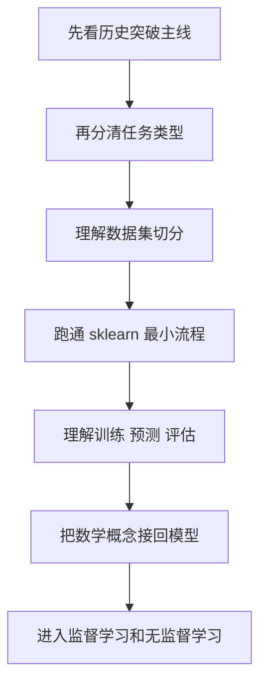
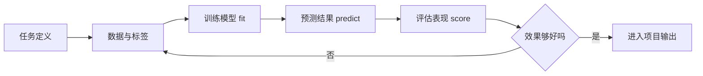

# 学前导读：机器学习基础这一章到底在学什么

这一章不是在教你背算法名称，而是在帮你先建立“机器学习项目的地图感”。如果这一章学稳，后面的监督学习、无监督学习、模型评估、特征工程和项目实践就不会变成零散概念。

## 这一章在整个课程里的位置

你已经在前面学过 Python、数据分析和 AI 数学最小基础。到这里，课程开始从“处理数据”进入“让模型从数据中学习规律”。

这一步的关键变化是：传统编程主要是人写规则，机器学习则是你准备数据、定义目标、选择模型、训练模型，再用评估结果判断模型是否真的学到了规律。

前半段的重点是把“数据”和“数学”准备好：你先能读懂数据、处理数据，再理解向量、概率和优化这些机器学习会反复用到的概念。

## 这一章真正要解决的问题

这一章要先回答四个基础问题：机器学习和传统编程到底差在哪里；分类、回归、聚类这些任务为什么要先分清；训练集、验证集、测试集为什么不能混用；`scikit-learn` 为什么能把训练、预测和评估组织成统一流程。

新人最容易把机器学习学成“算法清单”。但真正更重要的是先看懂一件事：每个算法都是为某类任务服务的，而任务、数据、特征、评估方式共同决定了模型是否有意义。

## 新人推荐学习顺序

建议先看“机器学习历史突破主线”，把贝叶斯、线性模型、决策树、SVM、随机森林、Boosting 和 sklearn 放进一条技术演进线。然后看“什么是机器学习”，把监督学习、无监督学习、分类、回归、聚类、训练集和测试集这些坐标轴立起来。再看 `Scikit-learn` 入门，理解 `fit / predict / score` 这条最短建模工作流。最后回看“数学如何真正流到机器学习”，把第 4 站的线性代数、概率统计和微积分接到模型训练里。

## 学这一章时要抓住的主线

你可以把这一章记成一条最小闭环：先判断任务是什么，再准备数据和标签，然后选择一个 baseline 模型，用 `fit` 训练，用 `predict` 预测，用 `score` 或其他指标评估，最后根据结果决定是否改特征、换模型或重新检查数据。

## 这一章和后面章节的关系

这一章是第 5 站的入口。后面的监督学习会展开分类和回归，无监督学习会展开聚类和降维，模型评估会告诉你分数是否可信，特征工程会告诉你怎样让数据更适合模型，最后项目实践会把这些内容合成一个完整建模流程。

如果这一章没有学稳，后面常见的问题是：每个算法都看过，但不知道什么时候该用它；代码能跑，但不知道结果是否可信；模型分数很高，却没有意识到可能发生了数据泄漏或评估错误。

如果你想把“为什么这些算法会出现”先看顺，可以先读 [1.2 机器学习历史突破主线](./04-history-breakthroughs.md)。它会把 Bayes、MLE、EM、线性模型、决策树、SVM、随机森林、Boosting、XGBoost 和 sklearn 分配到对应学习章节。

## 新人和进阶学习者怎么读

新人第一次学这一章时，先抓住主线和最小可运行例子。你不需要一次理解所有细节，只要能说清楚这一章解决什么问题、输入输出是什么、最小项目怎么跑起来，就可以继续往后走。

有经验的学习者可以把这一章当成查漏补缺和工程化练习：关注边界条件、失败案例、评估方式、代码可复现性，以及它和前后阶段的连接。读完后最好能把本章内容沉淀到自己的作品 README 或实验记录里。

## 学习时间与难度建议

| 学习方式 | 建议投入 | 目标 |
|---|---|---|
| 快速浏览 | 20～30 分钟 | 看懂本章解决什么问题，知道后面会用到哪里 |
| 最小通关 | 1～2 小时 | 跑通一个最小例子，完成本章小项目出口 |
| 深入练习 | 半天～1 天 | 补充错误分析、对比实验或项目 README 记录 |

## 本章自测问题

| 自测问题 | 通过标准 |
|---|---|
| 这一章解决什么问题？ | 能用一句话说明它在整门课里的位置 |
| 最小输入输出是什么？ | 能说清楚例子需要什么输入，会产生什么结果 |
| 常见失败点在哪里？ | 能列出至少一个报错、效果差或理解偏差的原因 |
| 学完后能沉淀什么？ | 能把本章产出写进项目 README、实验记录或作品集 |

## 本章小项目出口

学完这一章后，建议做一个最小分类或回归练习。你可以使用 sklearn 内置数据集，完成数据加载、训练测试切分、模型训练、预测、评估和简单结论说明。项目不需要复杂，但必须能说清楚：这是分类还是回归，输入特征是什么，目标标签是什么，使用了什么评估指标，以及模型结果是否能作为 baseline。

## 过关标准

这一章结束时，你应该能用自己的话解释机器学习和传统编程的差异，能区分分类、回归和聚类，能说明训练集和测试集为什么要分开，能读懂 `fit / predict / score` 的含义，并能跑通一个最小 sklearn 建模流程。

如果你还能主动问“这个分数可信吗”“有没有数据泄漏”“baseline 是多少”，说明你已经不是只在学 API，而是在建立机器学习项目思维。
