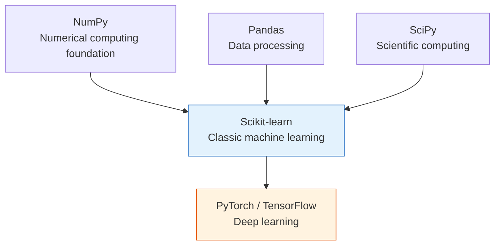
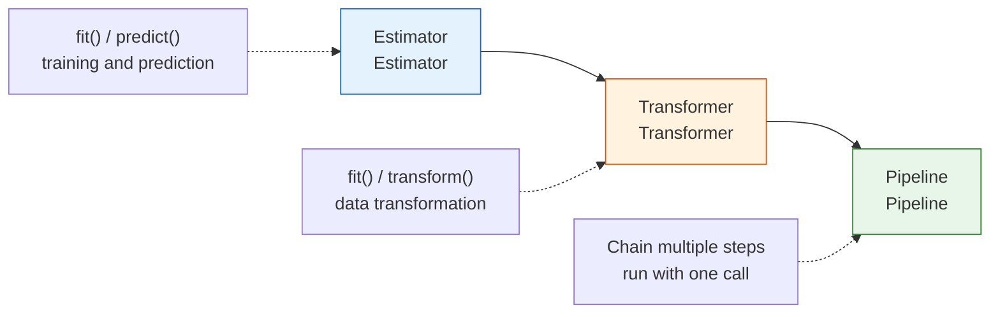
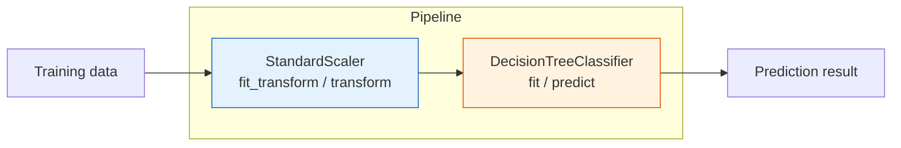
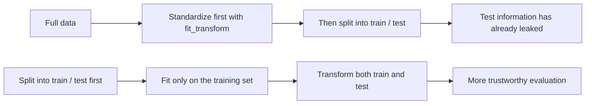

# 5.1.3 Introduction to the Scikit-learn Framework


:::tip Section focus
Scikit-learn is the **de facto standard library** for Python machine learning. Almost all classic ML tasks can be done with it. Once you master sklearn’s API pattern, learning any later algorithm will feel much smoother.
:::

## Learning Objectives

- Understand Scikit-learn’s design philosophy and unified API
- Master the three core concepts: Estimator, Transformer, and Pipeline
- Learn how to load and generate datasets
- Complete the full workflow from training to prediction
- Learn how to save and load models

---

## Beginners first, deeper understanding later

If you are new, focus on one key idea in this section: sklearn’s most important feature is a unified workflow, not any single algorithm. First map `fit`, `transform`, `predict`, and `score` to “training, transforming, predicting, evaluating.”

If you already have some experience, you can go further: how to use Pipeline to avoid data leakage, how to save preprocessing and the model together, and how to use a unified API for model comparison and tuning.

---

## First, build a map

The most important thing in this section is not “learning a library,” but building a stable machine learning workflow habit.

For beginners, the most valuable thing about `scikit-learn` is:

- It unifies many different algorithms under the same interface
- It lets you focus on the modeling workflow first, instead of syntax differences

A better mental model is:


If you keep this line in your head, you won’t feel especially lost later when you switch to any classic ML model.

---

## Why Scikit-learn?

### sklearn’s place in the ML ecosystem



| Feature | Description |
|------|------|
| **Unified API** | All algorithms use the same `fit` / `predict` / `transform` pattern |
| **Rich set of algorithms** | Classification, regression, clustering, dimensionality reduction, preprocessing, and more |
| **Excellent documentation** | Every algorithm has detailed docs and examples |
| **Active community** | One of the most popular ML libraries in the world |
| **Production-ready** | Can be used directly in real projects |

### What is sklearn’s most important value for beginners?

The most important thing is not “having many algorithms,” but:

- You don’t need to relearn a new interface every time you switch models
- You can focus on comparing models instead of being interrupted by library differences
- It becomes easier to understand that “training, prediction, evaluation” is actually one unified workflow

### Installation

```bash
python -m pip install --upgrade scikit-learn
```

```python
import sklearn
print(sklearn.__version__)
```

Expected output will be a version number, for example:

```text
1.8.0
```

`scikit-learn` is the package name you install with `pip`. `sklearn` is the module name you import in Python. If `import sklearn` fails after installation, first check that `pip` and `python` point to the same environment.

---

## Scikit-learn’s design philosophy

### Unified API — one trick that works everywhere

The strongest part of Scikit-learn is this: **all algorithms follow the same API pattern**. Whether it is linear regression, a decision tree, or SVM, the usage style is the same.

The following block is a workflow template. It will run after you create `X_train`, `X_test`, `y_train`, and `y_test` in a complete example.

```python
# No matter which algorithm you use, the code structure is the same:
from sklearn.xxx import SomeModel

model = SomeModel(hyperparameters)      # Create the model
model.fit(X_train, y_train)             # Train
y_pred = model.predict(X_test)          # Predict
score = model.score(X_test, y_test)     # Evaluate
```

Let’s look at a few concrete examples—notice how consistent the code structure is:

```python
from sklearn.tree import DecisionTreeClassifier
from sklearn.linear_model import LogisticRegression
from sklearn.svm import SVC
from sklearn.neighbors import KNeighborsClassifier

# The method is exactly the same! Only the model name changes
models = {
    "Decision Tree": DecisionTreeClassifier(),
    "Logistic Regression": LogisticRegression(),
    "SVM": SVC(),
    "KNN": KNeighborsClassifier(),
}

for name, model in models.items():
    model.fit(X_train, y_train)
    score = model.score(X_test, y_test)
    print(f"{name}: {score:.1%}")
```

:::info Benefits of a unified API
You only need to learn `fit` / `predict` / `score` once, and then you can use all algorithms in sklearn. Switching models becomes as easy as swapping parts.
:::

### What are the first three actions a beginner should remember?

If you only remember three actions for now, remember these:

- `fit`: learn
- `predict`: predict
- `score`: give you a basic result first

These three actions are the smallest closed loop you will see most often in Chapter 5.

### Decode the API terms before they become scary

| Term | What it is | Why it matters here |
|---|---|---|
| `API` | Application Programming Interface: the methods and inputs a library exposes | sklearn feels easy because many models share the same `fit`, `predict`, and `score` API |
| `Estimator` | An object that learns from data | Usually has `fit`, then `predict` or `score` |
| `Transformer` | An object that learns transformation parameters and changes data shape or scale | Usually has `fit`, `transform`, and `fit_transform` |
| `Pipeline` | An ordered chain of preprocessing steps and a model | Keeps training and prediction on the same path and reduces data leakage mistakes |
| `hyperparameter` | A setting chosen before training starts | Examples: `max_depth`, `n_neighbors`, `C`, `random_state` |
| `parameter` | A value learned during `fit` | Examples: tree split rules, scaler mean and standard deviation, linear weights |
| `attribute_` | A learned sklearn attribute whose name ends with `_` | Examples: `classes_`, `mean_`, `feature_importances_`; it exists only after `fit` |

### Three core roles



| Role | Core methods | What it does | Examples |
|------|---------|--------|------|
| **Estimator** | `fit()`, `predict()` | Learns from data, then makes predictions | Decision tree, linear regression, SVM |
| **Transformer** | `fit()`, `transform()` | Learns parameters from data, then transforms the data | Standardization, PCA, one-hot encoding |
| **Pipeline** | Chains the above steps | Connects multiple steps into a workflow | Standardization → PCA → classifier |


You can treat this diagram as sklearn’s “parts manual”: the Transformer organizes the data, the Estimator learns the pattern, and the Pipeline makes sure training and prediction follow the same path. Once beginners separate these three roles clearly, they won’t get confused later when they switch models or preprocessing steps.

### How can you remember these three roles in one sentence?

You can remember them like this:

- `Estimator`: learns patterns and makes predictions
- `Transformer`: turns data into a form that is easier to learn from
- `Pipeline`: strings these steps together and avoids manual wiring mistakes

---

## Estimator — learning and prediction

### Core methods

```python
# An Estimator is the base class for all objects that can "learn"
# All Estimators must implement:
#   fit(X, y)       — learn from data
#   predict(X)      — predict on new data
#   score(X, y)     — evaluate prediction quality

from sklearn.tree import DecisionTreeClassifier

# Create an Estimator (hyperparameters can be passed in)
model = DecisionTreeClassifier(max_depth=3, random_state=42)

# View a few hyperparameters
params = model.get_params()
print(params["criterion"], params["max_depth"], params["random_state"])
```

Expected output:

```text
gini 3 42
```

### Complete example

```python
from sklearn.datasets import load_iris
from sklearn.model_selection import train_test_split
from sklearn.tree import DecisionTreeClassifier
import numpy as np

# Load data
iris = load_iris()
X, y = iris.data, iris.target
feature_names = iris.feature_names
target_names = iris.target_names

print(f"Feature names: {feature_names}")
print(f"Class names: {target_names}")
print(f"Data shape: X={X.shape}, y={y.shape}")

# Split data
X_train, X_test, y_train, y_test = train_test_split(
    X, y, test_size=0.2, random_state=42
)

# Create and train the model
model = DecisionTreeClassifier(max_depth=3, random_state=42)
model.fit(X_train, y_train)

# Predict
y_pred = model.predict(X_test)
print(f"\nFirst 10 predictions: {y_pred[:10]}")
print(f"First 10 ground truth values: {y_test[:10]}")

# Evaluate
score = model.score(X_test, y_test)
print(f"\nAccuracy: {score:.1%}")

# View learned attributes (underscore suffix = only available after training)
print(f"\nFeature importances: {np.round(model.feature_importances_, 4)}")
```

Expected output:

```text
Feature names: ['sepal length (cm)', 'sepal width (cm)', 'petal length (cm)', 'petal width (cm)']
Class names: ['setosa' 'versicolor' 'virginica']
Data shape: X=(150, 4), y=(150,)

First 10 predictions: [1 0 2 1 1 0 1 2 1 1]
First 10 ground truth values: [1 0 2 1 1 0 1 2 1 1]

Accuracy: 100.0%

Feature importances: [0.     0.     0.9346 0.0654]
```

:::note Attributes after fit
In sklearn, attributes ending with `_` (such as `feature_importances_`) are **only available after training**. Accessing them before calling `fit()` will raise an error. This is sklearn’s naming convention.
:::

### What exactly does `fit` “learn”?

This is a very important question to think through first.

Different models learn different things during `fit`, for example:

- Linear regression learns parameters `w, b`
- A decision tree learns split rules
- A scaler learns the mean and standard deviation

So the essence of `fit` is not “just run a function,” but:

> **Extract a set of parameters or rules from the training data that will be reused later.**

### Predicting probabilities

For classification tasks, many models also support `predict_proba()`:

```python
from sklearn.linear_model import LogisticRegression

model = LogisticRegression(max_iter=200, random_state=42)
model.fit(X_train, y_train)

# predict returns the class
print("Predicted class:", model.predict(X_test[:3]))

# predict_proba returns the probability of each class
proba = model.predict_proba(X_test[:3])
print("Prediction probabilities:")
for i, p in enumerate(proba):
    readable = {str(name): float(prob) for name, prob in zip(target_names, np.round(p, 3))}
    print(f"  Sample {i}: {readable}")
```

Expected output:

```text
Predicted class: [1 0 2]
Prediction probabilities:
  Sample 0: {'setosa': 0.004, 'versicolor': 0.828, 'virginica': 0.168}
  Sample 1: {'setosa': 0.947, 'versicolor': 0.053, 'virginica': 0.0}
  Sample 2: {'setosa': 0.0, 'versicolor': 0.002, 'virginica': 0.998}
```

`predict` gives the most likely class. `predict_proba` gives the model’s confidence distribution across classes. In real projects, probabilities are useful when you need thresholds, ranking, risk scoring, or manual review queues.

---

## Transformer — data transformation

### Why do we need data transformation?

Many ML algorithms are **sensitive to scale**. For example, if one feature is in the range [0, 1] and another is in [0, 1,000,000], the latter will “dominate” the former.

```python
import numpy as np

# Problem demo: feature scales differ greatly
salary = np.array([50000, 80000, 120000])   # large values
age = np.array([25, 35, 45])                # smaller values

print(f"Salary mean: {salary.mean():.0f}, standard deviation: {salary.std():.0f}")
print(f"Age mean: {age.mean():.0f}, standard deviation: {age.std():.0f}")
# Salary values are much larger than age values → if used directly, the model may be dominated by salary
```

Expected output:

```text
Salary mean: 83333, standard deviation: 28674
Age mean: 35, standard deviation: 8
```

### StandardScaler standardization

```python
from sklearn.preprocessing import StandardScaler
import numpy as np

# Create sample data
X = np.array([
    [50000, 25],
    [80000, 35],
    [120000, 45],
    [60000, 28],
    [90000, 40],
])

# Create the Transformer
scaler = StandardScaler()

# fit: learn mean and standard deviation
scaler.fit(X)
print(f"Learned mean: {np.round(scaler.mean_, 2).tolist()}")
print(f"Learned standard deviation: {np.round(scaler.scale_, 4).tolist()}")

# transform: transform the data using the learned parameters
X_scaled = scaler.transform(X)
print(f"\nBefore standardization:\n{X}")
print(f"\nAfter standardization:\n{np.round(X_scaled, 2)}")
print(f"\nMean after standardization: {X_scaled.mean(axis=0).round(2)}")    # close to 0
print(f"Standard deviation after standardization: {X_scaled.std(axis=0).round(2)}")     # close to 1
```

Expected output:

```text
Learned mean: [80000.0, 34.6]
Learned standard deviation: [24494.8974, 7.3919]

Before standardization:
[[ 50000     25]
 [ 80000     35]
 [120000     45]
 [ 60000     28]
 [ 90000     40]]

After standardization:
[[-1.22 -1.3 ]
 [ 0.    0.05]
 [ 1.63  1.41]
 [-0.82 -0.89]
 [ 0.41  0.73]]

Mean after standardization: [-0. -0.]
Standard deviation after standardization: [1. 1.]
```

### Why do we need to `fit` before `transform` for standardization too?


Because a scaler also needs to “learn first”:

- It must first learn the mean and standard deviation of each column from the training data
- Then it can use those parameters to transform both the training set and the test set

That is also why many preprocessing steps are, in essence, a process of “learning parameters from the training data.”

The most important beginner rule is: `fit` is allowed to look at training data because it learns parameters; `transform` only applies those learned parameters. If the test set also participates in `fit`, your evaluation is no longer a fair simulation of new data.

### The `fit_transform` shortcut

```python
# fit + transform combined into one step (commonly used on the training set)
X_scaled = scaler.fit_transform(X)

# Note: for the test set, only use transform (do not fit; use the parameters learned from the training set)
# X_test_scaled = scaler.transform(X_test)  ← transform the test set with parameters learned from the training set
```

:::warning Key difference
- **Training set**: use `fit_transform()` — learn parameters and transform
- **Test set**: use `transform()` only — transform using parameters learned from the training set
- **Wrong approach**: using `fit_transform()` on the test set too → data leakage!
:::

### Common Transformers

| Transformer | What it does | Formula / description |
|------------|--------|----------|
| `StandardScaler` | Standardization | `(x - mean) / std` → mean 0, std 1 |
| `MinMaxScaler` | Normalization | `(x - min) / (max - min)` → scale to [0, 1] |
| `LabelEncoder` | Label encoding | Converts categories to numbers (cat → 0, dog → 1) |
| `OneHotEncoder` | One-hot encoding | cat → [1,0], dog → [0,1] |
| `PCA` | Dimensionality reduction | Reduce the number of features (covered in Chapter 4) |

```python
from sklearn.preprocessing import MinMaxScaler

# Normalize to [0, 1] with MinMaxScaler
mm_scaler = MinMaxScaler()
X_minmax = mm_scaler.fit_transform(X)
print("MinMaxScaler normalization:")
print(np.round(X_minmax, 2))
print(f"Minimum values: {X_minmax.min(axis=0)}")  # [0, 0]
print(f"Maximum values: {X_minmax.max(axis=0)}")  # [1, 1]
```

Expected output:

```text
MinMaxScaler normalization:
[[0.   0.  ]
 [0.43 0.5 ]
 [1.   1.  ]
 [0.14 0.15]
 [0.57 0.75]]
Minimum values: [0. 0.]
Maximum values: [1. 1.]
```

---

## Datasets — loading and generating

### Built-in real datasets

sklearn includes several classic datasets, which are great for learning and experimentation:

```python
from sklearn import datasets

# ===== Small datasets (loaded directly into memory) =====
iris = datasets.load_iris()         # Iris classification (150 samples, 4 features, 3 classes)
wine = datasets.load_wine()         # Wine classification (178 samples, 13 features, 3 classes)
digits = datasets.load_digits()     # Handwritten digits (1797 samples, 64 features, 10 classes)
boston = datasets.load_diabetes()    # Diabetes regression (442 samples, 10 features)

# View dataset structure
print("Iris dataset:")
print(f"  Feature matrix shape: {iris.data.shape}")
print(f"  Label shape: {iris.target.shape}")
print(f"  Feature names: {iris.feature_names}")
print(f"  Class names: {iris.target_names}")
print(f"  Description: {iris.DESCR[:200]}...")
```

### Generating synthetic data

Sometimes you need “custom” data to understand algorithm behavior:

```python
from sklearn.datasets import make_classification, make_regression, make_blobs
import matplotlib.pyplot as plt

fig, axes = plt.subplots(1, 3, figsize=(15, 4))

# 1. Generate classification data
X, y = make_classification(
    n_samples=200, n_features=2, n_informative=2,
    n_redundant=0, n_clusters_per_class=1, random_state=42
)
axes[0].scatter(X[:, 0], X[:, 1], c=y, cmap='coolwarm', s=20, alpha=0.7)
axes[0].set_title('make_classification\n(classification data)')

# 2. Generate regression data
X_reg, y_reg = make_regression(
    n_samples=200, n_features=1, noise=20, random_state=42
)
axes[1].scatter(X_reg, y_reg, s=20, alpha=0.7, color='steelblue')
axes[1].set_title('make_regression\n(regression data)')

# 3. Generate clustering data
X_blob, y_blob = make_blobs(
    n_samples=200, centers=4, cluster_std=0.8, random_state=42
)
axes[2].scatter(X_blob[:, 0], X_blob[:, 1], c=y_blob, cmap='viridis', s=20, alpha=0.7)
axes[2].set_title('make_blobs\n(clustering data)')

for ax in axes:
    ax.grid(True, alpha=0.3)

plt.tight_layout()
plt.show()
```

### Common data generation functions

| Function | Purpose | Key parameters |
|------|------|---------|
| `make_classification` | Classification data | `n_samples`, `n_features`, `n_classes` |
| `make_regression` | Regression data | `n_samples`, `n_features`, `noise` |
| `make_blobs` | Clustering data | `n_samples`, `centers`, `cluster_std` |
| `make_moons` | Moon-shaped data | `n_samples`, `noise` |
| `make_circles` | Concentric circles data | `n_samples`, `noise` |

```python
from sklearn.datasets import make_moons, make_circles

fig, axes = plt.subplots(1, 2, figsize=(10, 4))

X_m, y_m = make_moons(n_samples=300, noise=0.15, random_state=42)
axes[0].scatter(X_m[:, 0], X_m[:, 1], c=y_m, cmap='coolwarm', s=20)
axes[0].set_title('make_moons (moon-shaped)')

X_c, y_c = make_circles(n_samples=300, noise=0.08, factor=0.5, random_state=42)
axes[1].scatter(X_c[:, 0], X_c[:, 1], c=y_c, cmap='coolwarm', s=20)
axes[1].set_title('make_circles (concentric circles)')

for ax in axes:
    ax.grid(True, alpha=0.3)
    ax.set_aspect('equal')

plt.tight_layout()
plt.show()
```

---

## Pipeline — connect everything together

### Why do we need Pipeline?

In real projects, data processing and model training usually involve multiple steps:

```python
# Writing without Pipeline (easy to make mistakes)
scaler = StandardScaler()
X_train_scaled = scaler.fit_transform(X_train)
X_test_scaled = scaler.transform(X_test)  # easy to forget: only use transform

model = DecisionTreeClassifier()
model.fit(X_train_scaled, y_train)
score = model.score(X_test_scaled, y_test)
```

The problem is that too many steps make it easy to **miss something or mix things up**. Pipeline packages all steps together:

### Creating a Pipeline

```python
from sklearn.pipeline import Pipeline
from sklearn.preprocessing import StandardScaler
from sklearn.tree import DecisionTreeClassifier
from sklearn.datasets import load_iris
from sklearn.model_selection import train_test_split

# Load data
X, y = load_iris(return_X_y=True)
X_train, X_test, y_train, y_test = train_test_split(X, y, test_size=0.2, random_state=42)

# Create a Pipeline: standardization → decision tree
pipe = Pipeline([
    ("scaler", StandardScaler()),           # Step 1: standardization
    ("classifier", DecisionTreeClassifier(max_depth=3, random_state=42)),  # Step 2: classification
])

# Train in one step (automatically runs fit_transform → fit in sequence)
pipe.fit(X_train, y_train)

# Predict in one step (automatically runs transform → predict in sequence)
score = pipe.score(X_test, y_test)
print(f"Pipeline accuracy: {score:.1%}")
```

Expected output:

```text
Pipeline accuracy: 100.0%
```



### The `make_pipeline` shortcut

```python
from sklearn.pipeline import make_pipeline

# Automatically name steps (using lowercase class names)
pipe = make_pipeline(
    StandardScaler(),
    DecisionTreeClassifier(max_depth=3, random_state=42)
)

pipe.fit(X_train, y_train)
print(f"Accuracy: {pipe.score(X_test, y_test):.1%}")

# View step names
print(f"Steps: {list(pipe.named_steps.keys())}")
```

Expected output:

```text
Accuracy: 100.0%
Steps: ['standardscaler', 'decisiontreeclassifier']
```

### Benefits of Pipeline

| Benefit | Description |
|------|------|
| **Prevents data leakage** | Ensures `fit` runs only on the training set |
| **Concise code** | Wraps multiple steps into one object |
| **Easy tuning** | Works with GridSearchCV to tune all steps together |
| **Easy deployment** | Saving one Pipeline object includes all preprocessing steps |

---

## Model persistence — saving and loading

A trained model should be **saved** so it can be used later directly, without retraining.


In sklearn projects, the safest habit is to save the whole `Pipeline` whenever preprocessing is part of the workflow. That way, new data will pass through the same scaler, encoder, feature selector, and model in the same order.

### Using joblib (recommended)

```python
import joblib
from sklearn.pipeline import make_pipeline
from sklearn.preprocessing import StandardScaler
from sklearn.tree import DecisionTreeClassifier
from sklearn.datasets import load_iris
from sklearn.model_selection import train_test_split

# Train the model
X, y = load_iris(return_X_y=True)
X_train, X_test, y_train, y_test = train_test_split(X, y, test_size=0.2, random_state=42)

pipe = make_pipeline(StandardScaler(), DecisionTreeClassifier(max_depth=3, random_state=42))
pipe.fit(X_train, y_train)
print(f"Training accuracy: {pipe.score(X_test, y_test):.1%}")

# Save the model
joblib.dump(pipe, "iris_model.joblib")
print("Model saved as iris_model.joblib")

# Load the model
loaded_model = joblib.load("iris_model.joblib")
print(f"Accuracy after loading: {loaded_model.score(X_test, y_test):.1%}")
```

Expected output:

```text
Training accuracy: 100.0%
Model saved as iris_model.joblib
Accuracy after loading: 100.0%
```

This code creates a local file named `iris_model.joblib`. In a real project, keep the saved file together with the training code, dependency versions, and feature definitions.

`joblib` is not just “a file format.” It is a Python serialization tool often used with sklearn because many sklearn objects contain NumPy arrays. Serialization means turning an in-memory Python object into bytes that can be saved to disk and loaded later.

### Using pickle

```python
import pickle

# Save
with open("iris_model.pkl", "wb") as f:
    pickle.dump(pipe, f)

# Load
with open("iris_model.pkl", "rb") as f:
    loaded_model = pickle.load(f)

print(f"Accuracy after loading with pickle: {loaded_model.score(X_test, y_test):.1%}")
```

Expected output:

```text
Accuracy after loading with pickle: 100.0%
```

:::tip joblib vs pickle
- **joblib** is more efficient for objects that contain many NumPy arrays (recommended for sklearn models)
- **pickle** is part of the Python standard library and is more general
- Models saved by either one can **only be loaded with the same sklearn version** (version mismatch may cause errors)
- Never load `pickle` or `joblib` files from an untrusted source, because loading can execute code
:::

---

## Comprehensive practice: comparing multiple models

Let’s combine what we’ve learned and compare multiple models on the same dataset:

```python
from sklearn.datasets import load_wine
from sklearn.model_selection import train_test_split
from sklearn.pipeline import make_pipeline
from sklearn.preprocessing import StandardScaler
from sklearn.tree import DecisionTreeClassifier
from sklearn.linear_model import LogisticRegression
from sklearn.neighbors import KNeighborsClassifier
from sklearn.svm import SVC
import matplotlib.pyplot as plt

# 1. Prepare data
X, y = load_wine(return_X_y=True)
X_train, X_test, y_train, y_test = train_test_split(X, y, test_size=0.2, random_state=42)

print(f"Wine dataset: {X.shape[0]} samples, {X.shape[1]} features, {len(set(y))} classes")

# 2. Define multiple models (all using Pipeline + standardization)
models = {
    "Decision Tree": make_pipeline(StandardScaler(), DecisionTreeClassifier(max_depth=5, random_state=42)),
    "Logistic Regression": make_pipeline(StandardScaler(), LogisticRegression(max_iter=1000, random_state=42)),
    "KNN (k=5)": make_pipeline(StandardScaler(), KNeighborsClassifier(n_neighbors=5)),
    "SVM": make_pipeline(StandardScaler(), SVC(random_state=42)),
}

# 3. Train and evaluate
results = {}
for name, model in models.items():
    model.fit(X_train, y_train)
    train_score = model.score(X_train, y_train)
    test_score = model.score(X_test, y_test)
    results[name] = {"train": train_score, "test": test_score}
    print(f"{name:10s} | Train: {train_score:.1%} | Test: {test_score:.1%}")

# 4. Visual comparison
fig, ax = plt.subplots(figsize=(10, 5))
x = range(len(results))
train_scores = [v["train"] for v in results.values()]
test_scores = [v["test"] for v in results.values()]

bars1 = ax.bar([i - 0.2 for i in x], train_scores, 0.35, label='Training set', color='steelblue')
bars2 = ax.bar([i + 0.2 for i in x], test_scores, 0.35, label='Test set', color='coral')

ax.set_xticks(list(x))
ax.set_xticklabels(results.keys())
ax.set_ylabel('Accuracy')
ax.set_title('Model comparison (Wine dataset)')
ax.set_ylim(0.7, 1.05)
ax.legend()

# Add value labels
for bar in bars1:
    ax.text(bar.get_x() + bar.get_width()/2, bar.get_height() + 0.01,
            f'{bar.get_height():.1%}', ha='center', fontsize=9)
for bar in bars2:
    ax.text(bar.get_x() + bar.get_width()/2, bar.get_height() + 0.01,
            f'{bar.get_height():.1%}', ha='center', fontsize=9)

ax.grid(axis='y', alpha=0.3)
plt.tight_layout()
plt.show()
```

Example terminal output before the chart appears:

```text
Wine dataset: 178 samples, 13 features, 3 classes
Decision Tree | Train: 100.0% | Test: 94.4%
Logistic Regression | Train: 100.0% | Test: 100.0%
KNN (k=5)  | Train: 98.6% | Test: 94.4%
SVM        | Train: 100.0% | Test: 100.0%
```

Do not blindly choose the model with the highest training score. In this example, the test score matters more because it better simulates unseen data.

---

## sklearn API quick reference

### Core methods

| Method | Belongs to | Description |
|------|------|------|
| `fit(X, y)` | Estimator | Learn from data |
| `predict(X)` | Estimator | Predict on new data |
| `predict_proba(X)` | Classifier | Return prediction probabilities |
| `score(X, y)` | Estimator | Evaluate the model (classification → accuracy, regression → R²) |
| `transform(X)` | Transformer | Transform data using learned parameters |
| `fit_transform(X)` | Transformer | Combine fit + transform |
| `get_params()` | All | View hyperparameters |
| `set_params()` | All | Modify hyperparameters |

### Common modules

| Module | Description |
|------|------|
| `sklearn.datasets` | Dataset loading and generation |
| `sklearn.model_selection` | Data splitting, cross-validation, tuning |
| `sklearn.preprocessing` | Data preprocessing (standardization, encoding) |
| `sklearn.linear_model` | Linear models (linear regression, logistic regression) |
| `sklearn.tree` | Decision trees |
| `sklearn.ensemble` | Ensemble methods (random forest, gradient boosting) |
| `sklearn.svm` | Support vector machines |
| `sklearn.neighbors` | Nearest-neighbor algorithms |
| `sklearn.cluster` | Clustering algorithms |
| `sklearn.decomposition` | Dimensionality reduction (PCA) |
| `sklearn.metrics` | Evaluation metrics |
| `sklearn.pipeline` | Pipeline |

---

## A common mistake: preprocessing on the full dataset first

Many beginners, when using sklearn for the first time, standardize the full dataset first and then split it into training and test sets. This looks convenient, but it leaks information from the test set into the training workflow too early.


Read the comic as a safety checklist: `fit` learns, `transform` applies, and `Pipeline` keeps the train/test boundary from being crossed accidentally.



A safer default is: split the data first, then let Pipeline `fit` on the training set, and finally evaluate on the test set. That way, preprocessing parameters come only from the training set, and the test set really behaves like unseen data.

## Learning loop for this section

| Level | What you should be able to do |
|---|---|
| Intuition | Explain why sklearn unifies many models under `fit / predict / score` |
| Code | Run the full workflow of loading data, splitting, training, predicting, and evaluating |
| Engineering | Use Pipeline to connect preprocessing and the model, and avoid data leakage |
| Project | Save a model and compare multiple model results with a unified API |

---

## Summary

| Key point | Description |
|------|------|
| Unified API | All models use `fit` / `predict` / `score` |
| Estimator | An object that can learn and predict |
| Transformer | An object that transforms data (such as StandardScaler) |
| Pipeline | Chains preprocessing and the model into a workflow |
| Datasets | `load_*` loads real data, `make_*` generates synthetic data |
| Model saving | `joblib.dump()` / `joblib.load()` |

## What should you take away from this section?

If you only remember one sentence, I hope you remember this:

> **The most valuable thing about Scikit-learn is not any single algorithm, but that it unifies “training, transforming, predicting, and evaluating” into one reusable workflow.**

So after finishing this section, the most important thing is not remembering how many module names you saw, but being able to confidently say:

- When should you `fit`
- When should you `transform`
- When should you `predict`
- Why does `Pipeline` make projects more stable

:::info Connect to later sections
- **Chapter 2**: Learn specific algorithms in depth — linear regression, logistic regression, decision trees, ensemble methods
- **Chapter 4**: Model evaluation — how to compare and choose models scientifically
- **Chapter 5**: Feature engineering — use Pipeline to implement a complete data processing workflow
:::

---

## Hands-on exercises

### Exercise 1: Explore a dataset

Load the `load_digits()` dataset and answer:
- How many samples are there? How many features? How many classes?
- What does each feature represent? (Hint: check `digits.DESCR`)
- Use Matplotlib to plot the first 20 handwritten digits (Hint: `plt.imshow(digits.images[i], cmap='gray')`)

### Exercise 2: Compare multiple Pipeline models

Use `make_moons()` to generate nonlinear classification data, and compare the performance of these 4 models:
- Logistic Regression
- Decision Tree
- KNN
- SVM (with an RBF kernel)

Use Pipeline with StandardScaler for all models.

### Exercise 3: Data generation and visualization

Use `make_classification` to generate classification data with different levels of difficulty (by adjusting the `n_informative` and `class_sep` parameters), observe how the data distribution changes, and use a decision tree classifier to observe how accuracy changes.

### Exercise 4: Model saving and loading

1. Train an SVM model on the Wine dataset
2. Save the model with joblib
3. Load the model with joblib
4. Verify whether the loaded model’s predictions are the same
