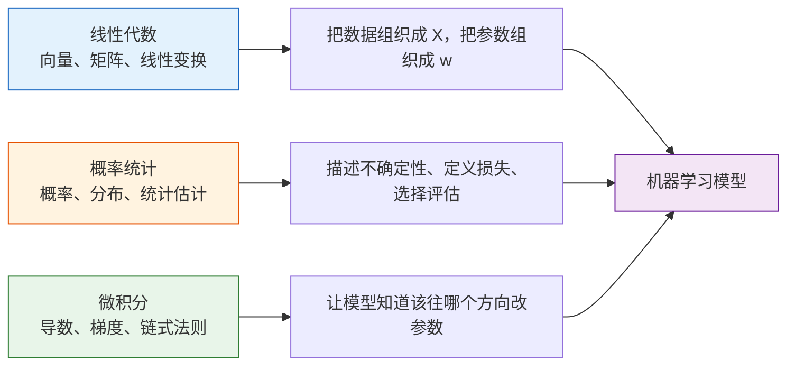
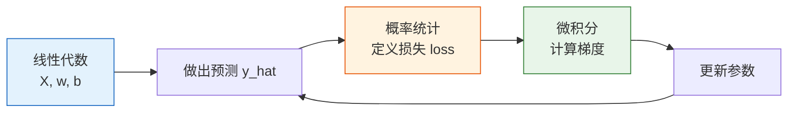
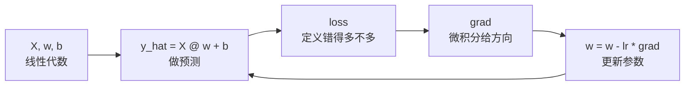

# 数学如何真正流到机器学习


:::tip 本节定位
这不是一篇新的数学课，也不是一篇具体算法课。它的任务只有一个：把第 4 站学过的数学，真正接到第 5 站的机器学习建模流程里。
:::

## 学习目标

- 看懂线性代数、概率统计、微积分在机器学习里各自负责什么
- 建立“数据矩阵 -> 预测 -> 损失 -> 梯度 -> 更新”的统一视角
- 不再把数学、代码、模型看成三套互不相干的东西
- 为后面的线性回归、逻辑回归、评估与优化做桥接

---

## 新人先掌握 / 进阶再理解

如果你是新人，这一节先抓主线：线性代数负责把数据和参数写成向量 / 矩阵，概率统计负责表达不确定性和定义损失，微积分负责告诉参数往哪边改。

如果你已经有经验，可以进一步关注这些数学对象如何在真实训练循环里对应到代码：`X @ w + b` 是预测，`loss` 是目标，`grad` 是更新方向，`lr` 是每次迈步大小。

---

## 先建立一张地图

### 先看一个故事：机器学习像开一家会学习的奶茶店

假设你开了一家奶茶店，想预测每杯饮品的销量。你会记录温度、是否周末、价格、是否有活动，这些记录就是特征。你会用历史销量判断预测准不准，这就是损失。你会根据预测偏差调整每个因素的重要性，这就是参数更新。

线性代数帮你把每天的记录排成表，概率统计帮你判断预测有多不确定、错得多不多，微积分帮你决定每个参数该往哪个方向调。机器学习不是突然冒出来的一套魔法，而是这些数学工具在同一条训练流水线里分工合作。

很多新人学完第 4 站，到了第 5 站还是会觉得像换了一门课。  
原因通常不是数学没学，而是没有把数学对象和建模动作对上。

更稳的理解方式是先记住这一张图：



如果你先抓住这张图，后面看到公式时就不容易慌，因为你知道：

- 它到底属于哪条数学主线
- 它在建模流程里到底负责什么

---

## 一、线性代数：把数据和参数组织起来

第 4 站里你已经见过：

- 向量
- 矩阵
- 矩阵乘法
- 线性变换

到了机器学习里，它们最直接的用途就是：

- 用向量表示一个样本
- 用矩阵表示一批样本
- 用参数向量表示模型要学的权重

### 1.1 一个样本为什么会被写成向量？

比如一个房子，我们可能用这些特征描述它：

- 面积
- 房间数
- 楼层

那它就可以写成一个向量：

> `x = [120, 3, 15]`

这不是为了写得高级，而是为了让模型能统一处理各种特征。

### 1.2 一批样本为什么会被写成矩阵？

当有很多房子时，我们会把它们堆成一个矩阵 `X`：

```python
import numpy as np

# 3 个样本，3 个特征
X = np.array([
    [120.0, 3.0, 15.0],
    [80.0,  2.0,  8.0],
    [150.0, 4.0, 20.0],
])

print("X 的形状:", X.shape)
print(X)
```

这时：

- 行 = 样本
- 列 = 特征

这就是后面你在 `sklearn` 里总会看到 `X.shape = (n_samples, n_features)` 的原因。

### 1.3 参数为什么也会写成向量？

如果模型认为每个特征都有一个权重，那参数也能写成向量：

```python
w = np.array([2.5, 30.0, 2.0])  # 每个特征一个权重
b = 50.0                        # 截距

pred = X @ w + b
print("预测值:", pred)
```

这里最关键的不是代码，而是意识到：

- `X` 是数据
- `w` 是模型学出来的参数
- `X @ w + b` 就是在把“特征影响”加总成一个预测

### 1.4 线性代数在第 5 站后面会出现在哪？

| 数学对象 | 在第 5 站里会出现在哪 |
|---|---|
| 向量 | 一个样本的特征表示 |
| 矩阵 | 整个训练集 `X` |
| 矩阵乘法 | 线性回归、逻辑回归、PCA |
| 特征值 / 特征向量 | PCA 降维 |

所以线性代数在机器学习里最核心的作用，不是推导，而是：

> **给数据和模型参数一个统一、可计算的表示方式。**

---

## 二、概率统计：描述不确定性，定义好坏

如果线性代数负责“把东西摆好”，那概率统计负责的是：

- 怎么描述模型输出的可信度
- 怎么定义预测错得多不多
- 怎么评估模型到底好不好

### 2.1 为什么逻辑回归会输出概率？

在线性回归里，我们预测的是连续值。  
但在分类里，我们更关心：

- 这个样本属于正类的概率有多大？

一个最小例子可以这样理解：

```python
import numpy as np

z = np.array([-2.0, -0.5, 0.0, 1.0, 3.0])
prob = 1 / (1 + np.exp(-z))

print("线性打分 z:", z)
print("概率输出:", np.round(prob, 4))
```

这里的 `prob` 就是在把“线性打分”压到 `0~1` 之间。  
所以你可以把概率统计在这里的作用理解成：

- 帮我们把模型输出变成“可解释的不确定性”

### 2.2 为什么损失函数和概率有关？

在监督学习里，我们要判断模型预测得好不好。  
这时概率统计会进入两个地方：

- 回归里：常常通过误差分布来理解 `MSE / MAE`
- 分类里：常常通过概率视角来理解交叉熵

一个非常朴素的理解方式是：

- 预测越接近真实值，损失越小
- 对真实类别越有把握，分类损失越小

### 2.3 概率统计在第 5 站里会出现在哪？

| 概率统计概念 | 在第 5 站里会出现在哪 |
|---|---|
| 概率输出 | 逻辑回归、分类阈值 |
| 分布和波动 | 数据分析、异常检测 |
| 均值 / 方差 | 标准化、偏差-方差权衡 |
| 统计评估 | 指标、交叉验证、实验比较 |

所以概率统计在机器学习里最重要的工作，不只是“算概率”，而是：

> **帮助我们表达不确定性、定义损失、比较模型。**

---

## 三、微积分：告诉模型参数该往哪里改

前面两条线解决了：

- 数据怎么表示
- 结果怎么评价

但模型还差最后一步：

- 如果结果不好，参数到底该怎么改？

这就是微积分进场的地方。

### 3.1 梯度下降最朴素的意思是什么？

你完全可以先不记公式，先记这句话：

> **如果损失大，就顺着“让损失变小”的方向，一点点改参数。**

这就是梯度下降最核心的直觉。

### 3.2 一个最小可运行的梯度下降例子

下面这个例子只做一件事：  
用最简单的线性关系 `y = wx + b`，看参数怎么被一点点学出来。

```python
import numpy as np

np.random.seed(42)
x = np.array([1.0, 2.0, 3.0, 4.0, 5.0])
y = np.array([3.2, 5.1, 7.0, 8.9, 11.1])  # 大致接近 2x + 1

w = 0.0
b = 0.0
lr = 0.05

for epoch in range(200):
    y_pred = w * x + b
    loss = np.mean((y - y_pred) ** 2)

    dw = -2 * np.mean(x * (y - y_pred))
    db = -2 * np.mean(y - y_pred)

    w -= lr * dw
    b -= lr * db

print("学到的 w:", round(w, 4))
print("学到的 b:", round(b, 4))
print("最终损失:", round(loss, 6))
```

这个例子里最值得记住的不是公式本身，而是这 4 步：

1. 先预测
2. 再算损失
3. 再算梯度
4. 最后更新参数

这 4 步就是后面深度学习训练循环的雏形。

### 3.3 微积分在第 5 站里会出现在哪？

| 微积分概念 | 在第 5 站里会出现在哪 |
|---|---|
| 导数 | 线性回归的优化 |
| 梯度 | 梯度下降更新参数 |
| 链式法则 | 这里先弱化感知，第 6 站会更重要 |
| 最优化 | 调参、训练、损失下降 |

所以微积分在这里最重要的作用是：

> **让“模型变好”从一句口号变成一个可计算、可执行的更新过程。**

---

## 四、把三条线真正合在一起

如果把一轮最小的机器学习训练拆开看，其实就是下面这几步：



你可以把它翻译成一句最重要的人话：

> **先把数据和参数组织起来，再定义“好不好”，再根据梯度一点点把参数往更好的方向推。**

这就是第 4 站数学真正流到第 5 站机器学习里的方式。

---

## 五、一个更适合新人的“读公式”方法

后面第 5 站你会越来越常看到公式。  
新人最怕的是一上来把它们看成一整块陌生符号。

更稳的读法是每次都先拆成这 4 个问题：

1. 这里的 `X`、`x`、`w`、`b` 是谁？
2. 这是在做预测，还是在算损失？
3. 这是概率 / 统计量，还是梯度 / 更新量？
4. 这一步放在训练流程里属于哪一环？

只要你这样拆，公式就会越来越像“流程语言”，而不是“符号墙”。

---

## 六、一个常见错误：把数学概念背散了

很多新人会分别记住：矩阵、概率、梯度。可是到机器学习里一看代码，还是不知道它们怎么连起来。原因通常是没有把它们放进同一个训练循环：



所以以后看到一个公式，先不要问“这个公式难不难”，而要先问：它在这条循环里是哪一步。

---

## 七、这一节的学习闭环

学完这一节后，你可以用下面这张表检查自己是否真正接上了机器学习主线：

| 层次 | 你应该能做到什么 |
|---|---|
| 直觉 | 能说清线性代数、概率统计、微积分各自在机器学习里负责什么 |
| 代码 | 能读懂 `X @ w + b`、`loss`、`grad`、`w -= lr * grad` 分别在干什么 |
| 公式 | 能把一个公式拆成数据、参数、预测、损失、更新这几类对象 |
| 后续连接 | 能理解为什么线性回归、逻辑回归、神经网络都会反复出现这条训练循环 |

---
## 八、这节最该带走什么

如果只带走一句话，我希望你记住：

> **第 4 站的数学，不是第 5 站的前置包袱，而是第 5 站每一步建模动作背后的语言。**

所以这一节最重要的收获应该是：

- 看到矩阵时，想到数据和参数怎么组织
- 看到概率和损失时，想到模型好坏怎么定义
- 看到梯度时，想到参数怎么被更新
- 不再把数学、代码、模型当成三套互相断开的东西

:::info 下一步怎么学最顺
看完这页后，最推荐直接接着学：

1. [1.4 Scikit-learn 框架入门](./02-sklearn-intro.md)
2. [2.2 线性回归](../ch02-supervised/01-linear-regression.md)
3. [4.2 评估指标](../ch04-evaluation/01-metrics.md)

这样你会最明显地感受到“数学真的开始在模型里工作了”。
:::
