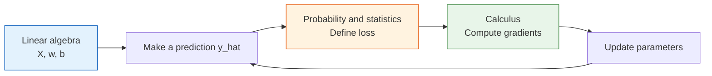
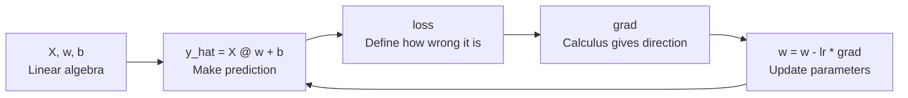

# How Mathematics Really Flows into Machine Learning


:::tip Section focus
This is not a new math lesson, and it is not a concrete algorithm lesson either. It has only one job: to connect the math you learned in Station 4 to the machine learning modeling process in Station 5.
:::

## Learning objectives

- Understand what linear algebra, probability and statistics, and calculus each do in machine learning
- Build a unified view of “data matrix -> prediction -> loss -> gradient -> update”
- Stop thinking of math, code, and models as three unrelated things
- Build a bridge for later linear regression, logistic regression, evaluation, and optimization

---

## First get the basics / then go deeper

If you are new, focus on the main thread in this section: linear algebra helps express data and parameters as vectors/matrices, probability and statistics help describe uncertainty and define loss, and calculus tells you which direction to adjust the parameters.

If you already have some experience, you can go one step further and pay attention to how these mathematical objects map to code in a real training loop: `X @ w + b` is prediction, `loss` is the objective, `grad` is the update direction, and `lr` is the size of each step.

---

## First build a map

### Start with a story: machine learning is like running a milk tea shop that learns

Suppose you run a milk tea shop and want to predict the sales of each drink. You record temperature, whether it is the weekend, the price, and whether there is a promotion. These records are features. You use historical sales to judge whether your predictions are accurate. That is loss. You adjust the importance of each factor based on prediction errors. That is parameter updating.

Linear algebra helps you organize daily records into tables, probability and statistics help you judge how uncertain the prediction is and how wrong it is, and calculus helps you decide which direction each parameter should move. Machine learning is not a magical system that appeared out of nowhere; it is these mathematical tools working together in the same training pipeline.

Many beginners, after finishing Station 4, still feel like they are taking a completely different course when they reach Station 5.
The usual reason is not that they did not learn the math, but that they never matched the mathematical objects with the modeling actions.

A more stable way to understand it is to remember this diagram first:


If you grasp this diagram first, you will not panic when you see formulas later, because you will know:

- Which mathematical thread it belongs to
- What it is responsible for in the modeling process

---

## 1. Linear algebra: organizing data and parameters

In Station 4, you already saw:

- Vectors
- Matrices
- Matrix multiplication
- Linear transformations

In machine learning, their most direct use is:

- Use vectors to represent one sample
- Use matrices to represent a batch of samples
- Use parameter vectors to represent the weights the model needs to learn

### 1.1 Why is one sample written as a vector?

For example, for a house, we might describe it with these features:

- Area
- Number of rooms
- Floor number

Then it can be written as a vector:

> `x = [120, 3, 15]`

This is not to make it look fancy, but to let the model handle different features in a unified way.

### 1.2 Why is a batch of samples written as a matrix?

When there are many houses, we stack them into a matrix `X`:

```python
import numpy as np

# 3 samples, 3 features
X = np.array([
    [120.0, 3.0, 15.0],
    [80.0,  2.0,  8.0],
    [150.0, 4.0, 20.0],
])

print("Shape of X:", X.shape)
print(X)
```

Expected output:

```text
Shape of X: (3, 3)
[[120.   3.  15.]
 [ 80.   2.   8.]
 [150.   4.  20.]]
```

Here:

- Rows = samples
- Columns = features

This is why later in `sklearn` you will keep seeing `X.shape = (n_samples, n_features)`.

### 1.3 Why are parameters also written as a vector?

If the model believes each feature has a weight, then the parameters can also be written as a vector:

```python
w = np.array([2.5, 30.0, 2.0])  # one weight per feature
b = 50.0                        # intercept

pred = X @ w + b
print("Predictions:", pred)
```

Expected output:

```text
Predictions: [470. 326. 585.]
```

The most important thing here is not the code, but realizing that:

- `X` is the data
- `w` is the model parameters learned by the model
- `X @ w + b` is summing up the “effect of features” into a prediction

:::info Decode the symbols
`X @ w` means matrix multiplication in Python. `@` is not a special ML trick; it is the operator that multiplies the feature matrix by the weight vector. `b` is the intercept, a base value added to every prediction.
:::

### 1.4 Where does linear algebra appear later in Station 5?

| Mathematical object | Where it appears in Station 5 |
|---|---|
| Vector | Feature representation of one sample |
| Matrix | The full training set `X` |
| Matrix multiplication | Linear regression, logistic regression, PCA |
| Eigenvalues / eigenvectors | PCA dimensionality reduction |

So the most important role of linear algebra in machine learning is not derivation, but:

> **Giving data and model parameters a unified, computable representation.**

---

## 2. Probability and statistics: describing uncertainty, defining quality

If linear algebra is responsible for “organizing things,” then probability and statistics are responsible for:

- How to describe the confidence of model outputs
- How to define how wrong a prediction is
- How to evaluate whether the model is actually good

### 2.1 Why does logistic regression output probabilities?

In linear regression, we predict continuous values.
But in classification, what we care more about is:

- What is the probability that this sample belongs to the positive class?

A minimal example can be understood like this:

```python
import numpy as np

z = np.array([-2.0, -0.5, 0.0, 1.0, 3.0])
prob = 1 / (1 + np.exp(-z))

print("Linear score z:", z)
print("Probability output:", np.round(prob, 4))
```

Expected output:

```text
Linear score z: [-2.  -0.5  0.   1.   3. ]
Probability output: [0.1192 0.3775 0.5    0.7311 0.9526]
```

Here, `prob` is compressing the “linear score” into the `0~1` range.
So you can understand the role of probability and statistics here as:

- Helping us turn model outputs into “interpretable uncertainty”

`z` is often called a logit in classification: it is a raw score before probability conversion. The sigmoid function is like a soft gate that turns any real number into a value between 0 and 1.

### 2.2 Why are loss functions related to probability?

In supervised learning, we need to judge whether the model’s predictions are good or bad.
At this point, probability and statistics enter in two places:

- In regression: we often understand `MSE / MAE` through the lens of an error distribution
- In classification: we often understand cross-entropy through a probabilistic perspective

A very plain way to understand this is:

- The closer the prediction is to the true value, the smaller the loss
- The more confident the model is about the true class, the smaller the classification loss

### 2.3 Where does probability and statistics appear later in Station 5?

| Probability and statistics concept | Where it appears in Station 5 |
|---|---|
| Probability output | Logistic regression, classification threshold |
| Distribution and fluctuation | Data analysis, anomaly detection |
| Mean / variance | Standardization, bias-variance tradeoff |
| Statistical evaluation | Metrics, cross-validation, experiment comparison |

So the most important job of probability and statistics in machine learning is not just “calculating probabilities,” but:

> **Helping us express uncertainty, define loss, and compare models.**

---

## 3. Calculus: telling the model which direction to adjust parameters

The first two lines solve:

- How to represent data
- How to evaluate results

But the model still lacks the last step:

- If the result is bad, how exactly should the parameters be changed?

That is where calculus comes in.

### 3.1 What is the simplest meaning of gradient descent?

You can completely skip the formula at first and just remember this sentence:

> **If the loss is large, adjust the parameters little by little in the direction that makes the loss smaller.**

That is the core intuition of gradient descent.

### 3.2 A minimal runnable example of gradient descent

The following example does only one thing:
Using the simplest linear relationship `y = wx + b`, it shows how parameters are learned step by step.

```python
import numpy as np

x = np.array([1.0, 2.0, 3.0, 4.0, 5.0])
y = np.array([3.2, 5.1, 7.0, 8.9, 11.1])  # roughly close to 2x + 1

w = 0.0
b = 0.0
lr = 0.05

for epoch in range(200):
    y_pred = w * x + b
    loss = np.mean((y - y_pred) ** 2)

    dw = -2 * np.mean(x * (y - y_pred))
    db = -2 * np.mean(y - y_pred)

    w -= lr * dw
    b -= lr * db

print("Learned w:", round(w, 4))
print("Learned b:", round(b, 4))
print("Final loss:", round(loss, 6))
```

Expected output:

```text
Learned w: 1.9654
Learned b: 1.1604
Final loss: 0.007272
```

What matters most in this example is not the formulas themselves, but these 4 steps:

1. Predict first
2. Compute the loss
3. Compute the gradient
4. Update the parameters

These 4 steps are the prototype of the training loop in later deep learning.

`lr` means learning rate. It controls how large each update step is. If it is too small, learning is slow; if it is too large, the parameters may overshoot the better point.

### 3.3 Where does calculus appear later in Station 5?

| Calculus concept | Where it appears in Station 5 |
|---|---|
| Derivative | Optimization in linear regression |
| Gradient | Updating parameters with gradient descent |
| Chain rule | We will downplay it here; it becomes more important in Station 6 |
| Optimization | Tuning, training, loss reduction |

So the most important role of calculus here is:

> **Turning “make the model better” from a slogan into a computable, executable update process.**

---

## 4. Putting the three lines together

If you break down one smallest machine learning training cycle, it is actually the following steps:


Read this image from top to bottom: the table becomes `X`, the knobs become `w`, the gap becomes `loss`, and the downhill path becomes gradient descent. This is the same story as the code above, just drawn as a training loop.



You can translate it into the most important plain-language sentence:

> **First organize the data and parameters, then define what “good” means, and then push the parameters little by little in a better direction according to the gradients.**

This is how the math from Station 4 really flows into machine learning at Station 5.

---

## 5. A reading method that is better for beginners

Later in Station 5, you will see more and more formulas.
Beginners are often most afraid of seeing them as one big block of unfamiliar symbols.

A more stable way to read them is to break them into these 4 questions every time:

1. Who are `X`, `x`, `w`, and `b` here?
2. Is this making a prediction or calculating loss?
3. Is this a probability/statistic, or a gradient/update term?
4. Which part of the training process does this step belong to?

If you break formulas down this way, they will increasingly feel like “process language” rather than a “wall of symbols.”

---

## 6. A common mistake: memorizing math concepts separately

Many beginners remember matrices, probability, and gradients separately. But when they look at code in machine learning, they still do not know how they connect. The usual reason is that they were never placed into the same training loop:



So when you see a formula in the future, do not first ask “Is this formula hard?” Instead, first ask: which step in this loop is it?

---

## 7. The learning loop for this section

After finishing this section, you can use the table below to check whether you have truly connected to the main machine learning thread:

| Level | What you should be able to do |
|---|---|
| Intuition | Clearly explain what linear algebra, probability and statistics, and calculus each do in machine learning |
| Code | Read `X @ w + b`, `loss`, `grad`, and `w -= lr * grad` and understand what each one does |
| Formula | Break a formula into data, parameters, prediction, loss, and update |
| Future connection | Understand why linear regression, logistic regression, and neural networks all repeatedly use this training loop |

---
## 8. What you should take away from this section

If you only take away one sentence, I hope you remember this:

> **The math from Station 4 is not baggage that you carry into Station 5; it is the language behind every modeling action in Station 5.**

So the most important gains from this section should be:

- When you see a matrix, think about how data and parameters are organized
- When you see probability and loss, think about how model quality is defined
- When you see gradients, think about how parameters are updated
- Stop treating math, code, and models as three disconnected systems

:::info The smoothest way to learn next
After reading this page, the best next steps are:

1. [1.4 Introduction to the Scikit-learn Framework](./02-sklearn-intro.md)
2. [2.2 Linear Regression](../ch02-supervised/01-linear-regression.md)
3. [4.2 Evaluation Metrics](../ch04-evaluation/01-metrics.md)

This is the easiest way to feel that “math has really started working inside the model.”
:::
