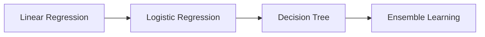

# 5.2.1 Pre-Class Guide: What Exactly Are We Learning in the Supervised Learning Chapter?

The supervised learning chapter is the main thread of Chapter 5, Machine Learning from Basics to Practice. It addresses this question:

> **When we have labeled data, how do we learn a model that can make predictions?**

## First, Build a Map

This chapter is easy to learn as “one model after another.”
But a more stable way to understand it is to see it as a progressive main line:

If you first grasp the line of “from simple to complex, from single models to multiple models,” this chapter will become much smoother to learn.

## Why Is the Learning Order in This Chapter Arranged Like This?

This line has a clear progression:

- Linear Regression: first learn the simplest continuous-value prediction
- Logistic Regression: then learn the most basic classification model
- Decision Tree: then look at nonlinearity and rule-based splitting
- Ensemble Learning: finally see how to combine multiple weak models into a stronger one
- SVM: add a classic maximum-margin path to understand the generalization intuition that “the boundary should stay a little farther from the samples”

## A Better Way for Beginners to Read This Chapter

It is recommended not to read it as “four independent algorithm explanations,” but instead to read it as these four questions:

1. If the relationship is roughly linear, can we start with the simplest model?
2. If the task becomes classification, can the linear idea still be used?
3. If the relationship is clearly nonlinear, can we switch to rule-based splitting?
4. If we want the classification boundary to be more stable, can we maximize the safe distance on both sides?
5. If a single model is not stable enough or not strong enough, can we combine many models?

This is much more likely to build a complete understanding than simply memorizing model names.

## What Habits Should You Develop While Studying This Chapter?

- Every time you learn a model, ask what kind of task it is best for
- Every time you learn a model, ask on what kind of data it is most likely to struggle
- Every time you learn a model, ask what new problem it solves compared with the previous one

That way, what you learn is not a “tool list,” but a “decision chain for model selection.”

## What Should Beginners Take Away from This Chapter?

- Know that regression and classification are two different kinds of tasks
- Know the difference between linear models and tree models
- Know why ensemble learning is often stronger
- Know that when a model performs poorly, it is not always because the algorithm is too weak; the data and features may also not have been processed well

## After Finishing This Chapter, What Should You Be Able to Answer on Your Own?

- Why linear regression is the starting point
- Why logistic regression, although called “regression,” is actually a classification model
- Why tree models are more flexible, and also more prone to overfitting
- Why ensemble tree models are often especially strong on tabular data tasks

## How Should Beginners and Advanced Learners Read This Chapter?

When beginners study this chapter for the first time, they should first focus on the main line and the smallest runnable example. You do not need to understand every detail at once. As long as you can clearly explain what problem this chapter solves, what the inputs and outputs are, and how to run the smallest project, you can keep moving forward.

Experienced learners can use this chapter as a chance to fill gaps and practice engineering skills: pay attention to boundary conditions, failure cases, evaluation methods, code reproducibility, and how this chapter connects with the stages before and after it. After reading, it is best to save the chapter’s content into your own project README or experiment notes.

## Suggested Study Time and Difficulty

| Study Mode | Suggested Time | Goal |
|---|---|---|
| Quick Scan | 20–30 minutes | Understand what problem this chapter solves and where it will be used later |
| Minimum Pass | 1–2 hours | Run a minimal example and complete the chapter’s small project exit task |
| Deep Practice | Half a day to 1 day | Add error analysis, comparison experiments, or project README notes |

## Self-Check Questions for This Chapter

| Self-Check Question | Passing Standard |
|---|---|
| What problem does this chapter solve? | You can explain its position in the whole course in one sentence |
| What are the minimum inputs and outputs? | You can clearly describe what input the example needs and what result it produces |
| Where are the common failure points? | You can list at least one cause of an error, poor performance, or misunderstanding |
| What can you save after learning it? | You can write the chapter’s output into a project README, experiment notes, or portfolio |
## Small Project Exit Task for This Chapter

After finishing this chapter, it is recommended to complete a minimum exercise: choose one of the chapter’s most core concepts or tools and produce a small result that can run, be screenshotted, and be written into a README. It does not need to be complex, but it should clearly show what the input is, what the process is, and what the output result is.

## Passing Standard

By the end of this chapter, you should be able to explain in your own words what problem this chapter solves, how it relates to the learning stations before and after it, and complete the minimum version of the chapter’s small project exit task.

If you can also record one common mistake, one debugging process, or one result improvement, then it means you have not just “read the content,” but have started turning this chapter into your own project experience.
