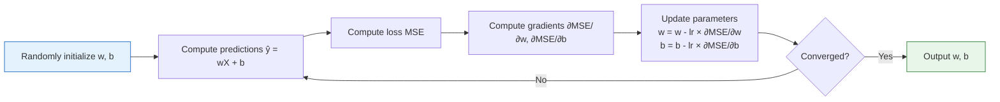
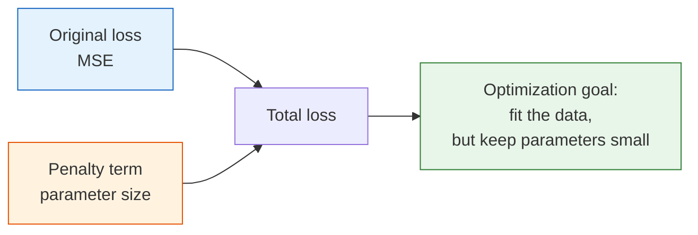
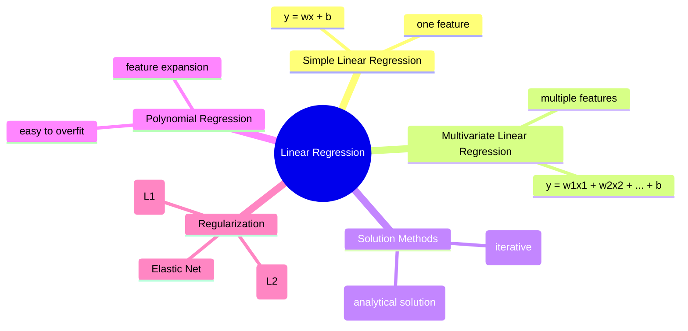

# Linear Regression


:::tip Section Focus
Linear regression is the **simplest and most important** machine learning algorithm. It is the foundation for understanding all later algorithms—logistic regression, neural networks, and even the core ideas behind GPT all show traces of it.
:::

## Learning Objectives

- Understand simple linear regression and multivariate linear regression
- Master the least squares method and the normal equation
- Understand gradient descent as a solution method (connected to Station 4)
- Master polynomial regression and overfitting
- Understand regularization (Ridge, Lasso, Elastic Net)

## First, set a very important learning expectation

This section is long, and it is easy for beginners to think they must learn many things at once:

- regression tasks
- loss functions
- normal equation
- gradient descent
- polynomial regression
- regularization

But the most appropriate first goal for beginners is actually only one:

> **First, make the main line clear: “How does a machine learning model go from task definition to loss, optimization, evaluation, and improvement?”**

If you understand that main line, logistic regression, neural networks, and many more complex models will make much more sense later.

---

## Build a map first

When learning linear regression for the first time, two situations are most common:

- You can write the formulas, but you do not know what problem each step is solving
- You can call `LinearRegression()`, but you do not know why you should start with a baseline, why residuals matter, or why regularization can prevent overfitting

A more stable learning order is:


Read this comic before the formulas: the line is an adjustable ruler, residuals are the vertical gaps from points to the line, MSE turns those gaps into a training objective, and regularization is the brake that stops a flexible model from bending too much.

If you first grasp this line, all the formulas later will be easier to connect to a clear problem.

:::tip Run setup first
This section uses `numpy`, `matplotlib`, `pandas`, and `scikit-learn`. If your environment is new, run `python -m pip install -r requirements-course-core.txt` from the project root first. `pandas` is the table-processing library used for the multivariate example below.
:::

---

## 1. Simple Linear Regression

### 1.1 Intuition: Find the "best fit line"

**Problem**: Given data about house area and price, can we predict the price for a new area?

```python
import numpy as np
import matplotlib.pyplot as plt

# Simulated data: area → price
rng = np.random.default_rng(seed=42)
X = rng.uniform(50, 200, 30)    # Area (square meters)
y = 2.5 * X + 50 + rng.normal(size=30) * 30  # Price (10,000 yuan)

plt.figure(figsize=(8, 5))
plt.scatter(X, y, color='steelblue', s=50, alpha=0.7)
plt.xlabel('Area (square meters)')
plt.ylabel('Price (10,000 yuan)')
plt.title('House Area vs Price')
plt.grid(True, alpha=0.3)
plt.show()
```

**Goal**: Find a straight line `y = wx + b` that gets as close as possible to all the data points.

- **w** (weight) = slope = how much the price increases when area increases by 1 square meter
- **b** (bias) = intercept = the base price when area is 0

### 1.1.1 What exactly do these two parameters control?

You can think of the line as a stick that can be rotated and moved up and down:

- `w` controls how steep the stick is
- `b` controls whether the whole stick shifts up or down

So the essence of linear regression training is to keep adjusting these two values until the line fits the data points as well as possible.

### 1.1.2 A more beginner-friendly analogy

You can think of linear regression like this:

- You are holding a ruler that can rotate and move up and down
- You want this ruler to fit the points in front of you as closely as possible

The most important thing to remember first is not the formula, but this:

- `w` decides how slanted the ruler is
- `b` decides whether the ruler shifts upward or downward overall
- Training is the repeated fine-tuning of these two knobs

:::info The most important sentence to remember
Linear regression is not about “memorizing formulas”; it is doing something very simple: **finding a rule that can describe, as stably as possible, how the input changes relate to how the output changes.**
:::

### 1.2 What is "best"? — The loss function

"Fits closely" needs a mathematical definition. We use **Mean Squared Error (MSE)**:

> **MSE = (1/n) × Σ(yi - ŷi)²**

where `ŷi = w×xi + b` is the model prediction.

**Intuition**: Square each prediction error, then take the average. The smaller the MSE, the better the fit.

### 1.3 Why do we usually square the error first?

This step is very important because it determines what we are actually penalizing.

- After squaring, the value is always positive, so positive and negative errors do not cancel out
- Large errors are amplified, so the model works harder to correct points that are far off
- The squared form is easy to differentiate, which helps us get analytical solutions and gradient descent formulas

But it also has one side effect:

- If the data contains extreme outliers, MSE will be strongly dominated by them

So when beginners do regression projects for the first time, it is good to remember:

- Use `MSE / RMSE` by default
- If you suspect many outliers, then consider `MAE`

### 1.3.1 Keyword decoder for regression metrics

| Term | What it means | Why it matters |
|---|---|---|
| `baseline` | The first simple model used for comparison | You need a starting point before claiming a better model is really better |
| `residual` | `true value - predicted value` | Residual plots reveal patterns that a single score can hide |
| `MSE` | Mean Squared Error | Penalizes large errors strongly; useful as an optimization target |
| `RMSE` | Root Mean Squared Error | Square root of MSE; returns to the same unit as the target |
| `MAE` | Mean Absolute Error | More robust when outliers should not dominate |
| `R²` | Proportion of target variation explained by the model | Useful for a quick fit-quality summary, but not enough for diagnosis |

```python
def mse_loss(y_true, y_pred):
    """Mean squared error"""
    return np.mean((y_true - y_pred) ** 2)

# Try several different lines
fig, axes = plt.subplots(1, 3, figsize=(15, 4))
params = [(1.0, 100, 'Slope too small'), (2.5, 50, 'Just right'), (4.0, -50, 'Slope too large')]

for ax, (w, b, title) in zip(axes, params):
    y_pred = w * X + b
    loss = mse_loss(y, y_pred)
    ax.scatter(X, y, color='steelblue', s=30, alpha=0.7)
    x_line = np.linspace(40, 210, 100)
    ax.plot(x_line, w * x_line + b, 'r-', linewidth=2)
    ax.set_title(f'{title}\nw={w}, b={b}, MSE={loss:.0f}')
    ax.set_xlabel('Area')
    ax.set_ylabel('Price')
    ax.grid(True, alpha=0.3)

plt.tight_layout()
plt.show()
```

In this example, the middle line usually has the smallest MSE:

```text
Slope too small: MSE ≈ 28463
Just right: MSE ≈ 575
Slope too large: MSE ≈ 14502
```

---

## 2. Solution Method 1: Normal Equation (Analytical Solution)

### 2.1 Formula

For linear regression, MSE has a **closed-form solution**:

> **w = (Xᵀ X)⁻¹ Xᵀ y**

This is the **Normal Equation**.

### 2.2 Manual implementation

```python
# Prepare the data (add an intercept column)
X_b = np.c_[np.ones(len(X)), X]  # Add a column of 1s before X (for intercept b)
print(f"X_b shape: {X_b.shape}")  # (30, 2)

# Solve using the normal equation
w = np.linalg.inv(X_b.T @ X_b) @ X_b.T @ y
b_fit, w_fit = w[0], w[1]
print(f"Intercept b = {b_fit:.2f}")
print(f"Slope w = {w_fit:.2f}")

# Visualization
plt.figure(figsize=(8, 5))
plt.scatter(X, y, color='steelblue', s=50, alpha=0.7, label='Data points')
x_line = np.linspace(40, 210, 100)
plt.plot(x_line, w_fit * x_line + b_fit, 'r-', linewidth=2,
         label=f'Fit line: y = {w_fit:.2f}x + {b_fit:.2f}')
plt.xlabel('Area (square meters)')
plt.ylabel('Price (10,000 yuan)')
plt.title('Solving Linear Regression with the Normal Equation')
plt.legend()
plt.grid(True, alpha=0.3)
plt.show()
```

Expected output:

```text
X_b shape: (30, 2)
Intercept b = 57.36
Slope w = 2.47
```

### 2.3 Pros and cons of the normal equation

| Pros | Cons |
|------|------|
| Computes the result directly, no iteration needed | Requires matrix inversion, complexity is O(n³) |
| No need to tune a learning rate | Very slow when the number of features is large |
| Always finds the global optimum | Cannot be used when features > samples |

### 2.4 When should you think of the normal equation first?

You can think of the normal equation as the “compute the answer directly” approach. It is best when:

- the number of features is small
- the dataset is not large
- you want to quickly verify whether a linear relationship exists

When you first build a small regression baseline, the normal equation or `sklearn` linear regression is usually a good fit.
But if you move into these scenarios, it becomes more natural to switch to gradient descent thinking:

- high-dimensional features
- a noticeably larger dataset
- you need to connect it to neural network training later
- you are no longer trying to “calculate one answer,” but instead want to “enter a unified training framework”

---

## 3. Solution Method 2: Gradient Descent

### 3.1 Connection to Station 4

In the calculus chapter of Station 4, you already learned the principle of gradient descent. Now apply it to linear regression:



### 3.1.1 Don’t rush to memorize the gradient formulas; first see what they mean

The core meaning of gradient descent is not “there are many formulas,” but this:

- Use the current parameters to make a prediction
- See how far the prediction is from the true value
- Decide which direction the parameters should move
- Adjust a little each time
- Repeat many times

If you understand these five steps, then `dw` and `db` are no longer just symbols. They mean:

- `dw` tells us which direction the slope should move
- `db` tells us whether the whole line should move up or down

### 3.2 Gradient derivation

The gradients of MSE with respect to w and b are:

> **∂MSE/∂w = -(2/n) × Σ xi(yi - ŷi)**
>
> **∂MSE/∂b = -(2/n) × Σ (yi - ŷi)**

### 3.3 Implement from scratch

```python
# Solve linear regression with gradient descent

# Parameter initialization
w_gd = 0.0
b_gd = 0.0
lr = 0.00005   # Learning rate (note: when feature values are large, the learning rate should be small)
epochs = 500

# Track training process
history = {'loss': [], 'w': [], 'b': []}

for epoch in range(epochs):
    # Forward: prediction
    y_pred = w_gd * X + b_gd

    # Compute loss
    loss = mse_loss(y, y_pred)

    # Compute gradients
    dw = -2 * np.mean(X * (y - y_pred))
    db = -2 * np.mean(y - y_pred)

    # Update parameters
    w_gd -= lr * dw
    b_gd -= lr * db

    history['loss'].append(loss)
    history['w'].append(w_gd)
    history['b'].append(b_gd)

print(f"Gradient descent result: w = {w_gd:.2f}, b = {b_gd:.2f}")
print(f"Normal equation result: w = {w_fit:.2f}, b = {b_fit:.2f}")

# Visualize training process
fig, axes = plt.subplots(1, 3, figsize=(15, 4))

axes[0].plot(history['loss'])
axes[0].set_title('Loss curve')
axes[0].set_xlabel('Epoch')
axes[0].set_ylabel('MSE')
axes[0].set_yscale('log')

axes[1].plot(history['w'], label='w')
axes[1].axhline(y=w_fit, color='r', linestyle='--', label=f'Optimal w={w_fit:.2f}')
axes[1].set_title('Convergence of w')
axes[1].legend()

axes[2].plot(history['b'], label='b')
axes[2].axhline(y=b_fit, color='r', linestyle='--', label=f'Optimal b={b_fit:.2f}')
axes[2].set_title('Convergence of b')
axes[2].legend()

for ax in axes:
    ax.grid(True, alpha=0.3)

plt.tight_layout()
plt.show()
```

Expected output:

```text
Gradient descent result: w = 2.86, b = 0.29
Normal equation result: w = 2.47, b = 57.36
```

Notice that this simple gradient-descent demo does not fully match the normal equation yet because `X` is large and the learning rate is deliberately tiny. This is a teaching choice: it lets you see the update loop without numerical explosion. In real projects, standardize features before gradient descent so the update steps are easier to tune.

---

## 4. Multivariate Linear Regression

### 4.1 From one feature to multiple features

In real problems, house price depends not only on area, but also on number of rooms, floor, distance to the subway, and so on.

> **ŷ = w₁x₁ + w₂x₂ + ... + wpxp + b = wᵀx + b**

### 4.1.1 What is the real upgrade in multivariate linear regression?

When beginners first see multivariate linear regression, they often think the model suddenly became much more complex.
In fact, the core problem has not changed. We just moved from:

- “one input determines the output”

to:

- “multiple inputs contribute linearly to the output together”

The real upgrade is only two things:

- the parameter changes from one `w` to a group of `w1, w2, ..., wp`
- we must now carefully handle feature scaling, multicollinearity, and feature interpretation

So multivariate linear regression is not a different algorithm; it is the natural form of linear regression in real data scenarios.

### 4.2 Implement with Scikit-learn

```python
from sklearn.linear_model import LinearRegression
from sklearn.model_selection import train_test_split
from sklearn.metrics import mean_squared_error, r2_score
import pandas as pd

# Simulated multi-feature house price data
rng = np.random.default_rng(seed=42)
n = 200
data = pd.DataFrame({
    'Area': rng.uniform(50, 200, n),
    'Rooms': rng.integers(1, 6, n),
    'Floor': rng.integers(1, 30, n),
    'DistanceToSubway(km)': rng.uniform(0.1, 5, n),
})
# True relationship + noise
data['Price'] = (2.5 * data['Area']
               + 30 * data['Rooms']
               + 2 * data['Floor']
               - 20 * data['DistanceToSubway(km)']
               + 50
               + rng.normal(size=n) * 30)

print(data.head())
print(f"\nData shape: {data.shape}")

# Prepare data
X = data[['Area', 'Rooms', 'Floor', 'DistanceToSubway(km)']].values
y = data['Price'].values

X_train, X_test, y_train, y_test = train_test_split(X, y, test_size=0.2, random_state=42)

# Train the model
model = LinearRegression()
model.fit(X_train, y_train)

# Inspect learned parameters
print("\nModel parameters:")
for name, coef in zip(['Area', 'Rooms', 'Floor', 'DistanceToSubway(km)'], model.coef_):
    print(f"  {name}: {coef:.2f}")
print(f"  Intercept: {model.intercept_:.2f}")

# Evaluate
y_pred = model.predict(X_test)
print(f"\nMSE: {mean_squared_error(y_test, y_pred):.2f}")
print(f"R² Score: {r2_score(y_test, y_pred):.4f}")
```

Expected output will be close to:

```text
Data shape: (200, 5)

Model parameters:
  Area: 2.52
  Rooms: 31.38
  Floor: 1.78
  DistanceToSubway(km): -21.83
  Intercept: 48.11

MSE: 860.36
R² Score: 0.9328
```

### 4.3 R² score

R² is one of the most commonly used evaluation metrics for regression models:

> **R² = 1 - Σ(yi - ŷi)² / Σ(yi - ȳ)²**

| R² value | Meaning |
|-------|------|
| 1.0 | Perfect fit |
| 0.8~1.0 | Very good model |
| 0.5~0.8 | Average model |
| < 0.5 | Poor model |
| < 0 | Worse than predicting the mean directly |

```python
# Visualize prediction vs actual
plt.figure(figsize=(6, 6))
plt.scatter(y_test, y_pred, alpha=0.6, s=30, color='steelblue')
plt.plot([y_test.min(), y_test.max()], [y_test.min(), y_test.max()],
         'r--', linewidth=2, label='Perfect prediction line')
plt.xlabel('Actual price')
plt.ylabel('Predicted price')
plt.title(f'Prediction vs Actual (R² = {r2_score(y_test, y_pred):.4f})')
plt.legend()
plt.grid(True, alpha=0.3)
plt.axis('equal')
plt.tight_layout()
plt.show()
```

---

## 5. Polynomial Regression — When the Data Is Not a Straight Line

### 5.1 Problem: a straight line is not enough

```python
# Generate nonlinear data
rng = np.random.default_rng(seed=42)
X_nl = np.linspace(-3, 3, 50)
y_nl = 0.5 * X_nl**2 - X_nl + 2 + rng.normal(size=50) * 0.8

# Force a linear regression fit
lr = LinearRegression()
lr.fit(X_nl.reshape(-1, 1), y_nl)
y_pred_linear = lr.predict(X_nl.reshape(-1, 1))

plt.figure(figsize=(8, 5))
plt.scatter(X_nl, y_nl, color='steelblue', s=30, alpha=0.7)
plt.plot(X_nl, y_pred_linear, 'r-', linewidth=2, label='Linear regression (underfitting)')
plt.title('A straight line cannot fit curved data')
plt.legend()
plt.grid(True, alpha=0.3)
plt.show()
```

### 5.2 Polynomial regression

**Idea**: Expand the original feature `x` into `[x, x², x³, ...]`, then still use linear regression.

```python
from sklearn.preprocessing import PolynomialFeatures

# Create polynomial features
poly = PolynomialFeatures(degree=2, include_bias=False)
X_poly = poly.fit_transform(X_nl.reshape(-1, 1))
print(f"Original features: {X_nl[:3]}")
print(f"Polynomial features:\n{X_poly[:3]}")  # [x, x²]

# Fit polynomial features with linear regression
lr_poly = LinearRegression()
lr_poly.fit(X_poly, y_nl)
y_pred_poly = lr_poly.predict(X_poly)

plt.figure(figsize=(8, 5))
plt.scatter(X_nl, y_nl, color='steelblue', s=30, alpha=0.7)
plt.plot(X_nl, y_pred_linear, 'r--', linewidth=2, label='Linear regression')
plt.plot(X_nl, y_pred_poly, 'g-', linewidth=2, label='Polynomial regression (degree=2)')
plt.title('Polynomial regression can fit curves')
plt.legend()
plt.grid(True, alpha=0.3)
plt.show()
```

Expected output for the feature expansion:

```text
Original features: [-3.         -2.87755102 -2.75510204]
Polynomial features:
[[-3.          9.        ]
 [-2.87755102  8.28029988]
 [-2.75510204  7.59058726]]
```

### 5.3 Polynomial degree and overfitting

```python
fig, axes = plt.subplots(2, 3, figsize=(15, 9))

degrees = [1, 2, 3, 5, 10, 18]
x_smooth = np.linspace(-3.2, 3.2, 200)

for ax, deg in zip(axes.ravel(), degrees):
    poly = PolynomialFeatures(degree=deg, include_bias=False)
    X_p = poly.fit_transform(X_nl.reshape(-1, 1))
    X_s = poly.transform(x_smooth.reshape(-1, 1))

    lr = LinearRegression()
    lr.fit(X_p, y_nl)

    y_s = lr.predict(X_s)
    y_s = np.clip(y_s, -10, 20)  # Prevent extreme values

    train_score = lr.score(X_p, y_nl)

    ax.scatter(X_nl, y_nl, color='steelblue', s=20, alpha=0.6)
    ax.plot(x_smooth, y_s, 'r-', linewidth=2)
    ax.set_title(f'degree = {deg}, R² = {train_score:.3f}')
    ax.set_ylim(-5, 15)
    ax.grid(True, alpha=0.3)

plt.suptitle('Polynomial degree and overfitting', fontsize=14, y=1.02)
plt.tight_layout()
plt.show()
```

:::warning Overfitting Warning
The higher the degree, the closer the training-set R² may get to 1, but the model may perform very poorly on new data. This is **overfitting**. Solution: regularization.
:::

### 5.4 The easiest place to get confused when learning polynomial regression

When beginners first reach this part, they often mistakenly think:

- “If the curve looks prettier, the model must be better”

But the real question should be:

- After the training set gets better, does the test set also improve?
- As model complexity increases, does generalization get worse?

So the most valuable teaching point of polynomial regression is not “it can draw a more curved line,” but that it shows very intuitively:

- too simple a model underfits
- too complex a model overfits
- model performance is not judged by the training set alone

---

## 6. Regularization — Preventing Overfitting

### 6.1 The idea behind regularization

Regularization = add a **penalty term** to the loss function to penalize overly large parameter values.



**Intuition**: Penalize large parameters → simpler model → reduced overfitting.

For regularized linear models, feature scale matters. If one feature has much larger numeric values than another, the penalty will not treat them fairly. That is why the code below uses `Pipeline(PolynomialFeatures -> StandardScaler -> Ridge/Lasso/ElasticNet)`.

### 6.2 Three types of regularization

| Method | Penalty term | Effect |
|------|--------|------|
| **Ridge (L2)** | `α × Σ(wi²)` | Parameters shrink but do not become zero |
| **Lasso (L1)** | `α × Σ|wi|` | Some parameters become zero (feature selection) |
| **Elastic Net** | A mix of L1 and L2 | Combines the strengths of both |

### 6.3 Ridge regression (L2 regularization)

```python
from sklearn.pipeline import make_pipeline
from sklearn.preprocessing import StandardScaler
from sklearn.linear_model import Ridge

# Compare high-degree polynomial + Ridge
X_base = X_nl.reshape(-1, 1)
X_smooth_base = x_smooth.reshape(-1, 1)

fig, axes = plt.subplots(1, 3, figsize=(15, 4))
alphas = [0, 0.1, 10]
titles = ['No regularization (α=0)', 'Ridge α=0.1', 'Ridge α=10']

for ax, alpha, title in zip(axes, alphas, titles):
    if alpha == 0:
        model = make_pipeline(
            PolynomialFeatures(degree=10, include_bias=False),
            StandardScaler(),
            LinearRegression()
        )
    else:
        model = make_pipeline(
            PolynomialFeatures(degree=10, include_bias=False),
            StandardScaler(),
            Ridge(alpha=alpha)
        )

    model.fit(X_base, y_nl)
    y_s = np.clip(model.predict(X_smooth_base), -10, 20)

    ax.scatter(X_nl, y_nl, color='steelblue', s=20, alpha=0.6)
    ax.plot(x_smooth, y_s, 'r-', linewidth=2)
    ax.set_title(title)
    ax.set_ylim(-5, 15)
    ax.grid(True, alpha=0.3)

plt.suptitle('Effect of Ridge regularization (degree=10)', fontsize=13)
plt.tight_layout()
plt.show()
```

### 6.4 Lasso regression (L1 regularization) — automatic feature selection

```python
from sklearn.linear_model import Lasso

# Lasso can make some parameters zero → automatic feature selection
ridge = make_pipeline(
    PolynomialFeatures(degree=10, include_bias=False),
    StandardScaler(),
    Ridge(alpha=1.0)
)
ridge.fit(X_base, y_nl)

lasso = make_pipeline(
    PolynomialFeatures(degree=10, include_bias=False),
    StandardScaler(),
    Lasso(alpha=0.1, max_iter=20000)
)
lasso.fit(X_base, y_nl)

ridge_coef = ridge.named_steps["ridge"].coef_
lasso_coef = lasso.named_steps["lasso"].coef_

# Visualize parameters
fig, axes = plt.subplots(1, 2, figsize=(12, 4))

axes[0].bar(range(len(ridge_coef)), np.abs(ridge_coef), color='steelblue')
axes[0].set_title('Ridge parameters (all non-zero)')
axes[0].set_xlabel('Feature index')
axes[0].set_ylabel('|parameter value|')

axes[1].bar(range(len(lasso_coef)), np.abs(lasso_coef), color='coral')
axes[1].set_title('Lasso parameters (some are zero → feature selection)')
axes[1].set_xlabel('Feature index')
axes[1].set_ylabel('|parameter value|')

for ax in axes:
    ax.grid(axis='y', alpha=0.3)

plt.tight_layout()
plt.show()

# See which features Lasso kept
print("Lasso coefficients:", np.round(lasso_coef, 4))
print(f"Number of non-zero coefficients: {np.sum(lasso_coef != 0)} / {len(lasso_coef)}")
```

Expected output:

```text
Lasso coefficients: [-1.5605  1.1533 -0.      0.1151 -0.      0.     -0.      0.     -0.      0.    ]
Number of non-zero coefficients: 3 / 10
```

### 6.5 Elastic Net

```python
from sklearn.linear_model import ElasticNet

# Elastic Net = a mix of L1 and L2
# l1_ratio controls the ratio of L1 and L2 (1.0 = pure Lasso, 0.0 = pure Ridge)
en = make_pipeline(
    PolynomialFeatures(degree=10, include_bias=False),
    StandardScaler(),
    ElasticNet(alpha=0.1, l1_ratio=0.5, max_iter=20000)
)
en.fit(X_base, y_nl)
en_coef = en.named_steps["elasticnet"].coef_

print("Elastic Net coefficients:", np.round(en_coef, 4))
print(f"Number of non-zero coefficients: {np.sum(en_coef != 0)} / {len(en_coef)}")
```

Expected output:

```text
Elastic Net coefficients: [-1.3582  0.8776 -0.2011  0.3548 -0.      0.0579 -0.      0.     -0.      0.    ]
Number of non-zero coefficients: 5 / 10
```

### 6.6 Summary of regularization comparison

| | Ridge (L2) | Lasso (L1) | Elastic Net |
|---|-----------|-----------|-------------|
| Penalty term | `α × Σ(wi²)` | `α × Σ\|wi\|` | Weighted combination of both |
| Parameter effect | Shrinks but not to zero | Some become zero | Some become zero |
| Use cases | All features are useful | Many useless features | Many features with correlations |
| sklearn class | `Ridge` | `Lasso` | `ElasticNet` |

---

## 7. Full Practice: Diabetes Dataset

```python
from sklearn.datasets import load_diabetes
from sklearn.model_selection import train_test_split
from sklearn.linear_model import LinearRegression, Ridge, Lasso
from sklearn.preprocessing import StandardScaler
from sklearn.pipeline import make_pipeline
from sklearn.metrics import mean_squared_error, r2_score
import matplotlib.pyplot as plt

# Load data
diabetes = load_diabetes()
X, y = diabetes.data, diabetes.target
print(f"Dataset: {X.shape[0]} samples, {X.shape[1]} features")
print(f"Feature names: {diabetes.feature_names}")

# Split data
X_train, X_test, y_train, y_test = train_test_split(X, y, test_size=0.2, random_state=42)

# Compare multiple models
models = {
    "Linear Regression": make_pipeline(StandardScaler(), LinearRegression()),
    "Ridge α=1": make_pipeline(StandardScaler(), Ridge(alpha=1.0)),
    "Ridge α=10": make_pipeline(StandardScaler(), Ridge(alpha=10.0)),
    "Lasso α=0.1": make_pipeline(StandardScaler(), Lasso(alpha=0.1, max_iter=10000)),
    "Lasso α=1": make_pipeline(StandardScaler(), Lasso(alpha=1.0, max_iter=10000)),
}

results = {}
for name, model in models.items():
    model.fit(X_train, y_train)
    y_pred = model.predict(X_test)
    mse = mean_squared_error(y_test, y_pred)
    r2 = r2_score(y_test, y_pred)
    results[name] = {'MSE': mse, 'R²': r2}
    print(f"{name:15s} | MSE: {mse:.1f} | R²: {r2:.4f}")

# Visualize R² comparison
fig, ax = plt.subplots(figsize=(10, 5))
names = list(results.keys())
r2_scores = [v['R²'] for v in results.values()]
colors = ['steelblue', 'coral', 'coral', 'seagreen', 'seagreen']
bars = ax.bar(names, r2_scores, color=colors, alpha=0.8)

for bar, score in zip(bars, r2_scores):
    ax.text(bar.get_x() + bar.get_width()/2, bar.get_height() + 0.005,
            f'{score:.4f}', ha='center', fontsize=10)

ax.set_ylabel('R² Score')
ax.set_title('Comparison of Different Regularization Methods (Diabetes Dataset)')
ax.set_ylim(0, 0.6)
ax.grid(axis='y', alpha=0.3)
plt.xticks(rotation=15)
plt.tight_layout()
plt.show()
```

Example terminal output:

```text
Dataset: 442 samples, 10 features
Feature names: ['age', 'sex', 'bmi', 'bp', 's1', 's2', 's3', 's4', 's5', 's6']
Linear Regression | MSE: 2900.2 | R²: 0.4526
Ridge α=1      | MSE: 2892.0 | R²: 0.4541
Ridge α=10     | MSE: 2875.8 | R²: 0.4572
Lasso α=0.1    | MSE: 2884.6 | R²: 0.4555
Lasso α=1      | MSE: 2824.6 | R²: 0.4669
```

### 7.1 After finishing this section, what should you do next?

If you have just learned linear regression, the most stable next step is not to rush into more complex models, but to first practice this minimal modeling chain:

1. Confirm whether the target is continuous
2. Build a linear regression baseline first
3. Check training and test errors
4. Check the residual plot and `R²`
5. If underfitting happens, consider feature engineering or a more complex model
6. If overfitting happens, consider regularization, cross-validation, and tuning

This chain is actually the prototype of the entire machine learning project workflow.


When reading this chart, do not stare only at `R²`. First check whether the residuals are randomly scattered; if the residuals show a curved pattern, the model may be underfitting; if a few points have very large errors, check for outliers first; if the error grows as the prediction grows, you may need to transform the target or use a different metric.

### 7.2 If this is your first regression problem, what is the safest default order?

When solving a regression problem for the first time, do not rush to compare many models.
A more stable order is usually:

1. First confirm the target is continuous
2. Build a linear regression baseline first
3. Check `RMSE / MAE / R²`
4. Then see whether the residual plot has a clear pattern
5. Then decide whether to improve features, add regularization, or switch to a more complex model

If you practice these 5 steps well, then you have truly learned this linear regression section.

---

## Summary



| Key Point | Explanation |
|------|------|
| Core idea | Find a linear function to fit the data and minimize MSE |
| Normal equation | Solve directly; fast for small data, slow for large data |
| Gradient descent | Iterative solution; friendly for large data |
| Polynomial regression | Use higher-order features to fit nonlinear data |
| Regularization | Penalize large parameters to prevent overfitting |

## What should you take away most from this section?

If you only remember one sentence, I hope it is this:

> **The most important thing about linear regression is not the line itself, but that it is the first time you connect the entire machine learning thinking chain: modeling, loss, optimization, diagnosis, and generalization.**

So after finishing this section, the real gains should be:

- know what a baseline is
- know why we define the loss first
- know that the normal equation and gradient descent solve the same problem
- know that more complex is not always better
- know that evaluation and diagnosis determine what you do next

:::info Connection to later sections
- **Next section**: Logistic regression — from regression to classification, just add a Sigmoid
- **Review Station 4**: Gradient descent (Section 3.3), cross-entropy (Section 2.4)
:::

---

## Hands-on Exercises

### Exercise 1: Implement gradient descent manually

Use the multi-feature house price data above, and manually implement gradient descent for multivariate linear regression (hint: standardize the features first).

### Exercise 2: Regularization tuning

Using the `load_diabetes()` dataset, try different Ridge alpha values (0.01, 0.1, 1, 10, 100), plot the relationship between alpha and test-set R², and find the best alpha.

### Exercise 3: Polynomial degree selection

Generate nonlinear data, fit polynomial regression with different degrees, compute training-set and test-set R² separately, and plot a “degree vs R²” chart to observe where overfitting begins.
