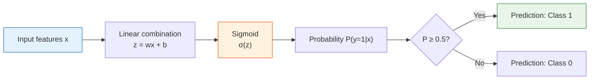
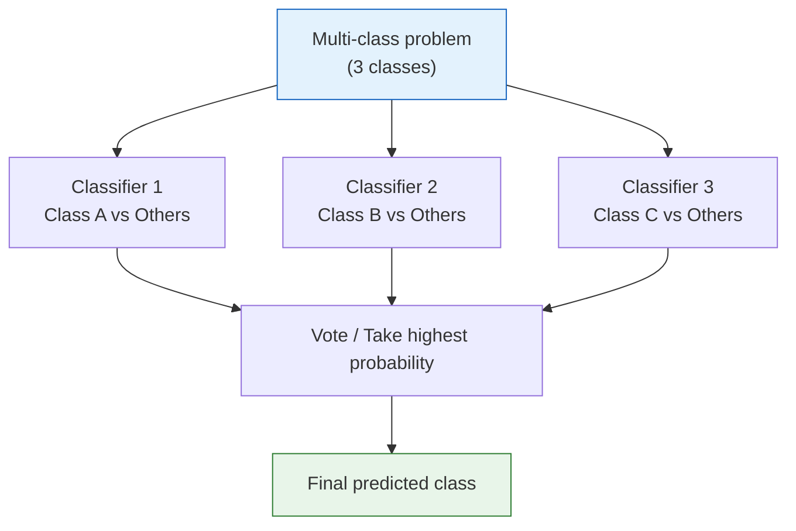

# Logistic Regression


:::tip Section Positioning
Although the name includes "regression," logistic regression is actually a **classification** algorithm. It adds a Sigmoid function on top of linear regression so continuous values can be mapped to probabilities. This is one of the most classic classification algorithms, and it is also key to understanding neural networks.
:::

## Learning Objectives

- Understand the transition from linear regression to classification
- Master the Sigmoid function and decision boundaries
- Understand the cross-entropy loss function (and connect it with Information Theory in Station 4)
- Master multi-class extensions (One-vs-Rest, Softmax)
- Implement logistic regression with Scikit-learn

## First, set a very important learning expectation

This section is very easy for beginners to get stuck on three words at once:

- `Sigmoid`
- `Cross-Entropy`
- `Decision Boundary`

But for first-time learning, the goal is not to fully derive everything right away. Instead, it is to first see this main thread clearly:

> **Linear regression learns continuous values, logistic regression learns probabilities, and then turns probabilities into classification decisions.**

As long as this thread is established first, cross-entropy, thresholds, and Softmax will all be easier to place later.

---

## Build a map first

For beginners, the best way to understand this section is not “linear regression + Sigmoid and that’s it,” but to first see its place in the classification pipeline:


What this section really needs to explain is:

- Why classification tasks cannot directly use linear regression
- Is logistic regression learning probabilities, or learning boundaries?
- Why does it become the bridge to neural networks later?

### Keyword Decoder

| Term | What it means in this section | Why it matters in real projects |
|------|------|------|
| `logit` | The raw score `z = wᵀx + b` before Sigmoid | It is not yet a probability, so you should not compare it directly with business thresholds |
| `Sigmoid` | A squashing function that maps any real number to `(0, 1)` | It turns a raw score into a probability-like value |
| `BCE` | Binary Cross-Entropy, the loss for binary probability prediction | It strongly punishes confident wrong predictions |
| `OvR` | One-vs-Rest, one binary classifier per class | Useful when you want to understand or control multi-class classification as several yes/no questions |
| `Softmax` | A function that turns several scores into probabilities that sum to 1 | Common for multi-class classification and neural networks |
| `threshold` | The probability cutoff used to turn probability into a class | Changing it trades recall against false alarms |
| `solver` | The numerical optimizer used by sklearn to find the parameters | Some optimizers support different regularization styles |
| `C` | Inverse regularization strength in sklearn logistic regression | Smaller `C` means stronger regularization and usually simpler coefficients |

## 1. From Regression to Classification

### 1.1 Problem: the output is no longer a number

| Linear Regression | Logistic Regression |
|---------|---------|
| Predicts continuous values (house prices, temperature) | Predicts categories (spam/normal, cat/dog) |
| Output: any real number | Output: probability [0, 1] |

**Key question**: the output of linear regression, `wx + b`, can be any real number, but probability must be between [0, 1]. How do we convert it?

### 1.2 Why does “forcing linear regression into classification” cause problems?

What is worth remembering first is not “the formulas are different,” but:

- The output of linear regression has no probabilistic meaning

For example, the predicted value may be:

- `1.7`
- `-0.4`

If you interpret that as “the probability of being the positive class,” it immediately becomes strange.
So the first thing logistic regression really solves is not “changing the boundary,” but:

- **making the output into a probability first**

### 1.2.1 A more beginner-friendly analogy

You can think of it like this:

- Linear regression is like directly giving a “score”
- Logistic regression first tells you “how confident it is”

For example:

- `0.92` feels like “I’m very sure it is the positive class”
- `0.51` feels like “I only slightly prefer the positive class”

So the key upgrade in logistic regression is not that the model suddenly becomes much more complex. It is that:

- It starts turning the output into a “confidence level” rather than a raw score


Read this image before the formula: logistic regression first calculates a raw `logit`, then Sigmoid turns that raw score into a probability, and only after that does the threshold turn the probability into a class. This separation matters in real projects because you can keep the same probability model but move the threshold when the business cost of false alarms and missed positives changes.

### 1.3 Sigmoid function — compress to [0, 1]

> **σ(z) = 1 / (1 + e⁻ᶻ)**

```python
import numpy as np
import matplotlib.pyplot as plt

def sigmoid(z):
    return 1 / (1 + np.exp(-z))

z = np.linspace(-8, 8, 200)
plt.figure(figsize=(8, 5))
plt.plot(z, sigmoid(z), 'b-', linewidth=2)
plt.axhline(y=0.5, color='r', linestyle='--', alpha=0.5, label='y = 0.5')
plt.axvline(x=0, color='gray', linestyle='--', alpha=0.5)
plt.fill_between(z, sigmoid(z), alpha=0.1, color='blue')
plt.xlabel('z = wx + b')
plt.ylabel('σ(z) = Probability')
plt.title('Sigmoid function: compress any real number to (0, 1)')
plt.legend()
plt.grid(True, alpha=0.3)
plt.ylim(-0.05, 1.05)
plt.show()

for value in [-8, -2, 0, 2, 8]:
    print(f"z={value:>2}: σ(z)={sigmoid(value):.4f}")
```

Expected output:

```text
z=-8: σ(z)=0.0003
z=-2: σ(z)=0.1192
z= 0: σ(z)=0.5000
z= 2: σ(z)=0.8808
z= 8: σ(z)=0.9997
```

Properties of Sigmoid:
| Property | Explanation |
|------|------|
| z → +∞ | σ(z) → 1 |
| z → -∞ | σ(z) → 0 |
| z = 0 | σ(z) = 0.5 |
| Derivative | σ'(z) = σ(z) × (1 - σ(z)) |

### 1.4 The complete logistic regression model



> **P(y=1|x) = σ(wᵀx + b) = 1 / (1 + e^-(wᵀx + b))**

### 1.5 One very important point that is often overlooked

The output of logistic regression is not the final class,
but:

- an estimated probability that a certain class occurs

The class is the result after you apply a threshold to that probability.

So it naturally has two layers:

1. Probability modeling
2. Threshold decision-making

---

## 2. Decision Boundary

### 2.1 What is a decision boundary?

A decision boundary is the **line that separates "class 0" and "class 1"**.

For logistic regression, the decision boundary is the line (or hyperplane) `wᵀx + b = 0`.

### 2.2 Why does the decision boundary fall on `wᵀx + b = 0`?

Because:

- When `σ(z) = 0.5`, the two classes are tied
- Sigmoid outputs `0.5` when `z = 0`

So this boundary is not chosen arbitrarily.
It is the point that is “exactly half and half” in probabilistic terms.

```python
from sklearn.datasets import make_classification
from sklearn.linear_model import LogisticRegression

# Generate binary classification data
X, y = make_classification(n_samples=200, n_features=2, n_informative=2,
                           n_redundant=0, n_clusters_per_class=1, random_state=42)

# Train logistic regression
model = LogisticRegression(random_state=42)
model.fit(X, y)

# Visualize the decision boundary
fig, ax = plt.subplots(figsize=(8, 6))

# Plot data points
scatter = ax.scatter(X[:, 0], X[:, 1], c=y, cmap='coolwarm', s=30, alpha=0.7, edgecolors='w', linewidth=0.5)

# Plot decision boundary
x_min, x_max = X[:, 0].min() - 1, X[:, 0].max() + 1
y_min, y_max = X[:, 1].min() - 1, X[:, 1].max() + 1
xx, yy = np.meshgrid(np.linspace(x_min, x_max, 200),
                      np.linspace(y_min, y_max, 200))
Z = model.predict_proba(np.c_[xx.ravel(), yy.ravel()])[:, 1]
Z = Z.reshape(xx.shape)

ax.contourf(xx, yy, Z, levels=np.linspace(0, 1, 11), cmap='coolwarm', alpha=0.3)
ax.contour(xx, yy, Z, levels=[0.5], colors='black', linewidths=2)

ax.set_xlabel('Feature 1')
ax.set_ylabel('Feature 2')
ax.set_title('Decision Boundary of Logistic Regression')
plt.colorbar(scatter, label='Class')
plt.grid(True, alpha=0.3)
plt.show()

print(f"Weights: w = {model.coef_[0]}")
print(f"Intercept: b = {model.intercept_[0]:.4f}")
print(f"Accuracy: {model.score(X, y):.1%}")
```

Expected output:

```text
Weights: w = [ 1.818 -0.409]
Intercept: b = 0.1873
Accuracy: 84.0%
```

The black contour line is the `0.5` probability boundary. Points on one side have `P(y=1|x) >= 0.5`; points on the other side have `P(y=1|x) < 0.5`.

---

## 3. Loss Function — Cross-Entropy

### 3.1 Why not use MSE?

For classification problems, the loss surface of MSE is **non-convex**, and gradient descent can easily get stuck in a local optimum. We need a better loss function.

### 3.2 What is most worth remembering here is not the word “non-convex”

For beginners, a more practical understanding is:

- MSE is better suited for continuous-value errors
- Classification problems care more about whether the “probability distribution is correct”

Cross-entropy is more like asking:

> **Did you assign a high enough probability to the true class?**

### 3.3 Binary Cross-Entropy


The image shows the most important behavior first: BCE is gentle when the model gives high probability to the true label, but it becomes very large when the model is confident and wrong. That is why BCE is a better teacher for probability classification than simply asking whether the final class is right or wrong.

> **BCE = -(1/n) × Σ[ yi × log(p̂i) + (1-yi) × log(1-p̂i) ]**

:::info Connection to Station 4
This is the **cross-entropy** you learned in “2.4 Information Theory Basics” in Station 4. The formula there was `H(P,Q) = -Σ p(x) log q(x)`. Now, `p` is the true label, and `q` is the model’s predicted probability.
:::

```python
def binary_cross_entropy(y_true, y_pred_prob):
    """Binary cross-entropy loss"""
    eps = 1e-15  # prevent log(0)
    y_pred_prob = np.clip(y_pred_prob, eps, 1 - eps)
    return -np.mean(
        y_true * np.log(y_pred_prob) + (1 - y_true) * np.log(1 - y_pred_prob)
    )

# Intuition: when the true label is 1
p = np.linspace(0.01, 0.99, 100)
loss_y1 = -np.log(p)      # loss when y=1
loss_y0 = -np.log(1 - p)  # loss when y=0

fig, axes = plt.subplots(1, 2, figsize=(12, 4))
axes[0].plot(p, loss_y1, 'b-', linewidth=2)
axes[0].set_xlabel('Predicted Probability P(y=1)')
axes[0].set_ylabel('Loss')
axes[0].set_title('When the true label is y=1\nThe closer the prediction is to 1, the smaller the loss')

axes[1].plot(p, loss_y0, 'r-', linewidth=2)
axes[1].set_xlabel('Predicted Probability P(y=1)')
axes[1].set_ylabel('Loss')
axes[1].set_title('When the true label is y=0\nThe closer the prediction is to 0, the smaller the loss')

for ax in axes:
    ax.grid(True, alpha=0.3)

plt.tight_layout()
plt.show()

examples = [
    (np.array([1]), np.array([0.9])),
    (np.array([1]), np.array([0.1])),
    (np.array([0]), np.array([0.1])),
    (np.array([0]), np.array([0.9])),
]
for y_true, y_prob in examples:
    print(
        f"true={y_true[0]}, predicted probability={y_prob[0]:.1f}, "
        f"loss={binary_cross_entropy(y_true, y_prob):.4f}"
    )
```

Expected output:

```text
true=1, predicted probability=0.9, loss=0.1054
true=1, predicted probability=0.1, loss=2.3026
true=0, predicted probability=0.1, loss=0.1054
true=0, predicted probability=0.9, loss=2.3026
```

This is the most important intuition: cross-entropy does not only ask “right or wrong.” It asks, “how much probability did you assign to the true answer?”

### 3.4 Implement logistic regression from scratch

```python
# Implement logistic regression from scratch with gradient descent

# Generate simple data
from sklearn.datasets import make_classification
X_train, y_train = make_classification(n_samples=200, n_features=2, n_informative=2,
                                        n_redundant=0, random_state=42)

# Standardize
X_mean = X_train.mean(axis=0)
X_std = X_train.std(axis=0)
X_norm = (X_train - X_mean) / X_std

# Initialize parameters
w = np.zeros(2)
b = 0.0
lr = 0.1
epochs = 200
history = []

for epoch in range(epochs):
    # Forward pass
    z = X_norm @ w + b
    p = sigmoid(z)

    # Compute loss
    loss = binary_cross_entropy(y_train, p)
    history.append(loss)

    # Compute gradients
    error = p - y_train
    dw = (X_norm.T @ error) / len(y_train)
    db = np.mean(error)

    # Update parameters
    w -= lr * dw
    b -= lr * db

print(f"Training complete: w = {w}, b = {b:.4f}")
print(f"Final loss: {history[-1]:.4f}")

# Compute training accuracy
predictions = (sigmoid(X_norm @ w + b) >= 0.5).astype(int)
accuracy = np.mean(predictions == y_train)
print(f"Training accuracy: {accuracy:.1%}")

# Visualize loss curve
plt.figure(figsize=(8, 4))
plt.plot(history)
plt.xlabel('Epoch')
plt.ylabel('Cross-Entropy Loss')
plt.title('Training Process of Logistic Regression From Scratch')
plt.grid(True, alpha=0.3)
plt.show()
```

Expected output:

```text
Training complete: w = [ 2.101 -0.201], b = -0.0519
Final loss: 0.3577
Training accuracy: 86.0%
```

Read this loop as five small steps: compute the score, convert it to probability, measure the probability error with BCE, compute gradients, and nudge `w` and `b`. That same pattern will reappear in neural networks: forward pass, loss, backward pass, parameter update.

---

## 4. Multi-Class Extensions

### 4.1 One-vs-Rest (OvR)

For K classes, train K binary classifiers, each one deciding “this class vs. not this class.”

### 4.2 When beginners do multi-class classification for the first time, what is the safest way to understand it?

A more stable sequence is usually:

1. First understand binary logistic regression
2. Then understand multi-class as “a group of binary classifiers” or a Softmax probability distribution
3. Finally go back to sklearn and look at implementation details such as `Softmax`, `OvR`, and the optimizer



### 4.3 Softmax Regression

Directly output a probability distribution over K classes:

> **P(y=k|x) = e^(zk) / Σ e^(zj)**

where `zk = wk·x + bk`.

**Intuition**: Softmax is the multi-class version of Sigmoid. The probabilities of all classes add up to 1.

```python
def softmax(z):
    """Softmax function"""
    exp_z = np.exp(z - np.max(z))  # subtract max to prevent overflow
    return exp_z / exp_z.sum()

# Example
z = np.array([2.0, 1.0, 0.5])
probs = softmax(z)
print(f"Raw scores: {z}")
print(f"Softmax probabilities: {probs.round(3)}")
print(f"Sum of probabilities: {probs.sum():.4f}")
```

Expected output:

```text
Raw scores: [2.  1.  0.5]
Softmax probabilities: [0.629 0.231 0.14 ]
Sum of probabilities: 1.0000
```

### 4.4 sklearn Multi-class Practice

```python
from sklearn.datasets import load_iris
from sklearn.linear_model import LogisticRegression
from sklearn.model_selection import train_test_split
from sklearn.metrics import classification_report, confusion_matrix
from sklearn.pipeline import make_pipeline
from sklearn.preprocessing import StandardScaler
import matplotlib.pyplot as plt
import numpy as np

# Load data
iris = load_iris()
X, y = iris.data, iris.target
X_train, X_test, y_train, y_test = train_test_split(X, y, test_size=0.2, random_state=42)

# Multi-class logistic regression.
# Modern sklearn automatically uses a suitable multi-class objective
# when the solver supports it. Scaling keeps the optimization stable.
model = make_pipeline(
    StandardScaler(),
    LogisticRegression(max_iter=500, random_state=42)
)
model.fit(X_train, y_train)

# Evaluate
y_pred = model.predict(X_test)
print("Classification report:")
print(classification_report(y_test, y_pred, target_names=iris.target_names, zero_division=0))

# Confusion matrix
cm = confusion_matrix(y_test, y_pred)
fig, ax = plt.subplots(figsize=(6, 5))
im = ax.imshow(cm, cmap='Blues')
ax.set_xticks(range(3))
ax.set_yticks(range(3))
ax.set_xticklabels(iris.target_names, rotation=45)
ax.set_yticklabels(iris.target_names)
ax.set_xlabel('Predicted Class')
ax.set_ylabel('True Class')
ax.set_title('Confusion Matrix')

# Display values in each cell
for i in range(3):
    for j in range(3):
        color = 'white' if cm[i, j] > cm.max() / 2 else 'black'
        ax.text(j, i, str(cm[i, j]), ha='center', va='center', color=color, fontsize=16)

plt.colorbar(im)
plt.tight_layout()
plt.show()
```

Expected output:

```text
Classification report:
              precision    recall  f1-score   support

      setosa       1.00      1.00      1.00        10
  versicolor       1.00      1.00      1.00         9
   virginica       1.00      1.00      1.00        11

    accuracy                           1.00        30
   macro avg       1.00      1.00      1.00        30
weighted avg       1.00      1.00      1.00        30
```

:::tip Modern sklearn note
Older tutorials often show `multi_class='multinomial'` or `multi_class='ovr'`. In recent sklearn versions, the default multi-class behavior is already suitable for normal multi-class logistic regression. If you explicitly want One-vs-Rest behavior, use `OneVsRestClassifier(LogisticRegression(...))` so your intent is clear.
:::

### 4.5 Predicted probabilities

```python
# View the probabilities output by Softmax
proba = model.predict_proba(X_test[:5])
print("Predicted probabilities for the first 5 samples:")
for i, p in enumerate(proba):
    pred_class = str(iris.target_names[y_pred[i]])
    true_class = str(iris.target_names[y_test[i]])
    probability_map = {
        str(name): float(round(probability, 3))
        for name, probability in zip(iris.target_names, p)
    }
    print(f"  Sample {i}: {probability_map} "
          f"→ Prediction: {pred_class}, True: {true_class}")
```

Expected output:

```text
Predicted probabilities for the first 5 samples:
  Sample 0: {'setosa': 0.011, 'versicolor': 0.876, 'virginica': 0.113} → Prediction: versicolor, True: versicolor
  Sample 1: {'setosa': 0.964, 'versicolor': 0.036, 'virginica': 0.0} → Prediction: setosa, True: setosa
  Sample 2: {'setosa': 0.0, 'versicolor': 0.003, 'virginica': 0.997} → Prediction: virginica, True: virginica
```

---

## 5. Regularization and Hyperparameters

### 5.1 The C parameter

In sklearn’s logistic regression, the `C` parameter controls the regularization strength (note: **smaller C means stronger regularization**, which is the opposite of Ridge’s alpha).

> **C = 1 / α**

```python
from sklearn.datasets import make_classification
from sklearn.linear_model import LogisticRegression
from sklearn.model_selection import train_test_split
from sklearn.pipeline import make_pipeline
from sklearn.preprocessing import StandardScaler

# Generate data
X, y = make_classification(n_samples=300, n_features=20, n_informative=5,
                           n_redundant=10, random_state=42)
X_train, X_test, y_train, y_test = train_test_split(X, y, test_size=0.2, random_state=42)

# Different C values
C_values = [0.001, 0.01, 0.1, 1, 10, 100]
train_scores = []
test_scores = []

for C in C_values:
    model = make_pipeline(
        StandardScaler(),
        LogisticRegression(C=C, max_iter=1000, random_state=42)
    )
    model.fit(X_train, y_train)
    train_scores.append(model.score(X_train, y_train))
    test_scores.append(model.score(X_test, y_test))
    print(f"C={C:>6}: train={train_scores[-1]:.3f}, test={test_scores[-1]:.3f}")

plt.figure(figsize=(8, 5))
plt.plot(C_values, train_scores, 'bo-', label='Training Set')
plt.plot(C_values, test_scores, 'ro-', label='Test Set')
plt.xscale('log')
plt.xlabel('C (inverse of regularization strength)')
plt.ylabel('Accuracy')
plt.title('Effect of C on Model Performance')
plt.legend()
plt.grid(True, alpha=0.3)
plt.show()
```

Expected output:

```text
C= 0.001: train=0.796, test=0.750
C=  0.01: train=0.850, test=0.783
C=   0.1: train=0.850, test=0.783
C=     1: train=0.867, test=0.767
C=    10: train=0.867, test=0.767
C=   100: train=0.867, test=0.767
```

### 5.2 L1 vs L2 regularization

```python
# L1 regularization → sparse parameters (feature selection)
# L2 regularization → shrink parameters (default)
# In sklearn 1.8+, use l1_ratio instead of the deprecated penalty parameter.

model_l1 = make_pipeline(
    StandardScaler(),
    LogisticRegression(l1_ratio=1.0, solver='saga', C=1.0, max_iter=5000, random_state=42)
)
model_l2 = make_pipeline(
    StandardScaler(),
    LogisticRegression(l1_ratio=0.0, solver='saga', C=1.0, max_iter=5000, random_state=42)
)

model_l1.fit(X_train, y_train)
model_l2.fit(X_train, y_train)

coef_l1 = model_l1.named_steps["logisticregression"].coef_[0]
coef_l2 = model_l2.named_steps["logisticregression"].coef_[0]

fig, axes = plt.subplots(1, 2, figsize=(12, 4))

axes[0].bar(range(20), np.abs(coef_l1), color='coral')
axes[0].set_title(f'L1 Regularization (non-zero parameters: {np.sum(coef_l1 != 0)}/20)')
axes[0].set_xlabel('Feature Index')
axes[0].set_ylabel('|Parameter Value|')

axes[1].bar(range(20), np.abs(coef_l2), color='steelblue')
axes[1].set_title(f'L2 Regularization (non-zero parameters: {np.sum(coef_l2 != 0)}/20)')
axes[1].set_xlabel('Feature Index')
axes[1].set_ylabel('|Parameter Value|')

for ax in axes:
    ax.grid(axis='y', alpha=0.3)

plt.tight_layout()
plt.show()

print(f"L1 non-zero parameters: {np.sum(coef_l1 != 0)}/20")
print(f"L2 non-zero parameters: {np.sum(coef_l2 != 0)}/20")
print(f"L1 test accuracy: {model_l1.score(X_test, y_test):.1%}")
print(f"L2 test accuracy: {model_l2.score(X_test, y_test):.1%}")
```

Expected output:

```text
L1 non-zero parameters: 9/20
L2 non-zero parameters: 20/20
L1 test accuracy: 76.7%
L2 test accuracy: 76.7%
```

L1 is like asking the model to keep only a few useful knobs. L2 is like asking it to keep all knobs, but avoid turning any one knob too hard. This is why L1 often helps feature selection, while L2 is the safer default for stable baselines.

### 5.3 When you do a classification project for the first time, why is logistic regression still especially worth trying first?

Because it usually has all of these advantages at once:

- Interpretable
- Fast
- Strong baseline
- Natural probability outputs

So in many text classification and tabular classification problems,
it is still a very good first choice.

---

## 6. Decision Boundary Visualization Comparison

```python
from sklearn.datasets import make_moons, make_circles

datasets = [
    ("Linearly separable", make_classification(n_samples=200, n_features=2,
                                    n_informative=2, n_redundant=0, random_state=42)),
    ("Moons", make_moons(n_samples=200, noise=0.2, random_state=42)),
    ("Circles", make_circles(n_samples=200, noise=0.1, factor=0.5, random_state=42)),
]

fig, axes = plt.subplots(1, 3, figsize=(15, 4))

for ax, (title, (X_d, y_d)) in zip(axes, datasets):
    model = LogisticRegression(random_state=42)
    model.fit(X_d, y_d)

    x_min, x_max = X_d[:, 0].min() - 0.5, X_d[:, 0].max() + 0.5
    y_min, y_max = X_d[:, 1].min() - 0.5, X_d[:, 1].max() + 0.5
    xx, yy = np.meshgrid(np.linspace(x_min, x_max, 200),
                          np.linspace(y_min, y_max, 200))
    Z = model.predict(np.c_[xx.ravel(), yy.ravel()]).reshape(xx.shape)

    ax.contourf(xx, yy, Z, alpha=0.3, cmap='coolwarm')
    ax.scatter(X_d[:, 0], X_d[:, 1], c=y_d, cmap='coolwarm', s=20, edgecolors='w', linewidth=0.5)
    ax.set_title(f'{title}\nAccuracy: {model.score(X_d, y_d):.1%}')
    ax.grid(True, alpha=0.3)

plt.suptitle('Decision Boundaries of Logistic Regression (Linear Separators)', fontsize=13)
plt.tight_layout()
plt.show()
```

Typical result:

```text
Linearly separable: about 86.5%
Moons: about 85.0%
Circles: about 50.5%
```

:::note Limitation of Logistic Regression
The decision boundary of logistic regression is **linear** (a line or a hyperplane). For non-linear data (moons, circles), its performance is worse. Later models such as decision trees and SVM can handle non-linear data.
:::


The output of logistic regression is not a “natural class,” but a probability. If you lower the threshold from 0.5, you usually catch more positive cases, but false alarms also increase; if you raise the threshold, predictions become more cautious, but you may miss more positive cases. In classification projects, the threshold is part of the business decision.

---

## The safest default order for your first classification task

If you are doing a classification task for the first time and are not sure where to start, you can follow this order:

1. First confirm whether the target is a category, not a continuous value
2. First use logistic regression to establish a baseline
3. First look at the confusion matrix and `Precision / Recall / F1`
4. Then check the probability outputs and whether the threshold needs adjustment
5. Finally decide whether you need a more complex model

This order is more stable than comparing many models right away, because it first trains the shortest main thread:

- probability
- classification
- evaluation
- decision threshold

---

## Summary

| Key Point | Explanation |
|------|------|
| Core formula | `P(y=1) = σ(wx + b)` |
| Sigmoid | Compresses linear output to (0, 1) |
| Loss function | Binary cross-entropy (BCE) |
| Decision boundary | Linear (line / hyperplane) |
| Multi-class | OvR or Softmax |
| Regularization | C parameter (smaller C means stronger regularization) |

:::info Connection to what comes next
- **Next section**: Decision Trees — non-linear decision boundaries, highly interpretable
- **Review of Station 4**: Derivative of Sigmoid (Section 3.1), Cross-Entropy (Section 2.4), Gradient Descent (Section 3.3)
:::

## What you should take away from this section

- Logistic regression really learns probabilities first, then makes classification decisions
- It is the first bridge from the regression main line to the classification main line
- If you can clearly explain the relationship among Sigmoid, decision boundaries, and cross-entropy, then you have truly learned this section

## Hands-On Exercises

### Exercise 1: Implement Softmax Regression from scratch

Extend the “implement logistic regression from scratch” example in this section and turn it into a Softmax multi-class version, then train it on the Iris dataset.

### Exercise 2: Decision boundary comparison

Use the `make_moons` data and compare how the decision boundaries of logistic regression change for different C values (0.01, 1, 100).

### Exercise 3: Feature importance analysis

Train logistic regression on the Iris dataset, inspect `model.coef_`, and analyze which features are most important for distinguishing different iris species. Visualize the results with a bar chart.
