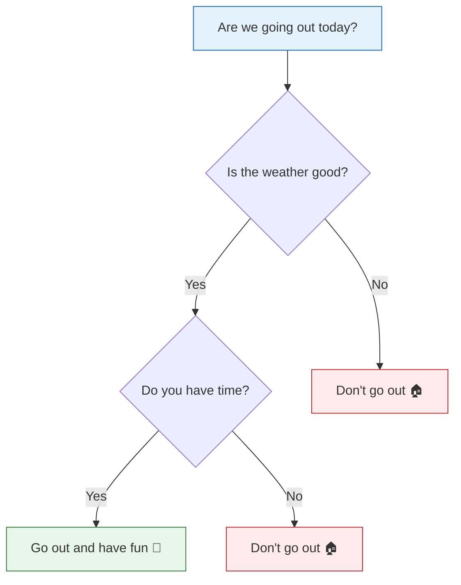

# Decision Trees


:::tip Section Overview
Decision trees are the **most intuitive and easiest-to-interpret** ML algorithm. They are like a "20 questions" game: classify data through a series of yes/no decisions. Even more importantly, decision trees are the foundation of later ensemble learning methods (Random Forest, XGBoost).
:::

## Learning Objectives

- Understand how decision trees are built
- Master information gain and Gini index (and connect them to the entropy concept from Station 4)
- Understand pruning strategies (pre-pruning, post-pruning)
- Master decision tree visualization and interpretability
- Learn about regression trees

## First, a very important learning expectation

This section is very likely to give beginners two opposite feelings at first:

- "Decision trees look just like if-else, so they should be really simple"
- "But once entropy, Gini, and pruning show up, it suddenly feels hard"

For a first pass, the goal is not to fully master every formula right away. Instead, it is better to follow this main thread:

> **A tree gradually grows rules step by step. The finer the rules become, the easier it is to memorize the training set, so complexity control naturally becomes necessary.**

Once this line is clear, purity, pruning, and Random Forest will be much easier to connect later.

---

## First, build a map

Decision trees can easily create the illusion for beginners that "they are so intuitive, so they must not be hard."
But in real projects, the most common confusion is actually:

- Why can a tree learn the training set so well so quickly?
- Why does it overfit so easily?
- Why do single trees look easy to understand, but in industry people prefer Random Forest and boosting methods?

A more stable order of understanding is:


If you first grasp this thread, the later parts about entropy, Gini, pruning, and ensemble learning will all connect more smoothly.

### Keyword Decoder

| Term | What it means here | How to use it in practice |
|------|------|------|
| `node` | A point in the tree where data is held or split | Inspect nodes to explain why a prediction went down a certain path |
| `root node` | The first node containing all training samples | The root split is often the most important global rule |
| `leaf node` | The final node that outputs a class or value | Small leaves often signal that the tree may be memorizing rare cases |
| `entropy` | A measure of label uncertainty | Lower entropy after a split means the child groups are cleaner |
| `Gini` | Another impurity measure used by CART trees | The sklearn default; usually a safe first choice |
| `max_depth` | The maximum number of split levels | Tune it first because it directly controls tree complexity |
| `min_samples_leaf` | Minimum samples allowed in a leaf | Helps avoid tiny leaves that only explain a few noisy points |
| `ccp_alpha` | Cost-complexity pruning strength | Use it for post-pruning after a full tree is grown |
| `CART` | Classification and Regression Trees | The family of tree algorithms used by sklearn decision trees |

---

## 1. Intuition of decision trees

### 1.1 Decision trees in daily life



A decision tree is a series of **if-else decisions**. Each time, it uses the value of one feature to split the data into two (or more) groups.

### 1.2 Decision trees in machine learning

| Element | Description |
|------|------|
| **Root node** | The top node, containing all data |
| **Internal node** | A decision node that splits by a feature |
| **Leaf node** | The final decision result (class or value) |
| **Split condition** | For example, "petal length ≤ 2.5cm" |
| **Depth** | The longest path from root to leaf |

### 1.2.1 Why are decision trees so easy to understand at a glance?

Because they break the model into many local problems:

- Ask one question first
- Go left or right based on the answer
- Then ask the next question

This is very different from linear regression or logistic regression, where all features are mixed into one formula at once.
So the biggest teaching value of decision trees is:

- They let beginners see the process of a model "making decisions" for the first time
- They make it explainable why the model made a certain prediction
- They also make it intuitive why the model can memorize the training set

### 1.2.2 A better analogy for beginners

You can think of a decision tree as:

- an interviewer who loves asking follow-up questions

Each round, it asks:

- "Can this question separate the samples a bit better?"

If yes, it keeps going; if not, it stops and gives a conclusion.
So when a tree grows deeper, what is happening in essence is:

- the rules become more and more detailed
- the classes become more and more separated
- but it also becomes easier to memorize the details of the training set

### 1.3 A simple example

```python
from sklearn.datasets import load_iris
from sklearn.tree import DecisionTreeClassifier, plot_tree
import matplotlib.pyplot as plt

# Use only 2 features for easier visualization
iris = load_iris()
X = iris.data[:, 2:4]  # petal length and width
y = iris.target

# Train a shallow decision tree
tree = DecisionTreeClassifier(max_depth=3, random_state=42)
tree.fit(X, y)

# Visualize the decision tree
fig, ax = plt.subplots(figsize=(14, 8))
plot_tree(tree, feature_names=['Petal Length', 'Petal Width'],
          class_names=iris.target_names, filled=True,
          rounded=True, fontsize=10, ax=ax)
plt.title('Iris Decision Tree (max_depth=3)')
plt.tight_layout()
plt.show()

print(f"Training accuracy: {tree.score(X, y):.1%}")
print(f"Tree depth: {tree.get_depth()}")
print(f"Leaf nodes: {tree.get_n_leaves()}")
print(f"Root split feature: Petal Length")
print(f"Root threshold: {tree.tree_.threshold[0]:.2f}")
```

Expected output:

```text
Training accuracy: 97.3%
Tree depth: 3
Leaf nodes: 5
Root split feature: Petal Length
Root threshold: 2.45
```

The root split tells a story: the tree first asks about petal length because that single question already separates many iris samples well.

---

## 2. How does a decision tree "learn"? — Split criteria

### 2.1 The core problem

At each node, the algorithm needs to decide:
1. **Which feature** should be used for splitting?
2. **What threshold** should be used for splitting?

Goal: make the data in each child node as **pure** as possible after each split.

### 2.1.1 Don’t rush to memorize formulas — first remember one sentence

What a decision tree really wants to do at every step is very simple:

> **Find a question that makes the two groups after splitting more organized than before.**

Information gain and Gini index are both ways to quantify how much more organized the data became.

### 2.1.2 What is most worth remembering the first time you learn tree models?

Rather than memorizing:

- the entropy formula
- the Gini formula

It is more useful to remember:

- every split is trying to make the data purer
- once a tree becomes too detailed, it starts memorizing the training set
- so complexity control naturally becomes necessary later

### 2.2 Information gain and entropy

:::info Connection to Station 4
In Station 4, "2.4 Basics of Information Theory," you learned about **entropy** — it measures the "uncertainty" of a set. Decision trees use entropy to decide how to split.
:::

**Entropy**:

> **H(S) = -Σ pk × log₂(pk)**

- `pk` = the proportion of class k in set S
- Higher entropy = more "mixed"; entropy = 0 = completely pure (only one class)

**Information gain**: the reduction in entropy before and after splitting.

> **IG(S, A) = H(S) - Σ (|Sv|/|S|) × H(Sv)**

```python
import numpy as np

def entropy(y):
    """Compute entropy"""
    classes, counts = np.unique(y, return_counts=True)
    probs = counts / len(y)
    return -np.sum(probs * np.log2(probs + 1e-10))

def information_gain(y, y_left, y_right):
    """Compute information gain"""
    n = len(y)
    return entropy(y) - (len(y_left)/n * entropy(y_left) + len(y_right)/n * entropy(y_right))

# Example: 10 samples
y_parent = np.array([0, 0, 0, 0, 0, 1, 1, 1, 1, 1])  # 5:5 mix
print(f"Parent node entropy: {entropy(y_parent):.4f}")

# Split plan A: perfect split
y_left_a = np.array([0, 0, 0, 0, 0])  # all 0
y_right_a = np.array([1, 1, 1, 1, 1])  # all 1
ig_a = information_gain(y_parent, y_left_a, y_right_a)
print(f"Plan A (perfect split) information gain: {ig_a:.4f}")

# Split plan B: poor split
y_left_b = np.array([0, 0, 1, 1, 1])   # 2:3 mix
y_right_b = np.array([0, 0, 0, 1, 1])   # 3:2 mix
ig_b = information_gain(y_parent, y_left_b, y_right_b)
print(f"Plan B (poor split) information gain: {ig_b:.4f}")
```

Expected output:

```text
Parent node entropy: 1.0000
Plan A (perfect split) information gain: 1.0000
Plan B (poor split) information gain: 0.0290
```

Plan A is valuable because it turns two mixed groups into two pure groups. Plan B barely improves order, so a tree should prefer Plan A.

### 2.3 Gini impurity

Another measure of "purity" that is faster to compute:

> **Gini(S) = 1 - Σ pk²**

- Gini = 0 → completely pure
- Maximum Gini → completely mixed

```python
def gini(y):
    """Compute Gini impurity"""
    classes, counts = np.unique(y, return_counts=True)
    probs = counts / len(y)
    return 1 - np.sum(probs ** 2)

# Compare entropy and Gini
p = np.linspace(0.01, 0.99, 100)
entropy_vals = -p * np.log2(p) - (1-p) * np.log2(1-p)
gini_vals = 2 * p * (1 - p)

plt.figure(figsize=(8, 5))
plt.plot(p, entropy_vals, 'b-', linewidth=2, label='Entropy')
plt.plot(p, gini_vals, 'r-', linewidth=2, label='Gini')
plt.xlabel('Positive class proportion p')
plt.ylabel('Impurity')
plt.title('Entropy vs Gini')
plt.legend()
plt.grid(True, alpha=0.3)
plt.show()

for labels in [y_parent, y_left_a, y_left_b]:
    print(f"Gini={gini(labels):.4f}, Entropy={entropy(labels):.4f}")
```

Expected output:

```text
Gini=0.5000, Entropy=1.0000
Gini=0.0000, Entropy=-0.0000
Gini=0.4800, Entropy=0.9710
```

Both Gini and entropy are asking the same practical question: “how mixed are the labels in this node?” The exact numbers differ, but the ranking is often similar.

### 2.4 Choice in sklearn

| Parameter | Option | Description |
|------|------|------|
| `criterion='gini'` | Gini impurity | `sklearn` **default**, faster to compute |
| `criterion='entropy'` | Information gain | Slightly more precise splitting, but a bit slower |

In practice, the difference is usually small, so using `gini` by default is fine.

### 2.5 If I am doing a project for the first time, how should I choose between `gini` and `entropy`?

If you are not running a special algorithm comparison experiment, you can start like this in your first project:

- Use the default `gini` first
- Focus your main effort on `max_depth`, `min_samples_leaf`, and `ccp_alpha`
- If you have already tuned those, then consider whether to compare `entropy`

The reason is simple:

- the split criterion is usually not the main source of performance differences
- controlling tree complexity is often much more important than choosing which purity formula to use

### 2.6 The safest default tuning order for tree models

If you are tuning a tree model for the first time, it is recommended to follow this order:

1. Build a shallow tree as a baseline
2. Check `max_depth` first
3. Then check `min_samples_leaf`
4. Then check `ccp_alpha`
5. Only at the end compare `gini / entropy`

This order is more stable because it first addresses:

- whether the tree has grown too complex
- whether the rules have become so detailed that they start memorizing the data

---

## 3. Visualizing the decision boundary

```python
from sklearn.datasets import make_classification, make_moons
from sklearn.tree import DecisionTreeClassifier
import numpy as np
import matplotlib.pyplot as plt

def plot_decision_boundary(ax, model, X, y, title):
    x_min, x_max = X[:, 0].min() - 0.5, X[:, 0].max() + 0.5
    y_min, y_max = X[:, 1].min() - 0.5, X[:, 1].max() + 0.5
    xx, yy = np.meshgrid(np.linspace(x_min, x_max, 200),
                          np.linspace(y_min, y_max, 200))
    Z = model.predict(np.c_[xx.ravel(), yy.ravel()]).reshape(xx.shape)
    ax.contourf(xx, yy, Z, alpha=0.3, cmap='coolwarm')
    ax.scatter(X[:, 0], X[:, 1], c=y, cmap='coolwarm', s=20, edgecolors='w', linewidth=0.5)
    ax.set_title(title)
    ax.grid(True, alpha=0.3)

# Decision trees with different depths
X, y = make_moons(n_samples=300, noise=0.25, random_state=42)

fig, axes = plt.subplots(1, 4, figsize=(18, 4))
depths = [1, 3, 5, None]

for ax, depth in zip(axes, depths):
    tree = DecisionTreeClassifier(max_depth=depth, random_state=42)
    tree.fit(X, y)
    label = f'No depth limit' if depth is None else f'depth={depth}'
    plot_decision_boundary(ax, tree, X, y,
                          f'{label}\nTraining accuracy: {tree.score(X, y):.1%}')
    print(f"{label}: training accuracy {tree.score(X, y):.1%}, "
          f"leaves {tree.get_n_leaves()}, depth {tree.get_depth()}")

plt.suptitle('How decision tree depth affects the decision boundary', fontsize=13)
plt.tight_layout()
plt.show()
```

Expected output:

```text
depth=1: training accuracy 81.0%, leaves 2, depth 1
depth=3: training accuracy 90.0%, leaves 6, depth 3
depth=5: training accuracy 94.7%, leaves 14, depth 5
No depth limit: training accuracy 100.0%, leaves 33, depth 9
```

:::warning Overfitting in decision trees
A decision tree with unlimited depth will "memorize" every training sample (training accuracy 100%), but the decision boundary becomes very complex. This is overfitting — and it needs to be controlled through **pruning**.
:::

### 3.1 When you first see this boundary plot, what should you focus on?

Not on training accuracy first, but on:

- whether the boundary has become very fragmented
- whether isolated points are being cut out into tiny separate regions
- whether the training score and test score are starting to diverge

This is a very important machine learning diagnostic idea:

- don’t just ask, "Can the model learn?"
- ask, "Is the model learning patterns, or just sample noise?"


This diagram should be read together with the boundary plot above: the deeper the tree, the more likely it is to carve isolated noise into tiny separate regions; pruning is not about "making the model weaker," but about removing overly fragmented splits that only serve the training samples, so the model learns something closer to the real pattern.

---

## 4. Pruning — controlling complexity

### 4.1 Pre-pruning

Limit tree growth **during construction**:

| Parameter | Description | Default |
|------|------|--------|
| `max_depth` | Maximum depth | None (unlimited) |
| `min_samples_split` | Minimum number of samples required for a node to split | 2 |
| `min_samples_leaf` | Minimum number of samples required at a leaf node | 1 |
| `max_leaf_nodes` | Maximum number of leaf nodes | None (unlimited) |

### 4.1.1 What is a safer order when tuning a tree model for the first time?

When beginners tune a decision tree for the first time, it is easy to change many parameters at once and then not know which one is actually responsible.
A safer order is:

1. Tune `max_depth` first
2. Then check whether `min_samples_leaf` needs tuning
3. Finally look at `min_samples_split` and `ccp_alpha`

Because:

- `max_depth` directly controls how complex the tree can become
- `min_samples_leaf` is very effective at preventing "splitting just for a few rare points"
- the other parameters are more like fine adjustments

```python
from sklearn.model_selection import train_test_split

X, y = make_moons(n_samples=500, noise=0.3, random_state=42)
X_train, X_test, y_train, y_test = train_test_split(X, y, test_size=0.2, random_state=42)

# Compare different depths
fig, axes = plt.subplots(1, 4, figsize=(18, 4))
configs = [
    (None, 'No pruning'),
    (3, 'max_depth=3'),
    (5, 'max_depth=5'),
    (10, 'max_depth=10'),
]

for ax, (depth, title) in zip(axes, configs):
    tree = DecisionTreeClassifier(max_depth=depth, random_state=42)
    tree.fit(X_train, y_train)
    train_acc = tree.score(X_train, y_train)
    test_acc = tree.score(X_test, y_test)
    plot_decision_boundary(ax, tree, X_train, y_train,
                          f'{title}\nTrain: {train_acc:.1%}, Test: {test_acc:.1%}')
    print(f"{title}: train={train_acc:.1%}, test={test_acc:.1%}, "
          f"leaves={tree.get_n_leaves()}")

plt.suptitle('How pre-pruning controls overfitting', fontsize=13)
plt.tight_layout()
plt.show()
```

Expected output:

```text
No pruning: train=100.0%, test=82.0%, leaves=43
max_depth=3: train=90.0%, test=89.0%, leaves=6
max_depth=5: train=94.8%, test=90.0%, leaves=13
max_depth=10: train=99.2%, test=82.0%, leaves=39
```

Notice the key diagnostic: the unpruned tree has the best training score but not the best test score. That gap is the visible footprint of overfitting.

### 4.2 Post-pruning — cost complexity pruning

**First grow a full tree, then go back and "trim" it.** In sklearn, this is done with the `ccp_alpha` (Cost Complexity Pruning) parameter.

```python
# Find the optimal ccp_alpha
tree_full = DecisionTreeClassifier(random_state=42)
tree_full.fit(X_train, y_train)

# Get subtrees corresponding to different alpha values
path = tree_full.cost_complexity_pruning_path(X_train, y_train)
ccp_alphas = path.ccp_alphas

# Train a tree for each alpha
train_scores = []
test_scores = []
for alpha in ccp_alphas:
    tree = DecisionTreeClassifier(ccp_alpha=alpha, random_state=42)
    tree.fit(X_train, y_train)
    train_scores.append(tree.score(X_train, y_train))
    test_scores.append(tree.score(X_test, y_test))

plt.figure(figsize=(8, 5))
plt.plot(ccp_alphas, train_scores, 'b-o', markersize=3, label='Training set')
plt.plot(ccp_alphas, test_scores, 'r-o', markersize=3, label='Test set')
plt.xlabel('ccp_alpha')
plt.ylabel('Accuracy')
plt.title('Cost complexity pruning')
plt.legend()
plt.grid(True, alpha=0.3)

# Mark the best point
best_idx = np.argmax(test_scores)
plt.axvline(x=ccp_alphas[best_idx], color='green', linestyle='--',
            label=f'Best alpha={ccp_alphas[best_idx]:.4f}')
plt.legend()
plt.show()

print(f"Best ccp_alpha: {ccp_alphas[best_idx]:.4f}")
print(f"Best test accuracy: {test_scores[best_idx]:.1%}")
print(f"Best tree leaves: {DecisionTreeClassifier(ccp_alpha=ccp_alphas[best_idx], random_state=42).fit(X_train, y_train).get_n_leaves()}")
```

Expected output:

```text
Best ccp_alpha: 0.0040
Best test accuracy: 91.0%
Best tree leaves: 7
```

`ccp_alpha` is like a pruning price: every extra split must justify its complexity. If a split only helps a few training samples, pruning removes it.

---

## 5. Feature importance

Decision trees naturally provide **feature importance** — showing how much each feature contributes to the classification decision.

```python
from sklearn.datasets import load_wine
from sklearn.tree import DecisionTreeClassifier

wine = load_wine()
X, y = wine.data, wine.target

tree = DecisionTreeClassifier(max_depth=4, random_state=42)
tree.fit(X, y)

# Feature importance
importance = tree.feature_importances_
sorted_idx = np.argsort(importance)

plt.figure(figsize=(8, 6))
plt.barh(range(len(sorted_idx)), importance[sorted_idx], color='steelblue')
plt.yticks(range(len(sorted_idx)), np.array(wine.feature_names)[sorted_idx])
plt.xlabel('Feature importance')
plt.title('Feature importance of a decision tree (Wine dataset)')
plt.grid(axis='x', alpha=0.3)
plt.tight_layout()
plt.show()

top_features = sorted(
    zip(wine.feature_names, importance),
    key=lambda item: item[1],
    reverse=True
)[:5]
for name, score in top_features:
    print(f"{name}: {score:.3f}")
print(f"Training accuracy: {tree.score(X, y):.1%}")
```

Expected output:

```text
proline: 0.390
od280/od315_of_diluted_wines: 0.319
flavanoids: 0.144
hue: 0.059
magnesium: 0.034
Training accuracy: 98.9%
```

Feature importance is useful for explanation, but it is not the same as causality. It says which features the tree used most for splitting, not which features truly caused the label.

---

## 6. Regression trees

Decision trees are not only for classification, they can also do **regression**.

### 6.1 Principle

The leaf nodes of a classification tree output **classes**; the leaf nodes of a regression tree output **numerical values** (the average value of all samples in that region).

### 6.2 Example

```python
from sklearn.tree import DecisionTreeRegressor

# Generate nonlinear data
rng = np.random.default_rng(seed=42)
X_reg = np.sort(rng.uniform(0, 10, 200)).reshape(-1, 1)
y_reg = np.sin(X_reg.ravel()) + rng.normal(size=200) * 0.3

# Regression trees with different depths
fig, axes = plt.subplots(1, 3, figsize=(15, 4))
depths = [2, 5, None]

for ax, depth in zip(axes, depths):
    tree = DecisionTreeRegressor(max_depth=depth, random_state=42)
    tree.fit(X_reg, y_reg)

    X_test_reg = np.linspace(0, 10, 500).reshape(-1, 1)
    y_pred = tree.predict(X_test_reg)

    ax.scatter(X_reg, y_reg, s=10, alpha=0.5, color='steelblue')
    ax.plot(X_test_reg, y_pred, 'r-', linewidth=2)
    label = 'No limit' if depth is None else str(depth)
    ax.set_title(f'depth={label}, R²={tree.score(X_reg, y_reg):.3f}')
    ax.grid(True, alpha=0.3)
    print(f"depth={label}: R2={tree.score(X_reg, y_reg):.3f}, "
          f"leaves={tree.get_n_leaves()}")

plt.suptitle('Regression trees with different depths', fontsize=13)
plt.tight_layout()
plt.show()
```

Expected output:

```text
depth=2: R2=0.604, leaves=4
depth=5: R2=0.895, leaves=31
depth=No limit: R2=1.000, leaves=200
```

The unlimited regression tree gives every sample its own tiny region, so the training `R²` becomes perfect. That is exactly why it may generalize poorly.

:::note Regression tree vs linear regression
A regression tree makes **step-like** predictions (each interval outputs a constant), rather than smooth ones. It can naturally fit nonlinear data, but it also overfits easily.
:::

---

## 7. Advantages and disadvantages of decision trees

| Advantages | Disadvantages |
|------|------|
| Easy to understand and explain (visualizable) | Prone to overfitting |
| No feature scaling required | Sensitive to small changes in data |
| Can handle both classification and regression | Decision boundaries are axis-aligned |
| Can handle multiclass problems | Greedy algorithm, no guarantee of global optimum |
| Implicit feature selection | A single tree has limited expressive power |

:::info How to address the drawbacks
Most drawbacks of decision trees can be addressed with **ensemble learning** (next section):
- Multiple trees vote together → reduce overfitting
- Random sampling → reduce sensitivity to individual data points
:::

### 7.1 When is a decision tree especially worth trying first?

Although a single tree is not always the strongest final model, it is very worth trying first in these scenarios:

- You particularly need interpretability
- You want to quickly judge which features are likely useful
- You suspect there are clear segmented rules between features and labels
- You want a baseline that is easy to explain to stakeholders

Its value in this course is not just as an algorithm, but as a bridge between two very important things:

- interpretable modeling
- the starting point of ensemble tree models

---

## 8. The safest default order when putting a decision tree into a project for the first time

When you first use a decision tree in a real project, you can follow this order:

1. Treat it as an interpretable baseline first
2. Limit the tree depth first; do not let it grow without control
3. Check the gap between training score and validation score
4. Then decide whether to keep tuning the single tree or move on to Random Forest / boosting

This is more stable than jumping directly to ensemble learning, because first you actually understand:

- why a single tree is intuitive
- why a single tree is unstable
- what exactly ensemble learning is fixing

:::info Connect to later sections
- **Next section**: Ensemble learning — combine multiple decision trees for performance far beyond a single tree
- **Review Station 4**: Entropy and information gain (information theory in Section 2.4)
:::

---

## Summary

| Key Point | Description |
|------|------|
| Core idea | Recursively split data using a series of decision conditions |
| Split criterion | Information gain (entropy) or Gini index |
| Overfitting control | Pre-pruning (limit depth/sample counts) or post-pruning (`ccp_alpha`) |
| Interpretability | Visualize decision paths and output feature importance |
| Regression tree | Leaf nodes output numerical values instead of classes |

## What should you take away from this section?

If you only remember one sentence, I hope it is this:

> **The core of a decision tree is not just "being able to split," but that it makes model complexity and overfitting visibly obvious for the first time.**

So the really important takeaways are:

- Know why trees are intuitive
- Know why trees overfit easily
- Know which parameters to adjust first when tuning a tree model
- Know why Random Forest and boosting naturally come next

## Hands-on exercises

### Exercise 1: Manually compute information gain

There are 10 samples with labels `[yes,yes,no,yes,no,no,yes,yes,no,no]` (5 "yes", 5 "no"). After splitting by feature A, the left child node is `[yes,yes,yes,no]`, and the right child node is `[no,no,no,no,yes,yes]`. Manually compute the information gain.

### Exercise 2: Depth tuning

Using the `make_moons` dataset (noise=0.3), try different `max_depth` values (1~20), plot the curves of training and test accuracy, and find the best depth.

### Exercise 3: Regression tree vs linear regression

Generate data using `y = sin(x) + noise`, then fit it with `LinearRegression`, `PolynomialFeatures(degree=5) + LinearRegression`, and `DecisionTreeRegressor(max_depth=5)`. Plot a comparison chart.

### Exercise 4: Feature importance

Use `load_iris()` to train a decision tree and plot a bar chart of feature importance. Try removing unimportant features and retraining to see whether accuracy drops.
