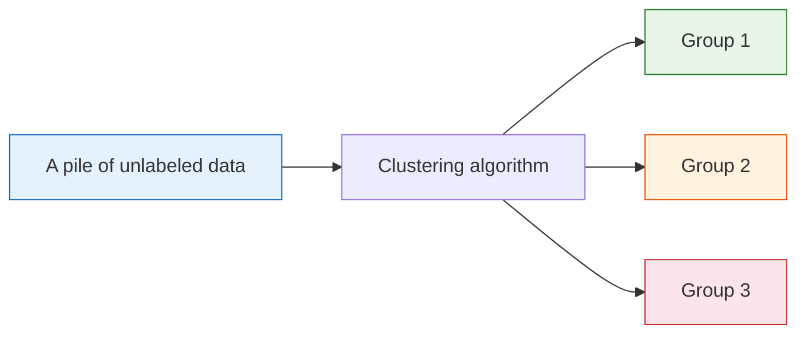
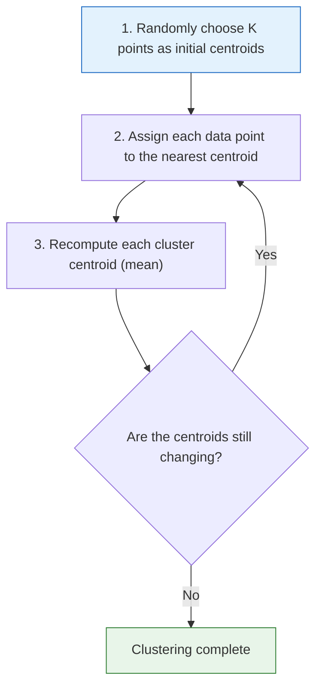
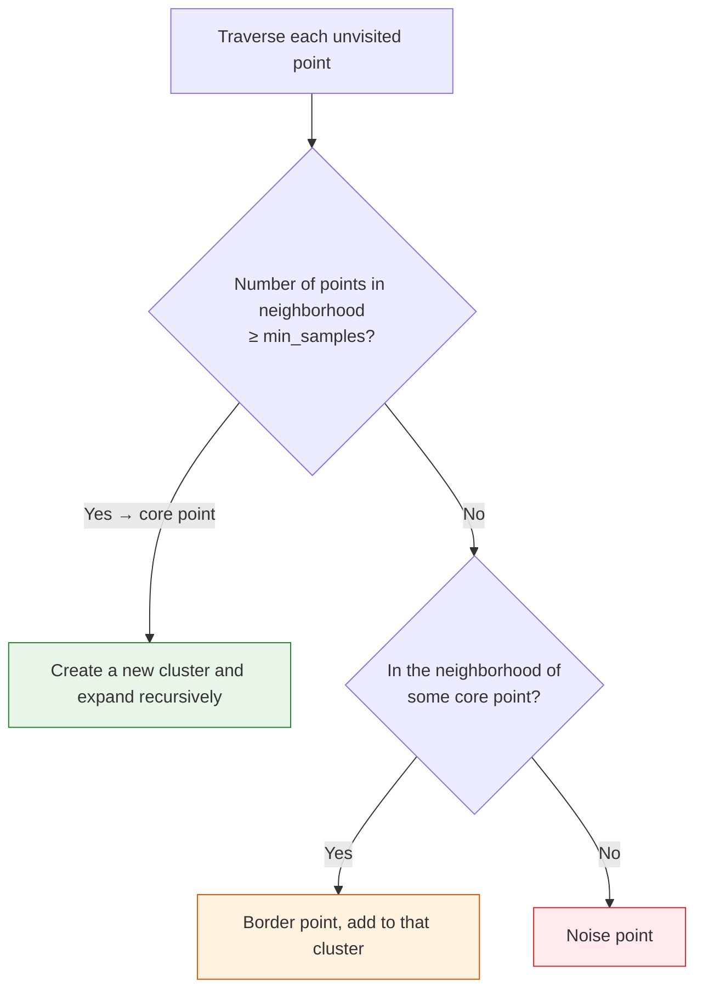

# 5.3.2 Clustering Algorithms


:::tip Section Overview
Clustering is one of the most common tasks in unsupervised learning—**automatically grouping similar data together without labels**. It is essential in scenarios such as customer segmentation, document classification, and image segmentation.
:::

## Learning Objectives

- Understand the principle and implementation of K-Means clustering
- Understand the K-Means++ initialization strategy
- Learn hierarchical clustering (agglomerative and divisive)
- Master DBSCAN density-based clustering
- Master methods for choosing K and clustering evaluation metrics

## First, Set an Important Learning Expectation

This section can feel a little intimidating for beginners at first, because it is different from the supervised learning you learned earlier:

- No labels
- No standard answers
- It may look like the data has been “grouped,” but it is not obvious whether the grouping is good

For your first pass, the most important thing is not to memorize every clustering algorithm, but to first accept this:

> **Clustering is a testable hypothesis about data structure when labels are unavailable.**

Once you hold onto that idea, you will not mistake clustering for “automatically discovering the one true answer.”

---

## First, Build a Map

The trickiest part of this section for beginners is usually:

- No labels, so it is hard to know what has been “learned”
- There are many algorithms, so it is unclear which one to study first
- The plots look grouped, but it is hard to tell whether the grouping is good

A more stable learning order is:


So clustering is not just “letting the machine group things automatically.”
At its core, it is about:
**how to find structure in data when labels are not available.**


Read this comic from top to bottom: clustering starts from an unlabeled pile of data, proposes one possible grouping, checks whether that grouping is compact and separated, and finally asks whether the groups mean anything in the real project. That last step matters because a beautiful plot can still be useless if nobody can act on the groups.

### Keyword Decoder Before You Start

| Term | Beginner-friendly meaning | Why it matters here |
|---|---|---|
| `cluster` | A group of data points that look similar under the chosen features | The whole section is about how to form and interpret these groups |
| `centroid` | The center point of a cluster, usually the average of its members | K-Means repeatedly moves centroids until the groups stop changing |
| `inertia_` / SSE | Sum of Squared Errors; a measure of how spread out points are inside clusters | Lower is usually more compact, but always decreases when K increases |
| `silhouette_score` | A score that checks both compactness and separation | It helps you compare candidate K values, not prove a perfect answer |
| `eps` | The neighborhood radius in DBSCAN | Too small creates many tiny clusters; too large merges everything |
| `min_samples` | Minimum nearby points needed to become a dense core point | It controls how strict DBSCAN is about calling an area “dense” |
| `dendrogram` | A tree diagram showing how clusters merge step by step | It makes hierarchical clustering easier to inspect visually |
| `baseline` | A simple first model used as a comparison point | K-Means is often the baseline before trying more complex clustering |

---

## Intuition for Clustering

### What Is Clustering?

**Clustering = put “similar” things together and separate “different” things.**



| Use case | Data | Clustering goal |
|---------|------|---------|
| Customer segmentation | Spending behavior data | Identify high-value / low-frequency / churn-risk customer groups |
| Document grouping | Text embeddings | Automatically classify by topic |
| Image segmentation | Pixel color values | Split an image into foreground/background |
| Gene analysis | Gene expression data | Find gene groups with similar functions |

### How Is Clustering Really Different from Classification?

These two words look similar, but they solve two completely different problems:

- **Classification**: labels are known; the goal is to learn “how to decide”
- **Clustering**: labels are unknown; the goal is to discover “what groups may exist”

So when you first learn clustering, you must accept one thing:

- Clustering results are not a single unique ground truth
- It is more like a “hypothesis about data structure”
- You need metrics and business interpretation to judge whether the hypothesis is useful

### A Better Analogy for Beginners

You can think of clustering as:

- Sorting a big pile of unlabeled miscellaneous items for the first time

You start by grouping things based on the intuition of “these seem like the same kind”:

- Put commonly used items in one pile
- Put rarely used items in another pile
- Pull especially messy items out separately

At this point, you are not looking for the one correct answer,
but for a grouping method that is:

- easy to understand
- useful for follow-up actions
- verifiable


This diagram helps you avoid a common mistake: not every segmentation task is suited to K-Means. Round, similarly sized clusters are better for K-Means; curved shapes or noisy data are better candidates for DBSCAN; if you want to inspect hierarchical relationships, consider hierarchical clustering. First look at the data shape, then choose the algorithm.

### Generate Demo Data

```python
import numpy as np
import matplotlib.pyplot as plt
from sklearn.datasets import make_blobs

# Generate data with 3 clusters
X, y_true = make_blobs(n_samples=300, centers=3, cluster_std=0.8, random_state=42)

print(f"X shape: {X.shape}")
print(f"Hidden true groups: {np.unique(y_true)}")

plt.figure(figsize=(8, 6))
plt.scatter(X[:, 0], X[:, 1], s=30, alpha=0.7, color='gray')
plt.title('Unlabeled data — how many groups can you see?')
plt.xlabel('Feature 1')
plt.ylabel('Feature 2')
plt.grid(True, alpha=0.3)
plt.show()
```

Expected output:

```text
X shape: (300, 2)
Hidden true groups: [0 1 2]
```

`y_true` is only used here because this is a synthetic teaching dataset. In a real clustering project, labels are usually unavailable, so you must rely on metrics, visualization, and domain interpretation.

---

## K-Means Clustering

### Algorithm Principle

K-Means is the most classic clustering algorithm, and its steps are very simple:



### Implement K-Means from Scratch

```python
def kmeans_simple(X, k, max_iters=100, seed=42):
    """Simple K-Means implementation"""
    rng = np.random.default_rng(seed)
    # 1. Randomly initialize centroids
    idx = rng.choice(len(X), k, replace=False)
    centroids = X[idx].copy()

    for iteration in range(max_iters):
        # 2. Assign each point to the nearest centroid
        distances = np.sqrt(((X[:, np.newaxis] - centroids) ** 2).sum(axis=2))
        labels = distances.argmin(axis=1)

        # 3. Update centroids
        new_centroids = np.array([X[labels == i].mean(axis=0) for i in range(k)])

        # Check convergence
        if np.allclose(centroids, new_centroids):
            print(f"Converged in round {iteration+1}")
            break
        centroids = new_centroids

    return labels, centroids

# Run
labels, centroids = kmeans_simple(X, k=3, seed=2)
print("Centroids rounded:")
print(np.round(centroids, 2))

# Visualize
plt.figure(figsize=(8, 6))
plt.scatter(X[:, 0], X[:, 1], c=labels, cmap='viridis', s=30, alpha=0.7)
plt.scatter(centroids[:, 0], centroids[:, 1], c='red', marker='X', s=200,
            edgecolors='black', linewidth=2, label='Centroids')
plt.title('K-Means Clustering Result (Manual Implementation)')
plt.legend()
plt.grid(True, alpha=0.3)
plt.show()
```

Expected output:

```text
Converged in round 2
Centroids rounded:
[[-2.61  9.04]
 [-6.88 -6.96]
 [ 4.73  2.  ]]
```

The exact cluster numbers may change because cluster IDs are arbitrary. What matters is not whether a group is called `0` or `1`, but whether nearby points are grouped consistently.

### Implement with sklearn

```python
from sklearn.cluster import KMeans

kmeans = KMeans(n_clusters=3, random_state=42, n_init=10)
kmeans.fit(X)

print(f"Cluster labels: {np.unique(kmeans.labels_)}")
print(f"Centroids rounded:\n{np.round(kmeans.cluster_centers_, 2)}")
print(f"Total inertia (SSE): {kmeans.inertia_:.2f}")

# Visualize
fig, axes = plt.subplots(1, 2, figsize=(14, 5))

# Clustering result
axes[0].scatter(X[:, 0], X[:, 1], c=kmeans.labels_, cmap='viridis', s=30, alpha=0.7)
axes[0].scatter(kmeans.cluster_centers_[:, 0], kmeans.cluster_centers_[:, 1],
                c='red', marker='X', s=200, edgecolors='black', linewidth=2)
axes[0].set_title('K-Means Clustering Result')

# Compare with true labels
axes[1].scatter(X[:, 0], X[:, 1], c=y_true, cmap='viridis', s=30, alpha=0.7)
axes[1].set_title('True Labels (for comparison)')

for ax in axes:
    ax.grid(True, alpha=0.3)

plt.tight_layout()
plt.show()
```

Expected output:

```text
Cluster labels: [0 1 2]
Centroids rounded:
[[-2.61  9.04]
 [-6.88 -6.96]
 [ 4.73  2.  ]]
Total inertia (SSE): 362.79
```

`fit()` means “learn the centroids from data.” `labels_` stores the final group assignment for every row, and `cluster_centers_` stores the learned centroids.

### Visualizing the K-Means Iteration Process

```python
fig, axes = plt.subplots(2, 3, figsize=(15, 9))

rng = np.random.default_rng(seed=42)
idx = rng.choice(len(X), 3, replace=False)
centroids = X[idx].copy()

for i, ax in enumerate(axes.ravel()):
    # Assign
    distances = np.sqrt(((X[:, np.newaxis] - centroids) ** 2).sum(axis=2))
    labels = distances.argmin(axis=1)

    ax.scatter(X[:, 0], X[:, 1], c=labels, cmap='viridis', s=20, alpha=0.6)
    ax.scatter(centroids[:, 0], centroids[:, 1], c='red', marker='X', s=200,
               edgecolors='black', linewidth=2)
    ax.set_title(f'Iteration {i+1}')
    ax.grid(True, alpha=0.3)

    # Update centroids
    centroids = np.array([X[labels == j].mean(axis=0) for j in range(3)])

plt.suptitle('K-Means Iteration Process', fontsize=13)
plt.tight_layout()
plt.show()
```

---

## K-Means++ Initialization

### Why Do We Need Better Initialization?

Plain K-Means randomly chooses initial centroids, which may pick poor starting positions and lead to:
- Slower convergence
- Unstable results
- Local optima

### K-Means++ Strategy

**Core idea**: make the initial centroids as spread out as possible.

1. Randomly choose the first centroid
2. For each later centroid, choose the point **farthest from the existing centroids** (with probability proportional to the squared distance)
3. Repeat until K centroids are selected

```python
# sklearn uses K-Means++ by default
kmeans_pp = KMeans(n_clusters=3, init='k-means++', random_state=42, n_init=10)
kmeans_random = KMeans(n_clusters=3, init='random', random_state=0, n_init=1)

kmeans_pp.fit(X)
kmeans_random.fit(X)

print(f"K-Means++ inertia: {kmeans_pp.inertia_:.2f}")
print(f"Random initialization inertia: {kmeans_random.inertia_:.2f}")
```

Expected output:

```text
K-Means++ inertia: 362.79
Random initialization inertia: 5482.74
```

The random run can start from unlucky centroids and end with a much larger inertia. This is why modern `sklearn` uses K-Means++ by default.

:::info sklearn Default
`sklearn`'s `KMeans` uses `init='k-means++'` by default, so you usually do not need to set it manually. `n_init=10` means the algorithm runs 10 times and keeps the best result.
:::

---

## How Do You Choose K?

The biggest issue with K-Means is that **you must specify K in advance**. Two common methods are used to determine the best K.

### Elbow Method

Compute SSE (Sum of Squared Errors, i.e. `inertia_`) for different K values and look for the “elbow point.”

```python
sse = []
K_range = range(1, 11)

for k in K_range:
    km = KMeans(n_clusters=k, random_state=42, n_init=10)
    km.fit(X)
    sse.append(km.inertia_)

print("SSE by K:", [round(value, 2) for value in sse])

plt.figure(figsize=(8, 5))
plt.plot(K_range, sse, 'bo-', markersize=8)
plt.xlabel('K (number of clusters)')
plt.ylabel('SSE (inertia)')
plt.title('Elbow Method — Choosing the Best K')
plt.xticks(K_range)
plt.grid(True, alpha=0.3)

# Annotate elbow
plt.annotate('Elbow → K=3', xy=(3, sse[2]), xytext=(5, sse[2] + 200),
             arrowprops=dict(arrowstyle='->', color='red'),
             fontsize=12, color='red')
plt.show()
```

Expected output:

```text
SSE by K: [20120.54, 5526.51, 362.79, 318.07, 273.36, 233.6, 200.97, 172.85, 149.96, 139.27]
```

### The Most Common Mistake with the Elbow Method

The elbow method is intuitive, but in real-world data there is often no clearly visible “elbow.”
In that case, do not force a single answer. Treat it as:

- A tool to narrow down the candidate range

A more reliable approach is:

- First use the elbow method to narrow K down to 2–4 candidate values
- Then use the silhouette coefficient and business interpretability for a second round of judgment

### Silhouette Score

The silhouette coefficient measures clustering quality for each sample, with values in [-1, 1]:
- **Close to 1**: the sample is very close to its own cluster and far from other clusters (good)
- **Close to 0**: the sample lies on the boundary between two clusters
- **Close to -1**: the sample may be assigned to the wrong cluster

```python
from sklearn.metrics import silhouette_score, silhouette_samples

sil_scores = []
for k in range(2, 11):
    km = KMeans(n_clusters=k, random_state=42, n_init=10)
    labels = km.fit_predict(X)
    score = silhouette_score(X, labels)
    sil_scores.append(score)
    print(f"K={k}: silhouette score = {score:.4f}")

plt.figure(figsize=(8, 5))
plt.plot(range(2, 11), sil_scores, 'bo-', markersize=8)
plt.xlabel('K (number of clusters)')
plt.ylabel('Silhouette score')
plt.title('Silhouette Score — Choosing the Best K')
plt.xticks(range(2, 11))
plt.grid(True, alpha=0.3)
plt.show()
```

### Silhouette Plot Visualization

```python
from sklearn.metrics import silhouette_samples

fig, axes = plt.subplots(1, 3, figsize=(18, 5))

for ax, k in zip(axes, [2, 3, 4]):
    km = KMeans(n_clusters=k, random_state=42, n_init=10)
    labels = km.fit_predict(X)
    sil_vals = silhouette_samples(X, labels)
    avg_score = silhouette_score(X, labels)

    y_lower = 10
    for i in range(k):
        cluster_sil = np.sort(sil_vals[labels == i])
        y_upper = y_lower + len(cluster_sil)
        ax.fill_betweenx(np.arange(y_lower, y_upper), 0, cluster_sil, alpha=0.7)
        ax.text(-0.05, y_lower + 0.5 * len(cluster_sil), str(i), fontsize=12)
        y_lower = y_upper + 10

    ax.axvline(x=avg_score, color='red', linestyle='--', label=f'Average={avg_score:.3f}')
    ax.set_title(f'K={k}')
    ax.set_xlabel('Silhouette score')
    ax.set_ylabel('Samples')
    ax.legend()

plt.suptitle('Silhouette Plots for Different K Values', fontsize=13)
plt.tight_layout()
plt.show()
```

If the silhouette plot for a cluster contains many values near 0 or below 0, that cluster probably overlaps with another cluster. If most bars are long and positive, the grouping is cleaner.

### What Is the Safer Order for Your First Clustering Project?

If this is your first time applying clustering in a real project, you can follow this order:

1. First standardize the features
2. Plot a 2D projection or basic statistics to see whether the data roughly forms groups
3. Run `K-Means` as a baseline first
4. Then use the elbow method and silhouette score to narrow down K
5. If the cluster shapes are clearly irregular or there is a lot of noise, try `DBSCAN`
6. Finally, always return to business interpretation: what does each cluster actually mean?

This step is very important, because clustering projects most easily get stuck in “we found several classes, but we do not know what they mean.”

---

## Hierarchical Clustering

### Principle

Hierarchical clustering does not require you to predefine K. It builds a **dendrogram**:

**Agglomerative method (bottom-up)**:
1. Treat each point as a cluster
2. Find the two closest clusters and merge them
3. Repeat until only one cluster remains

```python
from sklearn.cluster import AgglomerativeClustering
from scipy.cluster.hierarchy import dendrogram, linkage

# Use a small subset of data to show the dendrogram
X_small = X[:50]

# Compute the hierarchy
linkage_matrix = linkage(X_small, method='ward')

fig, axes = plt.subplots(1, 2, figsize=(15, 5))

# Dendrogram
dendrogram(linkage_matrix, ax=axes[0], truncate_mode='level', p=5)
axes[0].set_title('Dendrogram')
axes[0].set_xlabel('Samples')
axes[0].set_ylabel('Distance')

# Clustering result
agg = AgglomerativeClustering(n_clusters=3)
labels_agg = agg.fit_predict(X)
print(f"Linkage matrix shape: {linkage_matrix.shape}")
print(f"Hierarchical cluster labels: {np.unique(labels_agg)}")
axes[1].scatter(X[:, 0], X[:, 1], c=labels_agg, cmap='viridis', s=30, alpha=0.7)
axes[1].set_title('Hierarchical Clustering Result (K=3)')
axes[1].grid(True, alpha=0.3)

plt.tight_layout()
plt.show()
```

Expected output:

```text
Linkage matrix shape: (49, 4)
Hierarchical cluster labels: [0 1 2]
```

The linkage matrix has 49 rows because 50 small samples require 49 merge steps to become one tree. This is the meaning of “hierarchical”: you can cut the tree at different heights and get different numbers of clusters.

### Linkage Methods

| Method | How distance between two clusters is defined | Characteristics |
|------|-------------------|------|
| `ward` | Minimum increase in SSE after merging | Most commonly used, tends to produce similarly sized clusters |
| `complete` | Distance between the farthest points | Sensitive to outliers |
| `average` | Average distance over all point pairs | A balanced compromise |
| `single` | Distance between the nearest points | Prone to chaining effects |

---

## DBSCAN Density-Based Clustering

### The Limitation of K-Means

K-Means assumes clusters are **spherical**, so it performs poorly on non-spherical data:

```python
from sklearn.datasets import make_moons, make_circles

fig, axes = plt.subplots(1, 2, figsize=(12, 5))

# Half-moon data + K-Means
X_moons, y_moons = make_moons(n_samples=300, noise=0.1, random_state=42)
km_moons = KMeans(n_clusters=2, random_state=42, n_init=10)
labels_km = km_moons.fit_predict(X_moons)
print(f"K-Means half-moon labels: {np.unique(labels_km)}")
axes[0].scatter(X_moons[:, 0], X_moons[:, 1], c=labels_km, cmap='coolwarm', s=20)
axes[0].set_title('K-Means on Half-Moon Data (Failure)')

# Concentric circles + K-Means
X_circles, y_circles = make_circles(n_samples=300, noise=0.05, factor=0.5, random_state=42)
km_circles = KMeans(n_clusters=2, random_state=42, n_init=10)
labels_km2 = km_circles.fit_predict(X_circles)
print(f"K-Means circle labels: {np.unique(labels_km2)}")
axes[1].scatter(X_circles[:, 0], X_circles[:, 1], c=labels_km2, cmap='coolwarm', s=20)
axes[1].set_title('K-Means on Concentric Circles (Failure)')

for ax in axes:
    ax.grid(True, alpha=0.3)
    ax.set_aspect('equal')

plt.tight_layout()
plt.show()
```

Expected output:

```text
K-Means half-moon labels: [0 1]
K-Means circle labels: [0 1]
```

This output is intentionally misleading: K-Means does produce two labels, but the plot shows those labels cut through the curved shapes. A runnable result is not automatically a good clustering result.

### DBSCAN Principle

DBSCAN (Density-Based Spatial Clustering of Applications with Noise) clusters based on **density**:

| Concept | Description |
|------|------|
| **eps** | Neighborhood radius |
| **min_samples** | Minimum number of neighbors needed for a core point |
| **Core point** | A point with at least min_samples points in its neighborhood |
| **Border point** | In the neighborhood of a core point, but not itself a core point |
| **Noise point** | Neither a core point nor in the neighborhood of any core point |



### DBSCAN in Practice

```python
from sklearn.cluster import DBSCAN

fig, axes = plt.subplots(2, 2, figsize=(12, 10))

def cluster_noise_summary(labels):
    n_clusters = len(set(labels)) - (1 if -1 in labels else 0)
    n_noise = int((labels == -1).sum())
    return n_clusters, n_noise

# Half-moon data
db_moons = DBSCAN(eps=0.2, min_samples=5)
labels_db_moons = db_moons.fit_predict(X_moons)
axes[0][0].scatter(X_moons[:, 0], X_moons[:, 1], c=labels_db_moons, cmap='viridis', s=20)
n_clusters, n_noise = cluster_noise_summary(labels_db_moons)
axes[0][0].set_title(f'DBSCAN Half-Moon (noise points: {n_noise})')
print(f"DBSCAN half-moon: clusters={n_clusters}, noise={n_noise}")

# Concentric circles
db_circles = DBSCAN(eps=0.15, min_samples=5)
labels_db_circles = db_circles.fit_predict(X_circles)
axes[0][1].scatter(X_circles[:, 0], X_circles[:, 1], c=labels_db_circles, cmap='viridis', s=20)
n_clusters, n_noise = cluster_noise_summary(labels_db_circles)
axes[0][1].set_title(f'DBSCAN Concentric Circles (noise points: {n_noise})')
print(f"DBSCAN circles: clusters={n_clusters}, noise={n_noise}")

# Normal data
db_blobs = DBSCAN(eps=0.8, min_samples=5)
labels_db_blobs = db_blobs.fit_predict(X)
axes[1][0].scatter(X[:, 0], X[:, 1], c=labels_db_blobs, cmap='viridis', s=20)
n_clusters, n_noise = cluster_noise_summary(labels_db_blobs)
axes[1][0].set_title(f'DBSCAN Spherical Data (found {n_clusters} clusters)')
print(f"DBSCAN spherical: clusters={n_clusters}, noise={n_noise}")

# Compare K-Means vs DBSCAN
axes[1][1].scatter(X_moons[:, 0], X_moons[:, 1], c=labels_km, cmap='coolwarm', s=20)
axes[1][1].set_title('K-Means Half-Moon (comparison)')

for ax in axes.ravel():
    ax.grid(True, alpha=0.3)

plt.tight_layout()
plt.show()
```

Expected output:

```text
DBSCAN half-moon: clusters=2, noise=0
DBSCAN circles: clusters=5, noise=0
DBSCAN spherical: clusters=3, noise=5
```

This is also a useful warning: DBSCAN handles the half-moon shape well here, but the same parameters do not automatically solve every shape. For the concentric circles, `eps=0.15` is too strict and splits the rings into more groups.

### Tuning DBSCAN Parameters

```python
# Effect of eps
fig, axes = plt.subplots(1, 4, figsize=(18, 4))
eps_values = [0.1, 0.2, 0.5, 1.0]

for ax, eps in zip(axes, eps_values):
    db = DBSCAN(eps=eps, min_samples=5)
    labels = db.fit_predict(X_moons)
    n_clusters = len(set(labels)) - (1 if -1 in labels else 0)
    n_noise = (labels == -1).sum()
    print(f"eps={eps}: clusters={n_clusters}, noise={n_noise}")
    ax.scatter(X_moons[:, 0], X_moons[:, 1], c=labels, cmap='viridis', s=20)
    ax.set_title(f'eps={eps}\nclusters: {n_clusters}, noise: {n_noise}')
    ax.grid(True, alpha=0.3)

plt.suptitle('Effect of the DBSCAN eps Parameter', fontsize=13)
plt.tight_layout()
plt.show()
```

Expected output:

```text
eps=0.1: clusters=20, noise=86
eps=0.2: clusters=2, noise=0
eps=0.5: clusters=1, noise=0
eps=1.0: clusters=1, noise=0
```

Think of `eps` like the radius of a flashlight. If the light circle is too small, every dense area breaks apart; if it is too large, separate groups are swallowed into one.

### Advantages and Disadvantages of DBSCAN

| Advantages | Disadvantages |
|------|------|
| No need to predefine K | Requires tuning `eps` and `min_samples` |
| Can discover clusters of arbitrary shape | Performs poorly on high-dimensional data |
| Automatically identifies noise points | Hard to handle clusters with different densities |
| Robust to outliers | Sensitive to parameters |

### When Choosing a Clustering Algorithm for the First Time, What Is the Safest Way to Judge?

You can start with this simple decision table:

| Data characteristics | What to try first |
|---|---|
| Roughly spherical, large sample size | `K-Means` |
| Want to see hierarchical structure, small dataset | Hierarchical clustering |
| Irregular shapes, obvious noise | `DBSCAN` |

If you are still unsure, start with `K-Means`.
The reason is not that it is always the best, but that:

- It is the easiest to explain
- It works well as a baseline
- It forces you to think clearly about features and the `K` value first

---

## Comparison of Clustering Algorithms

```python
from sklearn.cluster import KMeans, AgglomerativeClustering, DBSCAN
from sklearn.datasets import make_blobs, make_moons, make_circles

datasets = [
    ("Spherical clusters", make_blobs(n_samples=300, centers=3, cluster_std=0.8, random_state=42)),
    ("Half-moon", make_moons(n_samples=300, noise=0.1, random_state=42)),
    ("Concentric circles", make_circles(n_samples=300, noise=0.05, factor=0.5, random_state=42)),
]

algorithms = [
    ("K-Means", lambda n_clusters: KMeans(n_clusters=n_clusters, random_state=42, n_init=10)),
    ("Hierarchical clustering", lambda n_clusters: AgglomerativeClustering(n_clusters=n_clusters)),
    ("DBSCAN", lambda _: None),
]

fig, axes = plt.subplots(3, 3, figsize=(15, 14))

for row, (data_name, (X_d, y_d)) in enumerate(datasets):
    n_real = len(set(y_d))
    for col, (algo_name, make_algo) in enumerate(algorithms):
        ax = axes[row][col]

        if algo_name in ['K-Means', 'Hierarchical clustering']:
            algo = make_algo(n_real)
            labels = algo.fit_predict(X_d)
        else:
            # Adjust DBSCAN eps
            eps_map = {0: 0.8, 1: 0.2, 2: 0.15}
            algo = DBSCAN(eps=eps_map[row], min_samples=5)
            labels = algo.fit_predict(X_d)

        ax.scatter(X_d[:, 0], X_d[:, 1], c=labels, cmap='viridis', s=15, alpha=0.7)
        if row == 0:
            ax.set_title(algo_name, fontsize=12)
        if col == 0:
            ax.set_ylabel(data_name, fontsize=12)
        ax.grid(True, alpha=0.3)

plt.suptitle('Performance of Three Clustering Algorithms on Different Data', fontsize=14)
plt.tight_layout()
plt.show()
```

| | K-Means | Hierarchical Clustering | DBSCAN |
|---|---------|---------|--------|
| Need to specify K | Yes | Yes | No |
| Cluster shape | Spherical | Spherical / chain-like | Arbitrary |
| Noise handling | Poor | Poor | Good |
| Large data | Fast | Slow | Medium |
| Best for | Spherical, large datasets | Need hierarchical structure | Irregular shapes, noisy data |

---

## Safest Default Order for Putting Clustering into a Project

When you first put clustering into a real project, you can follow this order:

1. First clarify why you want to segment the data
2. Standardize the features
3. Run `K-Means` first as a baseline
4. Then check the silhouette score and visualizations
5. If the cluster shapes are clearly irregular, consider `DBSCAN`
6. Finally, return to business interpretation: can these groups actually guide action?

This is more stable because you first build:

- the goal
- the baseline
- the metrics
- the interpretation

That complete chain, rather than focusing only on “making the groups look nicer.”

:::info Connect to the Next Section
- **Next section**: Dimensionality reduction algorithms — PCA, t-SNE, UMAP
- **Recap of Stop 4**: Eigenvalues and PCA (Section 1.3)
:::

---

## Summary

| Key Point | Description |
|------|------|
| K-Means | The classic algorithm, assigns to the nearest centroid and updates iteratively |
| K-Means++ | Better initialization, default in sklearn |
| Choosing K | Elbow method (SSE elbow) + silhouette score (higher is better) |
| Hierarchical clustering | No need to predefine K, can inspect a dendrogram |
| DBSCAN | Density-based, can find arbitrarily shaped clusters and automatically mark noise |

## What Should You Take Away from This Section?

If you only remember one sentence, I hope it is this:

> **Clustering is not about “automatically finding the truth,” but about proposing a testable hypothesis about data structure when labels are unavailable.**

So the real learning goal is not to memorize more algorithm names, but to learn how to:

- Look at the data shape first
- Then choose an algorithm
- Then check the metrics
- Finally explain the result in business terms

## Hands-On Exercises

### Exercise 1: Choosing K

Use `make_blobs(centers=5)` to generate data with 5 clusters, but pretend you do not know that K=5. Use the elbow method and silhouette score to find the best K.

### Exercise 2: DBSCAN Parameter Tuning

Use `make_moons(noise=0.15)` data, try different combinations of `eps` (0.05~1.0) and `min_samples` (3~15), plot a 3×3 grid of subplots, and find the best parameters.

### Exercise 3: Clustering Real Data

Use sklearn’s `load_iris()` dataset (without labels), and compare the results of K-Means, hierarchical clustering, and DBSCAN. Use the true labels to compute the adjusted Rand index (`adjusted_rand_score`) for evaluation.

### Exercise 4: Customer Segmentation

Generate simulated customer data (spending amount, purchase frequency, recency), standardize it first, then use K-Means for clustering, and analyze the characteristics of each group using Pandas `groupby`.
