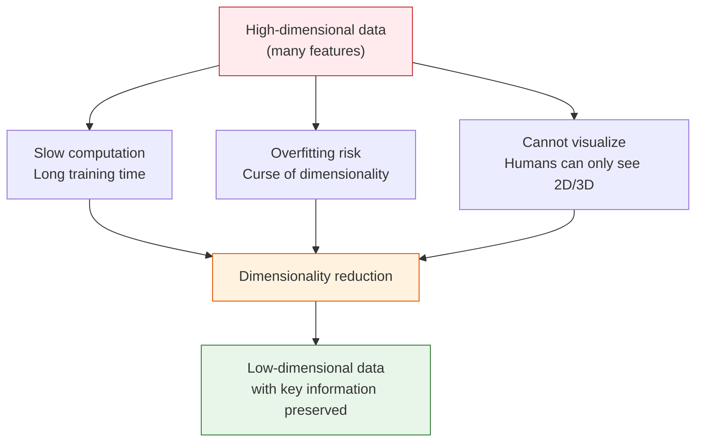
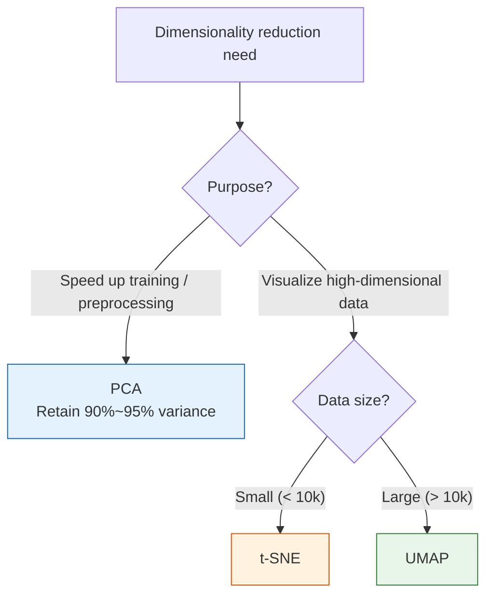

# Dimensionality Reduction Algorithms


:::tip Section Overview
Real-world data often has dozens or even thousands of features. Dimensionality reduction can **reduce the number of features while preserving important information**—it can both speed up training and help with visualization. This section builds on PCA from Station 4 and takes it into deeper practical use.
:::

## Learning Objectives

- Gain a deep understanding of PCA principles and practical applications (connected to Station 4)
- Master explained variance ratio analysis
- Understand the visualization principles and usage of t-SNE
- Learn the UMAP dimensionality reduction method

## First, set a very important learning expectation

This section is very easy for newcomers to get sidetracked by tool names at the start:

- PCA
- t-SNE
- UMAP

But on the first pass, what you should learn is not the differences by memorizing tools, but first to distinguish:

> **Are you reducing dimensions for modeling preprocessing, or for visualization and exploration?**

Once that purpose is clear, the method choice later becomes much smoother.

---

## First, build a map

This section on dimensionality reduction can easily be learned as “knowing a few tool names,” but what really matters is clarifying the purpose first.
Because when you do dimensionality reduction, you may actually be solving very different problems:

- Want to compress features and speed up training
- Want to reduce noise and correlation
- Want to plot high-dimensional data to inspect its structure

A more stable learning sequence is:


Separating “for modeling” from “for visualization” is the most important first step in this section.

---

## 1. Why do we need dimensionality reduction?

### 1.1 Problems with high-dimensional data



| Problem | Description |
|------|------|
| **Curse of dimensionality** | The more features there are, the sparser the data becomes, and the harder it is for models to learn |
| **Computational cost** | More features → slower training and larger memory usage |
| **Multicollinearity** | Many features are highly correlated and redundant |
| **Visualization** | Data with more than 3 dimensions cannot be plotted directly |

### 1.2 Two approaches to dimensionality reduction

| Approach | Method | Description |
|------|------|------|
| **Feature selection** | Pick important features | Keep a subset of the original features |
| **Feature extraction** | Generate new features | Transform original features into fewer new features (PCA, t-SNE) |

### 1.3 The easiest point to confuse when learning dimensionality reduction for the first time

Many newcomers mix up “dimensionality reduction” and “dropping features.”
In fact, they are not the same:

- Feature selection: keep some columns from the original set
- Dimensionality reduction: recombine original columns into fewer new axes

So after PCA, the principal components are no longer the original fields themselves, but linear combinations of them.

### 1.3.1 A more beginner-friendly analogy

You can think of dimensionality reduction as:

- Compressing a big bundle of scattered information into fewer main lines

This is not simply deleting some features,
but more like twisting many original features into several “new axes” with denser information.

So the most important thing to remember first is not the algorithm name, but:

- It is doing information compression and representation reorganization

---

## 2. PCA in practice

### 2.1 Review the principle

:::info Connection to Station 4
In Section 1.3, "Eigenvalues and Eigenvectors," of Station 4, you already learned the mathematical principles behind PCA:
- Compute the covariance matrix
- Find eigenvalues and eigenvectors
- Choose the direction corresponding to the largest eigenvalue as the principal component

The focus of this section is **practical application**—how to use PCA on real data.
:::

**The core idea of PCA**: find the direction with the largest variance in the data and project onto it.

### 2.2 Handwritten digit dimensionality reduction

```python
from sklearn.datasets import load_digits
from sklearn.preprocessing import StandardScaler
from sklearn.decomposition import PCA
import numpy as np
import matplotlib.pyplot as plt

# Load handwritten digit data
digits = load_digits()
X, y = digits.data, digits.target
print(f"Original data: {X.shape[0]} samples, {X.shape[1]} features")

# Look at a few samples first
fig, axes = plt.subplots(2, 10, figsize=(15, 3))
for i, ax in enumerate(axes.ravel()):
    ax.imshow(digits.images[i], cmap='gray')
    ax.set_title(str(y[i]), fontsize=9)
    ax.axis('off')
plt.suptitle('Handwritten digit samples (8×8 = 64 features)')
plt.tight_layout()
plt.show()

# Standardize
scaler = StandardScaler()
X_scaled = scaler.fit_transform(X)

# Reduce to 2D with PCA
pca_2d = PCA(n_components=2)
X_2d = pca_2d.fit_transform(X_scaled)
print(f"After dimensionality reduction: {X_2d.shape}")
print(f"Retained variance ratio: {pca_2d.explained_variance_ratio_.sum():.1%}")

# Visualization
plt.figure(figsize=(10, 8))
scatter = plt.scatter(X_2d[:, 0], X_2d[:, 1], c=y, cmap='tab10', s=10, alpha=0.6)
plt.colorbar(scatter, label='Digit')
plt.xlabel(f'PC1 (variance share {pca_2d.explained_variance_ratio_[0]:.1%})')
plt.ylabel(f'PC2 (variance share {pca_2d.explained_variance_ratio_[1]:.1%})')
plt.title('PCA reduced to 2D (handwritten digits)')
plt.grid(True, alpha=0.3)
plt.show()
```

### 2.3 Explained variance ratio analysis

**Key question**: How many principal components should we keep?

```python
# Use all principal components
pca_full = PCA()
pca_full.fit(X_scaled)

# Explained variance ratio
explained = pca_full.explained_variance_ratio_
cumulative = np.cumsum(explained)

fig, axes = plt.subplots(1, 2, figsize=(14, 5))

# Variance share of each principal component
axes[0].bar(range(1, len(explained)+1), explained, color='steelblue', alpha=0.7)
axes[0].set_xlabel('Principal component index')
axes[0].set_ylabel('Explained variance ratio')
axes[0].set_title('Variance share of each principal component')
axes[0].set_xlim(0, 30)

# Cumulative variance
axes[1].plot(range(1, len(cumulative)+1), cumulative, 'bo-', markersize=3)
axes[1].axhline(y=0.9, color='r', linestyle='--', label='90% threshold')
axes[1].axhline(y=0.95, color='orange', linestyle='--', label='95% threshold')

# Mark the point reaching 90%
n_90 = np.argmax(cumulative >= 0.9) + 1
n_95 = np.argmax(cumulative >= 0.95) + 1
axes[1].axvline(x=n_90, color='r', linestyle=':', alpha=0.5)
axes[1].axvline(x=n_95, color='orange', linestyle=':', alpha=0.5)

axes[1].set_xlabel('Number of principal components')
axes[1].set_ylabel('Cumulative explained variance ratio')
axes[1].set_title('Cumulative explained variance ratio (Scree Plot)')
axes[1].legend()

for ax in axes:
    ax.grid(True, alpha=0.3)

plt.tight_layout()
plt.show()

print(f"Keeping 90% of the variance requires {n_90} principal components (out of the original 64)")
print(f"Keeping 95% of the variance requires {n_95} principal components (out of the original 64)")
```

### 2.3.1 How do you decide between keeping 90% or 95%?

There is no fixed answer that always works, but for your first project, you can start like this:

- If you care more about training speed and compression, try 90% first
- If you worry more about losing information, try 95% first
- In the end, always validate with downstream model performance, not just the explained variance ratio

Because “how much variance is retained” is not the same as “what works best for the downstream task.”


When reading a PCA plot, first look at the inflection point of the cumulative variance curve: before the inflection point, each extra principal component is very valuable; after that, the gain becomes smaller. 90% or 95% are just practical thresholds, and you still need to judge together with downstream model scores, training speed, and interpretability.

### 2.4 The impact of PCA on model performance

```python
from sklearn.model_selection import train_test_split
from sklearn.linear_model import LogisticRegression
from sklearn.pipeline import make_pipeline
import time

X_train, X_test, y_train, y_test = train_test_split(X, y, test_size=0.2, random_state=42)

# Compare different numbers of principal components
n_components_list = [2, 5, 10, 20, 30, 64]
results = []

for n in n_components_list:
    pipe = make_pipeline(
        StandardScaler(),
        PCA(n_components=n) if n < 64 else PCA(),
        LogisticRegression(max_iter=5000, random_state=42)
    )

    start = time.time()
    pipe.fit(X_train, y_train)
    train_time = time.time() - start

    score = pipe.score(X_test, y_test)
    results.append({'n': n, 'score': score, 'time': train_time})
    print(f"PC={n:3d} | Accuracy: {score:.1%} | Training time: {train_time:.3f}s")

# Visualization
fig, ax1 = plt.subplots(figsize=(8, 5))
ax2 = ax1.twinx()

ns = [r['n'] for r in results]
scores = [r['score'] for r in results]
times = [r['time'] for r in results]

ax1.plot(ns, scores, 'bo-', label='Accuracy')
ax2.plot(ns, times, 'rs-', label='Training time')

ax1.set_xlabel('Number of principal components')
ax1.set_ylabel('Accuracy', color='blue')
ax2.set_ylabel('Training time (s)', color='red')
ax1.set_title('How PCA affects model performance and speed')

ax1.legend(loc='lower right')
ax2.legend(loc='center right')
ax1.grid(True, alpha=0.3)
plt.tight_layout()
plt.show()
```

### 2.4.1 PCA is not just about compressing dimensions

PCA often provides three kinds of value in projects:

- Remove redundant correlated information
- Reduce noise and make the model more stable
- Let downstream algorithms train in a more compact feature space

So after PCA, don’t just ask “How many dimensions were reduced?” Also ask:

- Did the model become faster?
- Did generalization become more stable?
- Is overfitting less likely?

---

## 3. t-SNE visualization

### 3.1 Limitations of PCA

PCA is a **linear** dimensionality reduction method—it can only find linear directions. For complex high-dimensional data, different classes may overlap on a 2D PCA plot.

### 3.2 t-SNE principle

t-SNE (t-distributed Stochastic Neighbor Embedding) is a nonlinear dimensionality reduction method designed specifically for **visualization**.

**Core idea**:
- Compute pairwise "similarities" between points in high-dimensional space
- Compute "similarities" again in low-dimensional space
- Adjust the low-dimensional coordinates so the similarity distributions in both spaces match as closely as possible

| Feature | Description |
|------|------|
| Nonlinear | Can show complex data structures |
| Designed for visualization | Usually reduced to 2D or 3D |
| Preserves local structure | Nearby points remain nearby in low-dimensional space |
| Randomness | Results may differ each run |

### 3.3 t-SNE in practice

```python
from sklearn.manifold import TSNE

# t-SNE dimensionality reduction
tsne = TSNE(n_components=2, random_state=42, perplexity=30)
X_tsne = tsne.fit_transform(X_scaled)

# PCA vs t-SNE comparison
fig, axes = plt.subplots(1, 2, figsize=(16, 6))

axes[0].scatter(X_2d[:, 0], X_2d[:, 1], c=y, cmap='tab10', s=10, alpha=0.6)
axes[0].set_title('PCA reduced to 2D')
axes[0].set_xlabel('PC1')
axes[0].set_ylabel('PC2')

axes[1].scatter(X_tsne[:, 0], X_tsne[:, 1], c=y, cmap='tab10', s=10, alpha=0.6)
axes[1].set_title('t-SNE reduced to 2D')
axes[1].set_xlabel('t-SNE 1')
axes[1].set_ylabel('t-SNE 2')

for ax in axes:
    ax.grid(True, alpha=0.3)

plt.suptitle('PCA vs t-SNE (handwritten digit data)', fontsize=13)
plt.tight_layout()
plt.show()
```

### 3.4 The perplexity parameter

`perplexity` controls the number of "neighbors" t-SNE pays attention to and affects the visualization:

```python
fig, axes = plt.subplots(1, 4, figsize=(20, 4))
perplexities = [5, 15, 30, 50]

for ax, perp in zip(axes, perplexities):
    tsne = TSNE(n_components=2, perplexity=perp, random_state=42)
    X_t = tsne.fit_transform(X_scaled)
    ax.scatter(X_t[:, 0], X_t[:, 1], c=y, cmap='tab10', s=8, alpha=0.6)
    ax.set_title(f'perplexity = {perp}')
    ax.grid(True, alpha=0.3)

plt.suptitle('The effect of the t-SNE perplexity parameter', fontsize=13)
plt.tight_layout()
plt.show()
```

:::warning t-SNE Notes
1. **Use it only for visualization**. Do not use t-SNE to extract features and then train a model
2. **It is slow**. For large datasets, first use PCA to reduce to 50 dimensions, then run t-SNE
3. **Distances are not meaningful**. You cannot compare the sizes of distances between different clusters
4. **Results differ each run** (you can fix this with `random_state`)
:::

### 3.5 The easiest place to misread t-SNE

t-SNE plots look beautiful, but beginners often mistakenly think:

- If clusters are farther apart, that means they are also farther apart in the original space
- If the plot looks more separated, the model must be better

Neither of these is always true.
What you should mainly look at with t-SNE is:

- Whether local neighborhood relationships are preserved
- Whether samples of the same class are more likely to form groups

Do not treat the whole plot as a strict geometric map.

---

## 4. UMAP dimensionality reduction

### 4.1 Introduction to UMAP

UMAP (Uniform Manifold Approximation and Projection) is a dimensionality reduction method that is faster than t-SNE and better at preserving global structure.

| | t-SNE | UMAP |
|---|-------|------|
| Speed | Slow | Much faster |
| Global structure | Not preserved | Preserved better |
| Can be used for feature extraction | Not recommended | Yes |
| Parameters | `perplexity` | `n_neighbors`, `min_dist` |

### 4.2 UMAP in practice

```bash
pip install umap-learn
```

```python
# UMAP requires installation: pip install umap-learn
try:
    import umap

    reducer = umap.UMAP(n_components=2, random_state=42)
    X_umap = reducer.fit_transform(X_scaled)

    # Compare three methods
    fig, axes = plt.subplots(1, 3, figsize=(18, 5))

    axes[0].scatter(X_2d[:, 0], X_2d[:, 1], c=y, cmap='tab10', s=10, alpha=0.6)
    axes[0].set_title('PCA')

    axes[1].scatter(X_tsne[:, 0], X_tsne[:, 1], c=y, cmap='tab10', s=10, alpha=0.6)
    axes[1].set_title('t-SNE')

    axes[2].scatter(X_umap[:, 0], X_umap[:, 1], c=y, cmap='tab10', s=10, alpha=0.6)
    axes[2].set_title('UMAP')

    for ax in axes:
        ax.grid(True, alpha=0.3)

    plt.suptitle('PCA vs t-SNE vs UMAP (handwritten digits)', fontsize=13)
    plt.tight_layout()
    plt.show()

except ImportError:
    print("Please install umap-learn first: pip install umap-learn")
```

### 4.3 UMAP parameters

| Parameter | Description | Recommendation |
|------|------|------|
| `n_neighbors` | Number of local neighbors (similar to perplexity) | 15 (default) |
| `min_dist` | Minimum distance between points in low-dimensional space | 0.1 (default) |
| `n_components` | Target dimensionality | 2 or 3 |
| `metric` | Distance metric | 'euclidean' (default) |

---

## 5. Summary of dimensionality reduction methods

| Method | Type | Speed | Use case |
|------|------|------|---------|
| **PCA** | Linear | Fast | Feature extraction, data compression, preprocessing |
| **t-SNE** | Nonlinear | Slow | High-dimensional data visualization (2D/3D) |
| **UMAP** | Nonlinear | Medium | Visualization + feature extraction |



### 5.1 What is the safest default order when doing a project for the first time?

You can follow this default order directly:

1. If the goal is modeling preprocessing, try `PCA` first
2. If the goal is 2D visualization, try `PCA` first as a baseline, then try `t-SNE`
3. If the data is larger and you still want to preserve structure, try `UMAP`

This order is the safest because it starts with the easiest method to explain.

---

## 7. The safest default order when putting dimensionality reduction into a project for the first time

When you first put dimensionality reduction into a real project, you can follow this order:

1. First clarify the purpose: speed up training, reduce noise, or visualize
2. If it is modeling preprocessing, try PCA first
3. Check downstream performance when retaining 90% and 95% variance
4. If it is exploratory visualization, then add t-SNE or UMAP
5. In the end, always return to downstream task metrics or business interpretation to decide whether it is worth keeping

In this way, you won’t learn dimensionality reduction as “which picture looks better,” but more like representation design in a real project.

:::info Next Steps
- **Next section**: Anomaly Detection — finding what is “abnormal” in data
- **Station 4 review**: The eigenvalue principle behind PCA (Section 1.3)
:::

---

## Summary

| Key Point | Description |
|------|------|
| PCA | Linear dimensionality reduction; preserves directions of maximum variance; can be used for feature extraction |
| Explained variance ratio | When the cumulative total reaches 90%~95%, you can decide how many principal components to keep |
| t-SNE | Nonlinear, designed for visualization, preserves local structure |
| UMAP | Faster than t-SNE and can preserve global structure |

## What should you take away from this section?

If you only take away one sentence, I hope you remember this:

> **Dimensionality reduction is not about making the plot look nicer; it is about making purposeful trade-offs between “information preservation” and “more compact representation.”**

So what really matters is:

- First distinguish modeling preprocessing from visualization and exploration
- Know that PCA is the default starting point
- Know that t-SNE and UMAP are more about exploration and presentation
- Know that in the end, you still need to judge by downstream task performance

## Hands-on exercises

### Exercise 1: Iris PCA reduction

Use `load_iris()` to perform PCA reduction to 2D and 3D (using `mpl_toolkits.mplot3d`), and compare which one separates the three species better.

### Exercise 2: Explained variance ratio

Use the `load_wine()` dataset with PCA, draw a Scree Plot, and determine how many principal components are needed to reach 95% explained variance.

### Exercise 3: t-SNE vs PCA

Use the `load_digits()` dataset and compare PCA and t-SNE in 2D visualization. Try different `perplexity` values (5, 15, 30, 50, 100) and observe which works best.

### Exercise 4: Dimensionality reduction + classification

On `load_digits()`, first use PCA to reduce to different dimensions (5, 10, 20, 30, 50), then use logistic regression for classification, plot the “dimension vs accuracy” curve, and find the optimal dimension.
