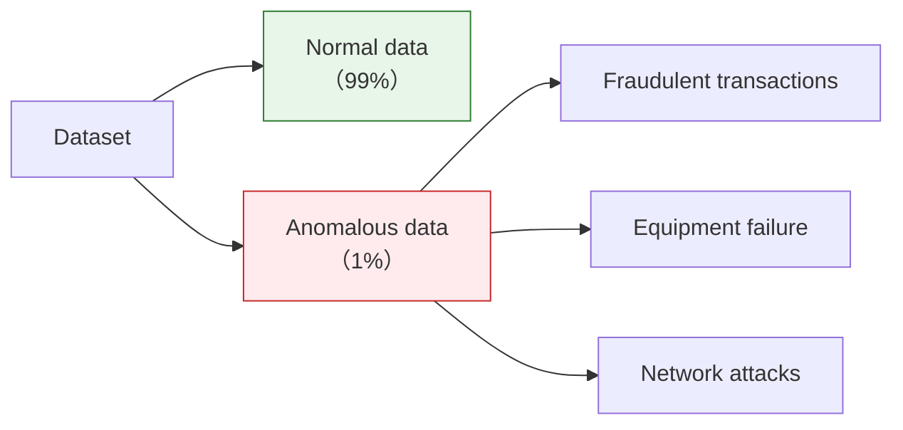
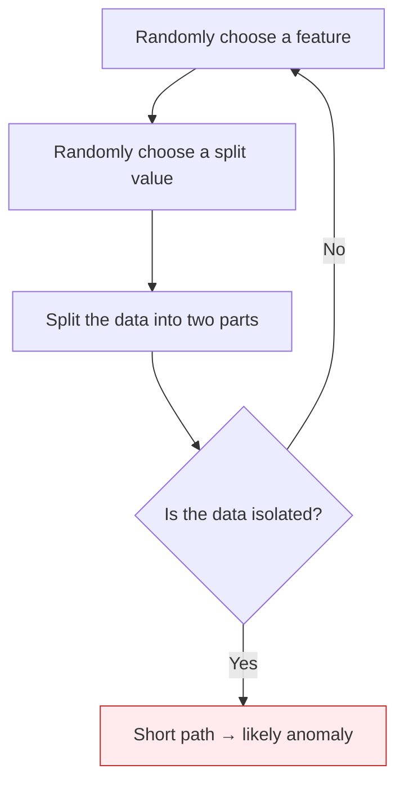
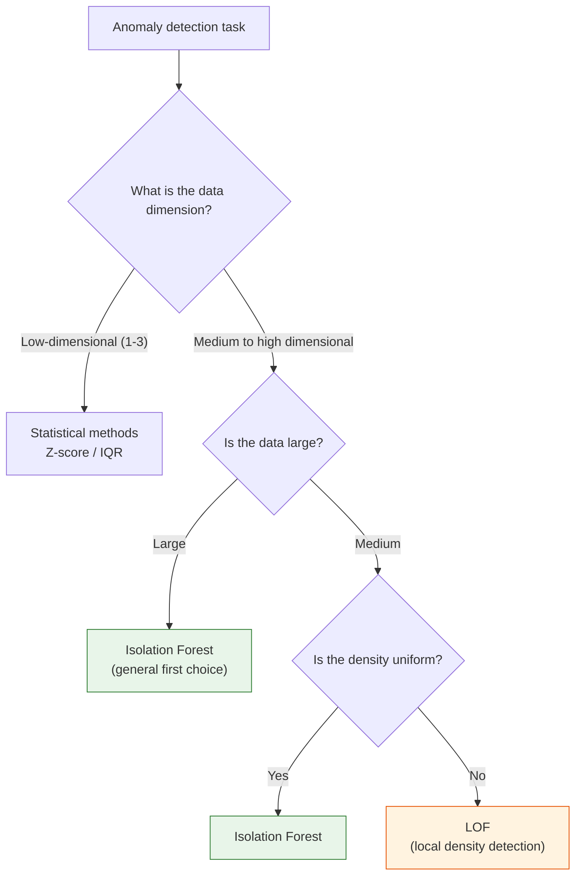

# Anomaly Detection


:::tip Section Overview
Anomaly detection is used to find **"abnormal"** samples in data—credit card fraud, network intrusions, equipment failures, and more. Unlike classification, anomalies are usually rare and there are not enough labels, so special algorithms are needed.
:::

## Learning Objectives

- Master statistical anomaly detection methods (Z-score, IQR)
- Master Isolation Forest
- Understand One-Class SVM
- Understand LOF (Local Outlier Factor)
- Be able to compare methods and choose the right one

## First, set the right learning expectation

The part that most easily trips up beginners in this section is that it does not have the clear labels and boundaries of ordinary classification.
What is more suitable for the first pass is not memorizing every method, but building this mental model first:

> **In anomaly detection, you often define what "normal" looks like first, and then judge who deviates too far from it.**

Once this idea is in place, the statistical methods, Isolation Forest, LOF, and threshold selection will make much more sense.

---

## Build a map first

The hardest part of anomaly detection for beginners is that it is not like ordinary classification, where "the labels are clear, so you just learn it directly." Often you are dealing with:

- Very few anomalies
- Incomplete anomaly labels
- New anomalies that do not look like old ones

A more stable order of understanding is:


So the most important thing in anomaly detection is not memorizing model names first, but understanding what “anomaly” actually means in your case.


Read this comic as the main warning for the section: anomaly detection is not simply “find strange points.” A point becomes important when it is strange enough to trigger a useful action. That is why thresholds, `contamination`, false positives, false negatives, and business cost are part of the modeling problem, not afterthoughts.

### Keyword Decoder Before You Start

| Term | Beginner-friendly meaning | Why it matters here |
|---|---|---|
| anomaly / outlier | A sample that does not fit the normal pattern | The same point may be harmless in one business and urgent in another |
| threshold | The cutoff where you decide “alert” vs “ignore” | Moving it changes false positives and false negatives |
| false positive | A normal point incorrectly flagged as anomalous | Too many false alarms make users ignore the system |
| false negative | A real anomaly missed by the model | In fraud, security, or equipment monitoring, this can be very costly |
| `contamination` | Your estimated anomaly ratio | Many sklearn anomaly models use it to decide how many points to flag |
| `decision_function()` | A score where higher usually means more normal for many sklearn detectors | Useful for drawing score heatmaps and tuning thresholds |
| `fit_predict()` | Train the detector and immediately output labels | In these examples, `1` means normal and `-1` means anomaly |
| LOF | Local Outlier Factor; compares a point with its local neighbors | Good when “abnormal” depends on local density |

---

## 1. Overview of anomaly detection

### 1.1 What is an anomaly?

**Anomaly (Outlier)** = a sample that is significantly different from most of the data.



| Application scenario | Normal data | Anomalous data |
|---------|---------|---------|
| Credit card fraud | Regular spending | Stolen-card transactions |
| Industrial monitoring | Equipment running normally | Equipment about to fail |
| Network security | Normal traffic | DDoS attacks |
| Medical diagnosis | Normal health indicators | Disease signals |

### 1.2 Why not use a classifier?

| Problem | Explanation |
|------|------|
| **Class imbalance** | Anomalous samples may be only 0.1% |
| **Lack of labels** | Many anomalies are not known in advance |
| **Anomalies change** | New fraud methods keep appearing |

### 1.2.1 What is the real difference between anomaly detection and classification?

Classification usually learns:

- “How do A and B differ?”

Anomaly detection more often learns:

- “What do most normal samples look like?”
- “How far away is too far?”

That is why thresholds, false positives, false negatives, and business cost matter so much in anomaly detection.

### 1.2.2 A better analogy for beginners

You can think of anomaly detection as:

- First understanding the “daily rhythm” of normal behavior

For example:

- The normal range of equipment temperature
- The normal login time and operation frequency of users

At this point, an anomaly is not necessarily something “never seen before,”
but rather something that:

- Deviates too far from the normal pattern
- Or falls into a place that very few points occupy

### 1.3 Generate demo data

```python
import numpy as np
import matplotlib.pyplot as plt

rng = np.random.default_rng(seed=42)

# Normal data: 2D Gaussian distribution
n_normal = 300
X_normal = rng.normal(size=(n_normal, 2)) * 1.5 + [5, 5]

# Anomalous data: random scatter
n_anomaly = 15
X_anomaly = rng.uniform(0, 12, (n_anomaly, 2))

# Merge
X_all = np.vstack([X_normal, X_anomaly])
y_true = np.array([1] * n_normal + [-1] * n_anomaly)  # 1=normal, -1=anomaly

print(f"Total samples: {X_all.shape[0]}")
print(f"Normal samples: {n_normal}")
print(f"Injected anomalies: {n_anomaly}")
print(f"True anomaly ratio: {n_anomaly / len(X_all):.1%}")

plt.figure(figsize=(8, 6))
plt.scatter(X_normal[:, 0], X_normal[:, 1], s=20, alpha=0.6, label='Normal', color='steelblue')
plt.scatter(X_anomaly[:, 0], X_anomaly[:, 1], s=80, marker='x', color='red',
            linewidths=2, label='Anomaly')
plt.title('Demo Data for Anomaly Detection')
plt.xlabel('Feature 1')
plt.ylabel('Feature 2')
plt.legend()
plt.grid(True, alpha=0.3)
plt.show()
```

Expected output:

```text
Total samples: 315
Normal samples: 300
Injected anomalies: 15
True anomaly ratio: 4.8%
```

In real projects, you usually do not know the true anomaly ratio. Here we know it only because this is synthetic data, which makes it useful for learning and evaluation.

---

## 2. Statistical methods

### 2.1 Z-score method

**Idea**: Assume the data follows a normal distribution, and treat samples that are more than N standard deviations away from the mean as anomalies.

> **Z = (x - μ) / σ**

Usually, |Z| > 3 is considered anomalous (99.7% of data lies within 3σ).

```python
from scipy import stats

# 1D example
rng = np.random.default_rng(seed=42)
data_1d = np.concatenate([rng.normal(size=200) * 2 + 10, [25, -5, 30]])

z_scores = np.abs(stats.zscore(data_1d))
threshold = 3
anomalies = z_scores > threshold
print(f"Z-score anomalies found: {anomalies.sum()}")
print("Z-score anomaly values:", np.round(data_1d[anomalies], 2).tolist())

plt.figure(figsize=(10, 4))
plt.scatter(range(len(data_1d)), data_1d, c=['red' if a else 'steelblue' for a in anomalies],
            s=20, alpha=0.7)
plt.axhline(y=data_1d[~anomalies].mean() + threshold * data_1d[~anomalies].std(),
            color='orange', linestyle='--', label='+3σ')
plt.axhline(y=data_1d[~anomalies].mean() - threshold * data_1d[~anomalies].std(),
            color='orange', linestyle='--', label='-3σ')
plt.title(f'Z-score Anomaly Detection ({anomalies.sum()} anomalies found)')
plt.legend()
plt.grid(True, alpha=0.3)
plt.show()
```

Expected output:

```text
Z-score anomalies found: 3
Z-score anomaly values: [25.0, -5.0, 30.0]
```

### 2.2 IQR method

**Idea**: Based on quartiles, with no assumption about the data distribution.

- IQR = Q3 - Q1 (interquartile range)
- Anomaly: x < Q1 - 1.5×IQR or x > Q3 + 1.5×IQR

```python
# IQR method
Q1 = np.percentile(data_1d, 25)
Q3 = np.percentile(data_1d, 75)
IQR = Q3 - Q1
lower = Q1 - 1.5 * IQR
upper = Q3 + 1.5 * IQR
anomalies_iqr = (data_1d < lower) | (data_1d > upper)
print(f"Q1={Q1:.2f}, Q3={Q3:.2f}, IQR={IQR:.2f}")
print(f"Lower={lower:.2f}, Upper={upper:.2f}")
print(f"IQR anomalies found: {anomalies_iqr.sum()}")
print("IQR anomaly values:", np.round(data_1d[anomalies_iqr], 2).tolist())

fig, axes = plt.subplots(1, 2, figsize=(12, 4))

# Box plot
axes[0].boxplot(data_1d, vert=False)
axes[0].set_title('Box Plot (Automatically Marks Outliers)')

# Scatter plot
axes[1].scatter(range(len(data_1d)), data_1d,
                c=['red' if a else 'steelblue' for a in anomalies_iqr], s=20, alpha=0.7)
axes[1].axhline(y=upper, color='orange', linestyle='--', label=f'Upper bound={upper:.1f}')
axes[1].axhline(y=lower, color='orange', linestyle='--', label=f'Lower bound={lower:.1f}')
axes[1].set_title(f'IQR Anomaly Detection ({anomalies_iqr.sum()} anomalies found)')
axes[1].legend()
axes[1].grid(True, alpha=0.3)

plt.tight_layout()
plt.show()
```

Expected output:

```text
Q1=8.68, Q3=11.13, IQR=2.45
Lower=5.01, Upper=14.80
IQR anomalies found: 4
IQR anomaly values: [15.83, 25.0, -5.0, 30.0]
```

Notice that IQR finds one more point than Z-score here. This is not a bug; the two methods define “far away” differently.

### 2.3 Z-score vs IQR

| | Z-score | IQR |
|---|---------|-----|
| Assumption | Normal distribution | No distribution assumption |
| Robustness | Affected by extreme values | More robust |
| Suitable for | Roughly normal data | Any distribution |
| Threshold | Usually 3σ | 1.5×IQR |

### 2.4 When are statistical methods especially worth trying first?

If you are dealing with:

- Low-dimensional data
- Simple rules
- A need to quickly find obvious outliers

then statistical methods are still very worth trying first.
Their value is not just that they are “simple,” but also that:

- You can quickly get an interpretable baseline
- You can get a rough sense of the anomaly rate
- You can discover problems in the data distribution earlier


When reading this chart, first ask what the anomaly looks like: if it is just extreme values in a single column, Z-score or IQR is fast enough; if it is a few isolated points in high-dimensional space, Isolation Forest is more suitable; if anomalies depend on local density differences, look at LOF; if you just want to learn the normal boundary, then consider One-Class SVM.

---

## 3. Isolation Forest

### 3.1 Principle

The idea behind Isolation Forest is very clever:

**Anomalies are easier to "isolate" — it takes only a few splits to separate them.**



| Concept | Explanation |
|------|------|
| Path length | Number of steps from root node to leaf node |
| Anomaly score | Shorter path → higher score → more likely an anomaly |
| Normal point | Surrounded by “normal” data and needs more splits to isolate |

### 3.2 sklearn implementation

```python
from sklearn.ensemble import IsolationForest

# Train Isolation Forest
iso = IsolationForest(
    n_estimators=100,
    contamination=0.05,  # Estimated anomaly ratio
    random_state=42
)
y_pred_iso = iso.fit_predict(X_all)  # 1=normal, -1=anomaly
print(f"Isolation Forest detected: {(y_pred_iso == -1).sum()}")

# Visualization
fig, axes = plt.subplots(1, 2, figsize=(14, 5))

# Prediction results
colors_pred = ['red' if p == -1 else 'steelblue' for p in y_pred_iso]
axes[0].scatter(X_all[:, 0], X_all[:, 1], c=colors_pred, s=20, alpha=0.7)
n_detected = (y_pred_iso == -1).sum()
axes[0].set_title(f'Isolation Forest Detection Results\n({n_detected} anomalies detected)')

# Anomaly score heatmap
xx, yy = np.meshgrid(np.linspace(-2, 14, 200), np.linspace(-2, 14, 200))
Z = iso.decision_function(np.c_[xx.ravel(), yy.ravel()])
Z = Z.reshape(xx.shape)
axes[1].contourf(xx, yy, Z, levels=20, cmap='RdBu')
axes[1].scatter(X_all[:, 0], X_all[:, 1], c=colors_pred, s=20, edgecolors='white', linewidth=0.5)
axes[1].set_title('Anomaly Score Heatmap\n(blue=normal, red=anomaly)')

for ax in axes:
    ax.grid(True, alpha=0.3)

plt.tight_layout()
plt.show()

# Evaluation
from sklearn.metrics import classification_report
print("Isolation Forest evaluation:")
print(classification_report(y_true, y_pred_iso, target_names=['Anomaly(-1)', 'Normal(1)']))
```

Expected output excerpt:

```text
Isolation Forest detected: 16
              precision    recall  f1-score   support

 Anomaly(-1)       0.75      0.80      0.77        15
   Normal(1)       0.99      0.99      0.99       300
```

The detector flags 16 points while we injected 15 anomalies. That difference is exactly why anomaly detection is a threshold-and-cost problem: a few extra alerts may be acceptable in fraud monitoring, but annoying in a user-facing notification system.

### 3.3 Key parameters

| Parameter | Explanation | Recommendation |
|------|------|------|
| `n_estimators` | Number of trees | 100 (default) |
| `contamination` | Estimated anomaly ratio | Set based on the business case |
| `max_samples` | Number of samples per tree | 'auto' or 256 |
| `max_features` | Fraction of features used per tree | 1.0 (default) |

### 3.4 Why is Isolation Forest often the first choice?

Because in many real-world tasks, it hits a very practical balance:

- Better at handling high-dimensional data than statistical methods
- Easier to scale to larger data than One-Class SVM
- More suitable as a general baseline than LOF

So when you build your first anomaly detection project, if you do not yet have a very clear structural assumption, starting with Isolation Forest is often the safest choice.

---

## 4. One-Class SVM

### 4.1 Principle

Train using **normal data only** and learn a boundary around “normal.” Anything outside the boundary is anomalous.

```python
from sklearn.svm import OneClassSVM

# One-Class SVM
ocsvm = OneClassSVM(kernel='rbf', gamma='auto', nu=0.05)  # nu ≈ anomaly ratio
y_pred_svm = ocsvm.fit_predict(X_all)
print(f"One-Class SVM detected: {(y_pred_svm == -1).sum()}")

# Visualization
fig, axes = plt.subplots(1, 2, figsize=(14, 5))

colors_svm = ['red' if p == -1 else 'steelblue' for p in y_pred_svm]
axes[0].scatter(X_all[:, 0], X_all[:, 1], c=colors_svm, s=20, alpha=0.7)
n_detected = (y_pred_svm == -1).sum()
axes[0].set_title(f'One-Class SVM Detection Results\n({n_detected} anomalies detected)')

# Decision boundary
Z_svm = ocsvm.decision_function(np.c_[xx.ravel(), yy.ravel()])
Z_svm = Z_svm.reshape(xx.shape)
axes[1].contourf(xx, yy, Z_svm, levels=20, cmap='RdBu')
axes[1].contour(xx, yy, Z_svm, levels=[0], colors='black', linewidths=2)
axes[1].scatter(X_all[:, 0], X_all[:, 1], c=colors_svm, s=20, edgecolors='white', linewidth=0.5)
axes[1].set_title('One-Class SVM Decision Boundary')

for ax in axes:
    ax.grid(True, alpha=0.3)

plt.tight_layout()
plt.show()
```

Expected output:

```text
One-Class SVM detected: 60
```

This result is intentionally useful for learning: with `gamma='auto'` on this toy data, One-Class SVM is much more aggressive than Isolation Forest. Do not treat `nu=0.05` as a guarantee that exactly 5% of points will be flagged; it is a constraint-like parameter, not a magic percentage switch.

### 4.2 Key parameters

| Parameter | Explanation |
|------|------|
| `kernel` | Kernel function (`'rbf'` is most commonly used) |
| `nu` | Upper bound on the anomaly ratio (0 to 1) |
| `gamma` | RBF kernel parameter (`'auto'` or `'scale'`) |

---

## 5. LOF (Local Outlier Factor)

### 5.1 Principle

LOF (Local Outlier Factor) judges anomalies by comparing **a point’s density with its neighbors’ density**.

- Normal point: the density around its neighbors is similar to its own
- Anomalous point: the density around its neighbors is much higher than its own (it lies in a “low-density region”)

LOF’s advantage: **it can detect local anomalies** — it works even in regions with different densities.

### 5.2 sklearn implementation

```python
from sklearn.neighbors import LocalOutlierFactor

# LOF
lof = LocalOutlierFactor(n_neighbors=20, contamination=0.05)
y_pred_lof = lof.fit_predict(X_all)
print(f"LOF detected: {(y_pred_lof == -1).sum()}")

# Visualization
fig, ax = plt.subplots(figsize=(8, 6))
colors_lof = ['red' if p == -1 else 'steelblue' for p in y_pred_lof]

# LOF score (the larger the absolute value, the more anomalous)
lof_scores = -lof.negative_outlier_factor_
sizes = 20 + (lof_scores - lof_scores.min()) / (lof_scores.max() - lof_scores.min()) * 200
print(f"LOF score range: {lof_scores.min():.2f} to {lof_scores.max():.2f}")

ax.scatter(X_all[:, 0], X_all[:, 1], c=colors_lof, s=sizes, alpha=0.6,
           edgecolors='white', linewidth=0.5)
n_detected = (y_pred_lof == -1).sum()
ax.set_title(f'LOF Detection Results (larger circle = more anomalous, {n_detected} detected)')
ax.grid(True, alpha=0.3)
plt.tight_layout()
plt.show()
```

Expected output:

```text
LOF detected: 16
LOF score range: 0.96 to 3.21
```

LOF scores are most useful as relative signals. A larger score means “this point looks less like its local neighborhood,” not necessarily “this point is globally far away.”

### 5.3 Key parameters

| Parameter | Explanation | Recommendation |
|------|------|------|
| `n_neighbors` | Number of neighbors to consider | 20 (default) |
| `contamination` | Anomaly ratio | `'auto'` or set manually |

### 5.4 What problem is LOF best for?

The most important thing to remember about LOF is not the formula, but that it is especially good at handling cases where:

- A point does not look extremely unusual globally
- But it clearly does not fit in with its local neighborhood

That is the idea of a “local anomaly.”
If your data has large density differences across regions, LOF often makes more sense than methods that only look at a global boundary.

---

## 6. Comprehensive method comparison

```python
from sklearn.ensemble import IsolationForest
from sklearn.svm import OneClassSVM
from sklearn.neighbors import LocalOutlierFactor

methods = {
    'Isolation Forest': IsolationForest(contamination=0.05, random_state=42),
    'One-Class SVM': OneClassSVM(nu=0.05, kernel='rbf', gamma='auto'),
    'LOF': LocalOutlierFactor(n_neighbors=20, contamination=0.05),
}

fig, axes = plt.subplots(1, 3, figsize=(18, 5))

for ax, (name, model) in zip(axes, methods.items()):
    y_pred = model.fit_predict(X_all)
    colors = ['red' if p == -1 else 'steelblue' for p in y_pred]
    ax.scatter(X_all[:, 0], X_all[:, 1], c=colors, s=20, alpha=0.7)
    n_anomalies = (y_pred == -1).sum()
    print(f"{name}: {n_anomalies} anomalies detected")
    ax.set_title(f'{name}\n{n_anomalies} anomalies detected')
    ax.grid(True, alpha=0.3)

plt.suptitle('Comparison of Three Anomaly Detection Methods', fontsize=13)
plt.tight_layout()
plt.show()
```

Expected output:

```text
Isolation Forest: 16 anomalies detected
One-Class SVM: 60 anomalies detected
LOF: 16 anomalies detected
```

| | Statistical methods | Isolation Forest | One-Class SVM | LOF |
|---|---------|-----------------|---------------|-----|
| Principle | Distance from mean/quartiles | Random split isolation | Learn normal boundary | Local density comparison |
| Speed | Fastest | Fast | Medium | Medium |
| High-dimensional data | Poor | Good | Good | Medium |
| Local anomalies | Cannot detect | Average | Average | Good |
| Large data | Good | Good | Poor | Medium |
| Suitable scenarios | Simple, low-dimensional | General first choice | Needs kernel functions | Uneven density |

---

## 7. Practice: Simulated credit card fraud detection

```python
from sklearn.datasets import make_classification
from sklearn.ensemble import IsolationForest
from sklearn.metrics import classification_report, confusion_matrix
from sklearn.preprocessing import StandardScaler

# Simulate highly imbalanced data
X_cc, y_cc = make_classification(
    n_samples=5000, n_features=10, n_informative=5,
    n_redundant=3, n_classes=2,
    weights=[0.97, 0.03],  # 97% normal, 3% anomalous
    random_state=42
)

print(f"Normal samples: {(y_cc == 0).sum()}")
print(f"Anomalous samples: {(y_cc == 1).sum()}")

# Standardization
scaler = StandardScaler()
X_cc_scaled = scaler.fit_transform(X_cc)

# Detect with Isolation Forest
iso = IsolationForest(contamination=0.05, random_state=42)
y_pred = iso.fit_predict(X_cc_scaled)

# Convert label format (iso: 1=normal, -1=anomaly → 0=normal, 1=anomaly)
y_pred_binary = (y_pred == -1).astype(int)

print("\nDetection results:")
print(classification_report(y_cc, y_pred_binary, target_names=['Normal', 'Anomaly']))

# Confusion matrix
cm = confusion_matrix(y_cc, y_pred_binary)
fig, ax = plt.subplots(figsize=(6, 5))
im = ax.imshow(cm, cmap='Blues')
ax.set_xticks([0, 1])
ax.set_yticks([0, 1])
ax.set_xticklabels(['Normal', 'Anomaly'])
ax.set_yticklabels(['Normal', 'Anomaly'])
ax.set_xlabel('Predicted')
ax.set_ylabel('Actual')
ax.set_title('Isolation Forest Fraud Detection Confusion Matrix')

for i in range(2):
    for j in range(2):
        color = 'white' if cm[i, j] > cm.max() / 2 else 'black'
        ax.text(j, i, str(cm[i, j]), ha='center', va='center', color=color, fontsize=16)

plt.colorbar(im)
plt.tight_layout()
plt.show()
```

Expected output excerpt:

```text
Normal samples: 4823
Anomalous samples: 177

              precision    recall  f1-score   support

      Normal      0.968     0.953     0.960      4823
     Anomaly      0.096     0.136     0.112       177
```

This simulated fraud example is deliberately hard: overall accuracy looks high because normal samples dominate, but anomaly precision and recall are weak. In anomaly detection, always inspect minority-class metrics and the confusion matrix.

---

## 8. How should you choose a method?



:::tip Practical advice
1. **First choice**: Isolation Forest (general, fast, and effective)
2. **Low-dimensional simple scenarios**: Z-score or IQR is enough
3. **Uneven density**: LOF
4. **Setting `contamination`**: Estimate the anomaly ratio based on business knowledge
:::

### 8.1 What is a more stable order for your first anomaly detection project?

It is recommended to follow this order:

1. Use statistical methods first to inspect the data distribution and obvious outliers
2. Then use `Isolation Forest` as a general baseline
3. If you find large local density differences, add `LOF`
4. If you truly have a clear idea of the “normal boundary,” then try `One-Class SVM`
5. Finally, set the threshold and `contamination` according to the cost of false positives / false negatives

This is more stable than jumping straight to advanced models, because you first get a sense of the distribution and a baseline.

---

## 9. The safest default order when bringing anomaly detection into a project for the first time

When you first put anomaly detection into a real project, you can follow this order:

1. Define what counts as an anomaly
2. Estimate a reasonable anomaly ratio
3. Try statistical methods first for low-dimensional, simple data
4. Try Isolation Forest first as a high-dimensional general baseline
5. Look at LOF when local density differences are large
6. Finally, set thresholds based on the cost of false positives and false negatives

This is safer because you are not starting by comparing models right away;
instead, you first make the three most important things clear:

- Anomaly definition
- Anomaly ratio
- Evaluation cost

:::info Connecting to the next sections
- **Chapter 4**: Model evaluation — how to evaluate anomaly detection results scientifically
- **Chapter 5**: Feature engineering — how to prepare better features for anomaly detection
:::

---

## Summary

| Key point | Explanation |
|------|------|
| Statistical methods | Z-score (normality assumption), IQR (no assumption) |
| Isolation Forest | Random split isolation, general first choice |
| One-Class SVM | Learns the normal boundary, flexible kernels |
| LOF | Local density comparison, can detect local anomalies |
| `contamination` | Most methods need an estimated anomaly ratio |

## What should you take away from this section?

If you only remember one sentence, I hope it is this:

> **Anomaly detection is not just about finding “weird points”; it is about using limited information to define how abnormal is abnormal enough to trigger an alert.**

So what you really need to learn is:

- First understand the business meaning of anomalies
- Then choose a method
- Then explain the results using the cost of false positives and false negatives

## Hands-on exercises

### Exercise 1: IQR vs Z-score

Generate one-dimensional data containing outliers (a mix of Gaussian noise and uniform noise), detect anomalies with Z-score and IQR separately, and compare the differences in the results.

### Exercise 2: Tune Isolation Forest

Using the demo data, try different `contamination` values (0.01, 0.05, 0.1, 0.2) and observe how the detection results change. Draw 4 subplots for comparison.

### Exercise 3: Real dataset

Use sklearn’s `fetch_kddcup99` (a subset of the network intrusion detection dataset, available with `subset='SA'`) for anomaly detection. Compare the performance of Isolation Forest and LOF.

### Exercise 4: Multi-method fusion

Use the same data to detect anomalies with Isolation Forest, One-Class SVM, and LOF, then combine the results using majority voting (an anomaly is counted only if at least 2 methods label it as anomalous). Compare the performance of a single method and the fused method.
