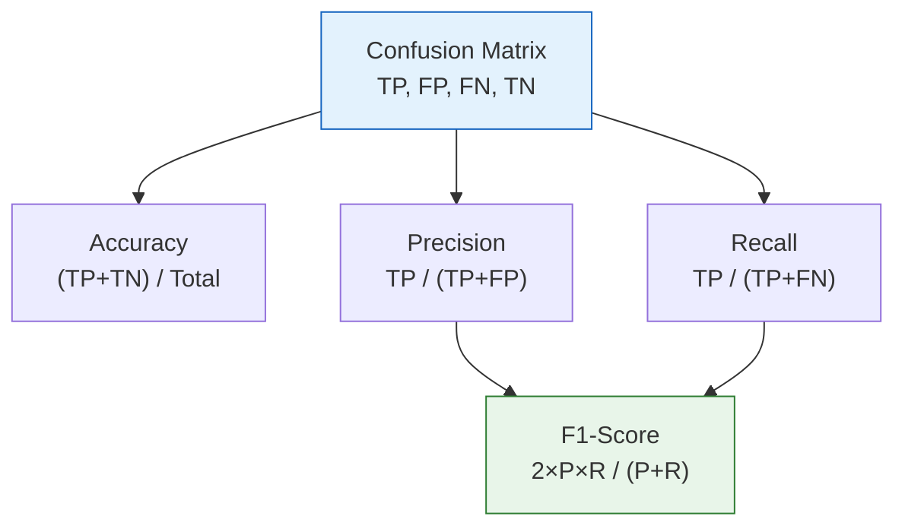
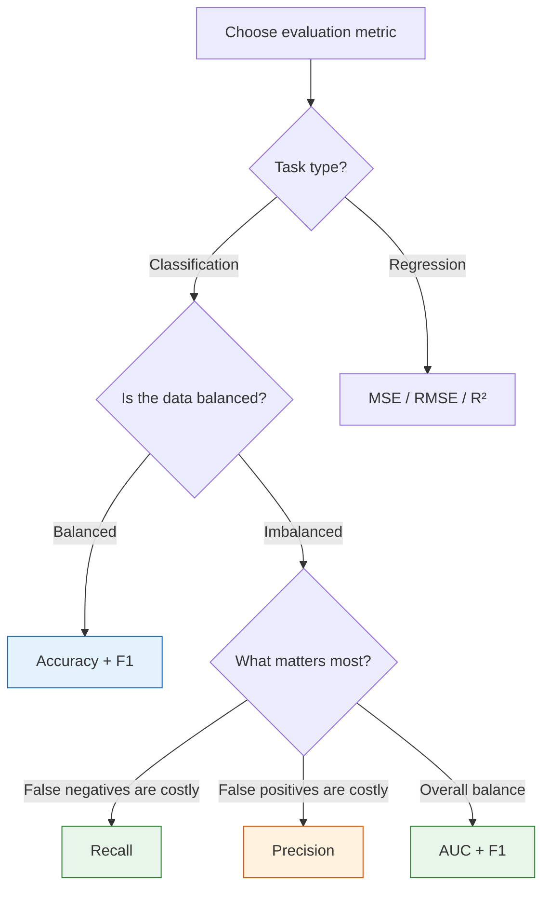

# Evaluation Metrics


:::tip Where this section fits
After training a model, **how do you know whether it is good or not**? Is 95% accuracy always good? Not necessarily! If you choose the wrong metric, you may make a completely wrong decision. This section helps you understand which metrics to focus on in different scenarios.
:::

## Learning Objectives

- Master classification metrics: accuracy, precision, recall, F1-score, confusion matrix
- Understand the ROC curve and AUC
- Master regression metrics: MSE, RMSE, MAE, R²
- Understand multi-class evaluation (macro, micro, weighted)

## First, a very important learning expectation

The easiest part of this section to get confused by is not the formulas themselves, but:

- There are many metrics
- Each one seems to make sense
- But the first time you work on a project, you have no idea which one to check first

So for beginners, the first goal here is not to “memorize every metric,” but to build a decision framework:

> **First ask what type of task it is, then ask how costly the errors are, then choose the main metric.**

Once this line is clear, Accuracy, Recall, AUC, and RMSE will no longer feel like a pile of unrelated terms.

---

## Build a map first

When beginners learn evaluation metrics for the first time, the most common problem is not “I don’t know the formula,” but:

- They know many metric names, but don’t know when to use which one
- They know whether the model score is high or low, but don’t know what that means for business risk

A more stable learning order should be:


In other words, metrics are not “scores you casually check after training”; they are part of model design.

---

## 1. Why isn’t accuracy enough?

### 1.1 The trap of imbalanced data

```python
import numpy as np

# Suppose: among 1000 emails, 10 are spam
y_true = np.array([0] * 990 + [1] * 10)

# "Smart" model: predict everything as normal
y_pred = np.zeros(1000)

accuracy = np.mean(y_true == y_pred)
print(f"Accuracy: {accuracy:.1%}")
# 99% accuracy! But it fails to catch a single spam email!
```

:::warning The trap of accuracy
With imbalanced data, **always predicting the majority class** can still give you very high accuracy. But such a model is useless. We need more detailed metrics.
:::

### 1.2 Don’t rush to memorize metrics—first ask about error cost

One of the most valuable ideas from Andrew Ng–style machine learning courses is:
**First ask what consequences errors will cause, then decide how to evaluate the model.**

For example:

- In cancer screening, missing a patient is usually more dangerous than a false alarm, so you should look at recall first
- In spam filtering, wrongly marking normal email as spam is annoying, so precision matters more
- In fraud detection, both kinds of errors are costly, so you should look at recall, precision, and threshold curves together

So evaluation metrics are not abstract math exercises. They help you answer:

- What exactly is the model getting wrong?
- Can I accept this kind of mistake?

---

## 2. Confusion matrix — the foundation of all classification metrics

### 2.1 Four basic quantities

| | Predicted Positive | Predicted Negative |
|---|---------------------|---------------------|
| **Actually Positive** | TP (True Positive) | FN (False Negative / Miss) |
| **Actually Negative** | FP (False Positive / False Alarm) | TN (True Negative) |

```python
from sklearn.metrics import confusion_matrix, ConfusionMatrixDisplay
from sklearn.datasets import load_breast_cancer
from sklearn.model_selection import train_test_split
from sklearn.linear_model import LogisticRegression
import matplotlib.pyplot as plt

# Breast cancer dataset
cancer = load_breast_cancer()
X_train, X_test, y_train, y_test = train_test_split(
    cancer.data, cancer.target, test_size=0.2, random_state=42
)

model = LogisticRegression(max_iter=10000, random_state=42)
model.fit(X_train, y_train)
y_pred = model.predict(X_test)

# Confusion matrix
cm = confusion_matrix(y_test, y_pred)
print("Confusion matrix:")
print(cm)

fig, ax = plt.subplots(figsize=(6, 5))
disp = ConfusionMatrixDisplay(cm, display_labels=['Malignant', 'Benign'])
disp.plot(ax=ax, cmap='Blues')
ax.set_title('Confusion Matrix for Breast Cancer Classification')
plt.tight_layout()
plt.show()
```

### 2.2 Deriving metrics from the confusion matrix



### 2.3 A more beginner-friendly way to read it

Many people see a confusion matrix for the first time and treat it as a table they must memorize.
In fact, there is a simpler way to read it:

- First look only at the row or column for “actually positive”
- Then ask how many the model missed
- Next look at the row or column for “predicted positive”
- Then ask how many of those positives are false alarms

This naturally leads you to the two most important questions:

- How many did it miss? That corresponds to recall
- Among the ones it caught, how many are truly positive? That corresponds to precision

---

## 3. Classification metrics in detail

### 3.1 Precision

> **Precision = TP / (TP + FP)**
>
> “Among the examples the model says are positive, how many are actually positive?”

**Use when**: **false positives are costly** — for example, recommendation systems (bad suggestions hurt user experience), spam detection (marking normal mail as spam is annoying).

### 3.2 Recall

> **Recall = TP / (TP + FN)**
>
> “Among the actual positives, how many did the model catch?”

**Use when**: **false negatives are costly** — for example, disease screening (missing a disease is dangerous), fraud detection (missing fraud causes loss).

### 3.3 F1-Score

> **F1 = 2 × Precision × Recall / (Precision + Recall)**
>
> The harmonic mean of precision and recall.

```python
from sklearn.metrics import accuracy_score, precision_score, recall_score, f1_score

print(f"Accuracy:   {accuracy_score(y_test, y_pred):.4f}")
print(f"Precision:  {precision_score(y_test, y_pred):.4f}")
print(f"Recall:     {recall_score(y_test, y_pred):.4f}")
print(f"F1-Score:   {f1_score(y_test, y_pred):.4f}")
```

### 3.4 Precision vs. recall trade-off

```python
from sklearn.metrics import precision_recall_curve

# Get precision and recall at different thresholds
y_proba = model.predict_proba(X_test)[:, 1]
precisions, recalls, thresholds = precision_recall_curve(y_test, y_proba)

fig, axes = plt.subplots(1, 2, figsize=(14, 5))

# PR curve
axes[0].plot(recalls, precisions, 'b-', linewidth=2)
axes[0].set_xlabel('Recall')
axes[0].set_ylabel('Precision')
axes[0].set_title('Precision-Recall Curve')
axes[0].grid(True, alpha=0.3)

# Effect of threshold
axes[1].plot(thresholds, precisions[:-1], 'b-', label='Precision')
axes[1].plot(thresholds, recalls[:-1], 'r-', label='Recall')
axes[1].set_xlabel('Classification threshold')
axes[1].set_ylabel('Score')
axes[1].set_title('How threshold affects precision/recall')
axes[1].legend()
axes[1].grid(True, alpha=0.3)

plt.tight_layout()
plt.show()
```

:::info How to choose?
- **Prefer false alarms over misses** (for example, disease screening) → prioritize **recall**, lower the threshold
- **Prefer misses over false alarms** (for example, spam filtering) → prioritize **precision**, raise the threshold
- **Both matter** → look at **F1-Score**
:::


You can use this diagram as a reading order for classification evaluation: first use the confusion matrix to see where the errors are, then use the threshold curve to see how precision and recall trade off, and finally look at the ROC or PR curve. The more imbalanced the classes are, the more important the PR curve usually becomes.

### 3.5 When you build your first classification project, how should you choose metrics?

If you are still a beginner, use this default order:

1. First look at the confusion matrix
2. If the classes are balanced, look at Accuracy + F1
3. If the classes are imbalanced, focus on Precision / Recall / F1
4. If the model outputs probabilities, also check ROC-AUC or PR-AUC
5. Finally decide whether threshold tuning is needed

This is more stable than piling on many metrics from the beginning, because it first helps you see where the model is wrong.

### 3.6 A beginner-friendly mnemonic

If you haven’t formed a habit for choosing metrics yet, you can remember this:

> **First see what kind of errors there are, then see how costly they are, and finally choose the main metric.**

This sentence matters more than memorizing many definitions, because it forces you to think about the problem first.

---

## 4. ROC curve and AUC

### 4.1 ROC curve

The ROC (Receiver Operating Characteristic) curve shows **True Positive Rate vs False Positive Rate** under different thresholds.

- **TPR (Recall) = TP / (TP + FN)**
- **FPR = FP / (FP + TN)**

```python
from sklearn.metrics import roc_curve, roc_auc_score

fpr, tpr, thresholds_roc = roc_curve(y_test, y_proba)
auc = roc_auc_score(y_test, y_proba)

plt.figure(figsize=(7, 6))
plt.plot(fpr, tpr, 'b-', linewidth=2, label=f'Logistic Regression (AUC = {auc:.4f})')
plt.plot([0, 1], [0, 1], 'k--', alpha=0.5, label='Random guess (AUC = 0.5)')
plt.fill_between(fpr, tpr, alpha=0.1, color='blue')
plt.xlabel('False Positive Rate (FPR)')
plt.ylabel('True Positive Rate (TPR)')
plt.title('ROC Curve')
plt.legend()
plt.grid(True, alpha=0.3)
plt.show()
```

### 4.2 What AUC means

**AUC (Area Under Curve) = the area under the ROC curve.**

| AUC value | Meaning |
|--------|------|
| 1.0 | Perfect classification |
| 0.9~1.0 | Excellent |
| 0.8~0.9 | Good |
| 0.7~0.8 | Fair |
| 0.5 | Same as random guessing |
| < 0.5 | Worse than random (there is a problem with the model) |

### 4.3 ROC comparison across multiple models

```python
from sklearn.tree import DecisionTreeClassifier
from sklearn.ensemble import RandomForestClassifier
from sklearn.svm import SVC

models = {
    'Logistic Regression': LogisticRegression(max_iter=10000, random_state=42),
    'Decision Tree': DecisionTreeClassifier(max_depth=5, random_state=42),
    'Random Forest': RandomForestClassifier(n_estimators=100, random_state=42),
}

plt.figure(figsize=(8, 6))
for name, m in models.items():
    m.fit(X_train, y_train)
    if hasattr(m, 'predict_proba'):
        proba = m.predict_proba(X_test)[:, 1]
    else:
        proba = m.decision_function(X_test)
    fpr, tpr, _ = roc_curve(y_test, proba)
    auc = roc_auc_score(y_test, proba)
    plt.plot(fpr, tpr, linewidth=2, label=f'{name} (AUC={auc:.4f})')

plt.plot([0, 1], [0, 1], 'k--', alpha=0.5)
plt.xlabel('FPR')
plt.ylabel('TPR')
plt.title('ROC Curve Comparison Across Multiple Models')
plt.legend()
plt.grid(True, alpha=0.3)
plt.show()
```

---

## 5. Regression metrics

### 5.1 Common metrics

| Metric | Formula | Description |
|------|------|------|
| **MSE** | `mean((y - ŷ)²)` | Mean squared error, penalizes large errors |
| **RMSE** | `sqrt(MSE)` | Same unit as y, more intuitive |
| **MAE** | `mean(\|y - ŷ\|)` | Mean absolute error, more robust to outliers |
| **R²** | `1 - SS_res/SS_tot` | Explained variance ratio, closer to 1 is better |

```python
from sklearn.datasets import load_diabetes
from sklearn.linear_model import LinearRegression, Ridge
from sklearn.model_selection import train_test_split
from sklearn.metrics import mean_squared_error, mean_absolute_error, r2_score
import numpy as np

# Load data
diabetes = load_diabetes()
X_train, X_test, y_train, y_test = train_test_split(
    diabetes.data, diabetes.target, test_size=0.2, random_state=42
)

# Train model
model = LinearRegression()
model.fit(X_train, y_train)
y_pred = model.predict(X_test)

# Calculate metrics
mse = mean_squared_error(y_test, y_pred)
rmse = np.sqrt(mse)
mae = mean_absolute_error(y_test, y_pred)
r2 = r2_score(y_test, y_pred)

print(f"MSE:  {mse:.2f}")
print(f"RMSE: {rmse:.2f}")
print(f"MAE:  {mae:.2f}")
print(f"R²:   {r2:.4f}")
```

### 5.2 Why shouldn’t you rely only on R² in regression?

`R²` is very common, but it is not a universal score.
When you do a regression project for the first time, a more stable approach is to check it together with error-based metrics:

- `RMSE` tells you how far off you are on average, in the same unit as the target, so it feels more intuitive
- `MAE` is more robust to outliers
- `R²` tells you how much better the model is compared with “always predict the mean”

So in regression, a more mature habit is:

- Don’t only ask “how high is R²?”
- Also ask “how much does it miss on average?”
- Then ask “is there any systematic bias in the errors?”

### 5.3 Visualization: residual analysis

```python
residuals = y_test - y_pred

fig, axes = plt.subplots(1, 3, figsize=(16, 4))

# Predicted vs actual
axes[0].scatter(y_test, y_pred, alpha=0.6, s=20, color='steelblue')
axes[0].plot([y_test.min(), y_test.max()], [y_test.min(), y_test.max()], 'r--', linewidth=2)
axes[0].set_xlabel('Actual value')
axes[0].set_ylabel('Predicted value')
axes[0].set_title(f'Predicted vs Actual (R²={r2:.3f})')

# Residual distribution
axes[1].hist(residuals, bins=20, color='steelblue', edgecolor='white', alpha=0.7)
axes[1].axvline(x=0, color='red', linestyle='--')
axes[1].set_xlabel('Residual')
axes[1].set_ylabel('Frequency')
axes[1].set_title('Residual Distribution (should be close to normal)')

# Residuals vs predictions
axes[2].scatter(y_pred, residuals, alpha=0.6, s=20, color='steelblue')
axes[2].axhline(y=0, color='red', linestyle='--')
axes[2].set_xlabel('Predicted value')
axes[2].set_ylabel('Residual')
axes[2].set_title('Residuals vs Predicted Values (should be randomly distributed)')

for ax in axes:
    ax.grid(True, alpha=0.3)

plt.tight_layout()
plt.show()
```

---

## 6. Multi-class evaluation

### 6.1 Three averaging methods

For multi-class problems, precision/recall/F1 can be calculated in three ways:

| Method | Description | Use case |
|------|------|---------|
| **macro** | Compute for each class, then average | All classes are equally important |
| **micro** | Compute once using global TP/FP/FN | Focus on overall performance |
| **weighted** | Weighted average by class sample count | For imbalanced classes |

```python
from sklearn.datasets import load_iris
from sklearn.metrics import classification_report
from sklearn.model_selection import train_test_split
from sklearn.linear_model import LogisticRegression

iris = load_iris()
X_train, X_test, y_train, y_test = train_test_split(
    iris.data, iris.target, test_size=0.2, random_state=42
)

model = LogisticRegression(max_iter=200, random_state=42)
model.fit(X_train, y_train)
y_pred = model.predict(X_test)

print(classification_report(y_test, y_pred, target_names=iris.target_names))
```

### 6.2 Multi-class confusion matrix

```python
from sklearn.metrics import confusion_matrix

cm = confusion_matrix(y_test, y_pred)

fig, ax = plt.subplots(figsize=(6, 5))
im = ax.imshow(cm, cmap='Blues')
ax.set_xticks(range(3))
ax.set_yticks(range(3))
ax.set_xticklabels(iris.target_names, rotation=45)
ax.set_yticklabels(iris.target_names)
ax.set_xlabel('Prediction')
ax.set_ylabel('Ground Truth')
ax.set_title('Multi-class Confusion Matrix (Iris)')

for i in range(3):
    for j in range(3):
        color = 'white' if cm[i, j] > cm.max() / 2 else 'black'
        ax.text(j, i, str(cm[i, j]), ha='center', va='center', color=color, fontsize=16)

plt.colorbar(im)
plt.tight_layout()
plt.show()
```

---

## 7. Metric selection guide



| Scenario | Recommended metrics |
|------|---------|
| Balanced classification | Accuracy, F1 |
| Imbalanced classification | F1, AUC, PR-AUC |
| Disease screening | Recall (do not miss cases) |
| Spam filtering | Precision (do not misclassify) |
| Regression | RMSE, R² |
| Model comparison | AUC (threshold-independent) |

### 7.1 A metric selection order that feels more like a real project

When you actually apply this section to a project, you can follow this order:

1. Clearly identify whether the task is classification or regression
2. Clearly identify the error you can least afford
3. Choose one main metric first
4. Add 1–2 auxiliary metrics
5. If it is classification, decide whether threshold tuning is needed
6. If it is regression, check the residual plot to understand the error pattern

This order is more useful than “calculate all the metrics,” because it forces you to define the problem clearly first.

---

## If this is your first time evaluating a model, use this default order

When you evaluate a model for the first time, it is recommended to do this:

1. First decide whether the task is classification or regression
2. First choose one main metric
3. Then add 1–2 auxiliary metrics
4. For classification, first check the confusion matrix, then the threshold issue
5. For regression, first check the error magnitude, then the residual plot

This is much closer to how evaluation works in real projects than “calculate every metric.”

:::info Coming up next
- **Next section**: Cross-validation — estimating model performance more reliably
- **Section 4.3**: Bias-variance tradeoff — understanding the essence of overfitting and underfitting
:::

---

## Summary

| Key point | Description |
|------|------|
| Confusion matrix | TP/FP/FN/TN, the foundation of all classification metrics |
| Precision | Among predicted positives, the proportion that are truly positive |
| Recall | Among actual positives, the proportion predicted as positive |
| F1-Score | Harmonic mean of precision and recall |
| ROC/AUC | A comprehensive metric not affected by the threshold |
| Regression metrics | MSE, RMSE, MAE, R² |

## What should you take away from this section?

If you only remember one sentence, I hope you remember this:

> **Evaluation metrics are not for grading the model; they are for deciding how you interpret the model’s errors.**

So what really matters is not memorizing as many formulas as possible, but forming these three habits:

- First ask about the task and the cost of errors
- Then choose the main metric
- Finally explain the metric in the context of the business and project

## Hands-on exercises

### Exercise 1: Imbalanced data experiment

Use `make_classification(weights=[0.95, 0.05])` to generate imbalanced data, then train logistic regression. Compare accuracy and F1 to see which one reflects real performance better.

### Exercise 2: ROC curve comparison

Use the Wine dataset (binary classification: take the first two classes), and compare the ROC curves and AUC of logistic regression, decision tree, random forest, and SVM.

### Exercise 3: Threshold tuning

Train logistic regression on the breast cancer dataset, manually adjust the classification threshold (0.1~0.9), plot the “threshold vs precision/recall/F1” curves, and find the threshold that maximizes F1.

### Exercise 4: Regression metric comparison

Use `load_diabetes()` to compare the MSE, RMSE, MAE, and R² of linear regression and Ridge, and plot a residual distribution comparison.
