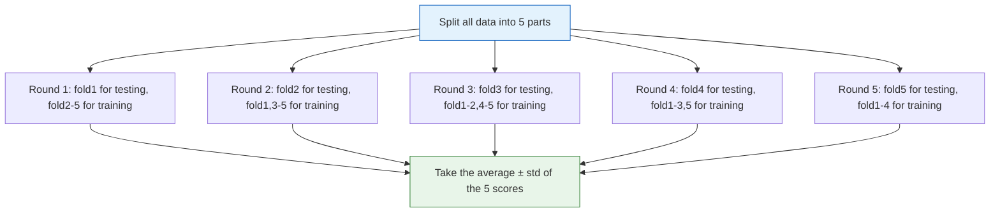

# Cross-Validation


:::tip Section Overview
If you evaluate a model with only one train/test split, the result can be heavily affected by the **random split**. Cross-validation gives each data point a chance to be used for both training and testing, producing more **stable and reliable** evaluation results.
:::

## Learning Objectives

- Understand the limitations of hold-out validation
- Master K-Fold cross-validation
- Master stratified K-Fold cross-validation
- Learn about leave-one-out and time series cross-validation
- Use `cross_val_score` and `cross_validate`

## First, set a very important learning expectation

The easiest place for beginners to misunderstand this section is to think of cross-validation as:

- “Run it a few more times and average it out”

But what is even more worth learning first is:

> **Cross-validation is a way to estimate a model’s generalization ability more reliably.**

In other words, the key point of this section is not to memorize how many split class names there are, but to first understand:

- Why one split is not enough
- Why different tasks need different splitting strategies
- Why evaluation design is also part of modeling

---

## First, build a map

For beginners, the best way to understand this section is not to “memorize different split class names,” but to first see what problem cross-validation is actually solving:


What this section is really trying to solve is:

- Why one random split is not trustworthy enough
- Why the evaluation method must match the task type

## 1. Problems with hold-out validation

### 1.1 Is one split enough?

```python
from sklearn.datasets import load_iris
from sklearn.model_selection import train_test_split
from sklearn.tree import DecisionTreeClassifier
import numpy as np

iris = load_iris()
X, y = iris.data, iris.target

# Different random_state values lead to different results
scores = []
for seed in range(50):
    X_train, X_test, y_train, y_test = train_test_split(X, y, test_size=0.2, random_state=seed)
    model = DecisionTreeClassifier(max_depth=3, random_state=42)
    model.fit(X_train, y_train)
    scores.append(model.score(X_test, y_test))

import matplotlib.pyplot as plt

plt.figure(figsize=(10, 4))
plt.bar(range(50), scores, color='steelblue', alpha=0.7)
plt.axhline(y=np.mean(scores), color='red', linestyle='--', label=f'Average: {np.mean(scores):.3f}')
plt.xlabel('Random seed')
plt.ylabel('Accuracy')
plt.title(f'Accuracy across 50 different splits (std: {np.std(scores):.3f})')
plt.legend()
plt.grid(axis='y', alpha=0.3)
plt.show()

print(f"Min: {min(scores):.3f}, Max: {max(scores):.3f}, Gap: {max(scores)-min(scores):.3f}")
```

:::warning Problem
The result of one split is **unstable** — different random seeds can lead to very different results. We need a more reliable evaluation method.
:::

### 1.2 A better rule of thumb for beginners

If you are still thinking:

- “This random split gave me a good score, so it should be fine, right?”

Then what this section wants to help you build is this idea:

- **One score is not important; a stable score is.**

### 1.3 A beginner-friendly analogy

You can think of cross-validation like this:

- Don’t judge someone based on just one exam
- Instead, give several different exams and then look at the average performance

What you get is not:

- “They happened to do well this time”

but rather:

- “Their overall level is probably around here”

---

## 2. K-Fold cross-validation

### 2.1 Principle

Split the data into K parts. Each time, use 1 part for testing and the remaining K-1 parts for training. Repeat K times and take the average.



### 2.2 sklearn implementation

```python
from sklearn.model_selection import cross_val_score, KFold
from sklearn.tree import DecisionTreeClassifier

model = DecisionTreeClassifier(max_depth=3, random_state=42)

# The simplest usage
scores = cross_val_score(model, X, y, cv=5, scoring='accuracy')
print(f"5-Fold cross-validation:")
print(f"  Scores per fold: {scores}")
print(f"  Mean: {scores.mean():.4f} ± {scores.std():.4f}")
```

### 2.3 Manually controlling KFold

```python
from sklearn.model_selection import KFold

kf = KFold(n_splits=5, shuffle=True, random_state=42)

# Visualize the split for each fold
fig, axes = plt.subplots(5, 1, figsize=(12, 6), sharex=True)

for fold, (train_idx, test_idx) in enumerate(kf.split(X)):
    ax = axes[fold]
    ax.scatter(train_idx, [0]*len(train_idx), c='steelblue', s=3, label='Training')
    ax.scatter(test_idx, [0]*len(test_idx), c='red', s=10, label='Testing')
    ax.set_ylabel(f'Fold {fold+1}')
    ax.set_yticks([])
    if fold == 0:
        ax.legend(loc='upper right', ncol=2)

axes[-1].set_xlabel('Sample index')
plt.suptitle('5-Fold cross-validation data split', fontsize=13)
plt.tight_layout()
plt.show()
```

### 2.4 How should you choose K?

| K value | Advantage | Disadvantage |
|------|------|------|
| K=3 | Fast | High variance, not stable enough |
| **K=5** | **Common default** | **Balances speed and stability** |
| **K=10** | **More stable** | **Slightly slower** |
| K=n (leave-one-out) | Most stable | Very slow |

### 2.5 What is the safest choice for your first project?

A reasonably stable sequence is usually:

- Beginner project: start with `cv=5`
- Want something a bit more stable: try `cv=10`
- Very small sample size: consider LOO

So in many cases, bigger is not better. Instead:

- Start with a value that is stable enough and still computationally acceptable

---

## 3. Stratified K-Fold cross-validation

### 3.1 Why do we need stratification?

Standard KFold splits data randomly, which may cause the class ratio in one fold to differ from the overall dataset, especially with imbalanced data.

**Stratified KFold ensures that the class ratio in each fold matches the overall ratio.**

```python
from sklearn.model_selection import StratifiedKFold

# Simulate imbalanced data
from sklearn.datasets import make_classification
X_imb, y_imb = make_classification(n_samples=100, n_features=5,
                                     weights=[0.9, 0.1], random_state=42)

print(f"Positive class ratio: {y_imb.mean():.1%}")

# Compare KFold and StratifiedKFold
kf = KFold(n_splits=5, shuffle=True, random_state=42)
skf = StratifiedKFold(n_splits=5, shuffle=True, random_state=42)

print("\nPositive class ratio in each fold with standard KFold:")
for fold, (_, test_idx) in enumerate(kf.split(X_imb)):
    print(f"  Fold {fold+1}: {y_imb[test_idx].mean():.1%}")

print("\nPositive class ratio in each fold with StratifiedKFold:")
for fold, (_, test_idx) in enumerate(skf.split(X_imb, y_imb)):
    print(f"  Fold {fold+1}: {y_imb[test_idx].mean():.1%}")
```

### 3.2 Default behavior in sklearn

```python
# cross_val_score uses StratifiedKFold by default for classification tasks
# You can also specify it explicitly
from sklearn.model_selection import cross_val_score

scores = cross_val_score(
    DecisionTreeClassifier(max_depth=3, random_state=42),
    X_imb, y_imb,
    cv=StratifiedKFold(n_splits=5, shuffle=True, random_state=42),
    scoring='f1'
)
print(f"Stratified 5-Fold F1: {scores.mean():.4f} ± {scores.std():.4f}")
```

:::info Best practice
- **Classification tasks**: always use `StratifiedKFold` (`cross_val_score` does this by default)
- **Regression tasks**: use standard `KFold`
- **Time series**: use `TimeSeriesSplit`
:::

### 3.3 The one sentence you should remember most from this section

> **The evaluation split strategy is also part of model design.**

In other words, if the split method is wrong, the model scores later on may already be distorted from the start.


The most important part of this figure is: for each fold, you must `fit` the preprocessor on the training fold, then `transform` the validation fold using the same rules. Do not standardize, apply PCA, or perform feature selection on the full dataset first and then do cross-validation; otherwise, information from the validation fold has already leaked into the training process.

---

## 4. Leave-One-Out (LOO)

**Leave-One-Out**: each time, leave 1 sample for testing and use the other n-1 samples for training. Repeat n times.

```python
from sklearn.model_selection import LeaveOneOut, cross_val_score

# Use a small dataset for demonstration (LOO is too slow on large datasets)
from sklearn.datasets import load_iris
X_small, y_small = load_iris(return_X_y=True)

loo = LeaveOneOut()
model = DecisionTreeClassifier(max_depth=3, random_state=42)

scores = cross_val_score(model, X_small, y_small, cv=loo)
print(f"LOO cross-validation:")
print(f"  Total rounds: {len(scores)}")
print(f"  Mean accuracy: {scores.mean():.4f}")
```

| Advantage | Disadvantage |
|------|------|
| Maximizes training data | High computational cost (n training runs) |
| Lowest evaluation bias | Variance may be high |
| | Not practical for large datasets |

---

## 5. Time series cross-validation

### 5.1 Why can’t we split randomly?

Time series data has **temporal order** — training on future data to predict the past is “data leakage.”

### 5.2 TimeSeriesSplit

```python
from sklearn.model_selection import TimeSeriesSplit
import numpy as np

# Simulate time series data
rng = np.random.default_rng(seed=42)
n = 100
X_ts = np.arange(n).reshape(-1, 1)
y_ts = np.sin(X_ts.ravel() / 10) + rng.normal(size=n) * 0.1

tscv = TimeSeriesSplit(n_splits=5)

fig, axes = plt.subplots(5, 1, figsize=(12, 8), sharex=True)

for fold, (train_idx, test_idx) in enumerate(tscv.split(X_ts)):
    ax = axes[fold]
    ax.scatter(train_idx, y_ts[train_idx], c='steelblue', s=10, label='Training')
    ax.scatter(test_idx, y_ts[test_idx], c='red', s=20, label='Testing')
    ax.set_ylabel(f'Fold {fold+1}')
    if fold == 0:
        ax.legend(loc='upper left', ncol=2)

axes[-1].set_xlabel('Time step')
plt.suptitle('Time series cross-validation (training set grows step by step)', fontsize=13)
plt.tight_layout()
plt.show()
```

---

## 6. `cross_validate` — richer output

```python
from sklearn.model_selection import cross_validate
from sklearn.ensemble import RandomForestClassifier

model = RandomForestClassifier(n_estimators=50, random_state=42)

# cross_validate returns more information than cross_val_score
results = cross_validate(
    model, X, y, cv=5,
    scoring=['accuracy', 'f1_macro'],
    return_train_score=True
)

print("Detailed results for 5-Fold cross-validation:")
print(f"  Training accuracy: {results['train_accuracy'].mean():.4f} ± {results['train_accuracy'].std():.4f}")
print(f"  Testing accuracy:  {results['test_accuracy'].mean():.4f} ± {results['test_accuracy'].std():.4f}")
print(f"  Testing F1:        {results['test_f1_macro'].mean():.4f} ± {results['test_f1_macro'].std():.4f}")
print(f"  Time per fold:     {results['fit_time'].mean():.3f}s")
```

### 6.1 Why is `cross_validate` more suitable for projects than `cross_val_score`?

Because in real projects, you often care about more than just:

- one average score

You may also care about:

- the gap between training and validation sets
- multiple metrics at the same time
- the time cost of each fold

This makes your experiment feel more like real model evaluation, not just number crunching.

---

## 7. Comprehensive comparison

```python
from sklearn.model_selection import cross_val_score
from sklearn.tree import DecisionTreeClassifier
from sklearn.linear_model import LogisticRegression
from sklearn.ensemble import RandomForestClassifier
from sklearn.svm import SVC

models = {
    'Decision Tree': DecisionTreeClassifier(max_depth=5, random_state=42),
    'Logistic Regression': LogisticRegression(max_iter=1000, random_state=42),
    'Random Forest': RandomForestClassifier(n_estimators=100, random_state=42),
    'SVM': SVC(random_state=42),
}

results = {}
for name, model in models.items():
    scores = cross_val_score(model, X, y, cv=10, scoring='accuracy')
    results[name] = scores
    print(f"{name:10s} | {scores.mean():.4f} ± {scores.std():.4f}")

# Boxplot comparison
fig, ax = plt.subplots(figsize=(8, 5))
data = [results[name] for name in models]
bp = ax.boxplot(data, labels=models.keys(), patch_artist=True)

colors = ['steelblue', 'coral', 'seagreen', 'gold']
for patch, color in zip(bp['boxes'], colors):
    patch.set_facecolor(color)
    patch.set_alpha(0.7)

ax.set_ylabel('Accuracy')
ax.set_title('10-Fold cross-validation comparison (boxplot)')
ax.grid(axis='y', alpha=0.3)
plt.tight_layout()
plt.show()
```

---

## 8. The safest default sequence for the first time you add cross-validation to a project

When you first add cross-validation into a project workflow, you can follow this sequence:

1. Start with a minimal baseline
2. Use `cv=5` to get an average score and standard deviation
3. For classification tasks, prioritize `StratifiedKFold` by default
4. For time series, switch to `TimeSeriesSplit` immediately
5. Finally, connect cross-validation to the hyperparameter tuning workflow

In this way, you will not learn cross-validation as an isolated API,
but will more naturally place it into the full evaluation pipeline of:

- baseline
- model comparison
- hyperparameter tuning

---

## Summary

| Method | Description | Use case |
|------|------|------|
| **Hold-out** | One train/test split | Quick experiments |
| **K-Fold** | Average over K splits | General-purpose (K=5 or 10) |
| **Stratified K-Fold** | K-Fold that preserves class ratios | Classification (default) |
| **LOO** | Leave 1 sample out each time | Small datasets |
| **TimeSeriesSplit** | Split in chronological order | Time series |

:::info What comes next
- **Next section**: Bias-variance tradeoff — why cross-validation and single-split evaluation can give different results
- **Section 4.4**: Hyperparameter tuning — using cross-validation to choose the best parameters
:::

## What should you take away from this section?

- The core of cross-validation is not “running it more times,” but “estimating model generalization more reliably”
- The splitting strategy must match the task type
- If evaluation is not designed well, many later model comparisons lose their meaning

## Hands-on exercises

### Exercise 1: Compare different K values

Use the Iris dataset and a decision tree to compare cross-validation results for K=3, 5, 10, and 20 (mean accuracy and standard deviation). Does the standard deviation get smaller as K increases?

### Exercise 2: Multi-metric evaluation

Use `cross_validate` on the breast cancer dataset to evaluate accuracy, precision, recall, and f1 at the same time, returning both training and testing scores. Which model shows the most severe overfitting?

### Exercise 3: Stratified vs non-stratified

Create a severely imbalanced dataset (positive:negative = 9:1) and compare the evaluation results of `KFold` and `StratifiedKFold`.
