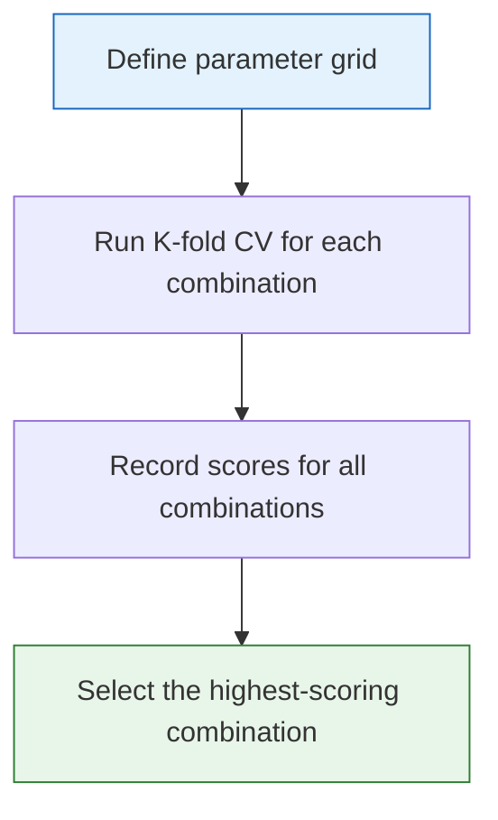
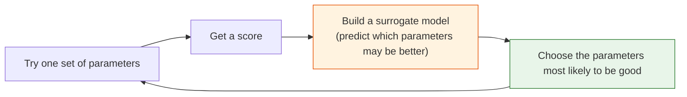
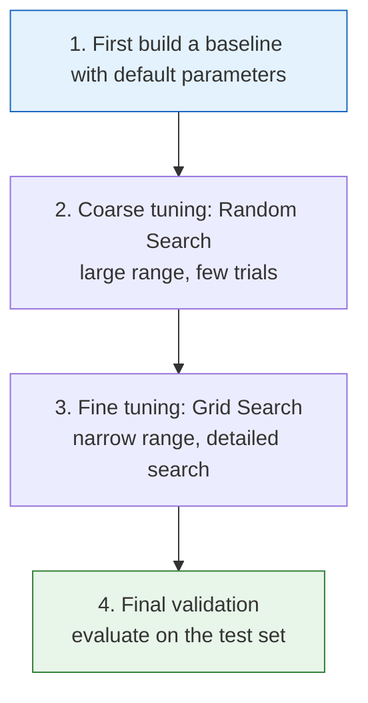

# Hyperparameter Tuning


:::tip Section overview
Model **hyperparameters** (such as tree depth, learning rate, and regularization strength) must be set manually, and they have a huge impact on model performance. This section teaches you how to search for the best hyperparameters **systematically**, instead of guessing and trying blindly.
:::

## Learning objectives

- Distinguish between parameters and hyperparameters
- Master grid search (GridSearchCV)
- Master random search (RandomizedSearchCV)
- Understand Bayesian optimization (Optuna)
- Master best practices for hyperparameter tuning

## First, an important learning expectation

The easiest place for beginners to go off track in this section is not that the tools are hard to use, but that it is too easy to think of tuning as:

- “The model is not good enough, so just search more parameters”

A better first understanding is:

> **Tuning only makes sense after the baseline, evaluation method, and search space are all reasonable.**

So the most important first layer in this section is not how many search tools you can use, but rather learning:

- When you should tune
- When you should not rush to tune

---

## First, build a map

For beginners, the best way to understand hyperparameter tuning is not “learn a few search tools first,” but to see where it fits in the machine learning workflow:


What this section really wants to solve is:

- Why tuning cannot be discussed separately from evaluation
- Why the test set should not be used to try parameters repeatedly
- Why the search space itself is a design problem

### 1.1 A more beginner-friendly analogy

You can first think of tuning as:

- Adjusting knobs while doing an experiment

But what really matters is not how often you turn the knobs, but:

- Whether you first set up the experiment properly
- What exact goal you are optimizing
- Whether you record the changes caused by each adjustment

So tuning is more like experimental design, not just parameter search.


When reading this diagram, first look at the “budget” line: the more parameters and the larger the ranges, the more the number of combinations explodes. For your first tuning attempt, do not twist every knob at once. Start with the parameters that most affect complexity, such as `max_depth` and `min_samples_leaf` in tree models, and then gradually expand the search space.

## 1. Parameters vs. hyperparameters

| | Parameters | Hyperparameters |
|---|-------------------|------------------------|
| Who determines them | The model learns them automatically from data | They are set manually by humans |
| When they are determined | During training | Before training |
| Examples | `w`, `b` in linear regression | `max_depth` in trees, learning rate |
| Storage location | `model.coef_` | `model.get_params()` |

```python
from sklearn.tree import DecisionTreeClassifier

model = DecisionTreeClassifier(max_depth=5, min_samples_split=10)
print("Hyperparameters (set before training):")
print(model.get_params())
```

---

## 2. Grid search

### 2.1 How it works

Exhaustively try every hyperparameter combination, evaluate each one with cross-validation, and choose the best.



### 2.2 GridSearchCV in action

```python
from sklearn.model_selection import GridSearchCV
from sklearn.ensemble import RandomForestClassifier
from sklearn.datasets import load_wine
from sklearn.model_selection import train_test_split
import numpy as np

wine = load_wine()
X_train, X_test, y_train, y_test = train_test_split(
    wine.data, wine.target, test_size=0.2, random_state=42
)

# Define parameter grid
param_grid = {
    'n_estimators': [50, 100, 200],
    'max_depth': [3, 5, 10, None],
    'min_samples_split': [2, 5, 10],
}

# Total of 3 × 4 × 3 = 36 combinations × 5 folds = 180 training runs
print(f"Total combinations: {3*4*3}")

# Grid search
grid = GridSearchCV(
    RandomForestClassifier(random_state=42),
    param_grid,
    cv=5,
    scoring='accuracy',
    n_jobs=-1,
    verbose=1
)

grid.fit(X_train, y_train)

print(f"\nBest parameters: {grid.best_params_}")
print(f"Best CV score: {grid.best_score_:.4f}")
print(f"Test set score: {grid.best_estimator_.score(X_test, y_test):.4f}")
```

### 2.3 View all results

```python
import pandas as pd
import matplotlib.pyplot as plt

# Convert results to a DataFrame
results = pd.DataFrame(grid.cv_results_)
print(results[['params', 'mean_test_score', 'rank_test_score']].head(10))

# Visualization: the effect of different n_estimators and max_depth values
fig, ax = plt.subplots(figsize=(8, 5))

for depth in [3, 5, 10, None]:
    mask = results['param_max_depth'] == depth
    subset = results[mask & (results['param_min_samples_split'] == 2)]
    label = f'depth={depth}' if depth else 'depth=None'
    ax.plot(subset['param_n_estimators'], subset['mean_test_score'], 'o-', label=label)

ax.set_xlabel('n_estimators')
ax.set_ylabel('CV accuracy')
ax.set_title('Grid Search results visualization')
ax.legend()
ax.grid(True, alpha=0.3)
plt.tight_layout()
plt.show()
```

### 2.4 Pros and cons of grid search

| Pros | Cons |
|------|------|
| Guarantees the best result within the grid | Combination explosion (very slow with many dimensions) |
| Simple to implement | Coarse grid spacing may miss the best value |
| Reproducible results | Wastes computation on poor regions |

### 2.5 When is grid search still worth using?

A more reliable rule of thumb is:

- The number of parameters is small
- You already have a rough idea of the range
- You want a clear, reproducible experiment

In that case, Grid Search is actually a very good choice because it is extremely transparent.

---

## 3. Random search

### 3.1 How it works

Instead of trying every combination, it **randomly samples** N combinations. Under the same compute budget, random search is often more efficient.

### 3.2 RandomizedSearchCV in action

```python
from sklearn.model_selection import RandomizedSearchCV
from scipy.stats import randint, uniform

# Define parameter distributions (ranges instead of fixed values)
param_dist = {
    'n_estimators': randint(50, 500),
    'max_depth': [3, 5, 10, 15, 20, None],
    'min_samples_split': randint(2, 20),
    'min_samples_leaf': randint(1, 10),
    'max_features': ['sqrt', 'log2', None],
}

# Randomly search 50 combinations
random_search = RandomizedSearchCV(
    RandomForestClassifier(random_state=42),
    param_dist,
    n_iter=50,       # Try only 50 combinations
    cv=5,
    scoring='accuracy',
    random_state=42,
    n_jobs=-1,
    verbose=1
)

random_search.fit(X_train, y_train)

print(f"\nBest parameters: {random_search.best_params_}")
print(f"Best CV score: {random_search.best_score_:.4f}")
print(f"Test set score: {random_search.best_estimator_.score(X_test, y_test):.4f}")
```

### 3.3 Grid vs. Random comparison

```python
# Visual comparison
fig, axes = plt.subplots(1, 2, figsize=(14, 5))

# Grid Search search space
grid_n = [50, 100, 200]
grid_d = [3, 5, 10]
grid_points = [(n, d) for n in grid_n for d in grid_d]
axes[0].scatter([p[0] for p in grid_points], [p[1] for p in grid_points],
                s=100, color='steelblue', zorder=5)
axes[0].set_xlabel('n_estimators')
axes[0].set_ylabel('max_depth')
axes[0].set_title(f'Grid Search ({len(grid_points)} points)\nOnly searches grid intersections')
axes[0].grid(True, alpha=0.3)

# Random Search search space
rng = np.random.default_rng(seed=42)
rand_n = rng.integers(50, 500, 20)
rand_d = rng.choice([3, 5, 10, 15, 20], 20)
axes[1].scatter(rand_n, rand_d, s=100, color='coral', zorder=5)
axes[1].set_xlabel('n_estimators')
axes[1].set_ylabel('max_depth')
axes[1].set_title(f'Random Search (20 points)\nCovers a broader search space')
axes[1].grid(True, alpha=0.3)

plt.tight_layout()
plt.show()
```

| | Grid Search | Random Search |
|---|------------|---------------|
| Search method | Exhaustive search of all combinations | Random sampling |
| Computation | Number of combinations × K folds | `n_iter` × K folds |
| Coverage | Grid intersection points | Broader |
| Best for | Fewer parameters, known ranges | More parameters, uncertain ranges |
| Recommended when | Fewer than 3 parameters | More than 3 parameters |

### 3.4 Why is “random search” often more reasonable than “fine grid search”?

Because what often wastes time is not that the model is too weak,
but that:

- You spend too much compute in the wrong parameter space

So the most important part of tuning is not only the search method,
but also:

- First define a reasonable search range
- First know what you really want to optimize

---

## 4. Bayesian optimization (Optuna)

### 4.1 How it works

Bayesian optimization is smarter than random search—it **uses previous trial results to guide the next search**.



### 4.2 Optuna in action

```bash
pip install optuna
```

```python
try:
    import optuna
    from sklearn.model_selection import cross_val_score

    # Define the optimization objective
    def objective(trial):
        params = {
            'n_estimators': trial.suggest_int('n_estimators', 50, 500),
            'max_depth': trial.suggest_int('max_depth', 3, 20),
            'min_samples_split': trial.suggest_int('min_samples_split', 2, 20),
            'min_samples_leaf': trial.suggest_int('min_samples_leaf', 1, 10),
            'max_features': trial.suggest_categorical('max_features', ['sqrt', 'log2', None]),
        }

        model = RandomForestClassifier(**params, random_state=42)
        score = cross_val_score(model, X_train, y_train, cv=5, scoring='accuracy').mean()
        return score

    # Run optimization
    study = optuna.create_study(direction='maximize')
    study.optimize(objective, n_trials=50, show_progress_bar=True)

    print(f"\nBest parameters: {study.best_params}")
    print(f"Best CV score: {study.best_value:.4f}")

    # Train with the best parameters
    best_model = RandomForestClassifier(**study.best_params, random_state=42)
    best_model.fit(X_train, y_train)
    print(f"Test set score: {best_model.score(X_test, y_test):.4f}")

except ImportError:
    print("Please install optuna first: pip install optuna")
```

### 4.3 When is Bayesian optimization worth using?

Typical cases include:

- The parameter space is getting larger
- Training one model is not cheap
- You do not want to waste budget on many obviously bad combinations

At that point, “trying more intelligently” becomes increasingly important.

### 4.4 Optuna visualization

```python
try:
    import optuna
    from optuna.visualization import plot_optimization_history, plot_param_importances

    # Optimization history (requires the code above to have been run first)
    fig = optuna.visualization.plot_optimization_history(study)
    fig.show()

    # Parameter importance
    fig = optuna.visualization.plot_param_importances(study)
    fig.show()

except (ImportError, NameError):
    print("You need to install optuna first and run the optimization")
```

### 4.5 Comparison of the three methods

| | Grid Search | Random Search | Bayesian Optimization |
|---|------------|--------------|-----------|
| Intelligence level | None (exhaustive) | Low (random) | High (learns from history) |
| Efficiency | Low | Medium | High |
| Implementation | `GridSearchCV` | `RandomizedSearchCV` | `optuna` |
| Best for | Few parameters, small ranges | General use | Many parameters, expensive computation |

---

## 5. Best practices for hyperparameter tuning

### 5.1 Tuning strategy



### 5.2 Common model tuning priorities

**Random Forest / GBDT**:

| Priority | Parameter | Search range |
|--------|------|---------|
| 1 | `n_estimators` | 100~1000 |
| 2 | `max_depth` | 3~20 |
| 3 | `learning_rate` (GBDT) | 0.01~0.3 |
| 4 | `min_samples_split` | 2~20 |
| 5 | `subsample` (GBDT) | 0.6~1.0 |

**XGBoost / LightGBM**:

| Priority | Parameter | Search range |
|--------|------|---------|
| 1 | `n_estimators` + `learning_rate` | Tune together |
| 2 | `max_depth` | 3~10 |
| 3 | `subsample` / `colsample_bytree` | 0.6~1.0 |
| 4 | `reg_alpha` / `reg_lambda` | 0~5 |

### 5.3 Important notes

:::warning Tuning pitfalls
1. **Do not tune on the test set** — use the test set only once for final evaluation
2. **Use cross-validation** — choose parameters based on CV scores, not a single train/validation split
3. **Fix `random_state`** — make results reproducible
4. **Coarse first, fine later** — do not start with a very fine grid
5. **Focus on important parameters** — not every parameter is worth tuning
:::

### 5.4 Pipeline + GridSearch

```python
from sklearn.pipeline import Pipeline
from sklearn.preprocessing import StandardScaler
from sklearn.model_selection import GridSearchCV
from sklearn.svm import SVC

# Tune parameters inside a Pipeline
pipe = Pipeline([
    ('scaler', StandardScaler()),
    ('svm', SVC(random_state=42)),
])

# Parameter name format: step_name__parameter_name
param_grid = {
    'svm__C': [0.1, 1, 10, 100],
    'svm__kernel': ['rbf', 'poly'],
    'svm__gamma': ['scale', 'auto', 0.01, 0.1],
}

grid = GridSearchCV(pipe, param_grid, cv=5, scoring='accuracy', n_jobs=-1)
grid.fit(X_train, y_train)

print(f"Best parameters: {grid.best_params_}")
print(f"Best CV score: {grid.best_score_:.4f}")
print(f"Test set score: {grid.score(X_test, y_test):.4f}")
```

---

## 6. Complete tuning example

```python
from sklearn.datasets import load_digits
from sklearn.model_selection import train_test_split, RandomizedSearchCV
from sklearn.ensemble import GradientBoostingClassifier
from scipy.stats import randint, uniform
import time

digits = load_digits()
X_train, X_test, y_train, y_test = train_test_split(
    digits.data, digits.target, test_size=0.2, random_state=42
)

# Step 1: Baseline
baseline = GradientBoostingClassifier(random_state=42)
baseline.fit(X_train, y_train)
print(f"Baseline test accuracy: {baseline.score(X_test, y_test):.4f}")

# Step 2: Random search
param_dist = {
    'n_estimators': randint(50, 300),
    'max_depth': randint(2, 10),
    'learning_rate': uniform(0.01, 0.3),
    'subsample': uniform(0.6, 0.4),
    'min_samples_split': randint(2, 15),
}

start = time.time()
rs = RandomizedSearchCV(
    GradientBoostingClassifier(random_state=42),
    param_dist,
    n_iter=30,
    cv=5,
    scoring='accuracy',
    random_state=42,
    n_jobs=-1,
)
rs.fit(X_train, y_train)
elapsed = time.time() - start

print(f"\nRandomSearch best parameters: {rs.best_params_}")
print(f"RandomSearch CV score: {rs.best_score_:.4f}")
print(f"RandomSearch test score: {rs.score(X_test, y_test):.4f}")
print(f"Time elapsed: {elapsed:.1f}s")

# Step 3: Compare
print(f"\nImprovement: {rs.score(X_test, y_test) - baseline.score(X_test, y_test):+.4f}")
```

---

## 7. What is the easiest thing to overlook when doing tuning for the first time?

What is most often overlooked is:

- **Do not keep looking at the test set while changing parameters**

Because once you start using the test set to guide tuning,
the test set is no longer “final unknown data,”
and your evaluation will start to become optimistically biased.

## 8. For your first tuning experiment, what is the safest default order?

If you are tuning for the first time, it is recommended to follow this order:

1. First lock in the baseline
2. First lock in the main metric
3. First tune only 1–2 key parameters
4. First use a relatively coarse range
5. After you have direction, narrow the range and fine-tune

This order is more stable than opening a huge search space right away, and it also makes it easier to know where the improvement came from.

## 9. If you still feel confused after learning this section, what should you focus on first?

If tuning still feels easy to get lost in, what is most worth focusing on is not all the differences between tools, but these three sentences:

1. No baseline, no rushing to tune
2. No stable evaluation, no trusting the tuning result
3. No reasonable search range, and even the most advanced search method will not help much

Once these three ideas start to hold, this section is already helping you in a real way.

---

## Summary

| Method | Description | Recommended scenario |
|------|------|---------|
| **Grid Search** | Exhaustively tries all combinations | Few parameters (≤3), known ranges |
| **Random Search** | Randomly samples combinations | Many parameters, first choice for exploration |
| **Optuna** | Bayesian optimization | Expensive computation, many parameters |
| **Pipeline + Search** | Tune preprocessing and model together | Production environments |

:::info What comes next
- **Chapter 5**: Feature engineering — improve the model with better features (often more effective than tuning)
- **Chapter 6**: Practical project — combine all tuning techniques
:::

## What should you take away from this section?

- Tuning is not just “trying a few parameters”; it is part of the model selection process
- The search method, search space, and evaluation protocol must be designed together
- Mature tuning is not only about “getting a higher score,” but also about “knowing why that score is trustworthy”

## Hands-on exercises

### Exercise 1: Grid vs. Random

On the Wine dataset, compare the best score found by GridSearchCV and RandomizedSearchCV under the same time budget. Which one is more efficient?

### Exercise 2: XGBoost tuning

Use XGBoost to tune on `load_digits()`. First use RandomizedSearchCV to find a rough range, then use GridSearchCV for fine-tuning. Record the improvement at each step.

### Exercise 3: Optuna practice

Use Optuna to optimize a LightGBM classifier. Use `optuna.visualization` to draw the optimization history and parameter importance charts.

### Exercise 4: Pipeline tuning

Create a `StandardScaler → PCA → RandomForest` Pipeline, and use GridSearchCV to tune PCA’s `n_components` and the RandomForest parameters at the same time.
