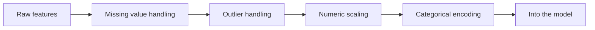

# 5.5.3 Feature Preprocessing


:::tip Section Focus
Feature preprocessing is not about “applying every possible method,” but about making choices based on the model, the data, and the task. What really matters is knowing why each step is done, when it should not be done, and how to avoid data leakage.
:::

## Learning Objectives

- Understand what problems missing values, outliers, scaling, and encoding each solve
- Be able to judge whether different models need standardization
- Know the applicable boundaries of One-Hot, Ordinal Encoding, and Target Encoding
- Build basic awareness of how to avoid data leakage

---

## First, Build a Map



This diagram shows a common order, not a fixed workflow. For example, tree models usually do not rely heavily on standardization, while linear models, KNN, SVM, and neural networks usually need scaling more.

## Reusable Setup for the Examples Below

To make the code blocks below runnable on their own, we will use one tiny mixed-type sample dataset. It includes missing values, numeric columns, and categorical columns.

```python
import numpy as np
import pandas as pd
from sklearn.model_selection import train_test_split

df = pd.DataFrame({
    "age": [25, np.nan, 39, 51, 45, np.nan, 33, 60],
    "income": [50000, 62000, np.nan, 120000, 85000, 76000, 54000, 200000],
    "amount": [80, 95, 120, 10000, 110, 130, 70, 150],
    "city": ["A", "B", "A", "C", None, "B", "D", "A"],
    "gender": ["F", "M", "F", "M", "F", None, "M", "F"],
    "target": [0, 1, 0, 1, 0, 1, 0, 1],
})

X = df[["age", "income", "amount", "city", "gender"]]
y = df["target"]
X_train, X_test, y_train, y_test = train_test_split(
    X, y, test_size=0.25, random_state=42, stratify=y
)
```

## Missing Value Handling

Missing values are sometimes dirty data, and sometimes a signal in themselves. For example, “the user did not fill in company” may mean an ordinary individual user; “a health metric is missing” may just be a system entry issue. Before handling missing values, ask first: why is it missing?

```python
import pandas as pd

missing_rate = df.isna().mean().sort_values(ascending=False)
print(missing_rate)
```

Common strategies include dropping columns with too many missing values, filling numeric features with the mean or median, filling categorical features with the mode or “unknown,” and adding a flag column indicating whether a value is missing. Do not start by calling `dropna()` on everything, or you may easily lose a large number of samples.

## Outlier Handling

Outliers are not always errors. Financial fraud, device failures, and extreme spending behavior may be exactly the kinds of samples the model cares about most. When handling outliers, you need to combine them with business context.

```python
q1 = df["amount"].quantile(0.25)
q3 = df["amount"].quantile(0.75)
iqr = q3 - q1
lower = q1 - 1.5 * iqr
upper = q3 + 1.5 * iqr
outliers = df[(df["amount"] < lower) | (df["amount"] > upper)]
print(outliers.head())
```

If an outlier comes from a data entry mistake, you can correct or remove it. If an outlier represents truly rare behavior, consider keeping it and using a robust model or binning to handle it.

## Numeric Scaling: When Standardization Is Needed

Standardization solves the problem of large differences in feature scale. For example, age may be in the tens, while income may be in the tens of thousands. If a model relies on distance or gradients, scale differences can affect training.

| Model type | Usually needs scaling? | Reason |
|---|---|---|
| Linear Regression / Logistic Regression | Recommended | Gradients and regularization are affected by scale |
| KNN / SVM | Usually yes | Distance calculations are affected by scale |
| Neural Networks | Usually yes | Helps stabilize training |
| Decision Trees / Random Forest / GBDT | Usually no | They split by thresholds and are not sensitive to monotonic scaling |

```python
from sklearn.preprocessing import StandardScaler

numeric_cols = ["age", "income", "amount"]
scaler = StandardScaler()
X_train_scaled = scaler.fit_transform(X_train[numeric_cols])
X_test_scaled = scaler.transform(X_test[numeric_cols])
print(X_train_scaled[:2])
```

Note that you should only `fit` on the training set, then `transform` the test set. If you fit the scaler on all the data, you leak test-set information into the training process.

## Categorical Encoding

Categorical features cannot be fed directly into most traditional models and need to be encoded. The most common method is One-Hot Encoding, which is suitable for unordered categories such as city, color, and occupation.

```python
from sklearn.preprocessing import OneHotEncoder

encoder = OneHotEncoder(handle_unknown="ignore")
X_train_cat = encoder.fit_transform(X_train[["city"]])
X_test_cat = encoder.transform(X_test[["city"]])
print(X_train_cat.shape, X_test_cat.shape)
```

Ordered categories can be encoded with Ordinal Encoding, such as education level or clothing size categories like small, medium, and large. But do not casually map unordered categories to 0, 1, 2, or the model may think there is an order relationship between them.

Target Encoding is useful for high-cardinality categories, but it can easily cause leakage. For example, when encoding city using the “average conversion rate of each city,” you must calculate it only based on the training fold, not directly from the full labels.

## Use a Pipeline to Prevent Leakage

The safest way is to put preprocessing and the model into the same Pipeline, so that during cross-validation each fold fits the preprocessors only on the training portion.

```python
from sklearn.compose import ColumnTransformer
from sklearn.pipeline import Pipeline
from sklearn.impute import SimpleImputer
from sklearn.preprocessing import OneHotEncoder, StandardScaler
from sklearn.linear_model import LogisticRegression

num_features = ["age", "income", "amount"]
cat_features = ["city", "gender"]

preprocess = ColumnTransformer([
    ("num", Pipeline([
        ("imputer", SimpleImputer(strategy="median")),
        ("scaler", StandardScaler()),
    ]), num_features),
    ("cat", Pipeline([
        ("imputer", SimpleImputer(strategy="most_frequent")),
        ("onehot", OneHotEncoder(handle_unknown="ignore")),
    ]), cat_features),
])

model = Pipeline([
    ("preprocess", preprocess),
    ("clf", LogisticRegression(max_iter=1000)),
])

model.fit(X_train, y_train)
print(model.score(X_test, y_test))
```

## Common Mistakes

The first mistake is standardizing all models. Tree models usually do not need it, and doing it may not bring any benefit. The second mistake is preprocessing before splitting the training and test sets, which causes data leakage. The third mistake is randomly mapping categories to numbers, causing the model to learn a nonexistent order relationship. The fourth mistake is over-cleaning outliers and deleting truly valuable extreme samples.

## Exercises

1. Use the Titanic dataset to calculate the missing rate for each column and design a handling plan for each one.
2. Train LogisticRegression and RandomForest on the same dataset separately, and compare the impact of standardization on each.
3. Explain why the scaler should `fit` on the training set rather than on the full dataset.
4. Find a high-cardinality categorical feature and think about the risks of One-Hot and Target Encoding respectively.

## Passing Criteria

After finishing this section, you should be able to write a preprocessing plan for tabular data, explain the reason for each preprocessing step, use a Pipeline to avoid data leakage, and judge whether a model really needs standardization or categorical encoding.
