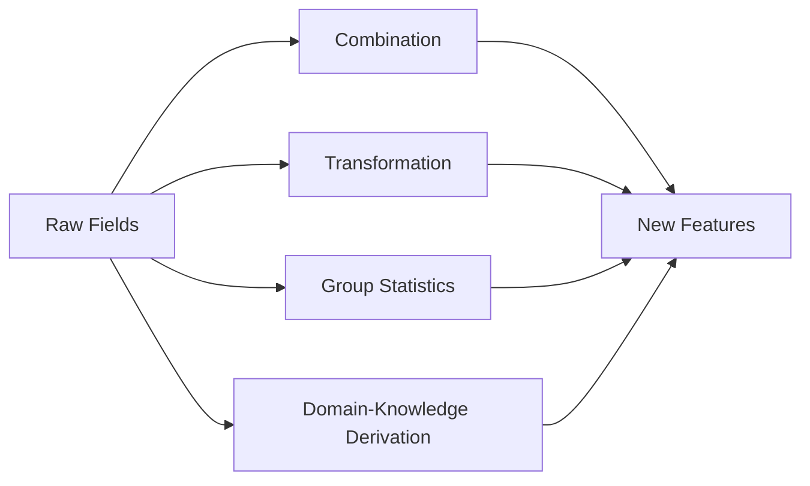

# 5.5.4 Feature Construction


:::tip Section Overview
Feature construction is about **creating new features** from existing data. It is often the most effective way to improve model performance. In Kaggle competitions, the winner is often decided by who built better features.
:::

## Learning Objectives

- Master polynomial features and interaction features
- Master time feature extraction
- Master statistical features (group statistics)
- Understand domain-knowledge-driven feature design

---

## First, Build a Map

Feature construction is not about “randomly creating more columns” — it is:

> **Turning raw fields into representations that are closer to the essence of the problem.**



### A Better Analogy for Beginners

You can think of feature construction as:

- Processing raw materials into semi-finished products that are more suitable for model input

Raw fields are often like:

- Vegetables that have not been cut yet

Constructed features are more like:

- Ingredients that have already been cut and prepared for a specific use, ready to go into the pan

So the real point of feature construction is not to “create a few more columns,” but to:

- make the data closer to the essence of the problem

## When Is Feature Construction Worth Doing?

- The raw fields are too “raw,” and the model cannot easily learn the relationship
- You have already found some combination patterns in EDA
- The business clearly has more natural derived metrics

## When Should You Not Create Features Carelessly?

- You have not yet understood the raw features themselves
- The new feature is only there to “look more complicated”
- You already have many features but have not done selection or validation

## A Construction Order Beginners Can Follow Directly

A more stable order is usually:

1. Start with the most natural business ratios or differences
2. Then add a small number of interaction features
3. Then look at time features and group statistics
4. Only then consider more aggressive automatic combinations

This is usually easier than piling on polynomial features from the start, because it makes it clearer where the gains come from.

## Polynomial Features and Interaction Features

```python
from sklearn.preprocessing import PolynomialFeatures
import numpy as np
import pandas as pd

# Raw features
X = np.array([[2, 3], [4, 5]])
feature_names = ['x1', 'x2']

# Second-order polynomial features (including interaction terms)
poly = PolynomialFeatures(degree=2, include_bias=False)
X_poly = poly.fit_transform(X)
print("Raw features:", feature_names)
print("Polynomial features:", poly.get_feature_names_out(feature_names))
print(f"Number of features: {X.shape[1]} → {X_poly.shape[1]}")
```

| Raw | Generated | Explanation |
|------|-----------|-------------|
| x1, x2 | x1², x2² | Quadratic terms |
| x1, x2 | x1×x2 | Interaction term |

:::warning Note
Polynomial features can cause the number of features to **explode**. A 3rd-degree polynomial with 10 features will produce 286 features. Usually, use `degree=2` and combine it with feature selection.
:::

### When You First Learn Interaction Features, What Is Most Worth Remembering?

What is most worth remembering is not the formula, but:

- some relationships cannot be expressed by a single field

For example:

- Housing prices depend not only on area
- They may also depend on combinations such as “area × location”

So interaction features are essentially asking:

- If we combine two factors, is the result more informative than looking at either one alone?

---

## Time Feature Extraction

```python
# Extract rich features from dates
dates = pd.date_range('2024-01-01', periods=100, freq='D')
df_time = pd.DataFrame({'date': dates})

df_time['year'] = df_time['date'].dt.year
df_time['month'] = df_time['date'].dt.month
df_time['day'] = df_time['date'].dt.day
df_time['dayofweek'] = df_time['date'].dt.dayofweek     # 0=Monday, 6=Sunday
df_time['is_weekend'] = df_time['dayofweek'].isin([5, 6]).astype(int)
df_time['quarter'] = df_time['date'].dt.quarter
df_time['day_of_year'] = df_time['date'].dt.dayofyear

print(df_time.head(10))
```

| Extracted Feature | Use Case |
|-------------------|----------|
| Year / month / day | Trends and seasonality |
| Day of week / weekend or not | Differences in consumer behavior |
| Hour / minute | Intra-day patterns |
| Quarter | Quarterly business analysis |
| Days from an event | Holiday effects |

### A Beginner-Friendly Rule of Thumb

Time fields are often not “just one field,” but a bundle of hidden patterns:

- cycles
- rhythms
- distance from an event

So what we most often do with time features is not only extract year/month/day, but also break “when” into “cycle and position.”

---

## Statistical Features (Group Statistics)

```python
import seaborn as sns

df = sns.load_dataset('tips')

# Group-based statistical features
df['avg_tip_by_day'] = df.groupby('day')['tip'].transform('mean')
df['max_bill_by_time'] = df.groupby('time')['total_bill'].transform('max')
df['tip_pct'] = df['tip'] / df['total_bill']
df['bill_rank_in_day'] = df.groupby('day')['total_bill'].rank(pct=True)

print(df[['day', 'total_bill', 'tip', 'avg_tip_by_day', 'tip_pct', 'bill_rank_in_day']].head(10))
```

| Statistic Type | Example | Scenario |
|----------------|---------|----------|
| Group mean | Average spending per day | Comparison within the same group |
| Group count | Number of orders per user | Activity level |
| Rank/percentile | Spending rank within the group | Relative position |
| Difference/ratio | Tip/bill ratio | Derived metric |

### Another Minimal Example of “Relative Position Within the Same Group”

```python
df_small = pd.DataFrame({
    "city": ["A", "A", "A", "B", "B"],
    "income": [10, 20, 30, 5, 15],
})

df_small["city_mean_income"] = df_small.groupby("city")["income"].transform("mean")
df_small["income_minus_city_mean"] = df_small["income"] - df_small["city_mean_income"]

print(df_small)
```

This example is especially good for beginners because it helps you first see that:

- sometimes absolute values are not enough
- “Is it high or low in its own group?” matters more

---

## Domain-Knowledge-Driven Feature Design

**Good features often come from understanding the business:**

| Domain | Raw Features | Constructed Feature |
|--------|--------------|---------------------|
| E-commerce | Total spending, number of orders | Average order value = total spending / number of orders |
| Real estate | Area, number of rooms | Area per room = area / number of rooms |
| Finance | Income, debt | Debt ratio = debt / income |
| User | Registration time, last login | Days of inactivity = today - last login |

```python
# Example of domain features for housing data
rng = np.random.default_rng(seed=42)
house = pd.DataFrame({
    'area': rng.uniform(50, 200, 100),
    'rooms': rng.integers(1, 6, 100),
    'floor': rng.integers(1, 30, 100),
    'age': rng.integers(0, 30, 100),
})

# Domain features
house['area_per_room'] = house['area'] / house['rooms']
house['is_new'] = (house['age'] <= 5).astype(int)
house['is_high_floor'] = (house['floor'] >= 15).astype(int)

print(house.head())
```

### Why Are Domain-Knowledge Features Often the Most Valuable?

Because they are often closest to the metrics the business really cares about.
For example:

- real estate focuses on “area per room”
- e-commerce focuses on “average order value”
- finance focuses on “debt ratio”

These features often look more like decision variables than the raw fields themselves.

---

## Don’t Forget These Three Things After Feature Construction

1. Check whether the dimensionality has exploded
2. Check whether cross-validation scores actually improved
3. Check whether the new features make the model harder to explain or easier to leak information

## A Feature Construction Checklist Beginners Can Copy Directly

When you build features for the first time, the safest checklist is usually:

1. Does this new feature have a clear business meaning?
2. Is it too directly related to the target variable, creating leakage risk?
3. Did cross-validation really improve after adding it?
4. If it improved, can I explain why?

If you cannot answer these four questions clearly,
the feature usually is not worth keeping right away.

## If You Put This Section Into a Project, What Is Most Worth Showing?

- A comparison between the raw features and the new features
- Why the new features make business sense
- A score comparison between the baseline and the model with added features
- One or two examples showing that the new features really helped the model

---

## Summary

| Method | Description | Key Point |
|--------|-------------|-----------|
| Polynomial / interaction | Automatically generate higher-order and combined features | Watch out for feature explosion |
| Time features | Extract cyclical information from dates | Day of week, month, holiday or not |
| Statistical features | Use group aggregation to create relative indicators | `transform` keeps the row count unchanged |
| Domain knowledge | Construct features based on business understanding | Most effective, but depends on experience |

## Hands-on Exercises

### Exercise 1: Titanic Feature Construction

On the Titanic dataset, construct: family size (`sibsp + parch + 1`), whether the passenger traveled alone, fare bands, and titles in names. Observe the improvement in model performance.

### Exercise 2: Time Series Features

Generate one year of date data, extract all time features (month, week, quarter, whether it is a working day), and use bar charts to show the distribution of different features.
