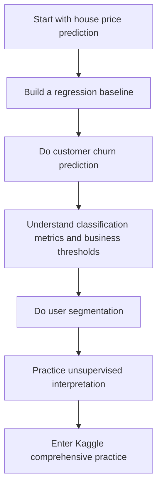
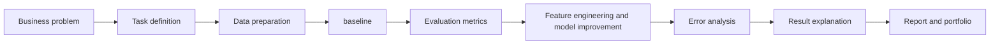

# 5.6.1 Pre-class Guide: How Should You Study This Project-Practice Chapter?

This chapter is not a new algorithm lesson. Instead, it ties together the previous five chapters into a real project loop. In the earlier chapters, you learned task types, supervised learning, unsupervised learning, model evaluation, and feature engineering. In this project chapter, you will train yourself to turn a problem into a machine learning work product that can be modeled, evaluated, explained, and delivered.

## Where This Chapter Sits in the Whole Course

The machine learning project chapter is the exit point of Station 5. It is meant to prove that you are not only able to call `sklearn`, and not only able to memorize algorithm names, but also able to put business problems, data, models, metrics, and conclusions into one process.

From the course roadmap, this chapter also lays the foundation for later deep learning, LLM applications, and Agent work. Because no matter how complex the model is, the project mindset is similar: define the problem first, then build a baseline, then evaluate, improve, explain, and deliver.

## The Real Problems This Chapter Solves

This chapter answers five questions: how to define a real-world problem as a regression, classification, or clustering task; how to build a minimal baseline instead of jumping straight into complex models; how to choose the main metric and auxiliary metrics; how to make explainable improvements through feature engineering, tuning, and model comparison; and how to translate model results into business language or a project report.

The most common mistake beginners make is treating the project chapter as “just running the code.” A real project is not about getting a model to run. It is about clearly explaining why the problem is defined this way, why this metric was chosen, why this improvement worked, where the model fails, and what should be done next.

:::info Guided practice before the larger projects
If this project loop still feels abstract, run [5.6.6 Hands-on Workshop: Build a Reproducible ML Evidence Pack](./05-hands-on-ml-workshop.md) first. It gives you one complete, runnable rehearsal before the house price, churn, segmentation, and Kaggle projects.
:::

## Recommended Learning Order for Beginners

It is recommended that you start with house price prediction, because regression tasks make it easiest to understand “predicting a continuous value.” Then move on to customer churn prediction, focusing on classification metrics, imbalanced data, and business thresholds. Next, do user segmentation analysis to understand how unsupervised projects explain results. Finally, do Kaggle competition practice to put data processing, modeling, evaluation, and submission into a real evaluation environment.

## The Main Thread to Focus on in This Chapter

The main thread of this chapter can be summarized as: a machine learning project is not a single training run, but a set of experiments that can be recorded, compared, and explained.

Once you understand this line, you will know why every project should keep experiment records. Without a baseline, you cannot tell whether an improvement is truly effective; without error analysis, you will not know when the model fails; without delivery-oriented expression, it is hard to include the project in your portfolio.

## What the Four Projects Are Practicing

| Project | Task Type | What You Are Really Practicing |
|---|---|---|
| House Price Prediction | Regression | The full regression loop from baseline to tuning |
| Customer Churn Prediction | Classification | Imbalanced data, business metrics, and classification evaluation |
| User Segmentation Analysis | Clustering | Interpreting unsupervised projects and applying them in business |
| Kaggle Competition Practice | Comprehensive | Putting the full ML workflow into a real evaluation environment |

## How This Chapter Connects to Later Stages

Machine learning projects will bring an “experimental mindset” into later deep learning and LLM projects. Deep learning projects also need baselines, training records, and error analysis; RAG projects also need evaluation sets and failure examples; Agent projects also need process logs and result evaluation.

If you do not build a solid foundation in this chapter, common problems later are: only knowing how to run models, but not how to design experiments; only looking at scores, but not knowing whether the metric is appropriate; being unable to explain model results; and failing to turn the project into a clear portfolio piece.

## How Beginners and Advanced Learners Should Read This

When beginners study this chapter for the first time, they should focus on the main thread and the smallest runnable example first. You do not need to understand every detail at once. As long as you can explain what problem this chapter solves, what the input and output are, and how the smallest project runs, you can keep moving forward.

Experienced learners can use this chapter to fill gaps and practice engineering habits: pay attention to edge cases, failure cases, evaluation methods, code reproducibility, and how this chapter connects to previous and next stages. After reading, it is best to distill the chapter into your own project README or experiment log.

## Suggested Study Time and Difficulty

| Study Mode | Suggested Time | Goal |
|---|---|---|
| Quick overview | 20–30 minutes | Understand what this chapter solves and where it will be used later |
| Minimum completion | 1–2 hours | Run a minimal example and finish the chapter’s project exit |
| Deep practice | Half a day to 1 day | Add error analysis, comparison experiments, or a project README record |

## Self-Check Questions for This Chapter

| Self-check Question | Passing Standard |
|---|---|
| What problem does this chapter solve? | You can explain its place in the whole course in one sentence |
| What are the minimal input and output? | You can clearly explain what the example needs as input and what results it produces |
| Where are the common failure points? | You can list at least one cause of errors, poor performance, or misunderstanding |
| What can be preserved after learning it? | You can write this chapter’s output into a project README, experiment log, or portfolio |

## Project Exit Deliverable for This Chapter

After finishing this chapter, it is recommended that you complete at least one “reviewable machine learning project report.” The report should include problem definition, data description, baseline, evaluation metrics, at least two rounds of improvement, error analysis, final conclusions, and next steps.

It is recommended that each project keep an experiment log table with fields such as version, what changed, main metric, auxiliary metric, my judgment, and next step. This will gradually move you from “running code” to “doing experiments.”

## Debug Detective Case

| Case | Content |
|---|---|
| Case Name | A ridiculously high model score |
| Scene | The model metrics look unusually good, but performance drops significantly on a different test set. |
| Investigation Steps | Check the train/test split, duplicate samples, target leakage, and the Dummy baseline. |
| Evidence to Close the Case | Leakage check records, baseline metrics, and error samples. |

When doing project practice, do not only keep successful screenshots. Pick at least one real failure case and write it into `reports/failure_cases.md` using the format “phenomenon, clues, suspicious causes, investigation steps, fixes, and regression checks,” so the project feels more like a real engineering work.

## Project Deliverable Standards

For each comprehensive project, it is recommended to deliver it according to the same portfolio standard instead of only making the code run. The minimum deliverables should include: a README, a reproducible run command, a set of sample inputs and outputs, a key workflow diagram, one failure case analysis, and a next-step improvement plan.

| Deliverable | Minimum Requirement | Advanced Requirement |
|---|---|---|
| README | Clearly state the project goal, how to run it, dependencies, and examples | Add architecture diagrams, design trade-offs, and retrospectives |
| Sample inputs and outputs | Keep at least 1 complete case | Keep success, failure, and edge cases |
| Evaluation records | Clearly state which metrics are used to judge performance | Add baselines, comparison experiments, and error analysis |
| Engineering records | Record one environment or interface issue | Record logs, cost, time spent, and troubleshooting process |
| Presentation materials | Use screenshots or a short GIF to prove it runs | Turn it into a portfolio page that can be explained |

The most important thing when doing a project is not piling on lots of features, but clearly explaining: what problem you solved, how the system works, how performance is judged, how to locate failures, and how the next version will be improved.

This diagram can serve as a project report template: first explain the problem and data, then show the baseline, metrics, model comparison, error samples, and next-step plan. What impresses people most in a portfolio is not “I ran many models,” but “I know why the model made these mistakes, and how I will improve it in the next round.”

## Passing Standard

By the end of this chapter, you should be able to break a classic ML problem into a clear modeling workflow, choose metrics and a baseline based on the task type, make one round of explainable improvement, use error analysis to show model limitations, and write the results into a project report that other people can understand.

If you can clearly say “how I defined the problem, why I evaluated it this way, where the model went wrong, and how I should improve it next,” then you have reached the portfolio exit standard for the machine learning stage.

## Suggested Version Roadmap

| Version | Goal | Delivery Focus |
|---|---|---|
| Basic version | Run the minimum loop | Can input, process, and output, with one set of examples kept |
| Standard version | Form a presentable project | Add configuration, logs, error handling, README, and screenshots |
| Challenge version | Close to portfolio quality | Add evaluation, comparison experiments, failure analysis, and a next-step roadmap |

It is recommended to finish the basic version first. Do not try to build everything at once. Every time you upgrade a version, write into the README what new capability was added, how it was verified, and what problems remain.
