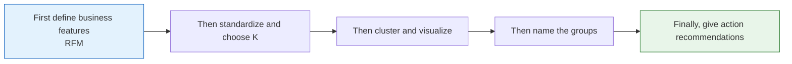

# 5.6.4 Project 3: User Segmentation Analysis (Clustering Problem)


:::tip Project Positioning
User segmentation is the **most common business application of unsupervised learning**. In this project, we use the RFM model to build customer features, discover customer groups with different values through clustering, and then provide marketing recommendations.
:::

## Project Overview

| Information | Description |
|------|------|
| Task type | Clustering (unsupervised) |
| Method | RFM model + K-Means |
| Evaluation metric | Silhouette score |
| Skills involved | Feature engineering, standardization, dimensionality reduction, clustering, business interpretation |

## Key Terms Before You Read the Code

- **RFM (Recency, Frequency, Monetary)** is a customer-value framework: how recently a customer purchased, how often they purchased, and how much they spent.
- **K-Means** is a clustering algorithm that groups samples by distance to cluster centers. It is simple and fast, but it needs you to choose `K`, the number of groups.
- **K** means the number of clusters. In business segmentation, `K` should be chosen by both metrics and whether the groups can be explained.
- **Standardization** puts features onto comparable scales. Without it, `monetary` may dominate `recency` and `frequency` simply because the number is larger.
- **PCA (Principal Component Analysis)** compresses high-dimensional features into fewer axes for visualization. It helps you draw the groups, but it does not replace business interpretation.
- **Silhouette score** measures whether samples are closer to their own group than to other groups. Higher is usually better, but a business-useless cluster is still not a good cluster.

## First, let’s set a very important learning expectation

The easiest trap for beginners in this question is not that clustering won’t run, but that the project can easily turn into something like this:

- The charts look great
- The group names are also created
- But in business terms, you still don’t know how to use it

What is more worth practicing on the first pass is not making the clustering plot prettier, but:

> **How to truly translate “group structure” into “actionable user personas and strategies.”**

As long as you establish that line first, this question will feel much more like a real project and less like a visualization exercise.

---

## Let’s build a map first

This task is easiest to make into “nice-looking charts, but hollow explanations.”
So the safest way to proceed is not to run clustering first, but to first think through “what kind of groups count as valuable.”



The most important thing in an unsupervised project is not that “the algorithm finished running,” but whether you can tell the clustering results as an actionable customer persona story.

## What you are really practicing in this task

The real difficulty of this project is not getting clustering labels, but:

1. Defining features in business language
2. Judging whether the K value is reasonable
3. Interpreting clustering results as “actionable customer groups”

## What should be confirmed first in the first version of this task

When doing this task for the first time, the most important things to confirm first are:

- Whether the features you chose are truly meaningful in business terms
- Whether the direction of each feature makes sense
- How you ultimately plan to name the groups

Because in a clustering project, the upper limit of all later “interpretation quality” is often already determined at the feature-definition step.

## A more beginner-friendly analogy

You can think of this task as:

- Creating an “actionable tiered list” for a large group of users

The key point is not:

- The machine blindly dividing people into several categories

But rather:

- Whether these tiers can truly help operations, marketing, or product teams take different actions

So the most valuable parts of this task are not clustering itself, but:

- Naming
- Explaining
- Action recommendations

## Recommended workflow

1. First explain the meaning of RFM clearly
2. Then do standardization and choose K
3. Then make PCA visualizations
4. Finally, write group naming and business recommendations

Unsupervised projects are most afraid of “the chart is done, but the explanation is missing.”

## The safest default order for your first attempt

If this is your first time doing user segmentation, I recommend the following order:

1. First clarify the business objective
2. First confirm why RFM is used for the persona features
3. First do standardization and choose K
4. First create statistical profiles for each group
5. Then use a PCA chart for presentation
6. Only then write group naming and business recommendations

This will be more stable because what you establish first is:

- Feature semantics
- Clustering basis
- Group profiles
- Business actions

This complete chain, instead of being led by the chart first.

## Step 1: Generate RFM data

```python
import pandas as pd
import numpy as np
import matplotlib.pyplot as plt

rng = np.random.default_rng(seed=42)
n_customers = 1000

df = pd.DataFrame({
    'customer_id': range(1, n_customers + 1),
    'recency': rng.exponential(30, n_customers).astype(int) + 1,       # Days since last purchase
    'frequency': rng.poisson(5, n_customers) + 1,                       # Purchase frequency
    'monetary': rng.exponential(200, n_customers).round(2) + 10,        # Total spending
})

print(df.describe())
```

### RFM introduction

| Metric | Meaning | What a larger value means |
|------|------|-----------|
| **R**ecency | Days since last purchase | Smaller is better (purchased more recently) |
| **F**requency | Purchase frequency | Larger is better (repeat customer) |
| **M**onetary | Total spending | Larger is better (high spender) |

### Step 1.1 Why RFM is especially suitable as a first clustering project

Because it has two advantages that are great for beginners:

- The business semantics are very clear
- The later group interpretation is naturally smoother

In other words, you are not clustering a pile of abstract numbers, but segmenting based on three very intuitive behaviors:

- Whether they bought recently
- How often they buy
- How much they spend

---

## Step 2: Feature standardization and clustering

```python
from sklearn.preprocessing import StandardScaler
from sklearn.cluster import KMeans

features = ['recency', 'frequency', 'monetary']
scaler = StandardScaler()
X_scaled = scaler.fit_transform(df[features])

# Use the elbow method to choose K
inertias = []
sil_scores = []
K_range = range(2, 9)

from sklearn.metrics import silhouette_score
for k in K_range:
    km = KMeans(n_clusters=k, random_state=42, n_init=10)
    labels = km.fit_predict(X_scaled)
    inertias.append(km.inertia_)
    sil_scores.append(silhouette_score(X_scaled, labels))

fig, axes = plt.subplots(1, 2, figsize=(12, 4))
axes[0].plot(K_range, inertias, 'bo-')
axes[0].set_xlabel('K')
axes[0].set_ylabel('Inertia')
axes[0].set_title('Elbow Method')

axes[1].plot(K_range, sil_scores, 'ro-')
axes[1].set_xlabel('K')
axes[1].set_ylabel('Silhouette Score')
axes[1].set_title('Silhouette Score Method')

plt.tight_layout()
plt.show()
```

---

## Step 3: Clustering and visualization

```python
from sklearn.decomposition import PCA

# Select the best K
best_k = K_range[np.argmax(sil_scores)]
print(f"Best K: {best_k}, Silhouette score: {max(sil_scores):.4f}")

km = KMeans(n_clusters=best_k, random_state=42, n_init=10)
df['cluster'] = km.fit_predict(X_scaled)

# PCA dimensionality reduction visualization
pca = PCA(n_components=2)
X_2d = pca.fit_transform(X_scaled)

plt.figure(figsize=(8, 6))
scatter = plt.scatter(X_2d[:, 0], X_2d[:, 1], c=df['cluster'], cmap='Set2', s=15, alpha=0.6)
plt.colorbar(scatter, label='Cluster')
plt.xlabel(f'PC1 ({pca.explained_variance_ratio_[0]:.1%})')
plt.ylabel(f'PC2 ({pca.explained_variance_ratio_[1]:.1%})')
plt.title('User Segmentation (PCA Projection)')
plt.show()
```

### Step 3.1 How to interpret the PCA chart

The main purpose of this chart is to help you:

- See whether the groups are roughly separated
- See whether there are obvious outlier groups
- Support presentation of the results

But it is not the final proof.
What really determines project quality is still the later part:

- Group statistical profiles
- Whether naming is reasonable
- Whether business recommendations are actionable

---

## Step 4: Interpret the clustering results

```python
# RFM statistics for each group
cluster_summary = df.groupby('cluster')[features].mean().round(1)
cluster_summary['Customer Count'] = df.groupby('cluster').size()
print(cluster_summary)

# Radar chart
fig, axes = plt.subplots(1, best_k, figsize=(4*best_k, 4), subplot_kw=dict(polar=True))
if best_k == 1:
    axes = [axes]

angles = np.linspace(0, 2*np.pi, len(features), endpoint=False).tolist()
angles += angles[:1]

# Normalize to [0, 1] for comparison
from sklearn.preprocessing import MinMaxScaler
mms = MinMaxScaler()
radar_data = mms.fit_transform(cluster_summary[features])
# Smaller recency is better, so flip it
radar_data[:, 0] = 1 - radar_data[:, 0]

for i, ax in enumerate(axes):
    values = radar_data[i].tolist() + [radar_data[i][0]]
    ax.fill(angles, values, alpha=0.25)
    ax.plot(angles, values, linewidth=2)
    ax.set_xticks(angles[:-1])
    ax.set_xticklabels(['Recent Activity', 'Purchase Frequency', 'Spending'])
    ax.set_title(f'Group {i}', pad=15)

plt.suptitle('RFM Radar Chart for Each Group', y=1.02, fontsize=13)
plt.tight_layout()
plt.show()
```

---

## Step 5: Business recommendations

```python
# Assign labels and recommendations based on clustering features
print("\n=== Business Recommendations ===")
for i in range(best_k):
    row = cluster_summary.loc[i]
    label = ""
    suggestion = ""
    if row['recency'] < cluster_summary['recency'].median() and row['monetary'] > cluster_summary['monetary'].median():
        label = "High-Value Active Customers"
        suggestion = "VIP service, exclusive discounts, and loyalty retention"
    elif row['recency'] > cluster_summary['recency'].median() and row['monetary'] > cluster_summary['monetary'].median():
        label = "High-Value At-Risk Customers"
        suggestion = "Win-back campaigns and personalized recommendations"
    elif row['frequency'] > cluster_summary['frequency'].median():
        label = "High-Frequency Low-Spend Customers"
        suggestion = "Increase average order value and cross-sell"
    else:
        label = "Low-Activity Customers"
        suggestion = "Low-cost outreach and coupon activation"

    print(f"  Group {i} ({int(row['Customer Count'])} people): {label}")
    print(f"    Recommendation: {suggestion}")
```

### Step 5.1 A very practical template for naming groups

You can use the following template for naming:

- First look at activity level
- Then look at value
- Finally look at risk

For example:

- High-Value Active Customers
- High-Value At-Risk Customers
- High-Frequency Low-AOV Customers
- Low-Activity Customers to Reactivate

The advantage of this naming style is that business stakeholders can immediately see what action to take.

---

## What is best to include in the project deliverable

- A K-selection curve chart
- A PCA clustering visualization
- A group profiling table
- A paragraph explaining “why these groups were named this way”

## A more complete project delivery structure

1. Why RFM was chosen for persona modeling
2. How K was selected
3. What the profile of each group is
4. Why they were named that way
5. What strategy corresponds to each group
6. If further iteration continues, what features should be added next

## What is most worth showing in a portfolio

- The basis for choosing K
- The RFM profile table for each group
- A clustering visualization chart
- A one-page table of group names and strategies
- A paragraph judging whether this clustering truly has business value

---

## Project checklist

- [ ] Build RFM features
- [ ] Standardize + use the elbow method / silhouette score to choose K
- [ ] Use PCA to visualize clustering results
- [ ] Analyze the RFM characteristics of each group
- [ ] Provide actionable business recommendations

<details>
<summary>Reference answers and explanation</summary>

1. RFM features need a clear observation window. Without a time window, recency and frequency are hard to interpret.
2. Standardize RFM before K-Means because monetary scale can otherwise dominate distance.
3. Choose K with both evidence and usefulness: elbow/silhouette scores plus cluster profiles that can be named and acted on.
4. PCA is a visualization aid. Do not treat the 2D chart as the full clustering proof; keep the profile table as the main evidence.
5. Business recommendations should match the group profile. If clusters are unstable or not actionable, the honest answer is to improve features before acting.

</details>

## Suggested version roadmap

| Version | Goal | Delivery focus |
|---|---|---|
| Basic version | Complete the minimum closed loop | Can input, process, output, and retain one set of examples |
| Standard version | Form a presentable project | Add configuration, logging, error handling, README, and screenshots |
| Challenge version | Close to portfolio quality | Add evaluation, comparison experiments, failure case analysis, and next-step roadmap |

It is recommended to finish the basic version first; do not chase a large all-in-one solution at the beginning. Every time you improve a version, be sure to write in the README: “What new capability was added, how was it verified, and what problems still remain.”

## Evidence to Keep

Keep this page's proof of learning as a small evidence card:

```text
project_goal: prediction, segmentation, Kaggle, or end-to-end ML portfolio target
pipeline: data split, preprocessing, model, evaluation, and report artifacts
result: metric table, chart, predictions, failure samples, and README note
failure_check: non-reproducible run, leakage, overfitting, weak baseline, or missing deployment boundary
Expected_output: ML project folder with pipeline, metrics, and failure review
```
