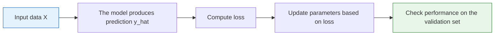

# 6.1.2 Transition: From Classical Machine Learning to Deep Learning

:::tip Section focus
This is not a new algorithms lesson, but a “transition map.” It has only one job: when you move from Station 5 into Station 6, it should not feel like you suddenly switched to a different course.
:::

## Learning goals

- See clearly whether Station 5 and Station 6 are “disconnected” or “progressive”
- Understand why traditional ML still needs neural networks afterward
- Recognize the shared structure of neural networks and traditional models in “data, loss, optimization, evaluation”
- Build a mental bridge for neurons, backpropagation, and the PyTorch training loop

---

## First, build a map

After finishing Station 5, many beginners typically have two questions:

- If linear regression, logistic regression, and tree models can already do so much, why do we still need to learn deep learning?
- When we get to Station 6, why do layers, gradients, backpropagation, and PyTorch suddenly appear all at once?

A more stable way to understand it is to first look at this evolution path:


So Station 6 is not overthrowing Station 5; it is continuing forward based on the modeling mindset you already built in Station 5.

---

## What exactly have you already learned in Station 5?

What Station 5 really taught you was not just a few model names, but the following modeling workflow:

1. First determine the task type
2. First establish a baseline
3. Then choose metrics
4. Then make improvements
5. Finally do error analysis and review

None of these disappear in Station 6.

### What Station 6 truly adds is not “whether there is evaluation”

Many people mistakenly think deep learning uses a completely different logic.
That is not the case. In Station 6, you still do the following:

- Split training and validation sets
- Look at loss and metrics
- Prevent overfitting
- Do error analysis

What is truly new is the model’s representational power and the training method.

---

## Why we still need to learn neural networks after traditional ML

Classical machine learning is powerful, but it also has some very natural limits.

### Traditional ML relies more on “manual representation”

In Station 5, you repeatedly did things like these:

- Manually engineer features
- Perform encoding, scaling, and selection
- Try to organize the problem into a form that the model can learn more easily

This is very important, but it also brings a limitation:

- The upper bound of the model is often constrained by your feature engineering ability

### Deep learning emphasizes “learning representations automatically”

The strongest point of deep learning can be understood simply as:

> **It does not just learn “how to predict,” it also learns “how the input should be represented.”**

For example:

- In images, CNNs automatically learn edges, textures, and local patterns
- In text, neural networks automatically learn embeddings and contextual representations
- In sequences, models automatically learn temporal dependencies or attention relationships

This is the capability that Station 6 really adds.

### A simple comparison

| Problem | More common approach in Station 5 | More common approach in Station 6 |
|---|---|---|
| Image classification | Manually extract features first, then feed them to a classifier | Let the CNN learn features directly |
| Text classification | TF-IDF / manually crafted statistical features | Let the network learn embeddings and context |
| Complex nonlinear relationships | Try tree models or ensemble learning | Let a deep network directly represent complex functions |

This does not mean Station 6 will definitely “replace” Station 5. Rather:

- When data is simple, sample size is small, and tabular tasks are strong, Station 5 methods are still very valuable
- When data is complex, unstructured, and hard to hand-engineer features for, the advantages of Station 6 methods become more and more obvious

---

## The shared skeleton of Station 5 and Station 6 has not really changed

Although Station 6 introduces many new terms, the skeleton of training one model is still the same line as in Station 5:



You can map it to Station 5 like this:

| Station 5 | Station 6 |
|---|---|
| Linear models / tree models | Neural networks |
| Metrics and loss | Metrics and loss |
| Training completed behind `fit()` | You will see the training loop more explicitly |
| Tuning and evaluation | Tuning and evaluation |

So the biggest change in Station 6 is not “whether there is training,” but:

- You begin to see more directly how the training process happens step by step

---

## Why Station 6 suddenly emphasizes gradients and backpropagation

In Station 5, many training details are hidden inside libraries.
In Station 6, you will start facing more directly:

- Many parameters
- Many layers
- The need for iterative updates

At this point, you must truly understand:

- Where the loss comes from
- What gradients represent
- Why parameters get updated

### You can first understand backpropagation in plain language

Don’t rush to memorize the derivation first. Remember this sentence first:

> **Forward propagation computes the result, and backpropagation computes how each parameter should be changed.**

This sentence is the core of the entire Station 6 chapter.

### The optimization thinking from Station 5 has already laid the groundwork

In Station 5, you have already seen:

- The loss of linear regression
- Gradient descent
- Regularization
- Cross-validation and overfitting

So Station 6 does not start from zero; it makes these things more explicit:

- The model is deeper
- There are more parameters
- The training loop is clearer

---

## Why Station 6 introduces PyTorch

In Station 5, `scikit-learn` is very suitable for beginners because it wraps the workflow in a unified way.
But in deep learning, you need more:

- Custom network structures
- Direct control over forward and backward passes
- More flexible training loop organization
- Compatibility with GPUs, larger models, and more complex data

That is why `PyTorch` enters the stage.

### First, distinguish the roles of sklearn and PyTorch

| Tool | What it is better at |
|---|---|
| `scikit-learn` | Classical ML, unified interface, fast baselines |
| `PyTorch` | Deep learning, flexible network definition, explicit training loops |

So do not think of them as “one replacing the other.” Instead, understand them like this:

- Station 5 uses `sklearn` first to establish a machine learning workflow
- Station 6 then uses `PyTorch` to open up the deep learning training process

### The most important bridging understanding

If you already understand the following in Station 5:

- Data
- Model
- Loss
- Evaluation

Then in Station 6, you are only learning one more thing:

> **How to control more explicitly how model parameters get updated.**

---

## What is most recommended to remember before entering Station 6

1. Station 6 does not overturn Station 5; it is built on top of Station 5
2. The biggest new capability of deep learning is learning representations automatically
3. The training skeleton of Station 5 and Station 6 is actually the same
4. `PyTorch` is not meant to be harder; it is meant to make the training process more controllable

---

## The most stable learning order after entering Station 6

If you are just coming from Station 5, it is recommended to follow this order:

1. First read [6.1.1 Pre-course guide: what is this chapter on neural network basics really about](./00-roadmap.md)
   First place the terms neuron, forward pass, backward pass, and optimizer in the right positions.

2. Then read [6.1.3 From neurons to multilayer perceptrons](./01-neurons-activation.md)
   First understand what “one neuron” is actually doing.

3. Then move on to [6.2.1 Pre-course guide: what is this chapter on PyTorch really about](../ch02-pytorch/00-roadmap.md)
   Then connect the training process using `Tensor / Autograd / Module / DataLoader / Training Loop`.

This will be much more stable than jumping straight into complex network structures.

---

## What should you take away from this section?

If you only take away one sentence, I hope you remember this:

> **Station 6 is not “another course”; it is the natural extension of the modeling workflow from Station 5, with stronger representational power and a more explicit training process.**

So the most important takeaways are:

- Know why traditional ML still needs deep learning afterward
- Know what new capability deep learning really adds
- Know why backpropagation and PyTorch appear
- Know that Station 5 and Station 6 still share the same modeling skeleton

## Evidence to Keep

Write a five-line bridge note before continuing:

```text
old_skill: I can train and evaluate sklearn models.
same_skeleton: data -> model -> loss/metric -> improvement -> error analysis.
new_capability: neural networks learn representations, not only final prediction rules.
new_control: PyTorch exposes forward, backward, optimizer, device, and checkpoint logic.
next_action: run one tiny neural network and explain why loss changes.
```

If this note feels clear, Chapter 6 will feel like an expansion of your existing modeling workflow rather than a reset.

## Expected Result

After this bridge page, your output is a mental model, not a Python file:

```text
I can explain what stays the same from sklearn to PyTorch.
I can explain what becomes more explicit in PyTorch.
I can point to one reason representation learning matters.
I can describe why Chapter 6 prepares me for Transformer and LLMs.
```

If you cannot say those four lines yet, reread the bridge before jumping into CNN, RNN, or Transformer architecture names.
