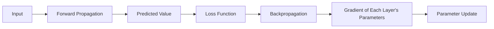
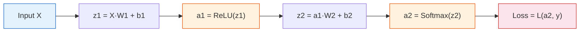
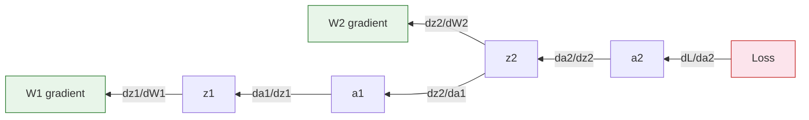
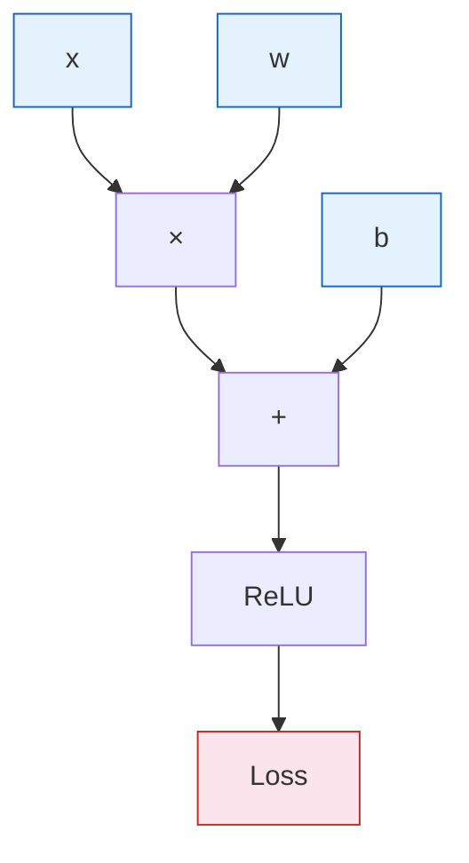

# 6.1.4 Forward and Backward Propagation


:::tip 🔧 Core Skill
Backpropagation is the **core algorithm** of deep learning. You must be able to manually derive the backpropagation process for a 2-layer network. Based on the "Chain Rule and Backpropagation Preview" at Station 4, this section gives you the complete derivation and implementation.
:::

## Learning Objectives

- Understand the full computation process of forward propagation
- Master common loss functions (MSE, cross-entropy)
- 🔧 Be able to manually derive backpropagation for a 2-layer network
- Understand the concept of a computational graph

---

## First, Build a Map

The most intimidating part for beginners in this section is that "the formulas suddenly get more numerous." A better order for understanding is:



You can understand this lesson with one sentence:

> **Forward propagation calculates the result, and backpropagation calculates what needs to be changed.**

## How This Section Connects with Station 5 and the Previous Section

If you just finished the previous section, you can understand it like this first:

- The previous section answered, "What is a neuron / a layer actually computing?"
- This section answers, "After it computes the wrong thing, how do the parameters get updated?"

If you just finished Station 5, you can also compare it this way:

- In Station 5, you already saw loss and gradient descent
- This section simply breaks down where the gradients actually come from

So what this section really adds is not "suddenly a lot of formulas," but:

- How responsibility during training is passed backward layer by layer

## Forward Propagation

Forward propagation is the **computation process from input to output**:



### During Forward Propagation, Which Four Things Should You Focus on First?

When you read network forward code for the first time, you can start by focusing only on these four kinds of variables:

- `x / X`: input
- `z`: intermediate value after the linear transformation
- `a`: output after activation
- `loss`: final error

In this way, whenever you see a line of code, it becomes easier to tell whether it belongs to:

- input
- intermediate computation
- output
- or error definition

### Manual Calculation Example

```python
import numpy as np

# A minimal 2-layer network: 2→3→2
np.random.seed(0)

# Input and weights
X = np.array([[1.0, 2.0]])     # 1 sample, 2 features
W1 = np.array([[0.1, 0.3, -0.2],
               [0.4, -0.1, 0.5]])  # 2×3
b1 = np.array([[0.0, 0.0, 0.0]])
W2 = np.array([[0.2, -0.3],
               [0.1, 0.4],
               [-0.5, 0.2]])       # 3×2
b2 = np.array([[0.0, 0.0]])
y_true = np.array([[1, 0]])        # true label (one-hot)

# Forward propagation
z1 = X @ W1 + b1
print(f"z1 = {z1}")

a1 = np.maximum(0, z1)  # ReLU
print(f"a1 (ReLU) = {a1}")

z2 = a1 @ W2 + b2
print(f"z2 = {z2}")

# Softmax
exp_z2 = np.exp(z2 - z2.max())
a2 = exp_z2 / exp_z2.sum(axis=1, keepdims=True)
print(f"a2 (Softmax) = {a2}")
```

### What Are the Three Things You Should Pay the Most Attention to in Forward Propagation?

When you first look at a network's forward computation, it is recommended that you ask only these three questions at each step:

1. What is the shape of the current tensor?
2. Is this layer doing a linear transformation or a nonlinear transformation?
3. Will the output of this step be passed to the next layer?

Many people get lost as soon as they see formulas. In fact, just grasping these three things first is enough.

### A More Beginner-Friendly Analogy: Forward Propagation Is Like "Layer-by-Layer Processing"

You can first think of forward propagation as a factory assembly line:

- Input materials go into the first layer
- The first layer processes them and passes them to the second layer
- The second layer processes them again
- Finally, the finished output is produced

So the most important thing about forward propagation is not that "the formulas are many," but that:

- data flows through the layers one by one
- each layer rewrites the representation into a form that the next layer can use more easily

---

## Loss Functions

### MSE (Regression)

> **MSE = (1/n) × Σ(yi - ŷi)²**

```python
# MSE
y_true_reg = np.array([3.0, 5.0, 2.0])
y_pred_reg = np.array([2.8, 5.2, 2.1])
mse = np.mean((y_true_reg - y_pred_reg) ** 2)
print(f"MSE = {mse:.4f}")
```

### Cross-Entropy (Classification)

> **Cross-Entropy = -Σ(yi × log(ŷi))**

```python
# Cross-entropy
loss = -np.sum(y_true * np.log(a2 + 1e-8))
print(f"Cross-entropy loss = {loss:.4f}")
```

### Binary Cross-Entropy (Binary Classification)

> **BCE = -(y × log(ŷ) + (1-y) × log(1-ŷ))**

```python
# Binary cross-entropy
y_bin = np.array([1, 0, 1, 1])
y_pred_bin = np.array([0.9, 0.1, 0.8, 0.7])
bce = -np.mean(y_bin * np.log(y_pred_bin) + (1 - y_bin) * np.log(1 - y_pred_bin))
print(f"BCE = {bce:.4f}")
```

### Choosing a Loss Function

| Task | Output Layer Activation | Loss Function |
|------|------------------------|---------------|
| Regression | None (linear) | MSE |
| Binary classification | Sigmoid | BCE |
| Multi-class classification | Softmax | Cross-entropy |

### Why Are the Output Layer and Loss Function Always Explained Together?

Because they are originally a matched pair.

For example:

- Regression outputs continuous values, often paired with `MSE`
- Binary classification outputs probabilities, often paired with `Sigmoid + BCE`
- Multi-class classification outputs a category distribution, often paired with `Softmax + CrossEntropy`

So when beginners do their first task, a very reliable habit is:

- not only ask how to write the model's last layer
- also ask together: which loss function should be matched with it

---

## Backpropagation — 🔧 Manual Derivation

### Core Idea

Backpropagation is the **systematic application of the chain rule** — starting from the loss and moving backward layer by layer to calculate the gradient of each parameter.



### The Most Beginner-Friendly One-Sentence Explanation of Backpropagation

You do not need to memorize the full derivation right away. You only need to remember this first:

- How wrong the output is
- How that error is distributed backward layer by layer
- How each layer knows how much it should change accordingly

This already captures the first essential nature of backpropagation.

### A More Direct Way to Say It: Error Responsibility Is Distributed Backward

If "gradient" still feels abstract, you can first understand backpropagation as:

- The final result is wrong
- This error is traced back through the earlier layers step by step
- Each layer takes on part of the "responsibility" for the error
- Then, based on that responsibility, the parameters are updated

This is why backpropagation looks like it is "sending messages from back to front."


:::tip Reading Guide
This diagram is best read from right to left: first look at `loss` to see how wrong the prediction is, then distribute the responsibility along the computational graph to the output layer, hidden layer, and earlier parameters. Backpropagation is not magic; it answers, "How much did each parameter contribute to this error, and how should it change next?"
:::

### Complete Derivation (2-Layer Network)

```python
# Continue the example above with manual backpropagation

# --- Output layer gradients ---
# For Softmax + cross-entropy, the gradient simplifies to: dz2 = a2 - y_true
dz2 = a2 - y_true
print(f"dz2 = {dz2}")

# W2 gradient: dW2 = a1.T @ dz2
dW2 = a1.T @ dz2
db2 = dz2.copy()
print(f"dW2 = \n{dW2}")

# --- Hidden layer gradients ---
# da1 = dz2 @ W2.T
da1 = dz2 @ W2.T
print(f"da1 = {da1}")

# Derivative of ReLU: 1 if z1 > 0, otherwise 0
relu_mask = (z1 > 0).astype(float)
dz1 = da1 * relu_mask
print(f"dz1 = {dz1}")

# W1 gradient: dW1 = X.T @ dz1
dW1 = X.T @ dz1
db1 = dz1.copy()
print(f"dW1 = \n{dW1}")

# --- Parameter update ---
lr = 0.1
W2 -= lr * dW2
b2 -= lr * db2
W1 -= lr * dW1
b1 -= lr * db1
print("\nParameters updated!")
```

### Summary of Gradient Formulas

| Variable | Gradient |
|------|------|
| `dz2` | `a2 - y` (Softmax + cross-entropy simplification) |
| `dW2` | `a1.T @ dz2` |
| `db2` | `dz2` |
| `da1` | `dz2 @ W2.T` |
| `dz1` | `da1 * relu_mask` |
| `dW1` | `X.T @ dz1` |
| `db1` | `dz1` |

### What Is the Most Common Source of Mistakes the First Time You Derive It Yourself?

Usually, the easiest mistakes are these three types:

1. Shapes do not match
   For example, forgetting a transpose and writing `a1.T @ dz2` incorrectly.

2. Mixing up `z` and `a`
   Especially when taking the derivative of an activation function, it is often unclear which one you should differentiate with respect to.

3. Forgetting that this is the chain rule
   You only look at a local term and do not connect "the previous layer's gradient × the current layer's derivative."

So the first time you do it, it is recommended that for each step you also write down:

- the current variable shape
- which term the current gradient comes from

---

## Computational Graph

### What Is a Computational Graph?

A computational graph splits each computation step into nodes and records **what depends on what**. During backpropagation, gradients are passed in the reverse direction along the graph.



**PyTorch automatically builds and traverses this computational graph** — this is the essence of `autograd`.

### Which Steps Do Beginners Usually Get Stuck on in This Section?

- Not understanding what `z`, `a`, and `loss` each represent
- Not knowing why the gradient direction must flow from back to front
- Memorizing only local formulas without knowing what the whole chain is doing

If you can now clearly explain:

- what forward propagation is computing
- what loss is measuring
- how backpropagation passes "error responsibility" backward

then you have already learned this section very well.

### Numerical Verification

Use a small perturbation to verify whether the gradient is correct:

```python
def numerical_gradient(f, x, eps=1e-5):
    """Numerical gradient (finite difference method)"""
    grad = np.zeros_like(x)
    for i in range(x.size):
        old_val = x.flat[i]
        x.flat[i] = old_val + eps
        fx_plus = f(x)
        x.flat[i] = old_val - eps
        fx_minus = f(x)
        grad.flat[i] = (fx_plus - fx_minus) / (2 * eps)
        x.flat[i] = old_val
    return grad

# Verify: y = x^2, dy/dx = 2x
x = np.array([3.0])
f = lambda x: x[0]**2
print(f"Analytical gradient: 2×3 = 6")
print(f"Numerical gradient: {numerical_gradient(f, x)[0]:.6f}")
```

---

## Complete Training Loop

```python
# Complete 2-layer network training (moon-shaped classification data)
from sklearn.datasets import make_moons

X, y = make_moons(200, noise=0.2, random_state=42)
y_onehot = np.eye(2)[y]  # one-hot

# Initialization
np.random.seed(42)
W1 = np.random.randn(2, 16) * 0.5
b1 = np.zeros((1, 16))
W2 = np.random.randn(16, 2) * 0.5
b2 = np.zeros((1, 2))

lr = 0.5
losses = []

for epoch in range(1000):
    # Forward
    z1 = X @ W1 + b1
    a1 = np.maximum(0, z1)
    z2 = a1 @ W2 + b2
    exp_z = np.exp(z2 - z2.max(axis=1, keepdims=True))
    a2 = exp_z / exp_z.sum(axis=1, keepdims=True)

    # Loss
    loss = -np.mean(np.sum(y_onehot * np.log(a2 + 1e-8), axis=1))
    losses.append(loss)

    # Backward
    dz2 = (a2 - y_onehot) / len(X)
    dW2 = a1.T @ dz2
    db2 = dz2.sum(axis=0, keepdims=True)
    da1 = dz2 @ W2.T
    dz1 = da1 * (z1 > 0)
    dW1 = X.T @ dz1
    db1 = dz1.sum(axis=0, keepdims=True)

    # Update
    W2 -= lr * dW2
    b2 -= lr * db2
    W1 -= lr * dW1
    b1 -= lr * db1

# Results
preds = np.argmax(a2, axis=1)
acc = (preds == y).mean()
print(f"Final loss: {losses[-1]:.4f}, accuracy: {acc:.1%}")

import matplotlib.pyplot as plt
fig, axes = plt.subplots(1, 2, figsize=(12, 4))
axes[0].plot(losses)
axes[0].set_xlabel('Epoch')
axes[0].set_ylabel('Loss')
axes[0].set_title('Training Loss')

axes[1].scatter(X[:, 0], X[:, 1], c=preds, cmap='coolwarm', s=10, alpha=0.7)
axes[1].set_title(f'Classification Results (accuracy {acc:.1%})')
plt.tight_layout()
plt.show()
```

### Why Is This NumPy Training Loop So Worth Studying Repeatedly?

Because it is actually the bare version of the PyTorch training loop that comes later:

- forward
- compute loss
- backward
- update

So once you understand this part, when you later see:

- `loss.backward()`
- `optimizer.step()`

you will not feel like they are a black box that happens out of nowhere.


:::tip Reading Guide
When reading this diagram, match the four NumPy steps with the PyTorch API one by one: forward computation corresponds to `model(x)`, manual gradient calculation corresponds to `loss.backward()`, manual parameter update corresponds to `optimizer.step()`, and clearing old gradients corresponds to `optimizer.zero_grad()`.
:::

---

## Summary

| Concept | Key Point |
|------|------|
| Forward propagation | Input → weighted sum → activation → output → loss |
| Loss function | Use MSE for regression, cross-entropy for classification |
| Backpropagation | Use the chain rule to compute gradients from back to front |
| Computational graph | Records computation dependencies; automatically built by PyTorch |

## What Should You Take Away Most from This Section?

If I had to leave you with only one sentence, I hope you remember this:

> **Backpropagation is not about creating mysterious formulas; it is about systematically answering, "After the model makes a mistake, how much should each parameter change?"**

So what you really need to keep steady in this section is:

- forward propagation computes results
- loss defines "how wrong" the result is
- backpropagation assigns error responsibility
- gradients are ultimately used to update parameters

---

## Hands-on Exercises

### Exercise 1: Manual Derivation (Pen and Paper)

For a 1→2→1 network (with Sigmoid activation), input x=0.5, target y=1, manually calculate one round of forward + backward propagation, then update the parameters.

### Exercise 2: Numerical Gradient Verification

Modify the complete training loop and use numerical gradients in the first round to verify whether the analytical gradient of dW1 is correct (the error should be less than 1e-5).
