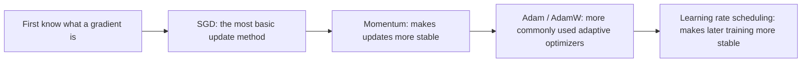
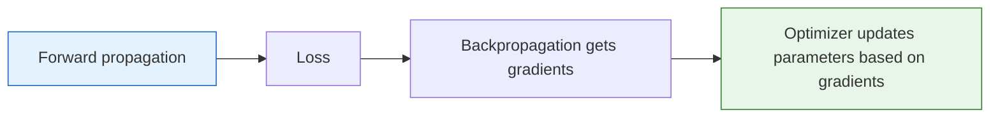

# Gradient Descent and Optimizers


:::tip Where this section fits
In Station 4, we learned basic gradient descent. Now let’s take a deeper look at the optimizers used in deep learning—**Adam is the one you’ll use most often**, but it’s important to understand how it evolved.
:::

## Learning Goals

- Understand the differences between batch gradient descent, mini-batch gradient descent, and stochastic gradient descent
- Understand the intuition behind Momentum
- 🔧 Master how to use Adam / AdamW
- Learn learning rate scheduling strategies

---

## First, Build a Map

This section on optimizers is one of the easiest places for beginners to get confused, because there are so many names. A better way to understand them is:



So what this section is really trying to solve is not “memorizing the optimizer family tree,” but:

- How parameters are actually updated
- Why different optimizers lead to different training behavior
- Which one you should choose first in a project

### A Better Beginner-Friendly Analogy

You can think of optimizers like this:

- Everyone knows where the goal is, but they descend the hill in different ways

Some people:

- Walk step by step, steadily

Some people:

- Keep momentum so they won’t be thrown off by small bumps

Some people:

- Also automatically adjust step size based on the current slope

So the most important thing about an optimizer is not “whether its name sounds more advanced,” but:

- How it turns gradients into update actions

## How This Section Connects to the Previous Two

If you just finished “forward propagation and backpropagation,” here is a good way to connect the ideas:

- The previous section solved “where gradients come from”
- This section starts solving “after gradients arrive, how do parameters actually change?”

So an optimizer is not an extra plugin. It is the final step in the training loop:




:::tip How to read this diagram
The reading is simple: gradients only tell you “which way is steepest,” and the optimizer turns that into a concrete way to move. SGD moves only according to the current slope, Momentum adds some inertia, and Adam automatically adjusts the step size in each direction based on historical gradients.
:::

## 1. Three Types of Gradient Descent

### 1.1 Comparison

| Method | How much data each update uses | Pros | Cons |
|------|-------------|------|------|
| **Batch Gradient Descent (BGD)** | All data | Stable | Slow, memory-heavy |
| **Stochastic Gradient Descent (SGD)** | 1 sample | Fast, can escape local minima | Noisy, unstable |
| **Mini-batch Gradient Descent** | A batch (32/64/128) | **Balances speed and stability** | Need to choose `batch_size` |

### 1.0.1 What should you remember first when seeing these three methods?

Don’t start by memorizing the definitions. First, hold on to this sentence:

> **The core difference is simply how much data is used to estimate the gradient each time parameters are updated.**

Once that idea is clear, many other behaviors make sense:

- Why SGD is more jittery
- Why BGD is more stable but slower
- Why mini-batch is the most common choice in deep learning

### 1.0.2 A Simple Memory Table for Beginners

| Method | The most important feeling to remember |
|------|------|
| BGD | Stable, but slow |
| SGD | Fast, but jittery |
| Mini-batch | The most common compromise |

This table is useful for beginners because it compresses the three gradient descent methods into one practical judgment instead of a pile of definitions.

```python
import numpy as np
import matplotlib.pyplot as plt

np.random.seed(42)
# Generate data: y = 3x + 2 + noise
X = np.random.randn(200, 1)
y = 3 * X + 2 + np.random.randn(200, 1) * 0.5

def compute_loss(X, y, w, b):
    return np.mean((X * w + b - y) ** 2)

# Compare three methods
methods = {}
for name, batch_size in [('BGD (full batch)', len(X)), ('SGD (single sample)', 1), ('Mini-batch (32)', 32)]:
    w, b = 0.0, 0.0
    lr = 0.05
    losses = []
    for epoch in range(50):
        indices = np.random.permutation(len(X))
        for start in range(0, len(X), batch_size):
            idx = indices[start:start+batch_size]
            X_batch, y_batch = X[idx], y[idx]
            pred = X_batch * w + b
            grad_w = 2 * np.mean(X_batch * (pred - y_batch))
            grad_b = 2 * np.mean(pred - y_batch)
            w -= lr * grad_w
            b -= lr * grad_b
        losses.append(compute_loss(X, y, w, b))
    methods[name] = losses

for name, losses in methods.items():
    plt.plot(losses, label=name, linewidth=2)
plt.xlabel('Epoch')
plt.ylabel('Loss')
plt.title('Comparison of Three Types of Gradient Descent')
plt.legend()
plt.grid(True, alpha=0.3)
plt.show()
```

---

## 2. Momentum — Descent with Inertia

### 2.1 Intuition

Imagine a ball rolling down a slope. Ordinary SGD only looks at the gradient direction at the current step. Momentum gives the ball **inertia**—even if it hits a small bump, it can keep sliding through.

> **v = β × v + (1-β) × gradient**
>
> **w = w - lr × v**

### 2.1.1 What shortcoming of SGD does Momentum fix?

The most important thing to remember is not the formula, but the practical problem it solves:

- SGD only looks at the current gradient, so it can zigzag back and forth
- Momentum also brings in the direction from previous steps

So you can think of it like this:

- SGD: only looks at the current step
- Momentum: looks at the current step, while keeping some forward inertia

```python
# Compare SGD and Momentum
def optimize_2d(optimizer_fn, steps=100):
    """Optimize f(x,y) = x² + 10y²"""
    x, y = np.array(5.0), np.array(5.0)
    path = [(x, y)]
    state = {}
    for _ in range(steps):
        gx, gy = 2*x, 20*y  # gradient
        x, y, state = optimizer_fn(x, y, gx, gy, state)
        path.append((x, y))
    return np.array(path)

def sgd(x, y, gx, gy, state, lr=0.05):
    return x - lr*gx, y - lr*gy, state

def momentum(x, y, gx, gy, state, lr=0.05, beta=0.9):
    vx = state.get('vx', 0)
    vy = state.get('vy', 0)
    vx = beta * vx + gx
    vy = beta * vy + gy
    state['vx'], state['vy'] = vx, vy
    return x - lr*vx, y - lr*vy, state

fig, axes = plt.subplots(1, 2, figsize=(12, 5))
for ax, (name, fn) in zip(axes, [('SGD', sgd), ('Momentum', momentum)]):
    path = optimize_2d(fn, 50)
    # Contours
    xx, yy = np.meshgrid(np.linspace(-6, 6, 100), np.linspace(-6, 6, 100))
    zz = xx**2 + 10*yy**2
    ax.contour(xx, yy, zz, levels=20, cmap='Blues', alpha=0.5)
    ax.plot(path[:, 0], path[:, 1], 'ro-', markersize=3, linewidth=1)
    ax.set_title(name)
    ax.set_xlim(-6, 6)
    ax.set_ylim(-6, 6)
plt.suptitle('Optimization Paths: SGD vs Momentum', fontsize=13)
plt.tight_layout()
plt.show()
```

---

## 3. Adam — The Most Common Optimizer

### 3.1 Core Idea

Adam combines Momentum (first-order momentum) and RMSProp (second-order momentum):
- **First-order momentum m**: moving average of gradients (direction)
- **Second-order momentum v**: moving average of squared gradients (adaptive learning rate)

### 3.2 Using It in PyTorch

```python
import torch
import torch.nn as nn

# Compare different optimizers in PyTorch
model_configs = {
    'SGD': lambda params: torch.optim.SGD(params, lr=0.01),
    'SGD+Momentum': lambda params: torch.optim.SGD(params, lr=0.01, momentum=0.9),
    'Adam': lambda params: torch.optim.Adam(params, lr=0.01),
    'AdamW': lambda params: torch.optim.AdamW(params, lr=0.01, weight_decay=0.01),
}

# Simple task: fit y = sin(x)
torch.manual_seed(42)
X = torch.linspace(-3, 3, 200).unsqueeze(1)
y = torch.sin(X)

results = {}
for name, opt_fn in model_configs.items():
    model = nn.Sequential(nn.Linear(1, 32), nn.ReLU(), nn.Linear(32, 1))
    optimizer = opt_fn(model.parameters())
    criterion = nn.MSELoss()
    losses = []

    for epoch in range(300):
        pred = model(X)
        loss = criterion(pred, y)
        optimizer.zero_grad()
        loss.backward()
        optimizer.step()
        losses.append(loss.item())

    results[name] = losses

plt.figure(figsize=(10, 5))
for name, losses in results.items():
    plt.plot(losses, label=name, linewidth=2)
plt.xlabel('Epoch')
plt.ylabel('Loss')
plt.title('Comparison of Convergence Speed Across Optimizers')
plt.legend()
plt.yscale('log')
plt.grid(True, alpha=0.3)
plt.show()
```

### 3.3 Optimizer Selection Guide

| Optimizer | Features | Use cases |
|--------|------|---------|
| **SGD** | Simple, requires learning rate tuning | Research experiments |
| **SGD+Momentum** | Speeds up convergence | Classic CV models |
| **Adam** | Adaptive learning rate, fast convergence | **Default first choice** |
| **AdamW** | Adam + decoupled weight decay | **Transformer, large models** |
| **RMSProp** | Adaptive learning rate | RNNs |

:::info Adam vs AdamW
Adam mixes L2 regularization into the gradient. AdamW handles weight decay separately, which works better. **In most cases today, use AdamW.**
:::

### 3.4 How should beginners choose an optimizer for their first project?

If you’re still new, a very safe way to start is usually:

- For MLP / CNN beginner experiments: start with `Adam`
- For Transformer / more modern models: prefer `AdamW`
- If you want to study more traditional optimization behavior: look at `SGD + Momentum`

At first, don’t overthink optimizer choice. In the first round, the most important things are:

1. The model can train stably
2. The loss decreases normally
3. The validation set performance does not collapse

### 3.5 Why is the learning rate often more important than the optimizer name?

Many beginners think about it like this:

- “Should I replace Adam with a more advanced optimizer?”

But in real training, a more common situation is:

- The optimizer itself is mostly fine
- The real problem is that the learning rate is too large or too small

So when you first debug unstable training, a more reliable order is usually:

1. Check the learning rate first
2. Then check batch size
3. Then check the optimizer

### 3.6 A Default Optimizer Order Worth Remembering for Beginners

For your first project, a safer default order is usually:

1. Start with `Adam`
2. If it’s a Transformer or a more modern large model, try `AdamW` first
3. If you want to study classic optimization behavior, then look at `SGD + Momentum`

This is usually much easier than getting stuck comparing a bunch of optimizer names before you can even get training running properly.

---

## 4. Learning Rate Scheduling

### 4.1 Why Do We Need It?

A fixed learning rate has problems: too large → does not converge; too small → too slow. **Learning rate scheduling** adjusts the learning rate dynamically during training.

### 4.2 Common Strategies

```python
import torch.optim.lr_scheduler as lr_scheduler

model = nn.Linear(10, 1)
optimizer = torch.optim.Adam(model.parameters(), lr=0.01)

schedulers = {
    'StepLR (×0.1 every 30 steps)': lr_scheduler.StepLR(optimizer, step_size=30, gamma=0.1),
    'CosineAnnealing': lr_scheduler.CosineAnnealingLR(optimizer, T_max=100),
}

fig, axes = plt.subplots(1, 2, figsize=(12, 4))
for ax, (name, scheduler) in zip(axes, schedulers.items()):
    optimizer = torch.optim.Adam(model.parameters(), lr=0.01)
    if 'Step' in name:
        scheduler = lr_scheduler.StepLR(optimizer, step_size=30, gamma=0.1)
    else:
        scheduler = lr_scheduler.CosineAnnealingLR(optimizer, T_max=100)

    lrs = []
    for epoch in range(100):
        lrs.append(optimizer.param_groups[0]['lr'])
        optimizer.step()
        scheduler.step()

    ax.plot(lrs, linewidth=2, color='steelblue')
    ax.set_xlabel('Epoch')
    ax.set_ylabel('Learning Rate')
    ax.set_title(name)
    ax.grid(True, alpha=0.3)

plt.tight_layout()
plt.show()
```

### 4.3 Warmup

First warm up with a small learning rate for a few steps, then gradually increase to the normal value, and finally decay slowly. **This is standard practice for Transformer training.**

| Strategy | Description | Common use cases |
|------|------|---------|
| **StepLR** | Multiply by γ every N steps | Simple tasks |
| **CosineAnnealing** | Decay along a cosine curve | CNN training |
| **Warmup + Cosine** | Increase first, then decrease | **Transformer** |
| **ReduceLROnPlateau** | Reduce when validation stops improving | Adaptive |

### 4.4 A Practical Optimizer Selection Order for Beginners

When training a new task for the first time, you can try this:

1. Start with `Adam(lr=1e-3)` or `AdamW(lr=1e-3)`
2. If training oscillates, lower the learning rate first
3. If convergence is slow later on, consider adding a scheduler
4. If you want a more serious comparison, try `SGD + Momentum`

This is usually much more stable than jumping between many optimizers from the start.

## If You Turn This Into a Project or Experiment Log, What Is Most Worth Showing?

What is usually most worth showing is not:

- I tried 5 optimizers

But rather:

1. What your default starting point was
2. How you adjusted the learning rate
3. A comparison of loss curves under different optimizers
4. Why you finally kept one optimizer

That makes it easier for others to see:

- You understand training decisions
- You are not just mechanically swapping optimizer names

---

## Summary

| Concept | Key point |
|------|------|
| Mini-batch SGD | The most commonly used way to compute gradients in real training |
| Momentum | Adds inertia to gradients and speeds up convergence |
| Adam / AdamW | Adaptive learning rate, **first-choice optimizer** |
| Learning rate scheduling | Dynamically adjusts the learning rate during training |

## What Should You Take Away Most from This Section?

- An optimizer is fundamentally answering: “How should parameters change?”
- The learning rate is often more important than “switching optimizer names”
- For your first project, getting a stable default working is more important than chasing the best possible result

If we compress it into one sentence, it is this:

> **Gradients tell you “where to update,” while the optimizer decides “how to update, how fast to update, and whether the update is stable.”**

---

## Hands-on Exercises

### Exercise 1: Optimizer Race

Use the `make_moons` dataset to train an MLP (PyTorch), and compare the convergence speed and final accuracy of SGD, SGD+Momentum, Adam, and AdamW.

### Exercise 2: Learning Rate Sensitivity

Train the same model with Adam, test learning rates 0.1, 0.01, 0.001, and 0.0001, and plot the learning curves for comparison.
