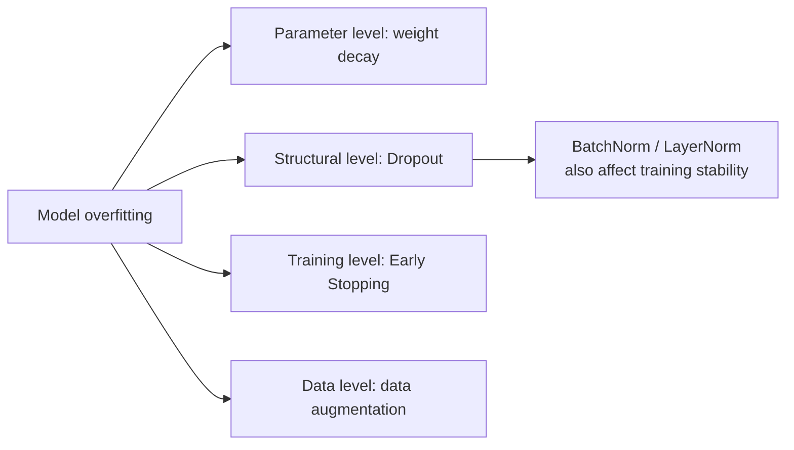
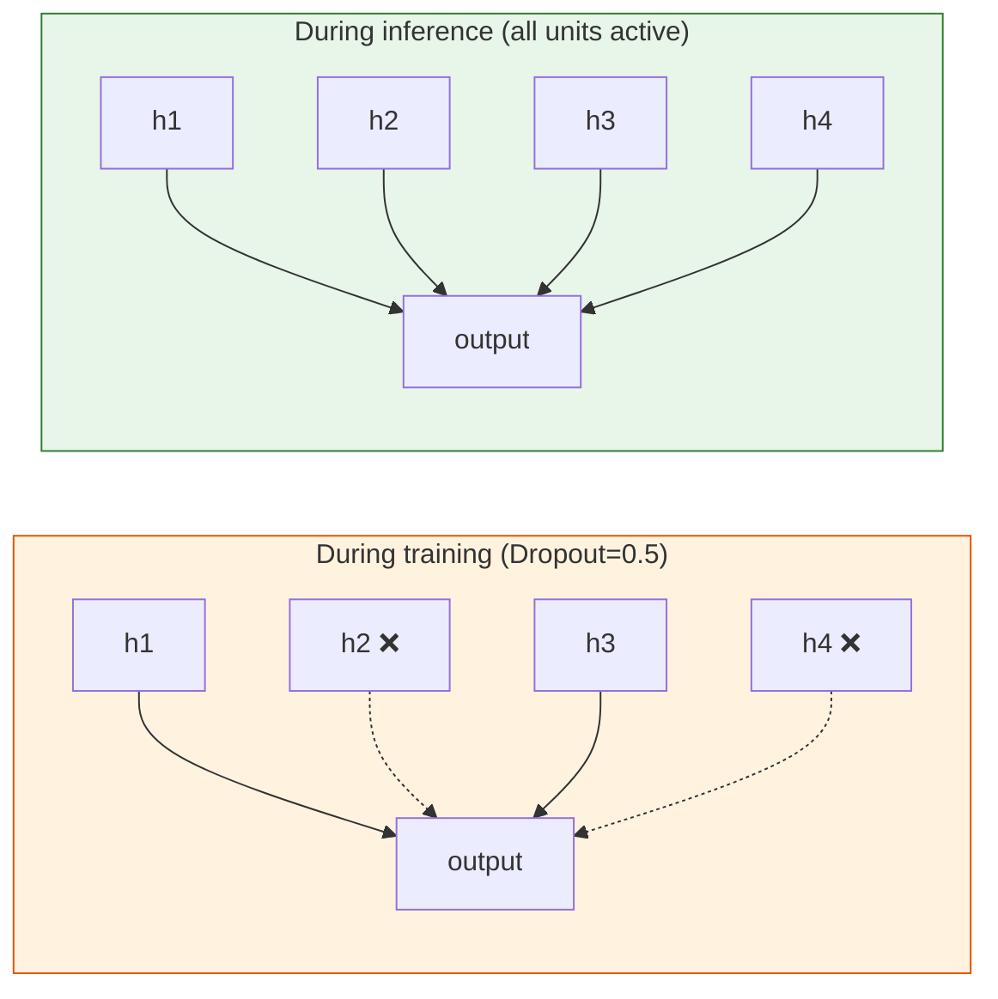

# 6.1.6 Regularization in Deep Learning


:::tip Section overview
Deep networks have a huge number of parameters, so they can overfit very easily. This section introduces regularization techniques specific to deep learning—**Dropout and BatchNorm are the two you must master.**
:::

## Learning objectives

- 🔧 Understand the principle and usage of Dropout
- 🔧 Understand Batch Normalization (BN)
- Understand Layer Normalization (LN)
- 🔧 Master data augmentation and Early Stopping

---

## First, build a map

If you only memorize the method names in this section, it can easily turn into a “tool list.” A better beginner-friendly way to understand it is:



So what this section really aims to solve is:

- Why models overfit
- Which layer each regularization method acts on
- What you should try first when you encounter overfitting

## How this section connects to Station 5 and the earlier training roadmap

If you came from Station 5, you have already seen:

- Underfitting / overfitting
- Regularization
- Cross-validation and generalization

In this section, we simply bring the idea of “controlling generalization” into the deep learning setting, and add methods that feel more deep-learning-specific:

- Dropout
- BatchNorm / LayerNorm
- Data augmentation
- Early Stopping

## I. Review: L1/L2 regularization

In Station 5, you learned that L2 regularization (weight decay) is used directly in deep learning through the optimizer’s `weight_decay` parameter:

```python
import torch
import torch.nn as nn

# A tiny standalone model makes the example runnable on its own
model = nn.Linear(10, 1)
optimizer = torch.optim.AdamW(model.parameters(), lr=0.001, weight_decay=0.01)
```

### Why do we still need to remember `weight_decay` first in deep learning?

Because it is often the simplest, most stable, and first regularization method you should try.

In other words, regularization in deep learning is not about “replacing everything with new concepts.” It is about:

- Keeping what you already learned in Station 5
- Then adding deep-learning-style structure and training techniques on top

---

## II. Dropout — random dropping

### Principle

During training, **randomly disable some neurons** by setting their outputs to 0. This forces the network not to rely on any single neuron and improves robustness.



### PyTorch usage

```python
import torch
import torch.nn as nn
import matplotlib.pyplot as plt
from sklearn.datasets import make_moons
from sklearn.model_selection import train_test_split

# Data
X, y = make_moons(500, noise=0.3, random_state=42)
X_train, X_test, y_train, y_test = train_test_split(X, y, test_size=0.3, random_state=42)
X_train_t = torch.FloatTensor(X_train)
y_train_t = torch.LongTensor(y_train)
X_test_t = torch.FloatTensor(X_test)
y_test_t = torch.LongTensor(y_test)

# Compare with and without Dropout
class MLP(nn.Module):
    def __init__(self, dropout_rate=0.0):
        super().__init__()
        self.net = nn.Sequential(
            nn.Linear(2, 64),
            nn.ReLU(),
            nn.Dropout(dropout_rate),
            nn.Linear(64, 64),
            nn.ReLU(),
            nn.Dropout(dropout_rate),
            nn.Linear(64, 2),
        )

    def forward(self, x):
        return self.net(x)

results = {}
for name, drop in [('No Dropout', 0.0), ('Dropout=0.3', 0.3), ('Dropout=0.5', 0.5)]:
    model = MLP(drop)
    optimizer = torch.optim.Adam(model.parameters(), lr=0.01)
    criterion = nn.CrossEntropyLoss()
    train_losses, test_losses = [], []

    for epoch in range(200):
        model.train()
        loss = criterion(model(X_train_t), y_train_t)
        optimizer.zero_grad()
        loss.backward()
        optimizer.step()
        train_losses.append(loss.item())

        model.eval()
        with torch.no_grad():
            test_loss = criterion(model(X_test_t), y_test_t)
            test_losses.append(test_loss.item())

    results[name] = (train_losses, test_losses)

fig, axes = plt.subplots(1, 3, figsize=(15, 4))
for ax, (name, (tr, te)) in zip(axes, results.items()):
    ax.plot(tr, label='train', linewidth=2)
    ax.plot(te, label='test', linewidth=2)
    ax.set_title(name)
    ax.set_xlabel('Epoch')
    ax.set_ylabel('Loss')
    ax.legend()
    ax.grid(True, alpha=0.3)
plt.suptitle('How Dropout affects overfitting', fontsize=13)
plt.tight_layout()
plt.show()
```

:::info Important
- `model.train()` enables Dropout
- `model.eval()` disables Dropout
- **Always call `model.eval()` during inference!**
:::

### Is Dropout suitable for every model?

No.

A more practical way to remember it is:

- MLP: common and useful
- CNN: sometimes useful, but not always the first choice
- Transformer: usually not solved by Dropout alone

So do not treat Dropout as a universal switch that you must turn on whenever overfitting happens.

### When you see overfitting for the first time, why shouldn’t Dropout be the only thing you think of?

Because overfitting does not come from just one cause.
It may come from:

- Too little data
- A model that is too large
- Training for too long
- Insufficient feature or sample diversity

So a more stable habit is:

- First judge roughly which layer the problem is coming from
- Then decide whether to handle it through data, structure, parameters, or the training process


:::tip Reading guide
This diagram is meant to help you build an order of operations: first check the data split and validation curve, then consider data augmentation, weight decay, early stopping, and Dropout. Dropout is useful, but it should not be your first reaction to every overfitting problem.
:::

---

## III. Batch Normalization (BN)

### Principle

Normalize the output of each layer so that it has **mean 0 and standard deviation 1**, then use learnable parameters to scale and shift it.

**Effects:**
- Faster convergence
- Less sensitivity to initialization
- Mild regularization effect

### PyTorch usage

```python
class MLP_BN(nn.Module):
    def __init__(self):
        super().__init__()
        self.net = nn.Sequential(
            nn.Linear(2, 64),
            nn.BatchNorm1d(64),   # Put BN before the activation function
            nn.ReLU(),
            nn.Linear(64, 64),
            nn.BatchNorm1d(64),
            nn.ReLU(),
            nn.Linear(64, 2),
        )

    def forward(self, x):
        return self.net(x)

# Compare with and without BN
for name, ModelClass in [('No BN', MLP), ('With BN', MLP_BN)]:
    model = ModelClass() if name == 'With BN' else ModelClass(0.0)
    optimizer = torch.optim.SGD(model.parameters(), lr=0.1)  # SGD makes the effect more obvious
    criterion = nn.CrossEntropyLoss()

    for epoch in range(100):
        model.train()
        loss = criterion(model(X_train_t), y_train_t)
        optimizer.zero_grad()
        loss.backward()
        optimizer.step()

    model.eval()
    with torch.no_grad():
        acc = (model(X_test_t).argmax(1) == y_test_t).float().mean()
    print(f"{name}: test accuracy = {acc:.4f}")
```

---

## IV. Layer Normalization (LN)

### BN vs LN

| Feature | Batch Normalization | Layer Normalization |
|------|-------------------|-------------------|
| Normalization dimension | Across samples (batch dimension) | Across features (layer dimension) |
| Depends on batch size | Yes | No |
| Best for | **CNN** | **Transformer, RNN** |

```python
# Using BN vs LN
bn = nn.BatchNorm1d(64)    # Input: (batch, 64)
ln = nn.LayerNorm(64)      # Input: (batch, 64)

x = torch.randn(32, 64)
print(f"BN output shape: {bn(x).shape}")
print(f"LN output shape: {ln(x).shape}")
```

:::info
Remember: **CNNs use BN, Transformers use LN.** This is the standard choice in real-world engineering.
:::

### Why do beginners so often confuse BN and LN?

Because they both look like “normalization,” but they focus on different dimensions:

- BN depends more on batch statistics
- LN focuses more on the features within a single sample

You do not need to memorize every detail at first. Just remember:

- In image CNNs, think of BN first
- In Transformers, think of LN first

### What is most worth remembering about BN / LN is not the formula, but “where to place them”

A more helpful memory rule for beginners is usually:

- BN is more like a common stabilizer in CNN training
- LN is more like a common stabilizer in Transformers

Remembering the right application scenario is more important than chasing the normalization formula details at the beginning.

---

## V. Data augmentation

### Image data augmentation

```python
from torchvision import transforms

# Common image augmentation pipeline
train_transform = transforms.Compose([
    transforms.RandomHorizontalFlip(p=0.5),     # Random horizontal flip
    transforms.RandomRotation(15),               # Random rotation ±15°
    transforms.ColorJitter(brightness=0.2, contrast=0.2),  # Color jitter
    transforms.RandomResizedCrop(224, scale=(0.8, 1.0)),   # Random crop
    transforms.ToTensor(),
    transforms.Normalize([0.485, 0.456, 0.406], [0.229, 0.224, 0.225]),
])

# No augmentation for the test set
test_transform = transforms.Compose([
    transforms.Resize(256),
    transforms.CenterCrop(224),
    transforms.ToTensor(),
    transforms.Normalize([0.485, 0.456, 0.406], [0.229, 0.224, 0.225]),
])
```

---

## VI. Early Stopping

### Principle

Monitor the **validation loss** and stop training if it does not improve for N consecutive epochs.

```python
class EarlyStopping:
    def __init__(self, patience=10, min_delta=0.001):
        self.patience = patience
        self.min_delta = min_delta
        self.counter = 0
        self.best_loss = float('inf')
        self.should_stop = False

    def step(self, val_loss):
        if val_loss < self.best_loss - self.min_delta:
            self.best_loss = val_loss
            self.counter = 0
        else:
            self.counter += 1
            if self.counter >= self.patience:
                self.should_stop = True
        return self.should_stop

# Example usage
early_stop = EarlyStopping(patience=10)
# for epoch in range(max_epochs):
#     train(...)
#     val_loss = validate(...)
#     if early_stop.step(val_loss):
#         print(f"Early stopping! Epoch {epoch}")
#         break
```

### Why is Early Stopping especially good for beginners to learn first?

Because it is one of the easiest techniques to apply, the least likely to break, and often gives very direct benefits.

Often, even if you have not fully figured out the model structure yet, as long as you do the following:

- Have a validation set
- Monitor validation loss
- Save the best weights

the project quality will already improve noticeably.

## The most stable order for handling overfitting the first time you see it

If you see that “train_loss keeps going down while val_loss starts getting worse,” try this order:

1. Check the amount of data and data augmentation first
2. Then consider early stopping
3. Then try weight decay
4. Then try Dropout
5. Finally, make larger changes to the model structure

This is more systematic than “just add some regularization whenever you see overfitting.”

---

## Summary

| Technique | Type | Key point |
|------|------|------|
| **Dropout** | Prevent overfitting | Randomly drop units during training, disable during inference |
| **Batch Norm** | Speed + regularization | Standard for CNNs, placed before activation |
| **Layer Norm** | Speed + regularization | Standard for Transformers |
| **Data augmentation** | Increase diversity | Use only on the training set |
| **Early Stopping** | Prevent overfitting | Monitor validation loss |
| **Weight decay** | L2 regularization | `weight_decay` in the optimizer |

## What should you take away from this section?

- Regularization is not one method, but a whole set of ways to control generalization
- Different methods act at different levels: parameters, structure, data, and the training process
- When handling overfitting for the first time, checking things in order is more effective than piling on many tricks

If we compress it into one sentence, it is:

> **Regularization is not “adding one trick”; it is using methods at different levels to keep the model from memorizing the training set too rigidly.**

---

## Hands-on exercises

### Exercise 1: Regularization combinations

Train an MLP on the MNIST dataset, then add Dropout, BatchNorm, and data augmentation step by step, and observe how test accuracy changes.

### Exercise 2: Early Stopping practice

Implement a complete early-stopping training loop, save the best model weights, and load the best weights for evaluation after training.
