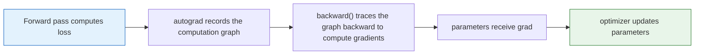

# 6.2.4 Autograd


## Learning Objectives

- Understand what gradients actually are
- Master the role of `requires_grad=True`
- Understand what `loss.backward()` does
- Understand gradient accumulation, clearing gradients, and `torch.no_grad()`

---

## First, build a map

This section is most likely to be misunderstood by beginners as “it’s just about whether you can write `backward()`.”
But more importantly, we should first see where it sits in the training loop:



So what you really need to understand in this section is not a single API, but:

- How gradients are passed back from the loss all the way to the parameters

## How this section connects to the previous and next ones

- The previous section on `Tensor` answered “what does the data look like?”
- This section on `autograd` answers “where do gradients come from?”
- The next section on `nn.Module` will answer “how do we organize the model?”

So this section is the beam in the middle:
without it, the training process only has a forward pass, but no “learning.”

## Why do we need autograd?

The core goal of training a model is just one sentence:

> **Make the model parameters move toward the direction that reduces the loss.**

The problem is: how do we know which direction to move in?

The answer is **gradient**.

You can think of a gradient as the “slope” of a hill:

- A large gradient means the slope is steep
- The gradient direction tells you the direction in which the loss increases fastest
- We want the loss to go down, so we update parameters in the **negative gradient direction**

If we manually derive gradients every time, it becomes extremely painful.
PyTorch’s `autograd` is like an automatic bookkeeper:

- You just write how to compute the loss
- It records the gradient path for you
- When you call `backward()`, it computes the gradients automatically

### Why does this become impossible to do by hand once things get complicated?

With one parameter, you can still compute it by hand.
But once a model has:

- Tens of thousands or millions of parameters
- Many layers
- Various intermediate tensors

manual derivation quickly becomes unmanageable.
So the most important value of automatic differentiation is not “saving a bit of effort,” but:

- Making large-model training feasible in practice

---

## A minimal example

```python
import torch

# A parameter that needs to be learned
w = torch.tensor(2.0, requires_grad=True)

# Define a simple function: loss = (w * 3 - 10)^2
loss = (w * 3 - 10) ** 2

print("loss:", loss.item())

# Automatic differentiation
loss.backward()

print("Gradient of w:", w.grad.item())
```

### What is happening here?

PyTorch records this computation chain:

```text
w -> w*3 -> w*3-10 -> (w*3-10)^2
```

When you run:

```python
loss.backward()
```

it walks backward along this chain using the chain rule, and finally gets:

```python
w.grad
```

This is the information that tells you “if `w` moves a little bit further, how will the loss change?”

### When you see this example for the first time, what should you focus on?

What you should focus on first is:

- `loss` is a final result
- `backward()` computes the effect of this final result on `w`
- `w.grad` stores the information about how to change `w`

As long as these three things are clear, more complex networks are just a longer version of the same chain.

---

## From gradients to parameter updates

Once you have gradients, you can do the simplest form of gradient descent:

```python
import torch

w = torch.tensor(2.0, requires_grad=True)
lr = 0.1

for step in range(5):
    loss = (w * 3 - 10) ** 2
    loss.backward()

    with torch.no_grad():
        w -= lr * w.grad

    print(f"step={step}, w={w.item():.4f}, loss={loss.item():.4f}")

    w.grad.zero_()
```

### What does each step do?

| Code | Purpose |
|---|---|
| `loss = ...` | Compute the current loss |
| `loss.backward()` | Compute the gradient of the current loss with respect to `w` |
| `w -= lr * w.grad` | Update the parameter using the gradient |
| `w.grad.zero_()` | Clear the old gradient and prepare for the next round |

---

## Why do we need to clear gradients?

This is one of the easiest traps for beginners in PyTorch.

By default, PyTorch **accumulates gradients** instead of overwriting them automatically.

See the example below:

```python
import torch

x = torch.tensor(3.0, requires_grad=True)

y1 = x ** 2
y1.backward()
print("Gradient after the first backward:", x.grad.item())

y2 = 2 * x
y2.backward()
print("Gradient after the second backward:", x.grad.item())
```

You will find that the second gradient is not a new result, but the sum of “first + second.”

That is why training loops usually include:

```python
optimizer.zero_grad()
```

or:

```python
tensor.grad.zero_()
```

### Why does PyTorch default to “accumulate gradients”?

Because some advanced training techniques intentionally do this, such as:

- Gradient accumulation
- Backpropagating multiple losses together

So the design itself is not wrong.
But as a beginner, you should first form a stable default habit:

- Before each update step, clear the gradients


:::tip Reading tip
Read this diagram as one training cycle: first the forward pass computes the loss, then `backward()` writes gradients into `.grad`, `optimizer.step()` updates the parameters using those gradients, and finally you must call `zero_grad()` to clear old gradients. PyTorch accumulates gradients by default, so “forgetting to clear them” is one of the most common invisible bugs for beginners.
:::

---

## What exactly does `requires_grad=True` control?

Only tensors marked with `requires_grad=True` will have their gradients tracked by PyTorch.

```python
import torch

a = torch.tensor(2.0, requires_grad=True)
b = torch.tensor(3.0, requires_grad=False)

y = a * b + 1
y.backward()

print("a.grad:", a.grad.item())
print("b.grad:", b.grad)
```

In the output, you will see:

- `a.grad` has a value
- `b.grad` is `None`

This makes perfect sense:
if a value is not a “learnable parameter,” then there is no need to compute gradients for it.

---

## What is `torch.no_grad()` for?

During training, we need to record gradients.
But during inference, evaluation, or manual parameter updates, we often **do not need** gradients.

In that case, we can use:

```text
with torch.no_grad():
    # inference or parameter update code goes here
```

Its effects are:

- Turn off gradient tracking
- Save memory
- Speed up inference

### The easiest thing for beginners to miss: parameter updates often also need gradient tracking turned off

You will find that many hand-written update snippets are wrapped in:

```text
with torch.no_grad():
    # inference or parameter update code goes here
```

The reason is:

- The parameter update itself is not something we want autograd to keep tracking for the next step
- So it usually does not need to be tracked by autograd

```python
import torch

w = torch.tensor(5.0, requires_grad=True)

with torch.no_grad():
    y = w * 2

print("y.requires_grad:", y.requires_grad)
```

---

## Putting it back into the context of “model training”

In real training, we usually do not update just one number `w`, but a whole set of parameters.

For example, in a linear model:

> `y = wx + b`

Here, both `w` and `b` are parameters, and both need to be learned.
What happens during training is actually still the same:

1. Make predictions with the current parameters
2. Compute the loss between predictions and true values
3. Automatically compute the gradient for each parameter
4. Update the parameters along the gradient direction using an optimizer

So autograd is not an “extra feature”; it is the engine of deep learning training.

---

## A runnable example with two parameters

```python
import torch

# We want the model to learn: y = 2x + 1
x = torch.tensor([1.0, 2.0, 3.0, 4.0])
y_true = torch.tensor([3.0, 5.0, 7.0, 9.0])

w = torch.tensor(0.0, requires_grad=True)
b = torch.tensor(0.0, requires_grad=True)
lr = 0.05

for epoch in range(200):
    y_pred = w * x + b
    loss = ((y_pred - y_true) ** 2).mean()

    loss.backward()

    with torch.no_grad():
        w -= lr * w.grad
        b -= lr * b.grad

    w.grad.zero_()
    b.grad.zero_()

    if epoch % 40 == 0:
        print(
            f"epoch={epoch:3d}, loss={loss.item():.4f}, "
            f"w={w.item():.4f}, b={b.item():.4f}"
        )
```

If everything works normally, `w` will approach `2` and `b` will approach `1`.

---

## Common misconceptions

### `backward()` automatically updates parameters

No.
`backward()` only **computes gradients**. The actual parameter update is done by your own update logic, or by the optimizer’s `step()`.

### It does not matter if we don’t clear gradients every round

That is not okay.
If you do not clear them, gradients will keep accumulating, and the training result will usually go wrong.

### We can keep gradients on during inference too

It will run, but it wastes resources.
During evaluation or deployment, you should wrap code with `torch.no_grad()` whenever possible.

---

## Summary

There are only three key takeaways in this section:

1. Gradients tell us which direction parameters should change
2. `backward()` computes gradients, but does not update parameters
3. PyTorch accumulates gradients by default, so you must clear them in the training loop

Once you understand autograd, you have truly stepped into the actual process of “training a model.”

## What should you take away most from this section

If we compress it into one sentence, it would be:

> **The essence of autograd is to automatically trace back the effect of the loss on the parameters through the computation graph.**

So what you really need to keep straight is:

- Which tensors need gradients
- When gradients are computed
- When gradients are accumulated
- Which stages should turn gradients off

---

## Exercises

1. Change the `y = 2x + 1` example above to `y = 3x - 2`, and train it again.
2. Remove `w.grad.zero_()` and `b.grad.zero_()`, and observe what happens during training.
3. Try changing the learning rate `lr` to `0.5` and `0.005`, and compare convergence speed and stability.
