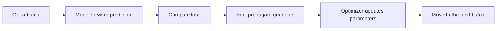

# Training Workflow


## Learning Goals

- Understand and write a standard PyTorch training loop
- Know the order of `train()`, `eval()`, `zero_grad()`, `backward()`, and `step()`
- Be able to complete training, validation, and prediction for a small task
- Build a reusable training template

---

## First, build a map

The best way for beginners to understand this training-loop section is not to “memorize a template,” but to first see clearly what training is repeating:



These five steps loop continuously. That is the core rhythm of deep learning training.

## How this section connects with Station 5 and the earlier PyTorch lessons

If you’ve come all the way here from Station 5, you can understand it like this:

- In Station 5, `fit()` already wrapped the training process for you
- In this section, you start writing the training process yourself, step by step

If you’re connecting this with the earlier PyTorch lessons, you can also think about it this way:

- `Tensor` solves “where the data lives”
- `Autograd` solves “where gradients come from”
- `nn.Module` solves “how the network is organized”
- `DataLoader` solves “how data is split into batches and fed in”
- And this section is responsible for stitching all of that into a real training process that runs

## 1. Why is the training loop important?

In deep learning code, the most valuable thing to practice again and again is not one specific layer, but the **training loop**.

Because no matter whether you are doing:

- image classification
- text classification
- object detection
- large model fine-tuning

the main training flow always follows this line:


### 1.1 Why is practicing the training loop more worthwhile than memorizing a network structure first?

Because network structures change:

- CNNs change
- RNNs change
- Transformers change

But the basic training loop stays stable for a long time.
So this section is very valuable: it helps you grasp the part of deep learning that is least likely to become outdated.

---

## 2. First, memorize the standard template

Don’t rush to memorize it yet. Read it a few times first:

```python
for batch_x, batch_y in train_loader:
    pred = model(batch_x)
    loss = loss_fn(pred, batch_y)

    optimizer.zero_grad()
    loss.backward()
    optimizer.step()
```

It actually does only three things:

1. Compute predictions
2. Compute error
3. Update parameters based on the error

### 2.1 The shortest chant a beginner should memorize first

If your training loop gets messy every time you write it, remember this shortest chant:

`forward -> compute loss -> clear gradients -> backprop -> update`

As long as this line flows smoothly, adding validation, logging, and early stopping later is not hard.

### 2.2 Why can’t this order be changed?

Because each step depends on the result of the previous one:

- Without forward computation, there are no predictions
- Without predictions, there is no loss
- Without loss, `backward()` cannot happen
- If you don’t clear old gradients, new gradients will mix with the old ones

So the training loop is not just “a few APIs put together,” but a causal chain with a strict order.


:::tip Reading hint
It’s a good idea to compare this diagram every time you write a training loop: `model.train()`, get batch, forward, loss, `zero_grad()`, `backward()`, `step()`. In the validation stage, switch to `model.eval()` and `torch.no_grad()` so validation does not record gradients.
:::

---

## 3. A complete runnable example

:::info Runtime environment
The code below can run directly:

```bash
pip install torch
```
:::

We will build a 2D regression task.
The input has two features, and the target follows an approximate relationship:

> `y ≈ 3*x1 + 2*x2 + 5`

```python
import torch
from torch import nn
from torch.utils.data import TensorDataset, DataLoader, random_split

torch.manual_seed(42)

# 1. Create a simulation dataset that can run directly
X = torch.randn(200, 2)
noise = torch.randn(200, 1) * 0.3
y = 3 * X[:, [0]] + 2 * X[:, [1]] + 5 + noise

dataset = TensorDataset(X, y)
train_dataset, val_dataset = random_split(
    dataset,
    [160, 40],
    generator=torch.Generator().manual_seed(42)
)

train_loader = DataLoader(train_dataset, batch_size=32, shuffle=True)
val_loader = DataLoader(val_dataset, batch_size=40, shuffle=False)

# 2. Define the model
model = nn.Sequential(
    nn.Linear(2, 8),
    nn.ReLU(),
    nn.Linear(8, 1)
)

# 3. Define the loss function and optimizer
loss_fn = nn.MSELoss()
optimizer = torch.optim.Adam(model.parameters(), lr=0.05)

# 4. Train
for epoch in range(1, 101):
    model.train()
    train_loss_sum = 0.0

    for batch_x, batch_y in train_loader:
        pred = model(batch_x)
        loss = loss_fn(pred, batch_y)

        optimizer.zero_grad()
        loss.backward()
        optimizer.step()

        train_loss_sum += loss.item() * len(batch_x)

    train_loss = train_loss_sum / len(train_dataset)

    # 5. Validate
    model.eval()
    with torch.no_grad():
        val_loss_sum = 0.0
        for batch_x, batch_y in val_loader:
            pred = model(batch_x)
            loss = loss_fn(pred, batch_y)
            val_loss_sum += loss.item() * len(batch_x)
        val_loss = val_loss_sum / len(val_dataset)

    if epoch % 20 == 0 or epoch == 1:
        print(f"epoch={epoch:3d}, train_loss={train_loss:.4f}, val_loss={val_loss:.4f}")

# 6. Test prediction
test_x = torch.tensor([[1.0, 2.0], [-1.0, 0.5], [0.0, 0.0]])
with torch.no_grad():
    test_pred = model(test_x)

print("\nPredictions on test samples:")
for x_row, y_row in zip(test_x, test_pred):
    print(f"x={x_row.tolist()} -> pred={round(y_row.item(), 2)}")
```

---

## 4. Step-by-step breakdown of this code

### 1. `model.train()`

Tells the model to enter training mode.
If the model has layers like `Dropout` or `BatchNorm`, they switch to training behavior.

### 2. `pred = model(batch_x)`

Forward pass.
In other words, “make a prediction using the current parameters.”

### 3. `loss = loss_fn(pred, batch_y)`

Tell the model: “How far are you from the true answer this time?”

### 4. `optimizer.zero_grad()`

Clear old gradients.
This is because PyTorch accumulates gradients by default.

### 5. `loss.backward()`

Backpropagation.
Computes the gradients of the loss with respect to each parameter.

### 6. `optimizer.step()`

Actually update the parameters based on the gradients.

### 4.1 When beginners write this for the first time, what step is most likely to be missed?

The two most common omissions are:

- forgetting `optimizer.zero_grad()`
- forgetting `model.eval()` and `torch.no_grad()` during validation

Both problems can make training look “weird,” but not necessarily fail immediately with an error.

### 4.2 A more beginner-friendly “training checklist” for each epoch

You can mentally run through this small table each epoch:

| Step | What should I check? |
|---|---|
| Forward | Are the input shapes correct? Are the output shapes correct? |
| loss | Do the outputs and labels match properly? |
| zero_grad | Were the old gradients cleared? |
| backward | Were gradients actually computed? |
| step | Were the parameters actually updated? |

This checklist is very helpful for debugging, because many training bugs happen in these five places.

---

## 5. Why do validation use `eval()` and `no_grad()`?

The goal of validation is not learning, but checking model performance.

So we usually write this:

```python
model.eval()
with torch.no_grad():
    ...
```

There are two reasons:

- `eval()`: switch certain layers into inference mode
- `no_grad()`: do not record gradients, saving memory and time

### 5.1 In the early learning stage, how important is it to separate training mode from validation mode?

This is easy to overlook because many tiny examples show no obvious problem.
But from this section on, you should develop a stable habit:

- Before training: `model.train()`
- Before validation: `model.eval()`
- During validation: `with torch.no_grad():`

Because later, once you encounter:

- Dropout
- BatchNorm
- larger models

if training mode and validation mode are not clearly separated, things will become increasingly error-prone.

---

## 6. A more memorable “kitchen-style analogy”

Thinking of training as running a restaurant is easy to remember:

| Deep learning step | Restaurant analogy |
|---|---|
| `batch_x` | A batch of customer orders |
| `model(batch_x)` | The chef cooks using the current method |
| `loss_fn` | Customers give a rating |
| `backward()` | Figure out what was done poorly |
| `step()` | Adjust the cooking method next time |

Training is repeated service, repeated improvement.

---

## 7. Common variations

### 1. Classification tasks

Regression often uses `MSELoss()`, while classification more commonly uses:

```python
loss_fn = nn.CrossEntropyLoss()
```

### 2. Different optimizers

The two most common ones are:

- `SGD`
- `Adam`

For beginners, `Adam` is often a little easier to work with.

### 3. Metrics

In addition to loss, training often also tracks:

- accuracy
- precision
- recall
- F1

---

## 8. The easiest places to make mistakes

### 1. Forgetting `zero_grad()`

Consequence: gradients keep accumulating, and the training result becomes unreliable.

### 2. Forgetting `model.eval()` during validation

Some layers behave differently in training and validation modes, which affects results.

### 3. Computing gradients during validation too

Even if it runs, it wastes memory and compute.

### 4. Mixing up `loss.item()` and `loss`

- `loss` is a tensor and can participate in backpropagation
- `loss.item()` is a normal Python number, suitable for printing and statistics

### 5. Only watching loss and ignoring the relationship between training and validation

Another common beginner mistake is:

- seeing training loss go down and assuming everything is fine

But a more reliable judgment should be:

- Is training loss going down?
- Is validation loss improving at the same time?
- Are the two starting to diverge?

This is actually preparing you for diagnosing overfitting later.

---

## 9. A general skeleton you can save

```python
for epoch in range(num_epochs):
    model.train()
    for batch_x, batch_y in train_loader:
        pred = model(batch_x)
        loss = loss_fn(pred, batch_y)

        optimizer.zero_grad()
        loss.backward()
        optimizer.step()

    model.eval()
    with torch.no_grad():
        for batch_x, batch_y in val_loader:
            pred = model(batch_x)
            val_loss = loss_fn(pred, batch_y)
```

From now on, whenever you see any PyTorch project, you should be able to recognize this main line.

---

## Summary

If you only remember one sentence from this section, let it be:

> **A training loop is “compute forward once, update backward once, and repeat many times.”**

Once you practice this chain well, later when you learn CNNs, Transformers, or fine-tuning large models, you won’t be intimidated by framework code.

## What you should take away most from this section

If I could add one more thing to remember, it would be this:

> **A training loop is not a template-memorization question, but a closed loop of “predict -> measure error -> update parameters based on the error.”**

So what this section really needs you to keep stable is:

- the order must not be messed up
- training mode and validation mode must be separated
- when debugging, first check shape, loss, gradients, and parameter updates

---

## Exercises

1. Change the optimizer in the example above from `Adam` to `SGD`, and observe the difference in convergence speed.
2. Change the hidden layer size from `8` to `16`, and observe how the training and validation losses change.
3. Change the noise in the data from `0.3` to `1.0`, and see how the difficulty of training the model changes.
