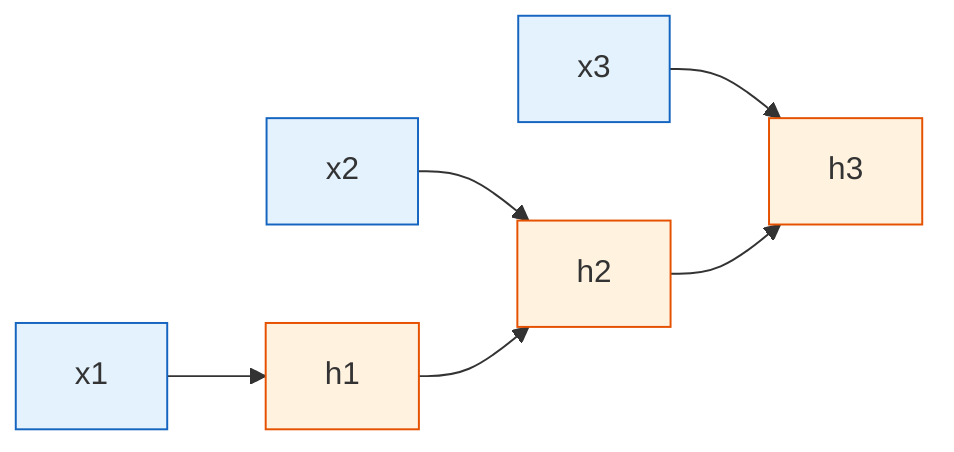

# RNN Basics


:::tip Section Focus
The earlier MLP and CNN are better at handling “static inputs,” while RNNs are designed to solve a different kind of problem:

> **The input is not a pile of static features, but a sequence of ordered data.**

For example, a sentence, a time series, a log stream, or a sequence of user actions.
:::

## Learning Objectives

- Understand why sequence tasks cannot be solved by a plain MLP alone
- Build an intuitive understanding of the RNN hidden state
- Read and understand how RNNs are unrolled across time
- Walk through the smallest RNN computation process by hand
- Master the input and output shapes of `nn.RNN` in PyTorch
- Understand the strengths and limitations of RNNs to prepare for LSTM / GRU

---

## How This Section Connects to the Earlier MLP / CNN Content

If you just came from the previous chapters, you can think about it like this:

- MLPs and CNNs are more like they process “the current input”
- RNNs explicitly process “the current input + the state left over from the past”

In other words, the most important new thing in an RNN is not that “the recurrent structure is cool,” but that:

- the model now has a very basic form of “memory”

## 1. Why Are Sequence Tasks Harder?

### 1.1 Order itself is information

Look at these two sentences:

- “I don’t like this course”
- “I like this course, it’s not hard”

If you only count word frequencies, they both contain:

- I
- like
- this course

But what really determines the meaning is the order and the context.

Now look at a time series:

- Day 1 sales are low, Day 2 rise, Day 3 surge

This is not just a pile of independent numbers either, but a changing process.

So the difficulty in sequence tasks is not “there is more data,” but:

> **Earlier information affects how later information is understood.**

### 1.3 When learning RNNs for the first time, don’t start with the formula

Instead, start by holding on to this sentence:

> **In sequence tasks, position and order themselves are information.**

Once this idea is stable, it becomes much easier to understand why we need:

- hidden state
- time unrolling
- LSTM / GRU

### 1.2 Why is MLP not good at this problem?

An MLP can map a fixed-length vector to an output, but it does not naturally remember:

- the relationship between the 1st word and the 8th word
- the relationship between the current value and the past trend
- what was seen before and what should be kept now

It is like forcing yourself to “forget everything” every time you read a new sentence, which naturally makes long sequences hard to understand.

---

## 2. The Core Idea of RNNs: At Each Step, Carry a Bit of “Memory”

### 2.1 What is hidden state?

The core design of an RNN is the hidden state `h_t`.

You can think of it as:

> **A little bit of information the model temporarily remembers when it reads the current step.**

When a new input `x_t` arrives, the model combines:

- the current input `x_t`
- the previous memory `h_{t-1}`

to compute a new memory `h_t`.

### 2.2 A very easy-to-remember analogy

An RNN is like taking notes while listening to someone speak:

- new content heard now = `x_t`
- important points already written down = `h_{t-1}`
- your updated notes = `h_t`

This “read and update at the same time” process is the essence of an RNN.

### 2.3 What is hidden state most often misunderstood as?

Many beginners think of `h_t` as “exact memory.”
A more accurate understanding is:

- it does not store the past word-for-word
- it is more like a compressed summary of past information

That is also why plain RNNs often run into problems:

- when the sequence gets long, the summary may no longer remember important information from far back

---

## 3. How Does an RNN Unroll Over Time?

### 3.1 The same parameters are reused at every time step

An RNN does not create a separate new set of parameters for each time step.
What it does is:

> Use the same set of parameters to repeatedly process each position in the sequence.



### 3.2 Why is “parameter sharing” important?

Because whether a sentence has 5 words or 50 words, the model can process it in the same way.
This is one of the keys to why RNNs can handle variable-length sequences.

### 3.3 When first learning time unrolling, what is the most important thing to understand?

Don’t treat it as a complicated diagram right away.
Just understand this one point first:

- on the surface, it looks like many boxes laid out in a row
- in essence, the same set of parameters is being reused across different time steps

That is why RNNs can handle variable-length sequences without adding an entirely new set of parameters for every new position.


:::tip Reading Tip
You can read this diagram from left to right: at each time step, the current input `x_t` and the old memory `h_{t-1}` are used to produce a new memory `h_t`. The core of an RNN is not that “the recurrence is complicated,” but that the model updates a compressed summary every time it reads a step.
:::

---

## 4. A Minimal Hand-Crafted Example: Calculating the Hidden State Step by Step

### 4.1 First look at the simplest formula

The simplest RNN can be written as:

> `h_t = tanh(W_x * x_t + W_h * h_{t-1} + b)`

Here:

- `x_t`: current input
- `h_{t-1}`: previous-step memory
- `h_t`: current new memory

### 4.2 Runnable example

```python
import numpy as np

# An input sequence of length 4
x_seq = [1.0, 0.5, -1.0, 2.0]

W_x = 0.8
W_h = 0.5
b = 0.1

h = 0.0  # initial hidden state

for t, x_t in enumerate(x_seq, start=1):
    h = np.tanh(W_x * x_t + W_h * h + b)
    print(f"step={t}, x_t={x_t:.1f}, h_t={h:.4f}")
```

### 4.3 What is this code actually teaching?

It is not trying to simulate a real large model. It is here to help you understand first that:

- an RNN depends on the previous step at every step
- the hidden state is continuously updated
- the current output is not based only on the current input, but on “current input + past summary”

Once you understand these three points, you have grasped the core of RNNs.

### 4.4 When you manually walk through this code for the first time, what should you focus on?

It is recommended to focus on just these three:

- current input `x_t`
- previous hidden state `h_{t-1}`
- new hidden state `h_t`

In other words, understanding “input + old memory -> new memory” is more important than memorizing more symbols right away.

---

## 5. What Are the Different Input/Output Patterns of RNNs?

### 5.1 Many-to-one: one result for the whole sequence

Typical tasks:

- sentiment classification
- spam classification
- behavior prediction

Input:

- a sequence of words / a sequence of data

Output:

- one class

### 5.2 Many-to-many: output at every step

Typical tasks:

- sequence labeling
- part-of-speech tagging
- named entity recognition

Input:

- a sequence of words

Output:

- one label for each word

### 5.3 Sequence-to-sequence: one sequence becomes another sequence

Typical tasks:

- machine translation
- summarization

This will be covered in more detail later in the Seq2Seq chapter.

---

## 6. How Do You Actually Use an RNN in PyTorch?

### 6.1 Minimal runnable example

```python
import torch

torch.manual_seed(42)

# batch=2, seq_len=5, input_size=4
x = torch.randn(2, 5, 4)

rnn = torch.nn.RNN(
    input_size=4,
    hidden_size=6,
    batch_first=True
)

out, h = rnn(x)

print("x shape   :", x.shape)
print("out shape :", out.shape)
print("h shape   :", h.shape)
```

### 6.2 What do these shapes mean?

Input:

- `x.shape = [2, 5, 4]`
- means there are 2 samples
- each sample has length 5
- each time step has 4 features

Output:

- `out.shape = [2, 5, 6]`
- means each time step outputs a 6-dimensional hidden representation

Final hidden state:

- `h.shape = [1, 2, 6]`
- the first dimension `1` means the number of layers (only one layer here)
- the second dimension `2` is the batch size
- the third dimension `6` is the hidden-state size

### 6.3 What is the difference between `out` and `h`?

- `out`: keeps the output of every time step
- `h`: the hidden state at the last time step

In many-to-one classification tasks, people often directly use the final `h` or `out[:, -1, :]` for classification.

---

## 7. A Small Example Closer to a Real Task: Sequence Classification

Below we simulate a very small task:

- input is a sequence of numbers
- determine whether the overall trend is more “positive” or more “negative”

```python
import torch
from torch import nn

torch.manual_seed(42)

# 4 sequences, each of length 5, with 1 feature per step
X = torch.tensor([
    [[1.0], [1.2], [1.3], [1.1], [1.0]],
    [[-1.0], [-1.1], [-1.3], [-0.9], [-1.2]],
    [[0.8], [0.7], [1.0], [0.9], [1.1]],
    [[-0.6], [-0.7], [-0.9], [-1.0], [-0.8]]
])

y = torch.tensor([1, 0, 1, 0])

class SimpleRNNClassifier(nn.Module):
    def __init__(self):
        super().__init__()
        self.rnn = nn.RNN(input_size=1, hidden_size=8, batch_first=True)
        self.fc = nn.Linear(8, 2)

    def forward(self, x):
        out, h = self.rnn(x)
        last_hidden = out[:, -1, :]
        return self.fc(last_hidden)

model = SimpleRNNClassifier()
loss_fn = nn.CrossEntropyLoss()
optimizer = torch.optim.Adam(model.parameters(), lr=0.05)

for epoch in range(100):
    pred = model(X)
    loss = loss_fn(pred, y)

    optimizer.zero_grad()
    loss.backward()
    optimizer.step()

    if epoch % 20 == 0:
        print(f"epoch={epoch:3d}, loss={loss.item():.4f}")

with torch.no_grad():
    result = model(X).argmax(dim=1)
    print("Predictions:", result.tolist())
    print("Ground truth:", y.tolist())
```

This example is very small, but it really teaches one thing:

> An RNN does not classify based on a single step. It gradually accumulates information over the whole sequence and then makes a decision.

---

## 8. Why Were RNNs Eventually Pushed Aside by LSTM / GRU and Transformer?

### 8.1 Main problem: long-range dependencies are hard

In theory, RNNs can remember for a long time, but in practice they often run into:

- vanishing gradients
- exploding gradients
- earlier information being washed out too quickly

For example, in a very long sentence, information from the beginning may become hard to preserve by the end.

### 8.2 Training is not parallelizable enough

RNNs compute step by step:

- step 5 has to wait for step 4
- step 4 has to wait for step 3

This makes them inefficient on long sequences.

That is also why:

- LSTM / GRU improved the situation first
- Transformer later changed the approach at a deeper level


:::tip Reading Tip
When reading this diagram, pay attention to the two decay lines: one shows early information becoming weaker as it passes through the hidden state, and the other shows gradients becoming weaker as they backpropagate to early time steps. LSTM / GRU and Transformer are both responses to these two pain points.
:::

But RNNs are still worth learning, because they help you truly understand the underlying intuition of “sequence modeling.”

---

## 9. Common Mistakes Beginners Make

### 9.1 Not knowing what the input shape should look like

In PyTorch, the most common confusion is:

- `batch_first=True`
- `batch_first=False`

If you set `batch_first=True`, the input is usually:

- `[batch, seq_len, input_size]`

### 9.2 Confusing `out` and `h`

Remember:

- `out` is for looking at every step
- `h` is for the final summary

### 9.3 Thinking RNNs can naturally remember very long histories

Theoretically they can, but in practice they often cannot.
That is exactly why we need to learn LSTM / GRU later.

---

## Summary

The most important thing to take away from this section is not the API, but these three stable intuitions:

1. RNNs are designed for sequence problems because order itself is information
2. Hidden state is the model “reading and remembering at the same time”
3. The essence of an RNN is repeatedly updating state along the time dimension using the same set of parameters

Once you understand these three points, your later study of LSTM, Seq2Seq, and attention mechanisms will feel much smoother.

---

## Exercises

1. Change `W_x` and `W_h` in the hand-crafted RNN example and observe how the hidden state changes.
2. Change `hidden_size` from 6 to 12 in the PyTorch example and see how the shape changes.
3. Replace the sequences in the classification example with data you define yourself and try building a simple trend classifier.
4. Think about this: why might an RNN “forget the beginning more and more” when reading a very long sentence?
