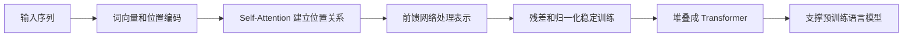

# 学前导读：Transformer 这一章到底在学什么

这一章解决的是一个非常关键的问题：为什么现代 NLP、大模型和很多多模态系统，都绕不开 Transformer。

如果前面神经网络、CNN、RNN 让你知道了“深度学习模型可以处理不同类型的数据”，那么这一章要帮你看懂的是：当数据是文本这样的序列时，模型为什么需要一种更适合捕捉全局关系的结构。

## 这一章在整个课程里的位置

你已经学过神经网络基础、PyTorch、CNN 和 RNN。到 Transformer 这一章，课程开始从传统深度学习模型进入大模型时代的核心结构。

RNN 的直觉是“边读边记”，它适合解释序列处理的基本想法，但在长文本、并行训练和长距离依赖上会遇到明显瓶颈。Transformer 的关键变化是：不再只按顺序传递信息，而是让每个位置可以根据相关性直接关注其他位置。

## 这一章真正要解决的问题

这一章不是让你一上来推公式，而是先建立结构直觉。你要理解 RNN 为什么不够，注意力机制为什么能让当前位置“看向”其他位置，Q/K/V 分别扮演什么角色，Self-Attention 为什么适合文本，Transformer 为什么要由多头注意力、前馈网络、残差连接、LayerNorm、位置编码等模块组合起来。

这些概念第一次看会觉得多，但它们都在服务同一件事：让模型在处理序列时，既能看到局部信息，也能建立全局关联，并且可以更高效地并行训练。

## 新人推荐学习顺序

建议先从 RNN 的痛点开始看，不要直接跳进 Transformer 结构图。先问：如果句子很长，前面的词如何影响后面的词？如果每一步都必须等上一步算完，训练会不会很慢？这些问题理解后，再看 Attention 就会自然很多。

然后重点理解 Q/K/V 的直觉。Query 可以理解成“我想找什么”，Key 可以理解成“我有什么特征可被匹配”，Value 可以理解成“真正要传过去的信息”。最后再看 Transformer 的整体结构，你会更容易理解为什么它要堆叠模块，而不是只靠一个注意力层。

## 学这一章时要抓住的主线

这一章的主线可以压缩成一句话：序列建模从“顺序传递”走向“全局关联”。

这条线看懂后，后面学 BERT、GPT、预训练、Prompt、微调、RAG 和 Agent 时，你会知道底层模型能力不是凭空来的，而是建立在 Transformer 对表示和上下文关系的建模能力之上。

## 这一章和后面章节的关系

Transformer 是第 6 站和第 7 站之间的桥。在第 6 站里，它是深度学习结构；到第 7 站，它会变成大模型原理的底座。后面讲预训练语言模型时，BERT 和 GPT 的差异，本质上也会回到 Transformer Encoder、Decoder、训练目标和使用方式的差异。

如果这一章没学稳，后面常见的问题是：知道 GPT 很强，但不知道上下文是怎样被建模的；知道 Attention 这个词，但不知道它为什么解决 RNN 的限制；会调用模型 API，但很难理解 token、上下文长度、Embedding 和推理成本之间的关系。

## 新人和进阶学习者怎么读

新人第一次学这一章时，先抓住主线和最小可运行例子。你不需要一次理解所有细节，只要能说清楚这一章解决什么问题、输入输出是什么、最小项目怎么跑起来，就可以继续往后走。

有经验的学习者可以把这一章当成查漏补缺和工程化练习：关注边界条件、失败案例、评估方式、代码可复现性，以及它和前后阶段的连接。读完后最好能把本章内容沉淀到自己的作品 README 或实验记录里。

## 学习时间与难度建议

| 学习方式 | 建议投入 | 目标 |
|---|---|---|
| 快速浏览 | 20～30 分钟 | 看懂本章解决什么问题，知道后面会用到哪里 |
| 最小通关 | 1～2 小时 | 跑通一个最小例子，完成本章小项目出口 |
| 深入练习 | 半天～1 天 | 补充错误分析、对比实验或项目 README 记录 |

## 本章自测问题

| 自测问题 | 通过标准 |
|---|---|
| 这一章解决什么问题？ | 能用一句话说明它在整门课里的位置 |
| 最小输入输出是什么？ | 能说清楚例子需要什么输入，会产生什么结果 |
| 常见失败点在哪里？ | 能列出至少一个报错、效果差或理解偏差的原因 |
| 学完后能沉淀什么？ | 能把本章产出写进项目 README、实验记录或作品集 |

## 本章小项目出口

学完这一章后，建议做一个“手写注意力直觉演示”或“小型文本分类实验”。前者可以用简单矩阵展示一个词如何给其他词分配注意力权重；后者可以用现成框架跑一个 Transformer/BERT 文本分类样例，重点记录输入 token、attention mask、模型输出和评估结果。

项目目标不是从零训练大模型，而是能把 Transformer 的核心信息流讲清楚。

## 过关标准

这一章结束时，你应该能解释 RNN 和 Transformer 的主要区别，能用通俗语言说明 Attention 和 Self-Attention 在做什么，能说清楚 Q/K/V 的角色分工，并能把 Transformer 和后面的 BERT、GPT、大模型主线连接起来。

如果你能画出“输入 token → embedding → attention → transformer block → 输出表示”的流程，并说明每一步大致在解决什么问题，就达到了进入大模型原理阶段的基础要求。
