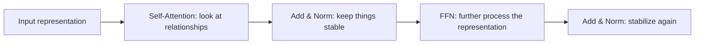
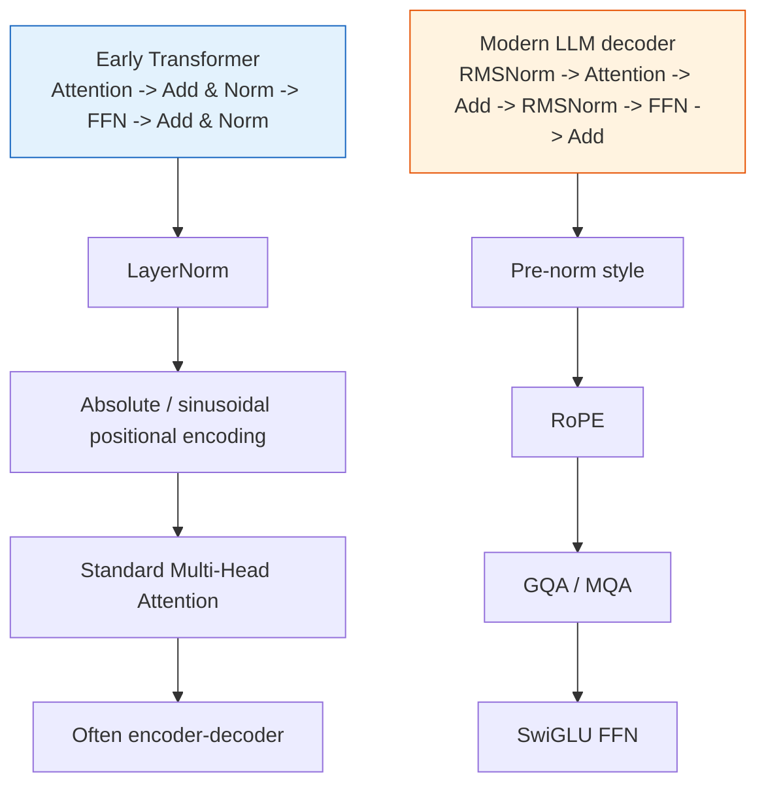

# Transformer Architecture


:::tip Where this section fits
In the previous section, you learned that the attention mechanism is the heart of the Transformer.
In this section, we are going to put the heart together with the other organs and look at the full system:

> **What exactly does a Transformer Block consist of, and why are the components arranged this way?**

Once you understand this section, you will no longer see GPT, BERT, and T5 as just names.
:::

## Learning Objectives

- Understand the standard structure of a Transformer Block
- Understand the roles of residual connections, LayerNorm, and feed-forward networks
- Distinguish the three main paths: encoder-only, decoder-only, and encoder-decoder
- Understand why positional encoding is essential
- Read a minimal Transformer encoder example

---

## First, Build a Map

It is easier to understand the Transformer architecture by asking: “Who does what in a single block?”



So the real questions this section answers are:

- Besides attention, what do the remaining Transformer modules actually do?
- Why do GPT, BERT, and T5 look different on the surface, but still share such a similar backbone?

---

## 1. A Transformer Is More Than Just “Attention”

### 1.1 A Common Misunderstanding

When many people hear “Transformer,” they only remember:

- self-attention
- Q/K/V
- multi-head

But a real Transformer Block is not “just an attention layer.”

A typical block also includes at least:

- Residual connections
- Layer normalization (LayerNorm)
- Feed-forward network (FFN)

### 1.2 Why Add So Many Things?

Because although the attention layer is good at “building relationships,” a stable and trainable large model also needs:

- smoother gradient flow
- more stable numerical distributions
- stronger nonlinear transformation ability

So you can roughly remember it this way:

> Attention decides “where to look,” FFN decides “how to further process,” and residual connections plus normalization keep the whole system stable.

### 1.3 A Beginner-Friendly Analogy

You can think of a Transformer Block as:

- a work group that first holds a meeting, then organizes notes, then does deeper processing, and finally organizes things again

In this analogy:

- Attention is like everyone exchanging information with each other first
- FFN is like each person independently processing the information they received
- Residual connections and normalization keep the whole process from becoming messy

With this mental model, it no longer feels like:

- a pile of mysterious layers stacked together


:::tip Reading the Diagram
It is helpful to read this diagram by responsibility: Attention mixes context, Residual preserves the original information, LayerNorm stabilizes the values, and FFN further processes each position. A Transformer is not just attention; it is an engineering structure that makes attention deep and trainable.
:::

---

## 2. What Does an Encoder Block Look Like?

### 2.1 Structure Diagram

```mermaid
flowchart LR
    A["Input representation"] --> B["Multi-Head Self-Attention"]
    B --> C["Add & Norm"]
    C --> D["Feed Forward Network"]
    D --> E["Add & Norm"]
    E --> F["Output representation"]

    style A fill:#e3f2fd,stroke:#1565c0,color:#333
    style B fill:#fff3e0,stroke:#e65100,color:#333
    style C fill:#f3e5f5,stroke:#6a1b9a,color:#333
    style D fill:#fffde7,stroke:#f9a825,color:#333
    style E fill:#f3e5f5,stroke:#6a1b9a,color:#333
    style F fill:#e8f5e9,stroke:#2e7d32,color:#333
```



### 2.2 In Plain English

For each block:

1. First use self-attention to look at global relationships
2. Then add the input back and normalize
3. Then pass through a position-wise feed-forward network
4. Then add the intermediate result back and normalize again

That is the main flow of a Transformer encoder block.

### 2.3 A Beginner-Friendly Module Summary Table

| Module | The Most Important Thing to Remember |
|---|---|
| Self-Attention | See which tokens are related in the sequence |
| Residual | Don’t lose the original information |
| LayerNorm | Keep the representation stable |
| FFN | Do another nonlinear transformation at each position |

This table is useful for beginners because it compresses a block from a structural diagram into a few memorable sentences.

---

## 3. What Does the Residual Connection Actually Help With?

### 3.1 The Most Intuitive Understanding

A residual connection is simply:

> Add a shortcut that brings the input directly back to the output.

In formula form, it is very simple:

> `y = f(x) + x`

### 3.2 Why Is This Helpful?

Because deep networks often suffer from:

- information becoming weaker as it flows through layers
- gradients becoming harder to propagate

A residual connection is like saying:

> “Even if the new things learned by this layer are not great yet, at least do not completely lose the original information.”

This makes the network easier to train and easier to deepen.

### 3.3 A Minimal Example

```python
import torch

x = torch.tensor([[1.0, 2.0, 3.0]])
f_x = torch.tensor([[0.1, -0.2, 0.3]])

y = x + f_x

print("x   =", x)
print("f(x)=", f_x)
print("y   =", y)
```

---

## 4. What Does LayerNorm Do?

### 4.1 Why Do We Need Normalization?

In deep networks, the value distribution of each layer’s output can drift a lot.
This makes training unstable.

The role of LayerNorm is:

> On the feature dimension, pull the representation of each position back to a more stable scale.

### 4.2 A Simple Analogy

You can think of LayerNorm as:

> After each layer finishes processing, first “straighten the posture” of the values so the next layer does not receive input that is too extreme.

### 4.3 Minimal Example

```python
import torch
from torch import nn

x = torch.tensor([
    [1.0, 2.0, 3.0, 10.0],
    [2.0, 2.5, 3.5, 9.0]
])

ln = nn.LayerNorm(4)
y = ln(x)

print("before =\n", x)
print("after  =\n", y)
print("row means:", y.mean(dim=1))
```

You will see that each row is pulled toward a more stable distribution.

---

## 5. Why Is the Feed-Forward Network (FFN) Also Important?

### 5.1 Attention Does Not End the Story

It is easy to think:

- since attention has already captured the relationships
- then maybe the layers after it are not that important?

That is not true.

Attention is better at “mixing information from different positions,”
while the FFN is better at “doing another nonlinear transformation on the representation at the current position.”

### 5.2 A Standard FFN

It is usually written roughly as:

> `Linear -> Activation -> Linear`

```python
import torch
from torch import nn

x = torch.randn(2, 5, 8)

ffn = nn.Sequential(
    nn.Linear(8, 32),
    nn.ReLU(),
    nn.Linear(32, 8)
)

y = ffn(x)

print("input shape :", x.shape)
print("output shape:", y.shape)
```

Note:

- The sequence length does not change
- Each position passes through the same feed-forward network independently

---

## 6. Why Is Positional Encoding Essential?

### 6.1 Attention Itself Does Not Carry Order

Self-attention is very good at figuring out “who is related to whom,”
but if you only give it token embeddings and do not tell it the positions:

- “cat chases dog”
- “dog chases cat”

In some cases, it may be hard to directly distinguish the difference in order.

### 6.2 So We Add Positional Encoding

Positional encoding tells the model:

- which position this token is at
- what its relative position is compared to other tokens

### 6.3 A Simple Sinusoidal Positional Encoding Example

```python
import numpy as np

positions = np.arange(5)
encoding = np.stack([
    np.sin(positions),
    np.cos(positions)
], axis=1)

print(np.round(encoding, 4))
```

Real positional encodings are higher-dimensional and more complex, but for intuition, you can think of them as:

> giving each position a unique coordinate label.

---

## 7. A Minimal Transformer Encoder Example

### 7.1 Runnable Code

```python
import torch
from torch import nn

torch.manual_seed(42)

# batch=2, seq_len=6, d_model=16
x = torch.randn(2, 6, 16)

layer = nn.TransformerEncoderLayer(
    d_model=16,
    nhead=4,
    dim_feedforward=32,
    batch_first=True
)

y = layer(x)

print("input shape :", x.shape)
print("output shape:", y.shape)
```

### 7.2 What Does This Code Teach?

It teaches you two very important facts:

1. After a block processes the input, the shape usually does not change
2. What changes is the quality of the representation, not the appearance of the tensor

In other words, even though many Transformer layers do not visibly change the shape,
what really changes is:

- how each position incorporates global context
- how rich the semantic information in the representation becomes


:::tip Reading the Diagram
When reading this diagram, do not focus only on shape: `[batch, seq_len, d_model]` may stay the same across layers, but each token representation has already absorbed more context. In a Transformer, the real “improvement” often happens inside the representation content, not in the outer dimensions.
:::

---

## 8. What Does a Decoder Block Add?

### 8.1 The Key Difference Between Decoder and Encoder

A Decoder Block usually adds one more module:

- **Cross-Attention**

So a typical decoder structure is:

1. Masked Self-Attention
2. Cross-Attention
3. Feed Forward

### 8.2 Why Add Cross-Attention?

Because the decoder does not only need to look at the history of what it has already generated, but also at the input information passed from the encoder.

This is very common in:

- machine translation
- summarization
- question answering generation

### 8.3 The Easiest Way to Distinguish Encoder-only / Decoder-only / Encoder-Decoder

When you first learn these three paths, the safest distinction is usually:

1. Encoder-only: more focused on understanding
2. Decoder-only: more focused on generation
3. Encoder-decoder: more like “read one piece, then generate another”

Remember this main line first, and then when you look at:

- BERT
- GPT
- T5

you will not be left with only the model names.

---

## 9. Three Main Transformer Families

### 9.1 Encoder-only

Representative model:

- BERT

Features:

- More focused on understanding tasks

### 9.2 Decoder-only

Representative model:

- GPT

Features:

- More focused on generation tasks

### 9.3 Encoder-Decoder

Representative model:

- T5

Features:

- Flexible input and output

---

## 10. Early Transformer vs Modern LLM Decoder

The original Transformer paper mainly introduced an encoder-decoder stack for sequence-to-sequence tasks such as machine translation. Modern large language models usually use a decoder-only stack optimized for next-token prediction and large-scale pretraining. The backbone is still Transformer, but the design choices are different.


:::tip How to read this diagram
Read it from top to bottom. The left side shows the original post-norm encoder-decoder design; the right side shows the modern pre-norm decoder-only pattern. The names changed because large models need more stable training, lower inference cost, and better long-context behavior.
:::



### 10.1 What beginners should remember first

| Part | Early Transformer | Modern LLM decoder | Why it changed |
|---|---|---|---|
| Normalization | LayerNorm | RMSNorm (Root Mean Square Normalization) | Simpler normalization often works well in large decoder stacks |
| Block order | Attention -> Add & Norm -> FFN -> Add & Norm | RMSNorm -> Attention -> Add -> RMSNorm -> FFN -> Add | Pre-norm makes deep training more stable |
| Position information | Absolute / sinusoidal positional encoding | RoPE (Rotary Positional Embedding) | Better relative-position behavior and longer-context use |
| Attention heads | Standard Multi-Head Attention | GQA / MQA (Grouped-Query / Multi-Query Attention) | Lower KV-cache cost and faster inference |
| FFN | Standard FFN, often ReLU/GELU | SwiGLU FFN | Stronger gating and better scaling behavior |
| Common architecture | Encoder-decoder | Decoder-only | Next-token prediction is easier to scale for LLMs |

### 10.2 Plain-language explanations of the acronyms

- **RMSNorm**: normalize by the root mean square of the features, without subtracting the mean
- **RoPE**: rotate position information into the attention space so the model feels order more naturally
- **GQA**: let multiple query groups share key/value heads
- **MQA**: let many query heads share a single key/value set
- **SwiGLU**: a gated feed-forward block that uses a Swish-style gate to control information flow

### 10.3 Why modern LLM decoders changed the block design

These changes are not cosmetic. They solve practical scaling problems:

- Deep models need more stable gradients, so pre-norm is attractive
- Long contexts need better position handling, so RoPE is often preferred
- Inference cost matters, so GQA/MQA reduce KV-cache pressure
- Large-scale generation needs stronger nonlinear blocks, so SwiGLU often replaces a simpler FFN

If you remember only one sentence, remember this:

> Early Transformer showed how to build a strong sequence-to-sequence block, while modern LLM decoders show how to scale that block to very large language models.

## If You Turn This Into Notes or a Project, What Is Most Worth Showing?

What is usually most worth showing is not:

- one very complex overall architecture diagram

But rather:

1. What each module in a block is responsible for
2. The difference between the encoder and the decoder
3. What each of the three main families is more suited for
4. Why combining these modules makes training more stable

This helps others see more clearly that:

- you understand the skeleton of the Transformer
- you are not just memorizing QKV

So when you study models later, do not only look at the name. First ask:

> Is it encoder-only, decoder-only, or encoder-decoder?

That question almost directly determines what it is good at.

---

## 11. Common Beginner Pitfalls

### 11.1 Mistaking Transformer for “Just Attention”

Attention is important, but it is not everything.
Residual connections, normalization, and FFN are all key to making the architecture work reliably.

### 11.2 Focusing Only on Shape and Ignoring Information Flow

Many times the shape does not change, but the semantic representation is being rebuilt layer by layer.

### 11.3 Not Knowing the Difference Between Encoder and Decoder

This will keep you confused when you later look at BERT, GPT, and T5.

---

## Summary

The most important thing in this section is not memorizing the diagram, but grasping this main idea:

> **A Transformer Block = attention builds relationships + residual connections preserve information + normalization stabilizes training + FFN performs nonlinear processing.**

With this main idea in mind, when you later study specific models like BERT, GPT, and T5, you can immediately see how they are trimmed and extended within this larger framework.

If you go one step further, you should also be able to separate the original Transformer block from the modern LLM decoder block:

> **Early Transformer = LayerNorm + absolute position + standard multi-head attention + encoder-decoder structure.**
>
> **Modern LLM decoder = pre-norm + RMSNorm + RoPE + GQA/MQA + SwiGLU + decoder-only structure.**

---

## Exercises

1. Change `d_model` to 32 in the minimal Transformer example, then check the output shape.
2. Explain in your own words: why do we say attention solves “where to look,” while the FFN solves “how to further process”?
3. Try drawing the extra layer that appears in the decoder block compared with the encoder block.
4. Think about this: why can a Transformer still process sequences even though it does not use convolution or recurrence?
