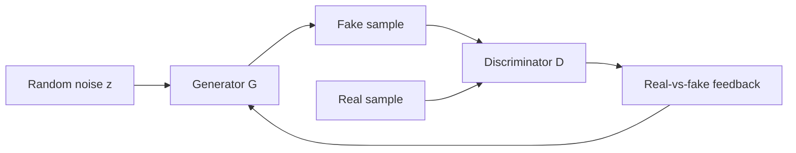

# GAN Basics [Optional]


:::tip Section overview
What makes GAN especially appealing is:

- It does not learn “labels”
- It learns “whether something looks real”

That is what makes it so attractive for generation tasks.
But it can also make beginners feel uneasy, because the training process does not look like ordinary supervised learning.

The goal of this section is not to mystify GAN, but to reduce it to a very concrete game:

> **The generator tries to fool the discriminator, and the discriminator tries to catch the generator.**
:::

## Learning objectives

- Understand what the generator and discriminator are each responsible for
- Understand why “adversarial training” can improve generation quality
- Build a minimal intuition for GAN training through a runnable example
- Understand why mode collapse and unstable training happen so often

---

## First, build a map

If you just came from earlier classification or regression tasks, you can think about it like this:

- Previously, the model mainly learned “what class should this input be assigned to?”
- GAN starts learning “how can we create a sample that looks like it came from the real distribution?”

So the biggest change in GAN is not “there is also a network,” but:

- The objective function and training relationship become much more dynamic
- The model no longer only pursues classification accuracy, but generation quality in a real-vs-fake game

The best way for beginners to understand GAN is not to start from formulas, but to first see it as a dynamic game:



So the most important thing in this section is not to memorize the loss function first, but to clearly see:

- What the generator wants to do
- What the discriminator wants to do
- Why training both together makes the system harder

## 1. What exactly does GAN do?

### 1.1 Generator

Input:

- Random noise

Output:

- A fake sample

Its goal is to:

- Make the sample look like it came from the real data distribution

### 1.2 Discriminator

Input:

- A sample

Output:

- Whether the sample looks real

Its goal is to:

- Distinguish real samples from fake ones

### 1.3 An analogy

GAN is like a battle between a counterfeit money factory and a bill detector:

- The counterfeit factory keeps making better fakes
- The detector keeps getting better at spotting them

Through this ongoing game, the quality of fake samples improves.

### 1.4 When learning GAN for the first time, what should you focus on?

What you should focus on first is not a pile of adversarial loss formulas, but this sentence:

> **GAN is not directly taught the “correct answer”; instead, it learns bit by bit to look more like the real distribution through a real-vs-fake game.**

Once this idea is stable in your mind, many later phenomena become easier to understand:

- Why training can be unstable
- Why the discriminator should not become too strong
- Why generated samples may look realistic but still collapse


:::tip Reading hint
When reading this diagram, think of GAN as two people learning at the same time: the generator is learning to become “more real,” and the discriminator is learning to “spot the fake.” If the discriminator is too strong, the generator cannot get useful feedback; if the generator only knows one trick, mode collapse becomes likely.
:::

---

## 2. Why is GAN more interesting than “direct pixel fitting”?

Because it does not ask the model to copy an image pixel by pixel,
but instead lets the model learn:

- What kind of samples look more like the real distribution overall

So GAN is more like learning:

- The “real-vs-fake boundary” of the data distribution

This is one of the reasons it became so influential in image generation.

---

## 3. Run a minimal GAN game example first

This example will not generate images,
but instead uses 1D numbers to simulate the real distribution and the generated distribution.

Assume the real data is concentrated around:

- `2.0`

The generator starts off badly,
then keeps moving closer to the real distribution.

```python
real_samples = [1.8, 2.0, 2.2, 1.9, 2.1]


def discriminator_score(x):
    # The closer x is to the real center 2.0, the more real it looks
    return max(0.0, 1.0 - abs(x - 2.0))


generator_output = -1.0

for step in range(8):
    score = discriminator_score(generator_output)
    print(
        f"step={step} generated={generator_output:.2f} "
        f"disc_score={score:.2f}"
    )

    # Extremely simplified "update": move toward the direction the discriminator thinks is more real
    if generator_output < 2.0:
        generator_output += 0.5
    else:
        generator_output -= 0.2
```

### 3.1 What should you take away from this example?

It shows that the key to GAN is not a fixed answer,
but rather:

- The generator keeps adjusting based on “real-vs-fake” feedback

### 3.2 Why does this feel different from ordinary classification training?

Because the goal itself is moving.
The discriminator changes, and the generator changes too.
That is one of the root causes of instability in adversarial training.

---

## 4. Why is GAN often unstable to train?

### 4.1 Imbalance between the two sides

If the discriminator is too strong:

- The generator cannot learn useful gradients

If the generator is too strong:

- The discriminator cannot tell real from fake

### 4.2 The objective itself changes

In ordinary supervised learning, the labels do not move.
In GAN, the generator and discriminator keep changing each other’s learning environment.

### 4.3 What is mode collapse?

One of the most common failure cases is:

- The generator finds one kind of sample that easily fools the discriminator
- Then it keeps generating only that small category over and over

This is called:

- mode collapse

In other words:

- It may look “realistic”
- But diversity is lost

### 4.4 What should beginners pay attention to first when training?

If you actually start running GAN, the most important things to observe first are:

- Whether the generated samples are becoming more realistic
- Whether the discriminator becomes so strong that it overwhelms the generator too quickly
- Whether the samples are increasingly becoming the same kind of thing

In other words, with GAN, do not look only at a single loss number; also pay attention to:

- Visualized samples
- Diversity
- Whether the two sides are becoming imbalanced

### 4.5 What is the biggest difference between GAN training and ordinary supervised learning?

One very important difference is:

- Your learning environment is also moving

In ordinary supervised learning:

- The labels do not move
- The reference frame for the loss is relatively stable

In GAN:

- The discriminator changes
- The generator changes too
- Both sides change the difficulty of training for the other side

So GAN instability is not an accidental bug; it is a natural challenge brought by this kind of training objective.

---

## 5. When is GAN worth learning?

### 5.1 Good for building the idea that generative models are not only about reconstruction and likelihood

It can help you understand:

- There is another path for learning distributions, starting from adversarial signals

### 5.2 Also good for seeing why generative model training is hard

GAN is a very good example for counterintuitive cases:

- You can very clearly see problems like unstable training and mode collapse

### 5.3 But it is not recommended as the default starting point for all generation projects

Today, in many tasks,
diffusion models are often more stable and more mainstream.

### 5.4 Then why learn GAN in this chapter?

Because GAN is one of the best entry points for understanding why generative models are hard to train.

The value of learning GAN is not just to know one model, but to build these three judgments:

- Generation is not just about fitting labels
- The training objective for generation may change dynamically
- Sample quality and diversity often need to be considered together

---

## 6. Most common misconceptions

### 6.1 Misconception 1: GAN is just “a model that can generate images”

More fundamentally, it is a:

- Adversarial generative learning method

### 6.2 Misconception 2: The stronger the discriminator, the better

Not true.
If it becomes too strong, the generator cannot learn anything.

### 6.3 Misconception 3: It is enough to only look at whether the generated samples look real

You also need to look at:

- Diversity
- Training stability

## If you continue learning, the recommended order is

1. First, make the intuitive differences between GAN and VAE clear
2. Then go back to your project and ask: “Do I care more about latent space, realism, or stability?”
3. Finally, look at newer generative model approaches

The most important thing in this section is to establish one judgment:

> **The core of GAN is to approximate the real data distribution through the adversarial game between the generator and the discriminator. It is powerful, but it also naturally brings the risk of unstable training and reduced diversity.**

Once you understand this clearly, it will be much easier to compare the strengths and weaknesses of VAE, diffusion models, and more modern generative approaches later on.

---

## Summary

The most important thing in this section is not that you can train a high-quality image model today, but that you build one judgment:

> **The core of GAN is adversarial game play. It helps you understand why generative learning is fascinating, and also why it is often unstable to train.**

## What should you take away from this section?

If you only take away one sentence, I hope you remember this:

> **The most important teaching value of GAN is not just that it can “generate,” but that it lets you truly see for the first time why generative model training is naturally more dynamic and more fragile.**

So what you really need to keep in mind in this section is:

- The division of roles between the generator and the discriminator
- Why adversarial training can improve generation quality
- Why unstable training and mode collapse happen so often

---

## Exercises

1. Change the real center in the example from `2.0` to `5.0`, and observe how the generator trajectory changes.
2. Explain in your own words: why is the training objective of GAN more likely to become unstable than ordinary supervised learning?
3. Why does mode collapse make a model that “looks like it generates well” still not very useful?
4. If you were building a generation project that requires stable training, would you choose GAN first or a more modern method? Why?
